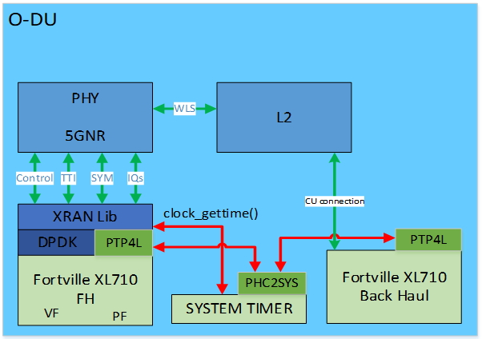
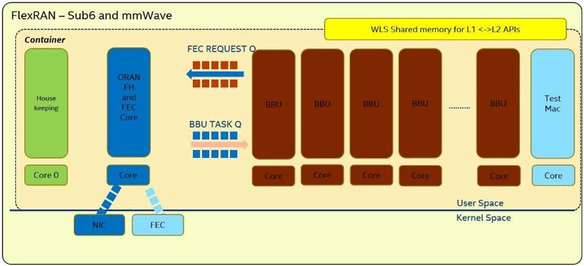
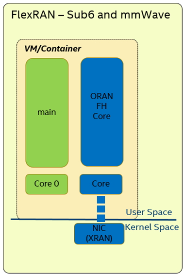
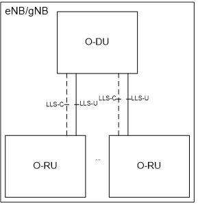
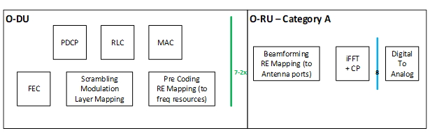
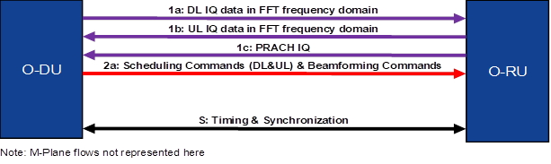
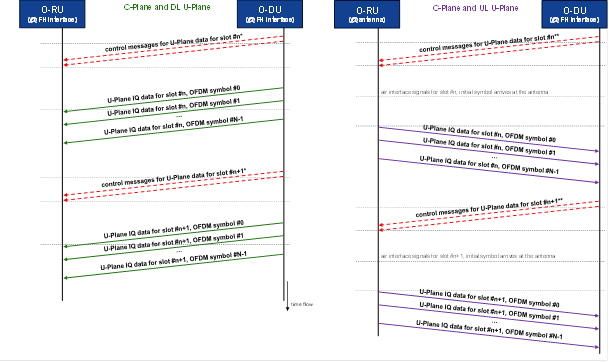

..    Copyright (c) 2019 Intel
..
..  Licensed under the Apache License, Version 2.0 (the "License");
..  you may not use this file except in compliance with the License.
..  You may obtain a copy of the License at
..
..      http://www.apache.org/licenses/LICENSE-2.0
..
..  Unless required by applicable law or agreed to in writing, software
..  distributed under the License is distributed on an "AS IS" BASIS,
..  WITHOUT WARRANTIES OR CONDITIONS OF ANY KIND, either express or implied.
..  See the License for the specific language governing permissions and
..  limitations under the License.

Architecture Overview
=====================

.. contents::
    :depth: 3
    :local:

This section provides an overview of the O-RAN architecture.

.. _introduction-1:

Introduction
------------

The front haul interface, according to the O-RAN Fronthaul
specification, is part of the 5G NR L1 reference implementation provided
with the FlexRAN software package. It performs communication between
O-RAN Distributed Unit (O-DU) and O-RAN Radio Unit (O-RU) and consists
of multiple HW and SW components.

The logical representation of HW and SW components is shown in *Figure
1*.

The same architecture design is applicable for LTE; however, the FH
library is not integrated with the PHY pipeline for FlexRAN LTE.

Figure 1. Architecture Block Diagram

From the hardware perspective, two networking ports are used to
communicate to the Front Haul and Back (Mid) Haul network as well as to
receive PTP synchronization. The system timer is used to provide a
“sense” of time to the gNB application.

From the software perspective, the following components are used:

*   Linux\* PTP provides synchronization of system timer to GPS time:
    -  ptp4l is used to synchronize oscillator on Network Interface Controller (NIC) to PTP GM.
    -  phc2sys is used to synchronize system timer to oscillator on NIC.

*  The DPDK to provide the interface to the Ethernet port.

*  O-RAN library is built on top of DPDK to perform U-plane and C-plane functionality according to the O-RAN Fronthaul specification.

*  5GNR reference PHY uses the O-RAN library to access interface to O-RU. The interface between the library and PHY is defined to communicate TTI event, symbol time, C-plane information as well as IQ sample data.

*  5G NR PHY communicates with the L2 application using the set of MAC/PHY APIs and the shared memory interface defined as WLS.

*  L2, in turn, can use Back (Mid) Haul networking port to connect to the CU unit in the context of 3GPP specification.

In this document, we focus on details of the design and implementation
of the O-RAN library for providing Front Haul functionality for both
mmWave and Sub-6 scenarios as well as LTE.

The O-RAN M-plane is not implemented and is outside of the scope of this
description. Configuration files are used to specify selected M-plane
level parameters.

5G NR L1 Application Threads
----------------------------

The specifics of the L1 application design and configuration for the
given scenario can be found in document 603577, *FlexRAN 5G NR Reference
Solution RefPHY* (Doxygen) (refer to *Table 2*) Only information
relevant to front haul is presented in this section.

Configuration of l1app with O-RAN interface for Front Haul is illustrated
acting as an O-DU in *Figure 2*.

Figure 2. 5G NR L1app Threads

In this configuration of L1app, the base architecture of 5G NR L1 is not
changed. The original Front Haul FPGA interface was updated with the
O-RAN fronthaul interface abstracted via the O-RAN library.

O-RAN FH Thread Performs:

-  Symbol base “time event” to the rest of the system based on System Clock synchronized to GPS time via PTP

-  Baseline polling mode driver performing TX and RX of Ethernet packets

-  Most of the packet processing such as Transport header, Application header, Data section header, and interactions with the rest of the PHY processing pipeline.

-  Polling of BBDev for FEC on PAC N3000 acceleration card

The other threads are standard for the L1app and created the independent
usage of O-RAN as an interface to the Radio.

Communication between L1 and O-RAN layer is performed using a set of
callback functions where L1 assigned callback and O-RAN layer executes
those functions at a particular event or time moment. Detailed
information on callback function options and setting, as well as design,
can be found in the sections below.

Design and installation of the l1app do not depend on the Host, VM, or
container environment and the same for all cases.

Sample Application Thread Model
-------------------------------

Configuration of a sample application for both the O-DU and O-RU follows
the model of 5G NR l1app application in *Figure 2*, but no BBU or FEC
related threads are needed as minimal O-RAN FH functionality is used
only.

Figure 3. Sample Application Threads

In this scenario, the main thread is used only for initializing and
closing the application. No execution happens on core 0 during run time.

Functional Split
----------------

Figure 1 corresponds to the O-RU part of the O-RAN split.
Implementation of the RU side of the O-RAN protocol is not covered in
this document.

Figure 4. eNB/gNB Architecture with O-DU and RU

More than one RU can be supported with the same implementation of the
O-RAN library and depends on the configuration of gNB in general. In this
document, we address details of implementation for a single O-DU – O-RU
connection.

The O-RAN Fronthaul specification provides two categories of the split
of Layer 1 functionality between O-DU and O-RU: Category A and Category
B.

Figure 5. Functional Split

Data Flow
---------

Table 3 lists the data flows supported for a single RU with a single
Component Carrier.

Table 3. Supported Data Flow

+---------+----+-----------------+-----------------+----------------+
| Plane   | ID | Name            | Contents        | Periodicity    |
+=========+====+=================+=================+================+
| U-Plane | 1a | DL Frequency    | DL user data    | symbol         |
|         |    | Domain IQ Data  | (PDSCH),        |                |
|         |    |                 | control channel |                |
|         |    |                 | data (PDCCH,    |                |
|         |    |                 | etc.)           |                |
+---------+----+-----------------+-----------------+----------------+
|         | 1b | UL Frequency    | UL user data    | symbol         |
|         |    | Domain IQ Data  | (PUSCH),        |                |
|         |    |                 | control channel |                |
|         |    |                 | data (PUCCH,    |                |
|         |    |                 | etc.)           |                |
+---------+----+-----------------+-----------------+----------------+
|         | 1c | PRACH Frequency | UL PRACH data   | slot or symbol |
|         |    | Domain IQ Data  |                 |                |
+---------+----+-----------------+-----------------+----------------+
| C-Plane | 2a | Scheduling      | Scheduling      | ~ slot         |
|         |    | Commands        | information,    |                |
|         |    |                 | FFT size, CP    |                |
|         |    | (Beamforming is | length,         |                |
|         |    | not supported)  | Subcarrier      |                |
|         |    |                 | spacing, UL     |                |
|         |    |                 | PRACH           |                |
|         |    |                 | scheduling      |                |
+---------+----+-----------------+-----------------+----------------+
| S-Plane | S  | Timing and      | IEEE 1588 PTP   | -              |
|         |    | Synchronization | packets         |                |
+---------+----+-----------------+-----------------+----------------+

Figure 6. Data Flows

Information on specific features of C-Plane and U-plane provided in
Sample Application Section Configuration of S-plane used on
test setup for simulation is provided in Appendix 2.

Data flow separation is based on VLAN (applicable when layer 2 or layer
3 is used for the C/U-plane transport.)

*  The mechanism for assigning VLAN ID to U-Plane and C-Plane is assumed to be via the M-Plane.

*  VLAN Tag is configurable via the standard Linux IP tool, refer to Appendix A, Setup Configuration.

*  No Quality of Service (QoS) is implemented as part of O-RAN library. Standard functionality of ETH port can be used to implement QoS.

Figure 7. C-plane and U-plane Packet Exchange

Timing, Latency, and Synchronization to GPS
-------------------------------------------

The O-RAN Fronthaul specification defines the latency model of the front
haul interface and interaction between O-DU and 0-RU. This
implementation of the O-RAN library supports only the category with fixed
timing advance and Defined Transport methods. It determines O-DU
transmit and receive windows based on pre-defined transport network
characteristics, and the delay characteristics of the RUs within the
timing domain.

Table 4 below provides default values used for the implementation of
O-DU – O-RU simulation with mmWave scenario. Table 5 and *Table 6* below
provide default values used for the implementation of O-DU – O-RU
simulation with numerology 0 and numerology 1 for Sub6 scenarios.
Configuration can be adjusted via configuration files for sample
application and reference PHY.

However, simulation of the different range of the settings was not
performed, and additional implementation changes might be required as
well as testing with actual O-RU. The parameters for the front haul
network are out of scope as a direct connection between O-DU and 0-RU
is used for simulation.

Table 4. Front Haul Interface Latency (numerology 3 - mmWave)

+------+------------+-------------------+-------------------+----------------+------------+
|      | Model      | C-Plane                               | U-Plane                     |
|      | Parameters |                                       |                             |
+      +            +-------------------+-------------------+----------------+------------+
|      |            | DL                | UL                | DL             | UL         |
+------+------------+-------------------+-------------------+----------------+------------+
| O-RU | T2amin     | T2a_min_cp_dl=50  | T2a_min_cp_ul=50  | T2a_min_up=25  | NA         |
+      +------------+-------------------+-------------------+----------------+------------+
|      | T2amax     | T2a_max_cp_dl=140 | T2a_max_cp_ul=140 | T2a_max_up=140 | NA         |
+      +------------+-------------------+-------------------+----------------+------------+
|      |            | Tadv_cp_dl        | NA                | NA             | NA         |
+      +------------+-------------------+-------------------+----------------+------------+
|      | Ta3min     | NA                | NA                | NA             | Ta3_min=20 |
+      +------------+-------------------+-------------------+----------------+------------+
|      | Ta3max     | NA                | NA                | NA             | Ta3_max=32 |
+------+------------+-------------------+-------------------+----------------+------------+
| O-DU | T1amin     | T1a_min_cp_dl=70  | T1a_min_cp_ul=60  | T1a_min_up=35  | NA         |
+      +------------+-------------------+-------------------+----------------+------------+
|      | T1amax     | T1a_max_cp_dl=100 | T1a_max_cp_ul=70  | T1a_max_up=50  | NA         |
+      +------------+-------------------+-------------------+----------------+------------+
|      | Ta4min     | NA                | NA                | NA             | Ta4_min=0  |
+      +------------+-------------------+-------------------+----------------+------------+
|      | Ta4max     | NA                | NA                | NA             | Ta4_max=45 |
+------+------------+-------------------+-------------------+----------------+------------+

Table 5. Front Haul Interface Latency (numerology 0 - Sub6)

+------+----------+----------+----------+----------+----------+
|      | Model    | C-Plane  |          | U-Plane  |          |
|      | Pa       |          |          |          |          |
|      | rameters |          |          |          |          |
+      +          +----------+----------+----------+----------+
|      |          | DL       | UL       | DL       | UL       |
+------+----------+----------+----------+----------+----------+
| O-RU | T2amin   | T        | T        | T2a_mi   | NA       |
|      |          | 2a_min_c | 2a_min_c | n_up=200 |          |
|      |          | p_dl=400 | p_ul=400 |          |          |
+      +----------+----------+----------+----------+----------+
|      | T2amax   | T2       | T2       | T2a_max  | NA       |
|      |          | a_max_cp | a_max_cp | _up=1120 |          |
|      |          | _dl=1120 | _ul=1120 |          |          |
+      +----------+----------+----------+----------+----------+
|      |          | Ta       | NA       | NA       | NA       |
|      |          | dv_cp_dl |          |          |          |
+      +----------+----------+----------+----------+----------+
|      | Ta3min   | NA       | NA       | NA       | Ta3      |
|      |          |          |          |          | _min=160 |
+      +----------+----------+----------+----------+----------+
|      | Ta3max   | NA       | NA       | NA       | Ta3      |
|      |          |          |          |          | _max=256 |
+------+----------+----------+----------+----------+----------+
| O-DU | T1amin   | T        | T        | T1a_mi   | NA       |
|      |          | 1a_min_c | 1a_min_c | n_up=280 |          |
|      |          | p_dl=560 | p_ul=480 |          |          |
+      +----------+----------+----------+----------+----------+
|      | T1amax   | T        | T        | T1a_ma   | NA       |
|      |          | 1a_max_c | 1a_max_c | x_up=400 |          |
|      |          | p_dl=800 | p_ul=560 |          |          |
+      +----------+----------+----------+----------+----------+
|      | Ta4min   | NA       | NA       | NA       | T        |
|      |          |          |          |          | a4_min=0 |
+      +----------+----------+----------+----------+----------+
|      | Ta4max   | NA       | NA       | NA       | Ta4      |
|      |          |          |          |          | _max=360 |
+------+----------+----------+----------+----------+----------+

Table 6. Front Haul Interface Latency (numerology 1 - Sub6)

+------+------------+-------------------+-------------------+----------------+------------+
|      | Model      | C-Plane           | U-Plane           |                |            |
|      | Parameters |                   |                   |                |            |
+      +            +-------------------+-------------------+----------------+------------+
|      |            | DL                | UL                | DL             | UL         |
+------+------------+-------------------+-------------------+----------------+------------+
| O-RU | T2amin     | T2a_min_cp_dl=285 | T2a_min_cp_ul=285 | T2a_min_up=71  | NA         |
+      +------------+-------------------+-------------------+----------------+------------+
|      | T2amax     | T2a_max_cp_dl=429 | T2a_max_cp_ul=429 | T2a_max_up=428 | NA         |
+      +------------+-------------------+-------------------+----------------+------------+
|      |            | Tadv_cp_dl        | NA                | NA             | NA         |
+      +------------+-------------------+-------------------+----------------+------------+
|      | Ta3min     | NA                | NA                | NA             | Ta3_min=20 |
+      +------------+-------------------+-------------------+----------------+------------+
|      | Ta3max     | NA                | NA                | NA             | Ta3_max=32 |
+------+------------+-------------------+-------------------+----------------+------------+
| O-DU | T1amin     | T1a_min_cp_dl=285 | T1a_min_cp_ul=285 | T1a_min_up=96  | NA         |
+      +------------+-------------------+-------------------+----------------+------------+
|      | T1amax     | T1a_max_cp_dl=429 | T1a_max_cp_ul=300 | T1a_max_up=196 | NA         |
+      +------------+-------------------+-------------------+----------------+------------+
|      | Ta4min     | NA                | NA                | NA             | Ta4_min=0  |
+      +------------+-------------------+-------------------+----------------+------------+
|      | Ta4max     | NA                | NA                | NA             | Ta4_max=75 |
+------+------------+-------------------+-------------------+----------------+------------+

IEEE 1588 protocol and PTP for Linux\* implementations are used to
synchronize local time to GPS time. Details of the configuration used
are provided in Appendix B, PTP Configuration. Local time is used to get
Top of the Second (ToS) as a 1 PPS event for SW implementation. Timing
event is obtained by performing polling of local time using
clock_gettime(CLOCK_REALTIME,..)

All-time intervals are specified concerning the GPS time, which
corresponds to OTA time.

Virtualization and Container-Based Usage
----------------------------------------

O-RAN implementation is deployment agnostic and does not require special
changes to be used in virtualized or container-based deployment options.
The only requirement is to provide one SRIOV base virtual port for
C-plane and one port for U-plane traffic per O-DU instance. This can be
achieved with the default Virtual Infrastructure Manager (VIM) as well
as using standard container networking.

To configure the networking ports, refer to the FlexRAN and Mobile Edge
Compute (MEC) Platform Setup Guide (*Table 2*) and readme.md in O-RAN
library or Appendix A.
