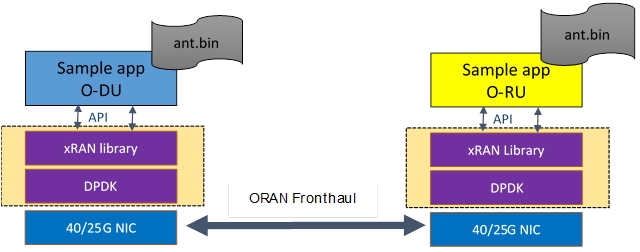

..    Copyright (c) 2019-2022 Intel
..
..  Licensed under the Apache License, Version 2.0 (the "License");
..  you may not use this file except in compliance with the License.
..  You may obtain a copy of the License at
..
..      http://www.apache.org/licenses/LICENSE-2.0
..
..  Unless required by applicable law or agreed to in writing, software
..  distributed under the License is distributed on an "AS IS" BASIS,
..  WITHOUT WARRANTIES OR CONDITIONS OF ANY KIND, either express or implied.
..  See the License for the specific language governing permissions and
..  limitations under the License.

Sample Application
==================

.. contents::
    :depth: 3
    :local:

Figure 26 illustrates a sample xRAN application.

Figure 26. Sample Application

The sample application was created to execute test scenarios with
features of the O-RAN library and test external API as well as timing.
The sample application is named sample-app, and depending on
configuration file settings can act as O-DU or simplified simulation of
O-RU. The first O-DU should be run on the machine that acts as O-DU and
the second as O-RU. Both machines are connected via ETH. The sample
application on both sides executes using a constant configuration
according to settings in corresponding config files
(./app/usecase/mu0_10mhz/config_file_o_du.dat and
./app/usecase/mu0_10mhz/config_file_o_ru.dat) and uses binary files
(ant.bin) with IQ samples as input. Multiple-use cases for different
numerologies and different BW are available as examples. Configuration
files provide descriptions of each parameter, and in general, those are
related to M-plane level settings as per the O-RAN Fronthaul
specification, refer to *Table 2*.

From the start of the process, the application (O-DU) sends DL packets
for the U-plane and C-plane and receives U-plane UL packets.
Synchronization of O-DU and O-RU sides is achieved via IEEE 1588.

U-plane packets for UL and DL direction are constructed the same way
except for the direction field.

Examples of default configurations used with the sample application for
v21.03 release provided below:

1 Cell mmWave 100MHz TDD DDDS:
------------------------------

-  Numerology 3 (mmWave)

-  TTI period 125 µs

-  100 MHz Bandwidth: 792 subcarriers (all 66 RB utilized at all times)

-  4x4 MIMO

-  No beamforming

-  1 Component carrier

-  Jumbo Frame for Ethernet (up to 9728 bytes)

-  Front haul throughput ~11.5 Gbps.

12 Cells Sub6 10MHz FDD:
------------------------

-  Numerology 0 (Sub-6)

-  TTI period 1000 µs

-  10 MHz Bandwidth: 624 subcarriers (all 52 RB utilized at all times)

-  4x4 MIMO

-  No beamforming

-  12 Component carrier

-  Jumbo Frame for Ethernet (up to 9728 bytes)

-  Front haul throughput ~13.7Gbps.

1 Cell Sub6 100 MHz TDD
-----------------------

-  Numerology 1 (Sub-6)

-  TTI period 500 µs

-  100 MHz Bandwidth: 3276 subcarriers (all 273 RB utilized at all times)

-  4x4 MIMO

-  No beamforming

-  1 Component carrier

-  Jumbo Frame for Ethernet (up to 9728 bytes)

-  Front haul throughput ~11.7 Gbps.

1 Cell Sub6 100 MHz TDD (Category B):
-------------------------------------

-  Numerology 1 (Sub-6)

-  TTI period 500 µs

-  100 MHz Bandwidth: 3276 subcarriers (all 273 RB utilized at all times). 8 UEs per TTI per layer

-  8DL /4UL MIMO Layers

-  Digital beamforming with 32T32R

-  1 Component carrier

-  Jumbo Frame for Ethernet (up to 9728 bytes)

-  Front haul throughput ~23.5 Gbps.

3 Cell Sub6 100MHz TDD Massive MIMO (Category B):
-------------------------------------------------

-  Numerology 1 (Sub-6)

-  TTI period 500 µs

-  100 Mhz Bandwidth: 3276 subcarriers (all 273 RB utilized at all times). 8 UEs per TTI per layer

-  16DL /8UL MIMO Layers

-  Digital beamforming with 64T64R

-  1 Component carrier for each Cell

-  Jumbo Frame for Ethernet (up to 9728 bytes)

-  Front haul throughput ~44 Gbps.

Other configurations can be constructed by modifying the config files
(see app/usecase/)

One_way Delay Measurements:
---------------------------

There are 4 usecases defined that are based on cat a, numerology 0 and
20 MHz Bw:

Common to all cases the following parameters are needed in the
usecase_xu.cfg files where x=r for ORU and x=d for ODU.

oXuOwdmNumSamps=8 # Run 8 samples per port

oXuOwdmFltrType=0 # Simple average

oXuOwdmRespTimeOut=10000000 # 10 ms expressed in ns (Currently not
enforced)

oXuOwdmMeasState=0 # Measurement state is INIT

oXuOwdmMeasId=0 # Measurement Id seed

oXuOwdmEnabled=1 # Measurements are enabled

oXuOwdmPlLength= n # with 40 <= n <= 1400 bytes

For the ORU

oXuOwdmInitEn=0 #O-RU is always the recipient

For the ODU

oXuOwdmInitEn=1 #O-DU is always initiator

20 Corresponds to the Request/Response usecase with Payload Size 40
bytes

oXuOwdmMeasMeth=0 # Measurement Method REQUEST

21 Corresponds to the Remote Request usecase with Payload Size 512 bytes

oXuOwdmMeasMeth=1 # Measurement Method REM_REQ

22 Corresponds to the Request with Follow Up usecase with Payload Size
1024 bytes

oXuOwdmMeasMeth=2 # Measurement Method REQUESTwFUP

23 Corresponds to the Remote Request with Follow Up usecase with default
Payload Size

oXuOwdmMeasMeth=3 # Measurement Method REM_REQ_WFUP

-

