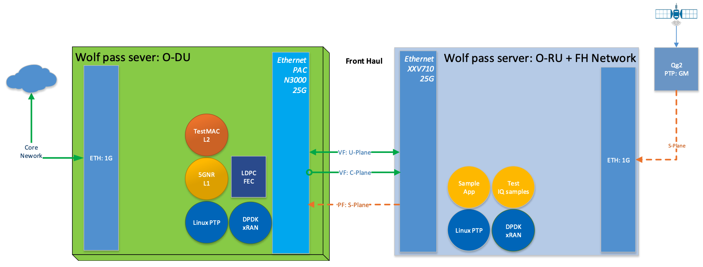
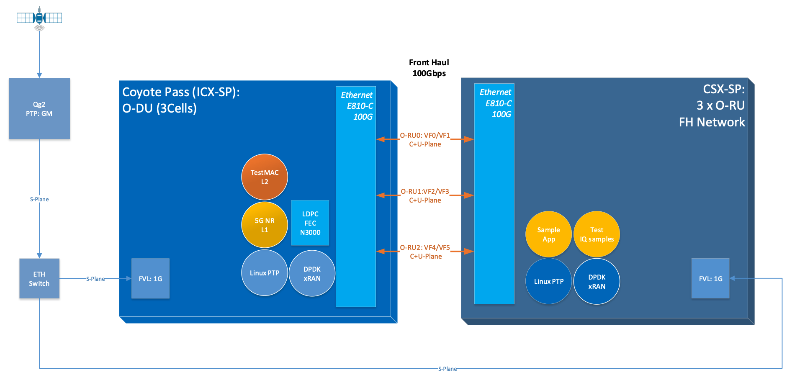

..    Copyright (c) 2019-2022 Intel
..
..  Licensed under the Apache License, Version 2.0 (the "License");
..  you may not use this file except in compliance with the License.
..  You may obtain a copy of the License at
..
..      http://www.apache.org/licenses/LICENSE-2.0
..
..  Unless required by applicable law or agreed to in writing, software
..  distributed under the License is distributed on an "AS IS" BASIS,
..  WITHOUT WARRANTIES OR CONDITIONS OF ANY KIND, either express or implied.
..  See the License for the specific language governing permissions and
..  limitations under the License.

.. |br| raw:: html

    

Setup Configuration
===================

A.1 Setup Configuration
-----------------------
The configuration shown in Figure 26 shows how to set up a test
environment to execute O-RAN scenarios where O-DU and 0-RU are simulated
using the sample application. This setup allows development and
prototyping as well as testing of O-RAN specific functionality. The O-DU
side can be instantiated with a full 5G NR L1 reference as well. The
configuration differences of the 5G NR l1app configuration are provided
below. Steps for running the sample application on the O-DU side and
0-RU side are the same, except configuration file options may be
different.

.. image:: images/Setup-for-O-RAN-Testing.jpg
  :width: 400
  :alt: Figure 27. Setup for O-RAN Testing

Figure 27. Setup for O-RAN Testing

Figure 28. Setup for O-RAN Testing with PHY and Configuration C3

Figure 29. Setup for O-RAN Testing with PHY and Configuration C3 for
Massive MIMO

A.2 Prerequisites
-----------------

Each server in *Figure 27* requires the following:

-  Wolfpass server according to recommended BOM for FlexRAN such as
   Intel® Xeon® Skylake Gold 6148 FC-LGA3647 2.4 GHz 27.5 MB 150W 20
   cores (two sockets) or higher

-  Wilson City or Coyote Pass server with Intel® Xeon® Icelake CPU for
   Massive-MIMO with L1 pipeline testing

-  BIOS settings:

    -  Intel® Virtualization Technology Enabled

    -  Intel® VT for Directed I/O - Enabled

    -  ACS Control - Enabled

    -  Coherency Support - Disabled

-  Front Haul networking cards:

    -  Intel® Ethernet Converged Network Adapter XL710-QDA2

    -  Intel® Ethernet Converged Network Adapter XXV710-DA2

    -  Intel® Ethernet Converged Network Adapter E810-CQDA2

    -  Intel® FPGA Programmable Acceleration Card (Intel® FPGA PAC) N3000

-  Back (Mid) Haul networking card can be either:

    -  Intel® Ethernet Connection X722 for 10GBASE-T

    -  Intel® 82599ES 10-Gigabit SFI/SFP+ Network Connection

    -  Other networking cards capable of HW timestamping for PTP synchronization.

    -  Both Back (mid) Haul and Front Haul NIC require support for PTP HW timestamping.

The recommended configuration for NICs is::

    ethtool -i enp33s0f0
    driver: i40e
    version: 2.14.13
    firmware-version: 8.20 0x80009bd4 1.2879.0
    expansion-rom-version:
    bus-info: 0000:21:00.0
    supports-statistics: yes
    supports-test: yes
    supports-eeprom-access: yes
    supports-register-dump: yes
    supports-priv-flags: yes
    ethtool -T enp33s0f0
    Time stamping parameters for enp33s0f0:
    Capabilities:
        hardware-transmit (SOF_TIMESTAMPING_TX_HARDWARE)
        software-transmit (SOF_TIMESTAMPING_TX_SOFTWARE)
        hardware-receive (SOF_TIMESTAMPING_RX_HARDWARE)
        software-receive (SOF_TIMESTAMPING_RX_SOFTWARE)
        software-system-clock (SOF_TIMESTAMPING_SOFTWARE)
        hardware-raw-clock (SOF_TIMESTAMPING_RAW_HARDWARE)
    PTP Hardware Clock: 4
    Hardware Transmit Timestamp Modes:
        off (HWTSTAMP_TX_OFF)
        on (HWTSTAMP_TX_ON)
    Hardware Receive Filter Modes:
        none (HWTSTAMP_FILTER_NONE)
        ptpv1-l4-sync (HWTSTAMP_FILTER_PTP_V1_L4_SYNC)
        ptpv1-l4-delay-req (HWTSTAMP_FILTER_PTP_V1_L4_DELAY_REQ)
        ptpv2-l4-event (HWTSTAMP_FILTER_PTP_V2_L4_EVENT)
        ptpv2-l4-sync (HWTSTAMP_FILTER_PTP_V2_L4_SYNC)
        ptpv2-l4-delay-req (HWTSTAMP_FILTER_PTP_V2_L4_DELAY_REQ)
        ptpv2-l2-event (HWTSTAMP_FILTER_PTP_V2_L2_EVENT)
        ptpv2-l2-sync (HWTSTAMP_FILTER_PTP_V2_L2_SYNC)
        ptpv2-l2-delay-req (HWTSTAMP_FILTER_PTP_V2_L2_DELAY_REQ)
        ptpv2-event (HWTSTAMP_FILTER_PTP_V2_EVENT)
        ptpv2-sync (HWTSTAMP_FILTER_PTP_V2_SYNC)
        ptpv2-delay-req (HWTSTAMP_FILTER_PTP_V2_DELAY_REQ)

The recommended configuration for Columbiaville NICs (base on Intel®
Ethernet 800 Series (Columbiaville) CVL 2.3 release is::

    ethtool -i enp81s0f0
    driver: ice
    version: 1.3.2
    firmware-version: 2.3 0x80005D18
    expansion-rom-version:
    bus-info: 0000:51:00.0
    supports-statistics: yes
    supports-test: yes
    supports-eeprom-access: yes
    supports-register-dump: yes
    supports-priv-flags: yes
    ethtool -T enp81s0f0
    Time stamping parameters for enp81s0f0:
    Capabilities:
        hardware-transmit (SOF_TIMESTAMPING_TX_HARDWARE)
        software-transmit (SOF_TIMESTAMPING_TX_SOFTWARE)
        hardware-receive (SOF_TIMESTAMPING_RX_HARDWARE)
        software-receive (SOF_TIMESTAMPING_RX_SOFTWARE)
        software-system-clock (SOF_TIMESTAMPING_SOFTWARE)
        hardware-raw-clock (SOF_TIMESTAMPING_RAW_HARDWARE)
    PTP Hardware Clock: 1
    Hardware Transmit Timestamp Modes:
        off (HWTSTAMP_TX_OFF)
        on (HWTSTAMP_TX_ON)
    Hardware Receive Filter Modes:
        none (HWTSTAMP_FILTER_NONE)
        all (HWTSTAMP_FILTER_ALL)

    Recommended version of
    iavf driver 4.0.2
    ICE COMMS Package version 1.3.24.0

*Note*. If your firmware version does not match with the ones in the output
images, you can download the correct version from the Intel Download
Center. It is Intel's repository for the latest software and drivers
for Intel products. The NVM Update Packages for Windows*, Linux*,
ESX*, FreeBSD*, and EFI/EFI2 are located at:

..

https://downloadcenter.intel.com/download/24769 (700 series)

https://downloadcenter.intel.com/download/29736 (E810 series)

PTP Grand Master is required to be available in the network to provide
synchronization of both O-DU and RU to GPS time.

The software package includes Linux\* CentOS\* operating system and RT
patch according to FlexRAN Reference Solution Cloud-Native Setup
document (refer to Table 2). Only real-time HOST is required.

1. Install Intel® C++ Compiler v19.0.3 or OneAPI compiler (preferred)

2. Download DPDK v20.11.3

3. Patch DPDK with FlexRAN BBDev patch as per given release.

4. Double check that FlexRAN DPDK patch includes changes below relevant
to O-RAN Front haul::

        For Fortville: 
        diff --git a/drivers/net/i40e/i40e_ethdev.c b/drivers/net/i40e/i40e_ethdev.c
        index 85a6a86..236fbe0 100644
        --- a/drivers/net/i40e/i40e_ethdev.c
        +++ b/drivers/net/i40e/i40e_ethdev.c
        @@ -2207,7 +2207,7 @@ void i40e_flex_payload_reg_set_default(struct i40e_hw *hw)
            /* Map queues with MSIX interrupt */
            main_vsi->nb_used_qps = dev->data->nb_rx_queues -
                pf->nb_cfg_vmdq_vsi * RTE_LIBRTE_I40E_QUEUE_NUM_PER_VM;
        -	i40e_vsi_queues_bind_intr(main_vsi, I40E_ITR_INDEX_DEFAULT);
        +	i40e_vsi_queues_bind_intr(main_vsi, I40E_ITR_INDEX_NONE);
            i40e_vsi_enable_queues_intr(main_vsi);
        
            /* Map VMDQ VSI queues with MSIX interrupt */
        @@ -2218,6 +2218,10 @@ void i40e_flex_payload_reg_set_default(struct i40e_hw *hw)
                i40e_vsi_enable_queues_intr(pf->vmdq[i].vsi);
            }
        +	i40e_aq_debug_write_global_register(hw,
        +					0x0012A504,
        +					0, NULL);
        +
            /* enable FDIR MSIX interrupt */
            if (pf->fdir.fdir_vsi) {
                i40e_vsi_queues_bind_intr(pf->fdir.fdir_vsi,
        diff --git a/drivers/net/i40e/i40e_ethdev_vf.c b/drivers/net/i40e/i40e_ethdev_vf.c
        index 001c301..6f9ffdb 100644
        --- a/drivers/net/i40e/i40e_ethdev_vf.c
        +++ b/drivers/net/i40e/i40e_ethdev_vf.c
        @@ -640,7 +640,7 @@ struct rte_i40evf_xstats_name_off {
        
            map_info = (struct virtchnl_irq_map_info *)cmd_buffer;
            map_info->num_vectors = 1;
        -	map_info->vecmap[0].rxitr_idx = I40E_ITR_INDEX_DEFAULT;
        +	map_info->vecmap[0].rxitr_idx = I40E_ITR_INDEX_NONE;
            map_info->vecmap[0].vsi_id = vf->vsi_res->vsi_id;
            /* Alway use default dynamic MSIX interrupt */
            map_info->vecmap[0].vector_id = vector_id;
        diff --git a/drivers/net/ixgbe/ixgbe_ethdev.c b/drivers/net/ixgbe/ixgbe_ethdev.c
        index 26b1927..018eb8f 100644
        --- a/drivers/net/ixgbe/ixgbe_ethdev.c
        +++ b/drivers/net/ixgbe/ixgbe_ethdev.c
        @@ -3705,7 +3705,7 @@ static int ixgbevf_dev_xstats_get_names(__rte_unused struct rte_eth_dev *dev,
                * except for 82598EB, which remains constant.
                */
                if (dev_conf->txmode.mq_mode == ETH_MQ_TX_NONE &&
        -				hw->mac.type != ixgbe_mac_82598EB)
        +				hw->mac.type != ixgbe_mac_82598EB && hw->mac.type != ixgbe_mac_82599EB)
                    dev_info->max_tx_queues = IXGBE_NONE_MODE_TX_NB_QUEUES;
            }
            dev_info->min_rx_bufsize = 1024; /* cf BSIZEPACKET in SRRCTL register */
        diff --git a/lib/librte_eal/common/include/rte_dev.h b/lib/librte_eal/common/include/rte_dev.h
        old mode 100644
        new mode 100755

        for Columbiaville
        diff --git a/drivers/net/ice/ice_ethdev.c b/drivers/net/ice/ice_ethdev.c
        index de189daba..d9aff341c 100644
        --- a/drivers/net/ice/ice_ethdev.c
        +++ b/drivers/net/ice/ice_ethdev.c
        @@ -2604,8 +2604,13 @@ __vsi_queues_bind_intr(struct ice_vsi *vsi, uint16_t msix_vect,

                        PMD_DRV_LOG(INFO, "queue %d is binding to vect %d",
                                    base_queue + i, msix_vect);
        -               /* set ITR0 value */
        -               ICE_WRITE_REG(hw, GLINT_ITR(0, msix_vect), 0x10);
        +               /* set ITR0 value
        +                * Empirical configuration for optimal real time latency
        +                * reduced interrupt throttling to 2 ms
        +                * Columbiaville pre-PRQ : local patch subject to change
        +                */
        +               ICE_WRITE_REG(hw, GLINT_ITR(0, msix_vect), 0x1);
        +               ICE_WRITE_REG(hw, QRX_ITR(base_queue + i), QRX_ITR_NO_EXPR_M);
                        ICE_WRITE_REG(hw, QINT_RQCTL(base_queue + i), val);
                        ICE_WRITE_REG(hw, QINT_TQCTL(base_queue + i), val_tx);
                }

5.Build and install the DPDK::

   See https://doc.dpdk.org/guides/prog_guide/build-sdk-meson.html

6.Make below file changes in dpdk that assure i40e to get best
latency of packet processing::

        --- i40e.h	2018-11-30 11:27:00.000000000 +0000
        +++ i40e_patched.h	2019-03-06 15:49:06.877522427 +0000
        @@ -451,7 +451,7 @@
        
        #define I40E_QINT_RQCTL_VAL(qp, vector, nextq_type) \
            (I40E_QINT_RQCTL_CAUSE_ENA_MASK | \
        -	(I40E_RX_ITR << I40E_QINT_RQCTL_ITR_INDX_SHIFT) | \
        +	(I40E_ITR_NONE << I40E_QINT_RQCTL_ITR_INDX_SHIFT) | \
            ((vector) << I40E_QINT_RQCTL_MSIX_INDX_SHIFT) | \
            ((qp) << I40E_QINT_RQCTL_NEXTQ_INDX_SHIFT) | \
            (I40E_QUEUE_TYPE_##nextq_type << I40E_QINT_RQCTL_NEXTQ_TYPE_SHIFT))

        --- i40e_main.c	2018-11-30 11:27:00.000000000 +0000
        +++ i40e_main_patched.c	2019-03-06 15:46:13.521518062 +0000
        @@ -15296,6 +15296,9 @@
                pf->hw_features |= I40E_HW_HAVE_CRT_RETIMER;
            /* print a string summarizing features */
            i40e_print_features(pf);
        +	
        +	/* write to this register to clear rx descriptor */
        +	i40e_aq_debug_write_register(hw, 0x0012A504, 0, NULL);
        
            return 0;

A.3 Configuration of System
---------------------------
1.Boot Linux with the following arguments::

    cat /proc/cmdline
    BOOT_IMAGE=/vmlinuz-3.10.0-1062.12.1.rt56.1042.el7.x86_64 root=/dev/mapper/centos-root ro
    crashkernel=auto rd.lvm.lv=centos/root rd.lvm.lv=centos/swap intel_iommu=on iommu=pt
    usbcore.autosuspend=-1 selinux=0 enforcing=0 nmi_watchdog=0 softlockup_panic=0 audit=0
    intel_pstate=disable cgroup_memory=1 cgroup_enable=memory mce=off idle=poll
    hugepagesz=1G hugepages=16 hugepagesz=2M hugepages=0 default_hugepagesz=1G
    isolcpus=1-19,21-39 rcu_nocbs=1-19,21-39 kthread_cpus=0,20 irqaffinity=0,20
    nohz_full=1-19,21-39

2. Boot Linux with the following arguments for Icelake CPU::

    cat /proc/cmdline
    BOOT_IMAGE=/vmlinuz-3.10.0-957.10.1.rt56.921.el7.x86_64
    root=/dev/mapper/centos-root ro crashkernel=auto rd.lvm.lv=centos/root
    rd.lvm.lv=centos/swap rhgb quiet intel_iommu=off usbcore.autosuspend=-1
    selinux=0 enforcing=0 nmi_watchdog=0 softlockup_panic=0 audit=0
    intel_pstate=disable cgroup_disable=memory mce=off hugepagesz=1G
    hugepages=40 hugepagesz=2M hugepages=0 default_hugepagesz=1G
    isolcpus=1-23,25-47 rcu_nocbs=1-23,25-47 kthread_cpus=0 irqaffinity=0
    nohz_full=1-23,25-47

3. Download from Intel Website and install updated version of i40e
driver if needed. The current recommended version of i40e is 2.14.13.
However, any latest version of i40e after 2.9.21 expected to be
functional for O-RAN FH.

4. For Columbiaville download Intel® Ethernet 800 Series (Columbiaville)
CVL2.3 B0/C0 Sampling Sample Validation Kit (SVK) from Intel Customer
Content Library. The current recommended version of ICE driver is
1.3.2 with ICE COMMS Package version 1.3.24.0. IAVF recommended
version 4.0.2

5. Identify PCIe Bus address of the Front Haul NIC (Fortville)::

    lspci|grep Eth
    86:00.0 Ethernet controller: Intel Corporation Ethernet Controller XXV710 for 25GbE SFP28 (rev 02)
    86:00.1 Ethernet controller: Intel Corporation Ethernet Controller XXV710 for 25GbE SFP28 (rev 02)
    88:00.0 Ethernet controller: Intel Corporation Ethernet Controller XXV710 for 25GbE SFP28 (rev 02)
    88:00.1 Ethernet controller: Intel Corporation Ethernet Controller XXV710 for 25GbE SFP28 (rev 02)

6. Identify PCIe Bus address of the Front Haul NIC (Columbiaville)::

    lspci \|grep Eth
    18:00.0 Ethernet controller: Intel Corporation Device 1593 (rev 02)
    18:00.1 Ethernet controller: Intel Corporation Device 1593 (rev 02)
    18:00.2 Ethernet controller: Intel Corporation Device 1593 (rev 02)
    18:00.3 Ethernet controller: Intel Corporation Device 1593 (rev 02)
    51:00.0 Ethernet controller: Intel Corporation Device 1593 (rev 02)
    51:00.1 Ethernet controller: Intel Corporation Device 1593 (rev 02)
    51:00.2 Ethernet controller: Intel Corporation Device 1593 (rev 02)
    51:00.3 Ethernet controller: Intel Corporation Device 1593 (rev 02)

7. Identify the Ethernet device name::

    ethtool -i enp33s0f0
    driver: i40e
    version: 2.14.13
    firmware-version: 8.20 0x80009bd4 1.2879.0 
    expansion-rom-version:
    bus-info: 0000:21:00.0
    supports-statistics: yes
    supports-test: yes
    supports-eeprom-access: yes
    supports-register-dump: yes
    supports-priv-flags: yesEnable 

or ::

    ethtool -i enp81s0f0
    driver: ice
    version: 1.3.2
    firmware-version: 2.3 0x80005D18
    expansion-rom-version:
    bus-info: 0000:51:00.0
    supports-statistics: yes
    supports-test: yes
    supports-eeprom-access: yes
    supports-register-dump: yes
    supports-priv-flags: yes 

8. Enable 3 virtual functions (VFs) on the each of two ports of each
NIC::

        #!/bin/bash

        echo 0 > /sys/bus/pci/devices/0000\:88\:00.0/sriov_numvfs
        echo 0 > /sys/bus/pci/devices/0000\:88\:00.1/sriov_numvfs

        echo 0 > /sys/bus/pci/devices/0000\:86\:00.0/sriov_numvfs
        echo 0 > /sys/bus/pci/devices/0000\:86\:00.1/sriov_numvfs

        modprobe -r iavf
        modprobe iavf

        echo 3 > /sys/bus/pci/devices/0000\:88\:00.0/sriov_numvfs
        echo 3 > /sys/bus/pci/devices/0000\:88\:00.1/sriov_numvfs

        echo 3 > /sys/bus/pci/devices/0000\:86\:00.0/sriov_numvfs
        echo 3 > /sys/bus/pci/devices/0000\:86\:00.1/sriov_numvfs

        a=8

        if [ -z "$1" ]
        then
        b=0
        elif [ $1 -lt $a ]
        then
        b=$1
        else
        echo " Usage $0 qos with 0<= qos <= 7 with 0 as a default if no qos is provided"
        exit 1
        fi

        #O-DU
        ip link set enp136s0f0 vf 0 mac 00:11:22:33:00:00 vlan 1 qos $b
        ip link set enp136s0f1 vf 0 mac 00:11:22:33:00:10 vlan 1 qos $b

        ip link set enp136s0f0 vf 1 mac 00:11:22:33:01:00 vlan 2 qos $b
        ip link set enp136s0f1 vf 1 mac 00:11:22:33:01:10 vlan 2 qos $b

        ip link set enp136s0f0 vf 2 mac 00:11:22:33:02:00 vlan 3 qos $b
        ip link set enp136s0f1 vf 2 mac 00:11:22:33:02:10 vlan 3 qos $b

        #O-RU
        ip link set enp134s0f0 vf 0 mac 00:11:22:33:00:01 vlan 1 qos $b
        ip link set enp134s0f1 vf 0 mac 00:11:22:33:00:11 vlan 1 qos $b

        ip link set enp134s0f0 vf 1 mac 00:11:22:33:01:01 vlan 2 qos $b
        ip link set enp134s0f1 vf 1 mac 00:11:22:33:01:11 vlan 2 qos $b

        ip link set enp134s0f0 vf 2 mac 00:11:22:33:02:01 vlan 3 qos $b
        ip link set enp134s0f1 vf 2 mac 00:11:22:33:02:11 vlan 3 qos $b

where output is next::

        ip link show
        ...
        9: enp134s0f0: <BROADCAST,MULTICAST,UP,LOWER_UP> mtu 1500 qdisc mq state UP mode DEFAULT group default qlen 1000
            link/ether 3c:fd:fe:b9:f9:60 brd ff:ff:ff:ff:ff:ff
            vf 0 MAC 00:11:22:33:00:01, vlan 1, spoof checking on, link-state auto, trust off
            vf 1 MAC 00:11:22:33:01:01, vlan 2, spoof checking on, link-state auto, trust off
            vf 2 MAC 00:11:22:33:02:01, vlan 3, spoof checking on, link-state auto, trust off
        11: enp134s0f1: <BROADCAST,MULTICAST,UP,LOWER_UP> mtu 1500 qdisc mq state UP mode DEFAULT group default qlen 1000
            link/ether 3c:fd:fe:b9:f9:61 brd ff:ff:ff:ff:ff:ff
            vf 0 MAC 00:11:22:33:00:11, vlan 1, spoof checking on, link-state auto, trust off
            vf 1 MAC 00:11:22:33:01:11, vlan 2, spoof checking on, link-state auto, trust off
            vf 2 MAC 00:11:22:33:02:11, vlan 3, spoof checking on, link-state auto, trust off
        12: enp136s0f0: <BROADCAST,MULTICAST,UP,LOWER_UP> mtu 1500 qdisc mq state UP mode DEFAULT group default qlen 1000
            link/ether 3c:fd:fe:b9:f8:b4 brd ff:ff:ff:ff:ff:ff
            vf 0 MAC 00:11:22:33:00:00, vlan 1, spoof checking on, link-state auto, trust off
            vf 1 MAC 00:11:22:33:01:00, vlan 2, spoof checking on, link-state auto, trust off
            vf 2 MAC 00:11:22:33:02:00, vlan 3, spoof checking on, link-state auto, trust off
        14: enp136s0f1: <BROADCAST,MULTICAST,UP,LOWER_UP> mtu 1500 qdisc mq state UP mode DEFAULT group default qlen 1000
            link/ether 3c:fd:fe:b9:f8:b5 brd ff:ff:ff:ff:ff:ff
            vf 0 MAC 00:11:22:33:00:10, vlan 1, spoof checking on, link-state auto, trust off
            vf 1 MAC 00:11:22:33:01:10, vlan 2, spoof checking on, link-state auto, trust off
            vf 2 MAC 00:11:22:33:02:10, vlan 3, spoof checking on, link-state auto, trust off
        ...

More information about VFs supported by Intel NICs can be found at
https://doc.dpdk.org/guides/nics/intel_vf.html.

The resulting configuration can look like the listing below, where six
new VFs were added for each O-DU and O-RU port:::

    lspci|grep Eth
    86:00.0 Ethernet controller: Intel Corporation Ethernet Controller XXV710 for 25GbE SFP28 (rev 02)
    86:00.1 Ethernet controller: Intel Corporation Ethernet Controller XXV710 for 25GbE SFP28 (rev 02)
    86:02.0 Ethernet controller: Intel Corporation Ethernet Virtual Function 700 Series (rev 02) 
    86:02.1 Ethernet controller: Intel Corporation Ethernet Virtual Function 700 Series (rev 02)
    86:02.2 Ethernet controller: Intel Corporation Ethernet Virtual Function 700 Series (rev 02) 
    86:0a.0 Ethernet controller: Intel Corporation Ethernet Virtual Function 700 Series (rev 02)
    86:0a.1 Ethernet controller: Intel Corporation Ethernet Virtual Function 700 Series (rev 02)
    86:0a.2 Ethernet controller: Intel Corporation Ethernet Virtual Function 700 Series (rev 02)
    88:00.0 Ethernet controller: Intel Corporation Ethernet Controller XXV710 for 25GbE SFP28 (rev 02)
    88:00.1 Ethernet controller: Intel Corporation Ethernet Controller XXV710 for 25GbE SFP28 (rev 02)
    88:02.0 Ethernet controller: Intel Corporation Ethernet Virtual Function 700 Series (rev 02)
    88:02.1 Ethernet controller: Intel Corporation Ethernet Virtual Function 700 Series (rev 02)
    88:02.2 Ethernet controller: Intel Corporation Ethernet Virtual Function 700 Series (rev 02)
    88:0a.0 Ethernet controller: Intel Corporation Ethernet Virtual Function 700 Series (rev 02)
    88:0a.1 Ethernet controller: Intel Corporation Ethernet Virtual Function 700 Series (rev 02)
    88:0a.2 Ethernet controller: Intel Corporation Ethernet Virtual Function 700 Series (rev 02)

9. Example where O-DU and O-RU simulation run on the same system:

O-DU:::

        cat ./run_o_du.sh
        #! /bin/bash

        ulimit -c unlimited
        echo 1 > /proc/sys/kernel/core_uses_pid

        ./build/sample-app --usecasefile ./usecase/cat_b/mu1_100mhz/301/usecase_du.cfg --num_eth_vfs 6 \
        --vf_addr_o_xu_a "0000:88:02.0,0000:88:0a.0" \
        --vf_addr_o_xu_b "0000:88:02.1,0000:88:0a.1" \
        --vf_addr_o_xu_c "0000:88:02.2,0000:88:0a.2"

O-RU::

        cat ./run_o_ru.sh
        #! /bin/bash
        ulimit -c unlimited
        echo 1 > /proc/sys/kernel/core_uses_pid

        ./build/sample-app --usecasefile ./usecase/cat_b/mu1_100mhz/301/usecase_ru.cfg --num_eth_vfs 6 \
        --vf_addr_o_xu_a "0000:86:02.0,0000:86:0a.0" \
        --vf_addr_o_xu_b "0000:86:02.1,0000:86:0a.1" \
        --vf_addr_o_xu_c "0000:86:02.2,0000:86:0a.2"

Install and Configure Sample Application
========================================

To install and configure the sample application:

1. Set up the environment(shown for icc change for icx)::

    For Skylake and Cascadelake
    export GTEST_ROOT=pwd/gtest-1.7.0
    export RTE_SDK=pwd/dpdk-20.11.3
    export RTE_TARGET=x86_64-native-linuxapp-icc
    export DIR_WIRELESS_SDK_ROOT=pwd/wireless_sdk
    export WIRELESS_SDK_TARGET_ISA=avx512
    export SDK_BUILD=build-${WIRELESS_SDK_TARGET_ISA}-icc
    export DIR_WIRELESS_SDK=${DIR_WIRELESS_SDK_ROOT}/${SDK_BUILD}
    export MLOG_DIR=`pwd`/flexran_l1_sw/libs/mlog
    export XRAN_DIR=`pwd`/flexran_xran

    for Icelake
    export GTEST_ROOT=`pwd`/gtest-1.7.0
    export RTE_SDK=`pwd`/dpdk-20.11
    export RTE_TARGET=x86_64-native-linuxapp-icc
    export DIR_WIRELESS_SDK_ROOT=`pwd`/wireless_sdk
    export WIRELESS_SDK_TARGET_ISA=snc
    export SDK_BUILD=build-${WIRELESS_SDK_TARGET_ISA}-icc
    export DIR_WIRELESS_SDK=${DIR_WIRELESS_SDK_ROOT}/${SDK_BUILD}
    export MLOG_DIR=`pwd`/flexran_l1_sw/libs/mlog
    export XRAN_DIR=`pwd`/flexran_xran

2. export FLEXRAN_SDK=${DIR_WIRELESS_SDK}/install Compile mlog library::

    [turner@xran home]$ cd $MLOG_DIR
    [turner@xran xran]$ ./build.sh

3. Compile O-RAN library and test the application::

    [turner@xran home]$ cd $XRAN_DIR
    [turner@xran xran]$ ./build.sh

4. Configure the sample app.

IQ samples can be generated using Octave\* and script
libs/xran/app/gen_test.m. (CentOS\* has octave-3.8.2-20.el7.x86_64
compatible with get_test.m)

Other IQ sample test vectors can be used as well. The format of IQ
samples is binary int16_t I and Q for N slots of the OTA RF signal. For
example, for mmWave, it corresponds to 792RE*2*14symbol*8slots*10 ms =
3548160 bytes per antenna. Refer to comments in gen_test.m to correctly
specify the configuration for IQ test vector generation.

Update usecase_du.dat (or usecase_ru.cfg) with a suitable configuration
for your scenario.

Update config_file_o_du.dat (or config_file_o_ru.dat) with a suitable
configuration for your scenario.

Update run_o_du.sh (run_o_ru.sh) with PCIe bus address of VF0 and VF1
used for U-plane and C-plane correspondingly.

5. Run the application using run_o_du.sh (run_o_ru.sh).

Install and Configure FlexRAN 5G NR L1 Application
==================================================

The 5G NR layer 1 application can be used for executing the scenario for
mmWave with either the RU sample application or just the O-DU side. The
current release supports the constant configuration of the slot pattern
and RB allocation on the PHY side. The build process follows the same
basic steps as for the sample application above and is similar to
compiling 5G NR l1app for mmWave with Front Haul FPGA. Please follow the
general build process in the FlexRAN 5G NR Reference Solution L1 User
Guide (refer to *Table 2*.) (For information only as a FlexRAN binary blob
is delivered to the community)

1. O-RAN library is enabled by default l1 application

2. Get the FlexRAN L1 binary from https://github.com/intel/FlexRAN. Look for the l1/bin/nr5g/gnb/l1 folder for the
   l1app binary and the corresponding phycfg and xrancfg files.

3. Configure the L1app using bin/nr5g/gnb/l1/phycfg_xran.xml and
xrancfg_sub6.xml (or other xml if it is mmW or massive MIMO). ::

    <XranConfig>
    <version>oran_f_release_v1.0</version>
    <!-- numbers of O-RU connected to O-DU. All O-RUs are the same
    capabilities. Max O-RUs is per XRAN_PORTS_NUM i.e. 4 -->
    <oRuNum>1</oRuNum>
    <!-- # 10G,25G,40G,100G speed of Physical connection on O-RU -->
    <oRuEthLinkSpeed>25</oRuEthLinkSpeed>
    <!-- # 1, 2, 3 total number of links per O-RU (Fronthaul Ethernet link
    in IOT spec) -->
    <oRuLinesNumber>1</oRuLinesNumber>

    <!-- O-RU 0 -->
    <PciBusAddoRu0Vf0>0000:51:01.0</PciBusAddoRu0Vf0>
    <PciBusAddoRu0Vf1>0000:51:01.1</PciBusAddoRu0Vf1>
    <PciBusAddoRu0Vf2>0000:51:01.2</PciBusAddoRu0Vf2>
    <PciBusAddoRu0Vf3>0000:51:01.3</PciBusAddoRu0Vf3>

    <!-- O-RU 1 -->
    <PciBusAddoRu1Vf0>0000:51:01.4</PciBusAddoRu1Vf0>
    <PciBusAddoRu1Vf1>0000:51:01.5</PciBusAddoRu1Vf1>
    <PciBusAddoRu1Vf2>0000:51:01.6</PciBusAddoRu1Vf2>
    <PciBusAddoRu1Vf3>0000:51:01.7</PciBusAddoRu1Vf3>

    <!-- O-RU 2 -->
    <PciBusAddoRu2Vf0>0000:51:02.0</PciBusAddoRu2Vf0>
    <PciBusAddoRu2Vf1>0000:51:02.1</PciBusAddoRu2Vf1>
    <PciBusAddoRu2Vf2>0000:51:02.2</PciBusAddoRu2Vf2>
    <PciBusAddoRu2Vf3>0000:51:02.3</PciBusAddoRu2Vf3>

    <!-- O-RU 4 -->
    <PciBusAddoRu3Vf0>0000:00:00.0</PciBusAddoRu3Vf0>
    <PciBusAddoRu3Vf1>0000:00:00.0</PciBusAddoRu3Vf1>
    <PciBusAddoRu3Vf2>0000:00:00.0</PciBusAddoRu3Vf2>
    <PciBusAddoRu3Vf3>0000:00:00.0</PciBusAddoRu3Vf3>

    <!-- remote O-RU 0 Eth Link 0 VF0, VF1-->
    <oRuRem0Mac0>00:11:22:33:00:01<oRuRem0Mac0>
    <oRuRem0Mac1>00:11:22:33:00:11<oRuRem0Mac1>
    <!-- remote O-RU 0 Eth Link 1 VF2, VF3 -->
    <oRuRem0Mac2>00:11:22:33:00:21<oRuRem0Mac2>
    <oRuRem0Mac3>00:11:22:33:00:31<oRuRem0Mac3>

    <!-- remote O-RU 1 Eth Link 0 VF4, VF5-->
    <oRuRem1Mac0>00:11:22:33:01:01<oRuRem1Mac0>
    <oRuRem1Mac1>00:11:22:33:01:11<oRuRem1Mac1>
    <!-- remote O-RU 1 Eth Link 1 VF6, VF7 -->
    <oRuRem1Mac2>00:11:22:33:01:21<oRuRem1Mac2>
    <oRuRem1Mac3>00:11:22:33:01:31<oRuRem1Mac3>

    <!-- remote O-RU 2 Eth Link 0 VF8, VF9 -->
    <oRuRem2Mac0>00:11:22:33:02:01<oRuRem2Mac0>
    <oRuRem2Mac1>00:11:22:33:02:11<oRuRem2Mac1>
    <!-- remote O-RU 2 Eth Link 1 VF10, VF11-->
    <oRuRem2Mac2>00:11:22:33:02:21<oRuRem2Mac2>
    <oRuRem2Mac3>00:11:22:33:02:31<oRuRem2Mac3>

    <!-- remote O-RU 2 Eth Link 0 VF12, VF13 -->
    <oRuRem3Mac0>00:11:22:33:03:01<oRuRem3Mac0>
    <oRuRem3Mac1>00:11:22:33:03:11<oRuRem3Mac1>
    <!-- remote O-RU 2 Eth Link 1 VF14, VF15-->
    <oRuRem3Mac2>00:11:22:33:03:21<oRuRem3Mac2>
    <oRuRem3Mac3>00:11:22:33:03:31<oRuRem3Mac3>

    <!--  Number of cells (CCs) running on this O-RU  [1 - Cell , 2 - Cells, 3 - Cells , 4 - Cells ] -->
    <oRu0NumCc>12</oRu0NumCc>
    <!-- First Phy instance ID mapped to this O-RU CC0  -->
    <oRu0Cc0PhyId>0</oRu0Cc0PhyId>
    <!-- Second Phy instance ID mapped to this O-RU CC1 -->
    <oRu0Cc1PhyId>1</oRu0Cc1PhyId>
    <!-- Third Phy instance ID mapped to this O-RU CC2  -->
    <oRu0Cc2PhyId>2</oRu0Cc2PhyId>
    <!-- Forth Phy instance ID mapped to this O-RU CC3  -->
    <oRu0Cc3PhyId>3</oRu0Cc3PhyId>
    <!-- First Phy instance ID mapped to this O-RU CC0  -->
    <oRu0Cc4PhyId>4</oRu0Cc4PhyId>
    <!-- Second Phy instance ID mapped to this O-RU CC1 -->
    <oRu0Cc5PhyId>5</oRu0Cc5PhyId>
    <!-- Third Phy instance ID mapped to this O-RU CC2  -->
    <oRu0Cc6PhyId>6</oRu0Cc6PhyId>
    <!-- Forth Phy instance ID mapped to this O-RU CC3  -->
    <oRu0Cc7PhyId>7</oRu0Cc7PhyId>
    <!-- First Phy instance ID mapped to this O-RU CC0  -->
    <oRu0Cc8PhyId>8</oRu0Cc8PhyId>
    <!-- Second Phy instance ID mapped to this O-RU CC1 -->
    <oRu0Cc9PhyId>9</oRu0Cc9PhyId>
    <!-- Third Phy instance ID mapped to this O-RU CC2  -->
    <oRu0Cc10PhyId>10</oRuCc10PhyId>
    <!-- Forth Phy instance ID mapped to this O-RU CC3  -->
    <oRu0Cc11PhyId>11</oRu0Cc11PhyId>

    <!--  Number of cells (CCs) running on this O-RU  [1 - Cell , 2 - Cells, 3 - Cells , 4 - Cells ] -->
    <oRu1NumCc>1</oRu1NumCc>
    <!-- First Phy instance ID mapped to this O-RU CC0  -->
    <oRu1Cc0PhyId>1</oRu1Cc0PhyId>
    <!-- Second Phy instance ID mapped to this O-RU CC1 -->
    <oRu1Cc1PhyId>1</oRu1Cc1PhyId>
    <!-- Third Phy instance ID mapped to this O-RU CC2  -->
    <oRu1Cc2PhyId>2</oRu1Cc2PhyId>
    <!-- Forth Phy instance ID mapped to this O-RU CC3  -->
    <oRu1Cc3PhyId>3</oRu1Cc3PhyId>

    <!--  Number of cells (CCs) running on this O-RU  [1 - Cell , 2 - Cells, 3 - Cells , 4 - Cells ] -->
    <oRu2NumCc>1</oRu2NumCc>
    <!-- First Phy instance ID mapped to this O-RU CC0  -->
    <oRu2Cc0PhyId>2</oRu2Cc0PhyId>
    <!-- Second Phy instance ID mapped to this O-RU CC1 -->
    <oRu2Cc1PhyId>1</oRu2Cc1PhyId>
    <!-- Third Phy instance ID mapped to this O-RU CC2  -->
    <oRu2Cc2PhyId>2</oRu2Cc2PhyId>
    <!-- Forth Phy instance ID mapped to this O-RU CC3  -->
    <oRu2Cc3PhyId>3</oRu2Cc3PhyId>

    <!-- XRAN Thread (core where the XRAN polling function is pinned: Core, priority, Policy [0: SCHED_FIFO 1: SCHED_RR] -->
    <xRANThread>19, 96, 0</xRANThread>

    <!-- core mask for XRAN Packets Worker (core where the XRAN packet processing is pinned): Core, priority, Policy [0: SCHED_FIFO 1: SCHED_RR] -->
    <xRANWorker>0x8000000000, 96, 0</xRANWorker>
    <xRANWorker_64_127>0x0000000000, 96, 0</xRANWorker_64_127>
    <!-- XRAN: Category of O-RU 0 - Category A, 1 - Category B -->
    <Category>0</Category>
    <!-- Slot setup processing offload to pipeline BBU cores: [0: USE XRAN CORES 1: USE BBU CORES] -->
    <xRANOffload>0</xRANOffload>
    <!-- XRAN MLOG: [0: DISABLE 1: ENABLE] -->
    <xRANMLog>0</xRANMLog>

    <!-- XRAN: enable sleep on PMD cores -->
    <xranPmdSleep>0</xranPmdSleep>

    <!-- RU Settings -->
    <Tadv_cp_dl>25</Tadv_cp_dl>
    <!-- Reception Window C-plane DL-->
    <T2a_min_cp_dl>285</T2a_min_cp_dl>
    <T2a_max_cp_dl>429</T2a_max_cp_dl>
    <!-- Reception Window C-plane UL-->
    <T2a_min_cp_ul>285</T2a_min_cp_ul>
    <T2a_max_cp_ul>429</T2a_max_cp_ul>
    <!-- Reception Window U-plane -->
    <T2a_min_up>71</T2a_min_up>
    <T2a_max_up>428</T2a_max_up>
    <!-- Transmission Window U-plane -->
    <Ta3_min>20</Ta3_min>
    <Ta3_max>32</Ta3_max>

    <!-- O-DU Settings -->
    <!-- MTU size -->
    <MTU>9600</MTU>
    <!-- VLAN Tag used for C-Plane -->
    <c_plane_vlan_tag>1</c_plane_vlan_tag>
    <u_plane_vlan_tag>2</u_plane_vlan_tag>

    <!-- Transmission Window Fast C-plane DL -->
    <T1a_min_cp_dl>258</T1a_min_cp_dl>
    <T1a_max_cp_dl>470</T1a_max_cp_dl>
    <!-- Transmission Window Fast C-plane UL -->
    <T1a_min_cp_ul>285</T1a_min_cp_ul>
    <T1a_max_cp_ul>429</T1a_max_cp_ul>
    <!-- Transmission Window U-plane -->
    <T1a_min_up>50</T1a_min_up>
    <T1a_max_up>196</T1a_max_up>
    <!-- Reception Window U-Plane-->
    <Ta4_min>0</Ta4_min>
    <Ta4_max>75</Ta4_max>

    <!-- Enable Control Plane -->
    <EnableCp>1</EnableCp>

    <DynamicSectionEna>0</DynamicSectionEna>
    <!-- Enable Dynamic section allocation for UL -->
    <DynamicSectionEnaUL>0</DynamicSectionEnaUL>
    <!-- Enable muti section for C-Plane -->
    <DynamicMultiSectionEna>0</DynamicMultiSectionEna>

    <xRANSFNWrap>1</xRANSFNWrap>
    <!-- Total Number of DL PRBs per symbol (starting from RB 0) that is transmitted (used for testing. If 0, then value is used from PHY_CONFIG_API) -->
    <xRANNumDLPRBs>0</xRANNumDLPRBs>
    <!-- Total Number of UL PRBs per symbol (starting from RB 0) that is received (used for testing. If 0, then value is used from PHY_CONFIG_API) -->
    <xRANNumULPRBs>0</xRANNumULPRBs>
    <!-- refer to alpha as defined in section 9.7.2 of ORAN spec. this value should be alpha*(1/1.2288ns), range 0 - 1e7 (ns) -->
    <Gps_Alpha>0</Gps_Alpha>
    <!-- beta value as defined in section 9.7.2 of ORAN spec. range -32767 ~ +32767 -->
    <Gps_Beta>0</Gps_Beta>

    <!-- XRAN: Compression mode on O-DU <-> O-RU 0 - no comp 1 - BFP -->
    <xranCompMethod>1</xranCompMethod>
    <!-- XRAN: Uplane Compression Header type 0 - dynamic 1 - static -->
    <xranCompHdrType>0</xranCompHdrType>   
    <!-- XRAN: iqWidth when DynamicSectionEna and BFP Compression enabled -->
    <xraniqWidth>9</xraniqWidth>
    <!-- Whether Modulation Compression mode is enabled or not for DL only -->
    <xranModCompEna>0</xranModCompEna>
    <!-- XRAN: Prach Compression mode on O-DU <-> O-RU 0 - no comp 1 - BFP -->
    <xranPrachCompMethod>0</xranPrachCompMethod>
    <!-- Whether Prach iqWidth when DynamicSectionEna and BFP Compression enabled -->
    <xranPrachiqWidth>16</xranPrachiqWidth>

    <oRu0MaxSectionsPerSlot>6</oRu0MaxSectionsPerSlot>
    <oRu0MaxSectionsPerSymbol>6</oRu0MaxSectionsPerSymbol>
    <oRu0nPrbElemDl>1</oRu0nPrbElemDl>
    <!--nRBStart, nRBSize, nStartSymb, numSymb, nBeamIndex, bf_weight_update, compMethod, iqWidth, BeamFormingType, Scalefactor, REMask -->
    <!-- weight base beams -->
    <oRu0PrbElemDl0>0,273,0,14,0,0,1,8,0,0,0</oRu0PrbElemDl0>
    <oRu0PrbElemDl1>50,25,0,14,1,1,0,16,1,0,0</oRu0PrbElemDl1>
    <oRu0PrbElemDl2>72,36,0,14,3,1,1,9,1,0,0</oRu0PrbElemDl2>
    <oRu0PrbElemDl3>144,48,0,14,4,1,1,9,1,0,0</oRu0PrbElemDl3>
    <oRu0PrbElemDl4>144,36,0,14,5,1,1,9,1,0,0</oRu0PrbElemDl4>
    <oRu0PrbElemDl5>180,36,0,14,6,1,1,9,1,0,0</oRu0PrbElemDl5>
    <oRu0PrbElemDl6>216,36,0,14,7,1,1,9,1,0,0</oRu0PrbElemDl6>
    <oRu0PrbElemDl7>252,21,0,14,8,1,1,9,1,0,0</oRu0PrbElemDl7>

    <oRu0nPrbElemUl>1</oRu0nPrbElemUl>
    <!--nRBStart, nRBSize, nStartSymb, numSymb, nBeamIndex, bf_weight_update, compMethod, iqWidth, BeamFormingType, Scalefactor, REMask-->
    <!-- weight base beams -->
    <oRu0PrbElemUl0>0,273,0,14,0,0,1,8,0,0,0</oRu0PrbElemUl0>
    <oRu0PrbElemUl1>0,273,0,14,0,0,1,8,0,0,0</oRu0PrbElemUl1>
    <oRu0PrbElemUl2>72,36,0,14,3,1,1,9,1,0,0</oRu0PrbElemUl2>
    <oRu0PrbElemUl3>108,36,0,14,4,1,1,9,1,0,0</oRu0PrbElemUl3>
    <oRu0PrbElemUl4>144,36,0,14,5,1,1,9,1,0,0</oRu0PrbElemUl4>
    <oRu0PrbElemUl5>180,36,0,14,6,1,1,9,1,0,0</oRu0PrbElemUl5>
    <oRu0PrbElemUl6>216,36,0,14,7,1,1,9,1,0,0</oRu0PrbElemUl6>
    <oRu0PrbElemUl7>252,21,0,14,8,1,1,9,1,0,0</oRu0PrbElemUl7>

    <oRu1MaxSectionsPerSlot>6</oRu1MaxSectionsPerSlot>
    <oRu1MaxSectionsPerSymbol>6</oRu1MaxSectionsPerSymbol>
    <oRu1nPrbElemDl>1</oRu1nPrbElemDl>
    <oRu1PrbElemDl0>0,273,0,14,0,0,1,8,0,0,0</oRu1PrbElemDl0>
    <oRu1PrbElemDl1>53,53,0,14,2,1,1,8,1,0,0</oRu1PrbElemDl1>
    <oRu1nPrbElemUl>1</oRu1nPrbElemUl>
    <oRu1PrbElemUl0>0,273,0,14,0,0,1,8,0,0,0</oRu1PrbElemUl0>
    <oRu1PrbElemUl1>53,53,0,14,2,1,1,8,1,0,0</oRu1PrbElemUl1>

    <oRu2MaxSectionsPerSlot>6</oRu2MaxSectionsPerSlot>
    <oRu2MaxSectionsPerSymbol>6</oRu2MaxSectionsPerSymbol>
    <oRu2nPrbElemDl>1</oRu2nPrbElemDl>
    <oRu2PrbElemDl0>0,273,0,14,0,0,1,8,0,0,0</oRu2PrbElemDl0>
    <oRu2PrbElemDl1>53,53,0,14,2,1,1,8,1,0,0</oRu2PrbElemDl1>
    <oRu2nPrbElemUl>1</oRu2nPrbElemUl>
    <oRu2PrbElemUl0>0,273,0,14,0,0,1,8,0,0,0</oRu2PrbElemUl0>
    <oRu2PrbElemUl1>53,53,0,14,2,1,1,8,1,0,0</oRu2PrbElemUl1>

    </XranConfig>

4. Modify l1/bin/nr5g/gnb/l1/dpdk.sh (change PCIe addresses from VFs). ::

    $RTE_SDK/usertools/dpdk-devbind.py --bind=vfio-pci 0000:21:02.0
    $RTE_SDK/usertools/dpdk-devbind.py --bind=vfio-pci 0000:21:02.1

5. Use configuration of test mac per::

    l1//bin/nr5g/gnb.testmac/cascade_lake-sp/csxsp_mu1_100mhz_mmimo_hton_xran.cfg (info only N/A)
    phystart 4 0 40200
    <!--   mmWave mu 3 100MHz                -->
    TEST_FD, 1002, 1, fd/mu3_100mhz/2/fd_testconfig_tst2.cfg

6. To execute l1app with O-DU functionality according to O-RAN Fronthaul specification, enter::

    [root@xran flexran] cd ./l1/bin/nr5g/gnb/l1
    [root@xran l1]#./l1.sh –xran

7. To execute testmac with O-DU functionality according to O-RAN Fronthaul specification, enter::

      [root@xran flexran] cd ./l1/bin/nr5g/gnb/testmac

8. To execute test case type (info only as file not available)::

      ./l2.sh
      --testfile=./cascade_lake-sp/csxsp_mu1_100mhz_mmimo_hton_xran.cfg

Configure FlexRAN 5G NR L1 Application for multiple O-RUs with multiple numerologies
====================================================================================

The 5G NR layer 1 application can be used for executing the scenario for
multiple cells with multiple numerologies. The current release supports
the constant configuration of different numerologies on different O-RU
ports. It is required that the first O-RU (O-RU0) to be configured with
highest numerology. The configuration procedure is similar as described
in above section. Please refer to the configuration file located in
bin\nr5g\gnb\l1\orancfg\sub3_mu0_20mhz_sub6_mu1_100mhz_4x4\gnb\xrancfg_sub6_oru.xml

Install and Configure FlexRAN 5G NR L1 Application for Massive - MIMO
=====================================================================

The 5G NR layer 1 application can be used for executing the scenario for
Massive-MIMO with either the RU sample application or just the O-DU
side. 3 cells scenario with 64T64R Massive MIMO is targeted for Icelake
system with Columbiavile NIC. The current release supports the constant
configuration of the slot pattern and RB allocation on the PHY side.
Please follow the general build process in the FlexRAN 5G NR Reference
Solution L1 User Guide (refer to Table 2.)

1. O-RAN library is enabled by default l1 application

2. 5G NR L1 application available from https://github.com/intel/FlexRAN. 
   Look for the l1/bin/nr5g/gnb/l1 folder for the
   l1app binary and the corresponding phycfg and xrancfg files.

3. Configure the L1app using bin/nr5g/gnb/l1/xrancfg_sub6_mmimo.xml.:: 

    <XranConfig>
    <version>oran_f_release_v1.0<</version>
    <!-- numbers of O-RU connected to O-DU. All O-RUs are the same capabilities. Max O-RUs is per XRAN_PORTS_NUM i.e. 4 -->
    <oRuNum>3</oRuNum>
    <!--  # 10G,25G,40G,100G speed of Physical connection on O-RU -->
    <oRuEthLinkSpeed>25</oRuEthLinkSpeed>
    <!--  # 1, 2, 3 total number of links per O-RU (Fronthaul Ethernet link in IOT spec) -->
    <oRuLinesNumber>2</oRuLinesNumber>
    <!--  (1) - C- plane and U-plane on the same set of VFs. (0) - C-plane and U-Plane use dedicated VFs -->
    <oRuCUon1Vf>1</oRuCUon1Vf>

    <!-- O-RU 0 -->
    <PciBusAddoRu0Vf0>0000:51:01.0</PciBusAddoRu0Vf0>
    <PciBusAddoRu0Vf1>0000:51:09.0</PciBusAddoRu0Vf1>
    <PciBusAddoRu0Vf2>0000:51:01.2</PciBusAddoRu0Vf2>
    <PciBusAddoRu0Vf3>0000:51:01.3</PciBusAddoRu0Vf3>

    <!-- O-RU 1 -->
    <PciBusAddoRu1Vf0>0000:51:11.0</PciBusAddoRu1Vf0>
    <PciBusAddoRu1Vf1>0000:51:19.0</PciBusAddoRu1Vf1>
    <PciBusAddoRu1Vf2>0000:51:01.6</PciBusAddoRu1Vf2>
    <PciBusAddoRu1Vf3>0000:51:01.7</PciBusAddoRu1Vf3>

    <!-- O-RU 2 -->
    <PciBusAddoRu2Vf0>0000:18:01.0</PciBusAddoRu2Vf0>
    <PciBusAddoRu2Vf1>0000:18:09.0</PciBusAddoRu2Vf1>
    <PciBusAddoRu2Vf2>0000:51:02.2</PciBusAddoRu2Vf2>
    <PciBusAddoRu2Vf3>0000:51:02.3</PciBusAddoRu2Vf3>

    <!-- O-RU 4 -->
    <PciBusAddoRu3Vf0>0000:00:00.0</PciBusAddoRu3Vf0>
    <PciBusAddoRu3Vf1>0000:00:00.0</PciBusAddoRu3Vf1>
    <PciBusAddoRu3Vf2>0000:00:00.0</PciBusAddoRu3Vf2>
    <PciBusAddoRu3Vf3>0000:00:00.0</PciBusAddoRu3Vf3>

    <!-- remote O-RU 0 Eth Link 0 VF0, VF1-->
    <oRuRem0Mac0>00:11:22:33:00:01<oRuRem0Mac0>
    <oRuRem0Mac1>00:11:22:33:00:11<oRuRem0Mac1>
    <!-- remote O-RU 0 Eth Link 1 VF2, VF3 -->
    <oRuRem0Mac2>00:11:22:33:00:21<oRuRem0Mac2>
    <oRuRem0Mac3>00:11:22:33:00:31<oRuRem0Mac3>

    <!-- remote O-RU 1 Eth Link 0 VF4, VF5-->
    <oRuRem1Mac0>00:11:22:33:01:01<oRuRem1Mac0>
    <oRuRem1Mac1>00:11:22:33:01:11<oRuRem1Mac1>
    <!-- remote O-RU 1 Eth Link 1 VF6, VF7 -->
    <oRuRem1Mac2>00:11:22:33:01:21<oRuRem1Mac2>
    <oRuRem1Mac3>00:11:22:33:01:31<oRuRem1Mac3>

    <!-- remote O-RU 2 Eth Link 0 VF8, VF9 -->
    <oRuRem2Mac0>00:11:22:33:02:01<oRuRem2Mac0>
    <oRuRem2Mac1>00:11:22:33:02:11<oRuRem2Mac1>
    <!-- remote O-RU 2 Eth Link 1 VF10, VF11-->
    <oRuRem2Mac2>00:11:22:33:02:21<oRuRem2Mac2>
    <oRuRem2Mac3>00:11:22:33:02:31<oRuRem2Mac3>

    <!-- remote O-RU 2 Eth Link 0 VF12, VF13 -->
    <oRuRem3Mac0>00:11:22:33:03:01<oRuRem3Mac0>
    <oRuRem3Mac1>00:11:22:33:03:11<oRuRem3Mac1>
    <!-- remote O-RU 2 Eth Link 1 VF14, VF15-->
    <oRuRem3Mac2>00:11:22:33:03:21<oRuRem3Mac2>
    <oRuRem3Mac3>00:11:22:33:03:31<oRuRem3Mac3>

    <!--  Number of cells (CCs) running on this O-RU  [1 - Cell , 2 - Cells, 3 - Cells , 4 - Cells ] -->
    <oRu0NumCc>1</oRu0NumCc>
    <!-- First Phy instance ID mapped to this O-RU CC0  -->
    <oRu0Cc0PhyId>0</oRu0Cc0PhyId>
    <!-- Second Phy instance ID mapped to this O-RU CC1 -->
    <oRu0Cc1PhyId>1</oRu0Cc1PhyId>
    <!-- Third Phy instance ID mapped to this O-RU CC2  -->
    <oRu0Cc2PhyId>2</oRu0Cc2PhyId>
    <!-- Forth Phy instance ID mapped to this O-RU CC3  -->
    <oRu0Cc3PhyId>3</oRu0Cc3PhyId>

    <!--  Number of cells (CCs) running on this O-RU  [1 - Cell , 2 - Cells, 3 - Cells , 4 - Cells ] -->
    <oRu1NumCc>1</oRu1NumCc>
    <!-- First Phy instance ID mapped to this O-RU CC0  -->
    <oRu1Cc0PhyId>1</oRu1Cc0PhyId>
    <!-- Second Phy instance ID mapped to this O-RU CC1 -->
    <oRu1Cc1PhyId>1</oRu1Cc1PhyId>
    <!-- Third Phy instance ID mapped to this O-RU CC2  -->
    <oRu1Cc2PhyId>2</oRu1Cc2PhyId>
    <!-- Forth Phy instance ID mapped to this O-RU CC3  -->
    <oRu1Cc3PhyId>3</oRu1Cc3PhyId>

    <!--  Number of cells (CCs) running on this O-RU  [1 - Cell , 2 - Cells, 3 - Cells , 4 - Cells ] -->
    <oRu2NumCc>1</oRu2NumCc>
    <!-- First Phy instance ID mapped to this O-RU CC0  -->
    <oRu2Cc0PhyId>2</oRu2Cc0PhyId>
    <!-- Second Phy instance ID mapped to this O-RU CC1 -->
    <oRu2Cc1PhyId>1</oRu2Cc1PhyId>
    <!-- Third Phy instance ID mapped to this O-RU CC2  -->
    <oRu2Cc2PhyId>2</oRu2Cc2PhyId>
    <!-- Forth Phy instance ID mapped to this O-RU CC3  -->
    <oRu2Cc3PhyId>3</oRu2Cc3PhyId>

    <!-- XRAN Thread (core where the XRAN polling function is pinned: Core, priority, Policy [0: SCHED_FIFO 1: SCHED_RR] -->
    <xRANThread>22, 96, 0</xRANThread>

    <!-- core mask for XRAN Packets Worker (core where the XRAN packet processing is pinned): Core, priority, Policy [0: SCHED_FIFO 1: SCHED_RR] -->
    <xRANWorker>0x3800000, 96, 0</xRANWorker>
    <!-- XRAN: Category of O-RU 0 - Category A, 1 - Category B -->
    <Category>1</Category>

    <!-- XRAN: enable sleep on PMD cores -->
    <xranPmdSleep>0</xranPmdSleep>

    <!-- RU Settings -->
    <Tadv_cp_dl>25</Tadv_cp_dl>
    <!-- Reception Window C-plane DL-->
    <T2a_min_cp_dl>285</T2a_min_cp_dl>
    <T2a_max_cp_dl>429</T2a_max_cp_dl>
    <!-- Reception Window C-plane UL-->
    <T2a_min_cp_ul>285</T2a_min_cp_ul>
    <T2a_max_cp_ul>429</T2a_max_cp_ul>
    <!-- Reception Window U-plane -->
    <T2a_min_up>71</T2a_min_up>
    <T2a_max_up>428</T2a_max_up>
    <!-- Transmission Window U-plane -->
    <Ta3_min>20</Ta3_min>
    <Ta3_max>32</Ta3_max>

    <!-- O-DU Settings -->
    <!-- MTU size -->
    <MTU>9600</MTU>
    <!-- VLAN Tag used for C-Plane -->
    <c_plane_vlan_tag>1</c_plane_vlan_tag>
    <u_plane_vlan_tag>2</u_plane_vlan_tag>

    <!-- Transmission Window Fast C-plane DL -->
    <T1a_min_cp_dl>258</T1a_min_cp_dl>
    <T1a_max_cp_dl>429</T1a_max_cp_dl>
    <!-- Transmission Window Fast C-plane UL -->
    <T1a_min_cp_ul>285</T1a_min_cp_ul>
    <T1a_max_cp_ul>300</T1a_max_cp_ul>
    <!-- Transmission Window U-plane -->
    <T1a_min_up>96</T1a_min_up>
    <T1a_max_up>196</T1a_max_up>
    <!-- Reception Window U-Plane-->
    <Ta4_min>0</Ta4_min>
    <Ta4_max>75</Ta4_max>

    <!-- Enable Control Plane -->
    <EnableCp>1</EnableCp>

    <DynamicSectionEna>0</DynamicSectionEna>
    <!-- Enable Dynamic section allocation for UL -->
    <DynamicSectionEnaUL>0</DynamicSectionEnaUL>
    <xRANSFNWrap>1</xRANSFNWrap>
    <!-- Total Number of DL PRBs per symbol (starting from RB 0) that is transmitted (used for testing. If 0, then value is used from PHY_CONFIG_API) -->
    <xRANNumDLPRBs>0</xRANNumDLPRBs>
    <!-- Total Number of UL PRBs per symbol (starting from RB 0) that is received (used for testing. If 0, then value is used from PHY_CONFIG_API) -->
    <xRANNumULPRBs>0</xRANNumULPRBs>
    <!-- refer to alpha as defined in section 9.7.2 of ORAN spec. this value should be alpha*(1/1.2288ns), range 0 - 1e7 (ns) -->
    <Gps_Alpha>0</Gps_Alpha>
    <!-- beta value as defined in section 9.7.2 of ORAN spec. range -32767 ~ +32767 -->
    <Gps_Beta>0</Gps_Beta>

    <!-- XRAN: Compression mode on O-DU <-> O-RU 0 - no comp 1 - BFP -->
    <xranCompMethod>1</xranCompMethod>
    <!-- XRAN: iqWidth when DynamicSectionEna and BFP Compression enabled -->
    <xraniqWidth>9</xraniqWidth>

    <!-- M-plane values of O-RU configuration  -->
    <oRu0MaxSectionsPerSlot>6<oRu0MaxSectionsPerSlot>
    <oRu0MaxSectionsPerSymbol>6<oRu0MaxSectionsPerSymbol>

    <oRu0nPrbElemDl>6</oRu0nPrbElemDl>
    <!--nRBStart, nRBSize, nStartSymb, numSymb, nBeamIndex, bf_weight_update, compMethod, iqWidth, BeamFormingType, Scalefactor, REMask -->
    <!-- weight base beams -->
    <oRu0PrbElemDl0>0,48,0,14,1,1,1,9,1,0,0</oRu0PrbElemDl0>
    <oRu0PrbElemDl1>48,48,0,14,2,1,1,9,1,0,0</oRu0PrbElemDl1>
    <oRu0PrbElemDl2>96,48,0,14,2,1,1,9,1,0,0</oRu0PrbElemDl2>
    <oRu0PrbElemDl3>144,48,0,14,4,1,1,9,1,0,0</oRu0PrbElemDl3>
    <oRu0PrbElemDl4>192,48,0,14,5,1,1,9,1,0,0</oRu0PrbElemDl4>
    <oRu0PrbElemDl5>240,33,0,14,6,1,1,9,1,0,0</oRu0PrbElemDl5>
    <oRu0PrbElemDl6>240,33,0,14,7,1,1,9,1,0,0</oRu0PrbElemDl6>
    <oRu0PrbElemDl7>252,21,0,14,8,1,1,9,1,0,0</oRu0PrbElemDl7>

    <!-- extType = 11 -->
    <oRu0ExtBfwDl0>2,24,0,0,9,1</oRu0ExtBfwDl0>
    <oRu0ExtBfwDl1>2,24,0,0,9,1</oRu0ExtBfwDl1>
    <oRu0ExtBfwDl2>2,24,0,0,9,1</oRu0ExtBfwDl2>
    <oRu0ExtBfwDl3>2,24,0,0,9,1</oRu0ExtBfwDl3>
    <oRu0ExtBfwDl4>2,24,0,0,9,1</oRu0ExtBfwDl4>
    <oRu0ExtBfwDl5>2,17,0,0,9,1</oRu0ExtBfwDl5>

    <oRu0nPrbElemUl>6</oRu0nPrbElemUl>
    <!--nRBStart, nRBSize, nStartSymb, numSymb, nBeamIndex, bf_weight_update, compMethod, iqWidth, BeamFormingType, Scalefactor, REMask -->
    <!-- weight base beams -->
    <oRu0PrbElemUl0>0,48,0,14,1,1,1,9,1,0,0</oRu0PrbElemUl0>
    <oRu0PrbElemUl1>48,48,0,14,2,1,1,9,1,0,0</oRu0PrbElemUl1>
    <oRu0PrbElemUl2>96,48,0,14,2,1,1,9,1,0,0</oRu0PrbElemUl2>
    <oRu0PrbElemUl3>144,48,0,14,4,1,1,9,1,0,0</oRu0PrbElemUl3>
    <oRu0PrbElemUl4>192,48,0,14,5,1,1,9,1,0,0</oRu0PrbElemUl4>
    <oRu0PrbElemUl5>240,33,0,14,6,1,1,9,1,0,0</oRu0PrbElemUl5>
    <oRu0PrbElemUl6>240,33,0,14,7,1,1,9,1,0,0</oRu0PrbElemUl6>
    <oRu0PrbElemUl7>252,21,0,14,8,1,1,9,1,0,0</oRu0PrbElemUl7>

    <!-- extType = 11 -->
    <oRu0ExtBfwUl0>2,24,0,0,9,1</oRu0ExtBfwUl0>
    <oRu0ExtBfwUl1>2,24,0,0,9,1</oRu0ExtBfwUl1>
    <oRu0ExtBfwUl2>2,24,0,0,9,1</oRu0ExtBfwUl2>
    <oRu0ExtBfwUl3>2,24,0,0,9,1</oRu0ExtBfwUl3>
    <oRu0ExtBfwUl4>2,24,0,0,9,1</oRu0ExtBfwUl4>
    <oRu0ExtBfwUl5>2,17,0,0,9,1</oRu0ExtBfwUl5>

    <oRu0nPrbElemSrs>1</oRu0nPrbElemSrs>
    <!--nRBStart, nRBSize, nStartSymb, numSymb, nBeamIndex, bf_weight_update, compMethod, iqWidth, BeamFormingType, Scalefactor, REMask -->
    <!-- weight base beams -->
    <oRu0PrbElemSrs0>0,273,0,14,1,1,1,9,1,0,0</oRu0PrbElemSrs0>
    <oRu0PrbElemSrs1>0,273,0,14,1,1,1,9,1,0,0</oRu0PrbElemSrs1>

    <!-- M-plane values of O-RU configuration  -->
    <oRu10MaxSectionsPerSlot>6<oRu1MaxSectionsPerSlot>
    <oRu1MaxSectionsPerSymbol>6<oRu1MaxSectionsPerSymbol>

    <oRu1nPrbElemDl>2</oRu1nPrbElemDl>
    <!--nRBStart, nRBSize, nStartSymb, numSymb, nBeamIndex, bf_weight_update, compMethod, iqWidth, BeamFormingType, Scalefactor, REMask -->
    <!-- weight base beams -->
    <oRu1PrbElemDl0>0,48,0,14,0,1,1,9,1,0,0</oRu1PrbElemDl0>
    <oRu1PrbElemDl1>48,48,0,14,2,1,1,9,1,0,0</oRu1PrbElemDl1>
    <oRu1PrbElemDl2>96,48,0,14,3,1,1,9,1,0,0</oRu1PrbElemDl2>
    <oRu1PrbElemDl3>144,48,0,14,4,1,1,9,1,0,0</oRu1PrbElemDl3>
    <oRu1PrbElemDl4>144,36,0,14,5,1,1,9,1,0,0</oRu1PrbElemDl4>
    <oRu1PrbElemDl5>180,36,0,14,6,1,1,9,1,0,0</oRu1PrbElemDl5>
    <oRu1PrbElemDl6>216,36,0,14,7,1,1,9,1,0,0</oRu1PrbElemDl6>
    <oRu1PrbElemDl7>252,21,0,14,8,1,1,9,1,0,0</oRu1PrbElemDl7>

    <!-- extType = 11 -->
    <oRu1ExtBfwDl0>2,24,0,0,9,1</oRu1ExtBfwDl0>
    <oRu1ExtBfwDl1>2,24,0,0,9,1</oRu1ExtBfwDl1>

    <oRu1nPrbElemUl>2</oRu1nPrbElemUl>
    <!--nRBStart, nRBSize, nStartSymb, numSymb, nBeamIndex, bf_weight_update, compMethod, iqWidth, BeamFormingType, Scalefactor, REMask -->
    <!-- weight base beams -->
    <oRu1PrbElemUl0>0,48,0,14,1,1,1,9,1,0,0</oRu1PrbElemUl0>
    <oRu1PrbElemUl1>48,48,0,14,2,1,1,9,1,0,0</oRu1PrbElemUl1>
    <oRu1PrbElemUl2>72,36,0,14,3,1,1,9,1,0,0</oRu1PrbElemUl2>
    <oRu1PrbElemUl3>108,36,0,14,4,1,1,9,1,0,0</oRu1PrbElemUl3>
    <oRu1PrbElemUl4>144,36,0,14,5,1,1,9,1,0,0</oRu1PrbElemUl4>
    <oRu1PrbElemUl5>180,36,0,14,6,1,1,9,1,0,0</oRu1PrbElemUl5>
    <oRu1PrbElemUl6>216,36,0,14,7,1,1,9,1,0,0</oRu1PrbElemUl6>
    <oRu1PrbElemUl7>252,21,0,14,8,1,1,9,1,0,0</oRu1PrbElemUl7>

    <!-- extType = 11 -->
    <oRu1ExtBfwUl0>2,24,0,0,9,1</oRu1ExtBfwUl0>
    <oRu1ExtBfwUl1>2,24,0,0,9,1</oRu1ExtBfwUl1>

    <oRu1nPrbElemSrs>1</oRu1nPrbElemSrs>
    <!--nRBStart, nRBSize, nStartSymb, numSymb, nBeamIndex, bf_weight_update, compMethod, iqWidth, BeamFormingType, Scalefactor, REMask -->
    <!-- weight base beams -->
    <oRu1PrbElemSrs0>0,273,0,14,1,1,1,9,1,0,0</oRu1PrbElemSrs0>
    <oRu1PrbElemSrs1>0,273,0,14,1,1,1,9,1,0,0</oRu1PrbElemSrs1>

    <!-- M-plane values of O-RU configuration  -->
    <oRu20MaxSectionsPerSlot>6<oRu2MaxSectionsPerSlot>
    <oRu2MaxSectionsPerSymbol>6<oRu2MaxSectionsPerSymbol>

    <oRu2nPrbElemDl>2</oRu2nPrbElemDl>
    <!--nRBStart, nRBSize, nStartSymb, numSymb, nBeamIndex, bf_weight_update, compMethod, iqWidth, BeamFormingType, Scalefactor, REMask -->
    <!-- weight base beams -->
    <oRu2PrbElemDl0>0,48,0,14,1,1,1,9,1,0,0</oRu2PrbElemDl0>
    <oRu2PrbElemDl1>48,48,0,14,2,1,1,9,1,0,0</oRu2PrbElemDl1>
    <oRu2PrbElemDl2>96,48,0,14,3,1,1,9,1,0,0</oRu2PrbElemDl2>
    <oRu2PrbElemDl3>144,48,0,14,4,1,1,9,1,0,0</oRu2PrbElemDl3>
    <oRu2PrbElemDl4>144,36,0,14,5,1,1,9,1,0,0</oRu2PrbElemDl4>
    <oRu2PrbElemDl5>180,36,0,14,6,1,1,9,1,0,0</oRu2PrbElemDl5>
    <oRu2PrbElemDl6>216,36,0,14,7,1,1,9,1,0,0</oRu2PrbElemDl6>
    <oRu2PrbElemDl7>252,21,0,14,8,1,1,9,1,0,0</oRu2PrbElemDl7>

    <!-- extType = 11 -->
    <oRu2ExtBfwDl0>2,24,0,0,9,1</oRu2ExtBfwDl0>
    <oRu2ExtBfwDl1>2,24,0,0,9,1</oRu2ExtBfwDl1>

    <oRu2nPrbElemUl>2</oRu2nPrbElemUl>
    <!--nRBStart, nRBSize, nStartSymb, numSymb, nBeamIndex, bf_weight_update, compMethod, iqWidth, BeamFormingType, Scalefactor, REMask -->
    <!-- weight base beams -->
    <oRu2PrbElemUl0>0,48,0,14,1,1,1,9,1,0,0</oRu2PrbElemUl0>
    <oRu2PrbElemUl1>48,48,0,14,2,1,1,9,1,0,0</oRu2PrbElemUl1>
    <oRu2PrbElemUl2>72,36,0,14,3,1,1,9,1,0,0</oRu2PrbElemUl2>
    <oRu2PrbElemUl3>108,36,0,14,4,1,1,9,1,0,0</oRu2PrbElemUl3>
    <oRu2PrbElemUl4>144,36,0,14,5,1,1,9,1,0,0</oRu2PrbElemUl4>
    <oRu2PrbElemUl5>180,36,0,14,6,1,1,9,1,0,0</oRu2PrbElemUl5>
    <oRu2PrbElemUl6>216,36,0,14,7,1,1,9,1,0,0</oRu2PrbElemUl6>
    <oRu2PrbElemUl7>252,21,0,14,8,1,1,9,1,0,0</oRu2PrbElemUl7>

    <!-- extType = 11 -->
    <oRu2ExtBfwUl0>2,24,0,0,9,1</oRu2ExtBfwUl0>
    <oRu2ExtBfwUl1>2,24,0,0,9,1</oRu2ExtBfwUl1>

    <oRu2nPrbElemSrs>1</oRu2nPrbElemSrs>
    <!--nRBStart, nRBSize, nStartSymb, numSymb, nBeamIndex, bf_weight_update, compMethod, iqWidth, BeamFormingType, Scalefactor, REMask -->
    <!-- weight base beams -->
    <oRu2PrbElemSrs0>0,273,0,14,1,1,1,9,1,0,0</oRu2PrbElemSrs0>
    <oRu2PrbElemSrs1>0,273,0,14,1,1,1,9,1,0,0</oRu2PrbElemSrs1>

    </XranConfig>

4. Modify ./bin/nr5g/gnb/l1/dpdk.sh (change PCIe addresses from VFs). ::

    ethDevice0=0000:51:01.0
    ethDevice1=0000:51:01.1
    ethDevice2=0000:51:01.2
    ethDevice3=0000:51:01.3
    ethDevice4=0000:51:01.4
    ethDevice5=0000:51:01.5
    ethDevice6=
    ethDevice7=
    ethDevice8=
    ethDevice9=
    ethDevice10=
    ethDevice11=
    fecDevice0=0000:92:00.0

5. Use configuration of test mac per::

      (Info only as these files not avilable)
      /bin/nr5g/gnb/testmac/icelake-sp/icxsp_mu1_100mhz_mmimo_64x64_hton_xran.cfg
      phystart 4 0 100200
      TEST_FD, 3370, 3, fd/mu1_100mhz/376/fd_testconfig_tst376.cfg,
      fd/mu1_100mhz/377/fd_testconfig_tst377.cfg,
      fd/mu1_100mhz/377/fd_testconfig_tst377.cfg

6. To execute l1app with O-DU functionality according to O-RAN Fronthaul specification, enter::

    [root@xran flexran] cd ./l1/bin/nr5g/gnb/l1
    ./l1.sh -xranmmimo
    Radio mode with XRAN - Sub6 100Mhz Massive-MIMO (CatB)
 

7. To execute testmac with O-DU functionality according to O-RAN Fronthaul specification, enter::

      [root@xran flexran] cd ./l1/bin/nr5g/gnb/testmac

8. To execute test case type::

      (Info only as file not available)
      ./l2.sh --testfile=./cascade_lake-sp/csxsp_mu1_100mhz_mmimo_hton_xran.cfg

