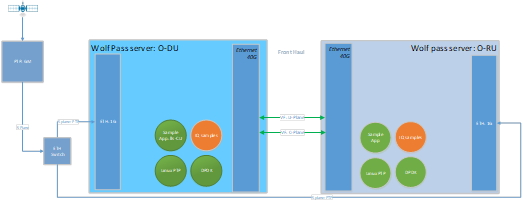
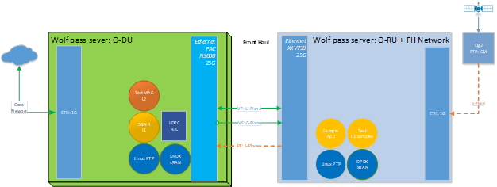

..    Copyright (c) 2019-2022 Intel
..
..  Licensed under the Apache License, Version 2.0 (the "License");
..  you may not use this file except in compliance with the License.
..  You may obtain a copy of the License at
..
..      http://www.apache.org/licenses/LICENSE-2.0
..
..  Unless required by applicable law or agreed to in writing, software
..  distributed under the License is distributed on an "AS IS" BASIS,
..  WITHOUT WARRANTIES OR CONDITIONS OF ANY KIND, either express or implied.
..  See the License for the specific language governing permissions and
..  limitations under the License.

.. |br| raw:: html

    

Setup Configuration
===================

A.1 Setup Configuration
-----------------------
The configuration shown in Figure 26 shows how to set up a test
environment to execute O-RAN scenarios where O-DU and 0-RU are simulated
using the sample application. This setup allows development and
prototyping as well as testing of O-RAN specific functionality. The O-DU
side can be instantiated with a full 5G NR L1 reference as well. The
configuration differences of the 5G NR l1app configuration are provided
below. Steps for running the sample application on the O-DU side and
0-RU side are the same, except configuration file options may be
different.

Figure 26. Setup for O-RAN Testing

Figure 27. Setup for O-RAN Testing with PHY and Configuration C3

A.2 Prerequisites
-----------------
Each server in Figure 26 requires the following:

-  Wolfpass server according to recommended BOM for FlexRAN such as
   Intel® Xeon® Skylake Gold 6148 FC-LGA3647 2.4 GHz 27.5 MB 150W 20
   cores (two sockets)

-  BIOS settings:

    -  Intel® Virtualization Technology Enabled

    -  Intel® VT for Directed I/O - Enabled

    -  ACS Control - Enabled

    -  Coherency Support - Disabled

-  Front Haul networking cards:

    -  Intel® Ethernet Converged Network Adapter XL710-QDA2

    -  Intel® Ethernet Converged Network Adapter XXV710-DA2

    -  Intel® Ethernet Converged Network Adapter E810-CQDA2

    -  Intel® FPGA Programmable Acceleration Card (Intel® FPGA PAC) N3000

-  Back (Mid) Haul networking card can be either:

    -  Intel® Ethernet Connection X722 for 10GBASE-T

    -  Intel® 82599ES 10-Gigabit SFI/SFP+ Network Connection

    -  Other networking cards capable of HW timestamping for PTP synchronization.

    -  Both Back (mid) Haul and Front Haul NIC require support for PTP HW timestamping.

The recommended configuration for NICs is::

    ethtool -i enp33s0f0
    driver: i40e
    version: 2.14.13
    firmware-version: 8.20 0x80009bd4 1.2879.0
    expansion-rom-version:
    bus-info: 0000:21:00.0
    supports-statistics: yes
    supports-test: yes
    supports-eeprom-access: yes
    supports-register-dump: yes
    supports-priv-flags: yes
    ethtool -T enp33s0f0
    Time stamping parameters for enp33s0f0:
    Capabilities:
        hardware-transmit (SOF_TIMESTAMPING_TX_HARDWARE)
        software-transmit (SOF_TIMESTAMPING_TX_SOFTWARE)
        hardware-receive (SOF_TIMESTAMPING_RX_HARDWARE)
        software-receive (SOF_TIMESTAMPING_RX_SOFTWARE)
        software-system-clock (SOF_TIMESTAMPING_SOFTWARE)
        hardware-raw-clock (SOF_TIMESTAMPING_RAW_HARDWARE)
    PTP Hardware Clock: 4
    Hardware Transmit Timestamp Modes:
        off (HWTSTAMP_TX_OFF)
        on (HWTSTAMP_TX_ON)
    Hardware Receive Filter Modes:
        none (HWTSTAMP_FILTER_NONE)
        ptpv1-l4-sync (HWTSTAMP_FILTER_PTP_V1_L4_SYNC)
        ptpv1-l4-delay-req (HWTSTAMP_FILTER_PTP_V1_L4_DELAY_REQ)
        ptpv2-l4-event (HWTSTAMP_FILTER_PTP_V2_L4_EVENT)
        ptpv2-l4-sync (HWTSTAMP_FILTER_PTP_V2_L4_SYNC)
        ptpv2-l4-delay-req (HWTSTAMP_FILTER_PTP_V2_L4_DELAY_REQ)
        ptpv2-l2-event (HWTSTAMP_FILTER_PTP_V2_L2_EVENT)
        ptpv2-l2-sync (HWTSTAMP_FILTER_PTP_V2_L2_SYNC)
        ptpv2-l2-delay-req (HWTSTAMP_FILTER_PTP_V2_L2_DELAY_REQ)
        ptpv2-event (HWTSTAMP_FILTER_PTP_V2_EVENT)
        ptpv2-sync (HWTSTAMP_FILTER_PTP_V2_SYNC)
        ptpv2-delay-req (HWTSTAMP_FILTER_PTP_V2_DELAY_REQ)

The recommended configuration for Columbiaville NICs (base on Intel®
Ethernet 800 Series (Columbiaville) CVL 2.3 release is::

    ethtool -i enp81s0f0
    driver: ice
    version: 1.3.2
    firmware-version: 2.3 0x80005D18
    expansion-rom-version:
    bus-info: 0000:51:00.0
    supports-statistics: yes
    supports-test: yes
    supports-eeprom-access: yes
    supports-register-dump: yes
    supports-priv-flags: yes
    ethtool -T enp81s0f0
    Time stamping parameters for enp81s0f0:
    Capabilities:
        hardware-transmit (SOF_TIMESTAMPING_TX_HARDWARE)
        software-transmit (SOF_TIMESTAMPING_TX_SOFTWARE)
        hardware-receive (SOF_TIMESTAMPING_RX_HARDWARE)
        software-receive (SOF_TIMESTAMPING_RX_SOFTWARE)
        software-system-clock (SOF_TIMESTAMPING_SOFTWARE)
        hardware-raw-clock (SOF_TIMESTAMPING_RAW_HARDWARE)
    PTP Hardware Clock: 1
    Hardware Transmit Timestamp Modes:
        off (HWTSTAMP_TX_OFF)
        on (HWTSTAMP_TX_ON)
    Hardware Receive Filter Modes:
        none (HWTSTAMP_FILTER_NONE)
        all (HWTSTAMP_FILTER_ALL)

    Recommended version of
    iavf driver 4.0.2
    ICE COMMS Package version 1.3.24.0

*Note*. If your firmware version does not match with the ones in the output
images, you can download the correct version from the Intel Download
Center. It is Intel's repository for the latest software and drivers
for Intel products. The NVM Update Packages for Windows*, Linux*,
ESX*, FreeBSD*, and EFI/EFI2 are located at:

..

https://downloadcenter.intel.com/download/24769 (700 series)

https://downloadcenter.intel.com/download/29736 (E810 series)

PTP Grand Master is required to be available in the network to provide
synchronization of both O-DU and RU to GPS time.

The software package includes Linux\* CentOS\* operating system and RT
patch according to FlexRAN Reference Solution Cloud-Native Setup
document (refer to Table 2). Only real-time HOST is required.

1. Install Intel® C++ Compiler v19.0.3

2. Download DPDK v20.11

3. Patch DPDK with FlexRAN BBDev patch as per given release.

4. Double check that FlexRAN DPDK patch includes changes below relevant
to O-RAN Front haul::

        For Fortville: 
        diff --git a/drivers/net/i40e/i40e_ethdev.c b/drivers/net/i40e/i40e_ethdev.c
        index 85a6a86..236fbe0 100644
        --- a/drivers/net/i40e/i40e_ethdev.c
        +++ b/drivers/net/i40e/i40e_ethdev.c
        @@ -2207,7 +2207,7 @@ void i40e_flex_payload_reg_set_default(struct i40e_hw *hw)
            /* Map queues with MSIX interrupt */
            main_vsi->nb_used_qps = dev->data->nb_rx_queues -
                pf->nb_cfg_vmdq_vsi * RTE_LIBRTE_I40E_QUEUE_NUM_PER_VM;
        -	i40e_vsi_queues_bind_intr(main_vsi, I40E_ITR_INDEX_DEFAULT);
        +	i40e_vsi_queues_bind_intr(main_vsi, I40E_ITR_INDEX_NONE);
            i40e_vsi_enable_queues_intr(main_vsi);
        
            /* Map VMDQ VSI queues with MSIX interrupt */
        @@ -2218,6 +2218,10 @@ void i40e_flex_payload_reg_set_default(struct i40e_hw *hw)
                i40e_vsi_enable_queues_intr(pf->vmdq[i].vsi);
            }
        +	i40e_aq_debug_write_global_register(hw,
        +					0x0012A504,
        +					0, NULL);
        +
            /* enable FDIR MSIX interrupt */
            if (pf->fdir.fdir_vsi) {
                i40e_vsi_queues_bind_intr(pf->fdir.fdir_vsi,
        diff --git a/drivers/net/i40e/i40e_ethdev_vf.c b/drivers/net/i40e/i40e_ethdev_vf.c
        index 001c301..6f9ffdb 100644
        --- a/drivers/net/i40e/i40e_ethdev_vf.c
        +++ b/drivers/net/i40e/i40e_ethdev_vf.c
        @@ -640,7 +640,7 @@ struct rte_i40evf_xstats_name_off {
        
            map_info = (struct virtchnl_irq_map_info *)cmd_buffer;
            map_info->num_vectors = 1;
        -	map_info->vecmap[0].rxitr_idx = I40E_ITR_INDEX_DEFAULT;
        +	map_info->vecmap[0].rxitr_idx = I40E_ITR_INDEX_NONE;
            map_info->vecmap[0].vsi_id = vf->vsi_res->vsi_id;
            /* Alway use default dynamic MSIX interrupt */
            map_info->vecmap[0].vector_id = vector_id;
        diff --git a/drivers/net/ixgbe/ixgbe_ethdev.c b/drivers/net/ixgbe/ixgbe_ethdev.c
        index 26b1927..018eb8f 100644
        --- a/drivers/net/ixgbe/ixgbe_ethdev.c
        +++ b/drivers/net/ixgbe/ixgbe_ethdev.c
        @@ -3705,7 +3705,7 @@ static int ixgbevf_dev_xstats_get_names(__rte_unused struct rte_eth_dev *dev,
                * except for 82598EB, which remains constant.
                */
                if (dev_conf->txmode.mq_mode == ETH_MQ_TX_NONE &&
        -				hw->mac.type != ixgbe_mac_82598EB)
        +				hw->mac.type != ixgbe_mac_82598EB && hw->mac.type != ixgbe_mac_82599EB)
                    dev_info->max_tx_queues = IXGBE_NONE_MODE_TX_NB_QUEUES;
            }
            dev_info->min_rx_bufsize = 1024; /* cf BSIZEPACKET in SRRCTL register */
        diff --git a/lib/librte_eal/common/include/rte_dev.h b/lib/librte_eal/common/include/rte_dev.h
        old mode 100644
        new mode 100755

        for Columbiaville
        diff --git a/drivers/net/ice/ice_ethdev.c b/drivers/net/ice/ice_ethdev.c
        index de189daba..d9aff341c 100644
        --- a/drivers/net/ice/ice_ethdev.c
        +++ b/drivers/net/ice/ice_ethdev.c
        @@ -2604,8 +2604,13 @@ __vsi_queues_bind_intr(struct ice_vsi *vsi, uint16_t msix_vect,

                        PMD_DRV_LOG(INFO, "queue %d is binding to vect %d",
                                    base_queue + i, msix_vect);
        -               /* set ITR0 value */
        -               ICE_WRITE_REG(hw, GLINT_ITR(0, msix_vect), 0x10);
        +               /* set ITR0 value
        +                * Empirical configuration for optimal real time latency
        +                * reduced interrupt throttling to 2 ms
        +                * Columbiaville pre-PRQ : local patch subject to change
        +                */
        +               ICE_WRITE_REG(hw, GLINT_ITR(0, msix_vect), 0x1);
        +               ICE_WRITE_REG(hw, QRX_ITR(base_queue + i), QRX_ITR_NO_EXPR_M);
                        ICE_WRITE_REG(hw, QINT_RQCTL(base_queue + i), val);
                        ICE_WRITE_REG(hw, QINT_TQCTL(base_queue + i), val_tx);
                }

5.Build and install DPDK::

   See https://doc.dpdk.org/guides/prog_guide/build-sdk-meson.html

6.Make below file changes in dpdk that assure i40e to get best
latency of packet processing::

        --- i40e.h	2018-11-30 11:27:00.000000000 +0000
        +++ i40e_patched.h	2019-03-06 15:49:06.877522427 +0000
        @@ -451,7 +451,7 @@
        
        #define I40E_QINT_RQCTL_VAL(qp, vector, nextq_type) \
            (I40E_QINT_RQCTL_CAUSE_ENA_MASK | \
        -	(I40E_RX_ITR << I40E_QINT_RQCTL_ITR_INDX_SHIFT) | \
        +	(I40E_ITR_NONE << I40E_QINT_RQCTL_ITR_INDX_SHIFT) | \
            ((vector) << I40E_QINT_RQCTL_MSIX_INDX_SHIFT) | \
            ((qp) << I40E_QINT_RQCTL_NEXTQ_INDX_SHIFT) | \
            (I40E_QUEUE_TYPE_##nextq_type << I40E_QINT_RQCTL_NEXTQ_TYPE_SHIFT))

        --- i40e_main.c	2018-11-30 11:27:00.000000000 +0000
        +++ i40e_main_patched.c	2019-03-06 15:46:13.521518062 +0000
        @@ -15296,6 +15296,9 @@
                pf->hw_features |= I40E_HW_HAVE_CRT_RETIMER;
            /* print a string summarizing features */
            i40e_print_features(pf);
        +	
        +	/* write to this register to clear rx descriptor */
        +	i40e_aq_debug_write_register(hw, 0x0012A504, 0, NULL);
        
            return 0;

A.3 Configuration of System
---------------------------
1.Boot Linux with the following arguments::

    cat /proc/cmdline
    BOOT_IMAGE=/vmlinuz-3.10.0-1062.12.1.rt56.1042.el7.x86_64 root=/dev/mapper/centos-root ro
    crashkernel=auto rd.lvm.lv=centos/root rd.lvm.lv=centos/swap intel_iommu=on iommu=pt
    usbcore.autosuspend=-1 selinux=0 enforcing=0 nmi_watchdog=0 softlockup_panic=0 audit=0
    intel_pstate=disable cgroup_memory=1 cgroup_enable=memory mce=off idle=poll
    hugepagesz=1G hugepages=16 hugepagesz=2M hugepages=0 default_hugepagesz=1G
    isolcpus=1-19,21-39 rcu_nocbs=1-19,21-39 kthread_cpus=0,20 irqaffinity=0,20
    nohz_full=1-19,21-39

2. Boot Linux with the following arguments for Icelake CPU::

    cat /proc/cmdline
    BOOT_IMAGE=/vmlinuz-3.10.0-957.10.1.rt56.921.el7.x86_64
    root=/dev/mapper/centos-root ro crashkernel=auto rd.lvm.lv=centos/root
    rd.lvm.lv=centos/swap rhgb quiet intel_iommu=off usbcore.autosuspend=-1
    selinux=0 enforcing=0 nmi_watchdog=0 softlockup_panic=0 audit=0
    intel_pstate=disable cgroup_disable=memory mce=off hugepagesz=1G
    hugepages=40 hugepagesz=2M hugepages=0 default_hugepagesz=1G
    isolcpus=1-23,25-47 rcu_nocbs=1-23,25-47 kthread_cpus=0 irqaffinity=0
    nohz_full=1-23,25-47

3. Download from Intel Website and install updated version of i40e
driver if needed. The current recommended version of i40e is 2.14.13.
However, any latest version of i40e after 2.9.21 expected to be
functional for O-RAN FH.

4. For Columbiaville download Intel® Ethernet 800 Series (Columbiaville)
CVL2.3 B0/C0 Sampling Sample Validation Kit (SVK) from Intel Customer
Content Library. The current recommended version of ICE driver is
1.3.2 with ICE COMMS Package version 1.3.24.0. IAVF recommended
version 4.0.2

5. Identify PCIe Bus address of the Front Haul NIC (Fortville)::

    lspci|grep Eth
    86:00.0 Ethernet controller: Intel Corporation Ethernet Controller XXV710 for 25GbE SFP28 (rev 02)
    86:00.1 Ethernet controller: Intel Corporation Ethernet Controller XXV710 for 25GbE SFP28 (rev 02)
    88:00.0 Ethernet controller: Intel Corporation Ethernet Controller XXV710 for 25GbE SFP28 (rev 02)
    88:00.1 Ethernet controller: Intel Corporation Ethernet Controller XXV710 for 25GbE SFP28 (rev 02)

6. Identify PCIe Bus address of the Front Haul NIC (Columbiaville)::

    lspci \|grep Eth
    18:00.0 Ethernet controller: Intel Corporation Device 1593 (rev 02)
    18:00.1 Ethernet controller: Intel Corporation Device 1593 (rev 02)
    18:00.2 Ethernet controller: Intel Corporation Device 1593 (rev 02)
    18:00.3 Ethernet controller: Intel Corporation Device 1593 (rev 02)
    51:00.0 Ethernet controller: Intel Corporation Device 1593 (rev 02)
    51:00.1 Ethernet controller: Intel Corporation Device 1593 (rev 02)
    51:00.2 Ethernet controller: Intel Corporation Device 1593 (rev 02)
    51:00.3 Ethernet controller: Intel Corporation Device 1593 (rev 02)

7. Identify the Ethernet device name::

    ethtool -i enp33s0f0
    driver: i40e
    version: 2.14.13
    firmware-version: 8.20 0x80009bd4 1.2879.0 
    expansion-rom-version:
    bus-info: 0000:21:00.0
    supports-statistics: yes
    supports-test: yes
    supports-eeprom-access: yes
    supports-register-dump: yes
    supports-priv-flags: yesEnable 

or ::

    ethtool -i enp81s0f0
    driver: ice
    version: 1.3.2
    firmware-version: 2.3 0x80005D18
    expansion-rom-version:
    bus-info: 0000:51:00.0
    supports-statistics: yes
    supports-test: yes
    supports-eeprom-access: yes
    supports-register-dump: yes
    supports-priv-flags: yes 

8. Enable 3 virtual functions (VFs) on the each of two ports of each
NIC::

        #!/bin/bash

        echo 0 > /sys/bus/pci/devices/0000\:88\:00.0/sriov_numvfs
        echo 0 > /sys/bus/pci/devices/0000\:88\:00.1/sriov_numvfs

        echo 0 > /sys/bus/pci/devices/0000\:86\:00.0/sriov_numvfs
        echo 0 > /sys/bus/pci/devices/0000\:86\:00.1/sriov_numvfs

        modprobe -r iavf
        modprobe iavf

        echo 3 > /sys/bus/pci/devices/0000\:88\:00.0/sriov_numvfs
        echo 3 > /sys/bus/pci/devices/0000\:88\:00.1/sriov_numvfs

        echo 3 > /sys/bus/pci/devices/0000\:86\:00.0/sriov_numvfs
        echo 3 > /sys/bus/pci/devices/0000\:86\:00.1/sriov_numvfs

        a=8

        if [ -z "$1" ]
        then
        b=0
        elif [ $1 -lt $a ]
        then
        b=$1
        else
        echo " Usage $0 qos with 0<= qos <= 7 with 0 as a default if no qos is provided"
        exit 1
        fi

        #O-DU
        ip link set enp136s0f0 vf 0 mac 00:11:22:33:00:00 vlan 1 qos $b
        ip link set enp136s0f1 vf 0 mac 00:11:22:33:00:10 vlan 1 qos $b

        ip link set enp136s0f0 vf 1 mac 00:11:22:33:01:00 vlan 2 qos $b
        ip link set enp136s0f1 vf 1 mac 00:11:22:33:01:10 vlan 2 qos $b

        ip link set enp136s0f0 vf 2 mac 00:11:22:33:02:00 vlan 3 qos $b
        ip link set enp136s0f1 vf 2 mac 00:11:22:33:02:10 vlan 3 qos $b

        #O-RU
        ip link set enp134s0f0 vf 0 mac 00:11:22:33:00:01 vlan 1 qos $b
        ip link set enp134s0f1 vf 0 mac 00:11:22:33:00:11 vlan 1 qos $b

        ip link set enp134s0f0 vf 1 mac 00:11:22:33:01:01 vlan 2 qos $b
        ip link set enp134s0f1 vf 1 mac 00:11:22:33:01:11 vlan 2 qos $b

        ip link set enp134s0f0 vf 2 mac 00:11:22:33:02:01 vlan 3 qos $b
        ip link set enp134s0f1 vf 2 mac 00:11:22:33:02:11 vlan 3 qos $b

where output is next::

        ip link show
        ...
        9: enp134s0f0: <BROADCAST,MULTICAST,UP,LOWER_UP> mtu 1500 qdisc mq state UP mode DEFAULT group default qlen 1000
            link/ether 3c:fd:fe:b9:f9:60 brd ff:ff:ff:ff:ff:ff
            vf 0 MAC 00:11:22:33:00:01, vlan 1, spoof checking on, link-state auto, trust off
            vf 1 MAC 00:11:22:33:01:01, vlan 2, spoof checking on, link-state auto, trust off
            vf 2 MAC 00:11:22:33:02:01, vlan 3, spoof checking on, link-state auto, trust off
        11: enp134s0f1: <BROADCAST,MULTICAST,UP,LOWER_UP> mtu 1500 qdisc mq state UP mode DEFAULT group default qlen 1000
            link/ether 3c:fd:fe:b9:f9:61 brd ff:ff:ff:ff:ff:ff
            vf 0 MAC 00:11:22:33:00:11, vlan 1, spoof checking on, link-state auto, trust off
            vf 1 MAC 00:11:22:33:01:11, vlan 2, spoof checking on, link-state auto, trust off
            vf 2 MAC 00:11:22:33:02:11, vlan 3, spoof checking on, link-state auto, trust off
        12: enp136s0f0: <BROADCAST,MULTICAST,UP,LOWER_UP> mtu 1500 qdisc mq state UP mode DEFAULT group default qlen 1000
            link/ether 3c:fd:fe:b9:f8:b4 brd ff:ff:ff:ff:ff:ff
            vf 0 MAC 00:11:22:33:00:00, vlan 1, spoof checking on, link-state auto, trust off
            vf 1 MAC 00:11:22:33:01:00, vlan 2, spoof checking on, link-state auto, trust off
            vf 2 MAC 00:11:22:33:02:00, vlan 3, spoof checking on, link-state auto, trust off
        14: enp136s0f1: <BROADCAST,MULTICAST,UP,LOWER_UP> mtu 1500 qdisc mq state UP mode DEFAULT group default qlen 1000
            link/ether 3c:fd:fe:b9:f8:b5 brd ff:ff:ff:ff:ff:ff
            vf 0 MAC 00:11:22:33:00:10, vlan 1, spoof checking on, link-state auto, trust off
            vf 1 MAC 00:11:22:33:01:10, vlan 2, spoof checking on, link-state auto, trust off
            vf 2 MAC 00:11:22:33:02:10, vlan 3, spoof checking on, link-state auto, trust off
        ...

More information about VFs supported by Intel NICs can be found at
https://doc.dpdk.org/guides/nics/intel_vf.html.

The resulting configuration can look like the listing below, where six
new VFs were added for each O-DU and O-RU port:::

    lspci|grep Eth
    86:00.0 Ethernet controller: Intel Corporation Ethernet Controller XXV710 for 25GbE SFP28 (rev 02)
    86:00.1 Ethernet controller: Intel Corporation Ethernet Controller XXV710 for 25GbE SFP28 (rev 02)
    86:02.0 Ethernet controller: Intel Corporation Ethernet Virtual Function 700 Series (rev 02) 
    86:02.1 Ethernet controller: Intel Corporation Ethernet Virtual Function 700 Series (rev 02)
    86:02.2 Ethernet controller: Intel Corporation Ethernet Virtual Function 700 Series (rev 02) 
    86:0a.0 Ethernet controller: Intel Corporation Ethernet Virtual Function 700 Series (rev 02)
    86:0a.1 Ethernet controller: Intel Corporation Ethernet Virtual Function 700 Series (rev 02)
    86:0a.2 Ethernet controller: Intel Corporation Ethernet Virtual Function 700 Series (rev 02)
    88:00.0 Ethernet controller: Intel Corporation Ethernet Controller XXV710 for 25GbE SFP28 (rev 02)
    88:00.1 Ethernet controller: Intel Corporation Ethernet Controller XXV710 for 25GbE SFP28 (rev 02)
    88:02.0 Ethernet controller: Intel Corporation Ethernet Virtual Function 700 Series (rev 02)
    88:02.1 Ethernet controller: Intel Corporation Ethernet Virtual Function 700 Series (rev 02)
    88:02.2 Ethernet controller: Intel Corporation Ethernet Virtual Function 700 Series (rev 02)
    88:0a.0 Ethernet controller: Intel Corporation Ethernet Virtual Function 700 Series (rev 02)
    88:0a.1 Ethernet controller: Intel Corporation Ethernet Virtual Function 700 Series (rev 02)
    88:0a.2 Ethernet controller: Intel Corporation Ethernet Virtual Function 700 Series (rev 02)

9. Example where O-DU and O-RU simulation run on the same system:

O-DU:::

        cat ./run_o_du.sh
        #! /bin/bash

        ulimit -c unlimited
        echo 1 > /proc/sys/kernel/core_uses_pid

        ./build/sample-app --usecasefile ./usecase/cat_b/mu1_100mhz/301/usecase_du.cfg --num_eth_vfs 6 \
        --vf_addr_o_xu_a "0000:88:02.0,0000:88:0a.0" \
        --vf_addr_o_xu_b "0000:88:02.1,0000:88:0a.1" \
        --vf_addr_o_xu_c "0000:88:02.2,0000:88:0a.2"

O-RU::

        cat ./run_o_ru.sh
        #! /bin/bash
        ulimit -c unlimited
        echo 1 > /proc/sys/kernel/core_uses_pid

        ./build/sample-app --usecasefile ./usecase/cat_b/mu1_100mhz/301/usecase_ru.cfg --num_eth_vfs 6 \
        --vf_addr_o_xu_a "0000:86:02.0,0000:86:0a.0" \
        --vf_addr_o_xu_b "0000:86:02.1,0000:86:0a.1" \
        --vf_addr_o_xu_c "0000:86:02.2,0000:86:0a.2"

Install and Configure Sample Application
========================================

To install and configure the sample application:

1. Set up the environment::

    For Skylake and Cascadelake
    export GTEST_ROOT=pwd/gtest-1.7.0
    export RTE_SDK=pwd/dpdk-20.11
    export RTE_TARGET=x86_64-native-linuxapp-icc
    export DIR_WIRELESS_SDK_ROOT=pwd/wireless_sdk
    export WIRELESS_SDK_TARGET_ISA=avx512
    export SDK_BUILD=build-${WIRELESS_SDK_TARGET_ISA}-icc
    export DIR_WIRELESS_SDK=${DIR_WIRELESS_SDK_ROOT}/${SDK_BUILD}
    export MLOG_DIR=pwd/flexran_l1_sw/libs/mlog
    export XRAN_DIR=pwd/flexran_xran

    for Icelake
    export GTEST_ROOT=pwd/gtest-1.7.0
    export RTE_SDK=pwd/dpdk-20.11
    export RTE_TARGET=x86_64-native-linuxapp-icc
    export DIR_WIRELESS_SDK_ROOT=pwd/wireless_sdk
    export WIRELESS_SDK_TARGET_ISA=snc
    export SDK_BUILD=build-${WIRELESS_SDK_TARGET_ISA}-icc
    export DIR_WIRELESS_SDK=${DIR_WIRELESS_SDK_ROOT}/${SDK_BUILD}
    export MLOG_DIR=pwd/flexran_l1_sw/libs/mlog
    export XRAN_DIR=pwd/flexran_xran

2. export FLEXRAN_SDK=${DIR_WIRELESS_SDK}/install Compile mlog library::

    [turner@xran home]$ cd $MLOG_DIR
    [turner@xran xran]$ ./build.sh

3. Compile O-RAN library and test the application::

    [turner@xran home]$ cd $XRAN_DIR
    [turner@xran xran]$ ./build.sh

4. Configure the sample app.

IQ samples can be generated using Octave\* and script
libs/xran/app/gen_test.m. (CentOS\* has octave-3.8.2-20.el7.x86_64
compatible with get_test.m)

Other IQ sample test vectors can be used as well. The format of IQ
samples is binary int16_t I and Q for N slots of the OTA RF signal. For
example, for mmWave, it corresponds to 792RE*2*14symbol*8slots*10 ms =
3548160 bytes per antenna. Refer to comments in gen_test.m to correctly
specify the configuration for IQ test vector generation.

Update usecase_du.dat (or usecase_ru.cfg) with a suitable configuration
for your scenario.

Update config_file_o_du.dat (or config_file_o_ru.dat) with a suitable
configuration for your scenario.

Update run_o_du.sh (run_o_ru.sh) with PCIe bus address of VF0 and VF1
used for U-plane and C-plane correspondingly.

5. Run the application using run_o_du.sh (run_o_ru.sh).

Install and Configure FlexRAN 5G NR L1 Application
==================================================

The 5G NR layer 1 application can be used for executing the scenario for
mmWave with either the RU sample application or just the O-DU side. The
current release supports the constant configuration of the slot pattern
and RB allocation on the PHY side. The build process follows the same
basic steps as for the sample application above and is similar to
compiling 5G NR l1app for mmWave with Front Haul FPGA. Please follow the
general build process in the FlexRAN 5G NR Reference Solution L1 User
Guide (refer to *Table 2*.)

1. O-RAN library is enabled by default l1 application:

2. Build the 5G NR L1 application using the command::

    ./flexran_build.sh -r 5gnr_mmw -i avx512 -m sdk -m fb -m mlog –m wls -m
    5gnr_l1app_mmw -m xran -m 5gnr_testmac

3. Configure the L1app using bin/nr5g/gnb/l1/phycfg_xran.xml and
xrancfg_sub6.xml (or other xml if it is mmwave or massive MIMO). ::

    <XranConfig>
        <version>20.08</version>
            <!-- numbers of O-RU connected to O-DU. All O-RUs are the same capabilities. Max O-RUs is per XRAN_PORTS_NUM i.e. 4 -->
        <oRuNum>1</oRuNum>
        <!--  # 10G,25G,40G,100G speed of Physical connection on O-RU -->
        <oRuEthLinkSpeed>25</oRuEthLinkSpeed>
        <!--  # 1, 2, 3 total number of links per O-RU (Fronthaul Ethernet link in IOT spec) -->
        <oRuLinesNumber>1</oRuLinesNumber>

        <!-- O-RU 0 -->
        <PciBusAddoRu0Vf0>0000:51:01.0</PciBusAddoRu0Vf0>
        <PciBusAddoRu0Vf1>0000:51:01.1</PciBusAddoRu0Vf1>
        <PciBusAddoRu0Vf2>0000:51:01.2</PciBusAddoRu0Vf2>
        <PciBusAddoRu0Vf3>0000:51:01.3</PciBusAddoRu0Vf3>

        <!-- O-RU 1 -->
        <PciBusAddoRu1Vf0>0000:51:01.4</PciBusAddoRu1Vf0>
        <PciBusAddoRu1Vf1>0000:51:01.5</PciBusAddoRu1Vf1>
        <PciBusAddoRu1Vf2>0000:51:01.6</PciBusAddoRu1Vf2>
        <PciBusAddoRu1Vf3>0000:51:01.7</PciBusAddoRu1Vf3>

        <!-- O-RU 2 -->
        <PciBusAddoRu2Vf0>0000:51:02.0</PciBusAddoRu2Vf0>
        <PciBusAddoRu2Vf1>0000:51:02.1</PciBusAddoRu2Vf1>
        <PciBusAddoRu2Vf2>0000:51:02.2</PciBusAddoRu2Vf2>
        <PciBusAddoRu2Vf3>0000:51:02.3</PciBusAddoRu2Vf3>

        <!-- O-RU 4 -->
        <PciBusAddoRu3Vf0>0000:00:00.0</PciBusAddoRu3Vf0>
        <PciBusAddoRu3Vf1>0000:00:00.0</PciBusAddoRu3Vf1>
        <PciBusAddoRu3Vf2>0000:00:00.0</PciBusAddoRu3Vf2>
        <PciBusAddoRu3Vf3>0000:00:00.0</PciBusAddoRu3Vf3>

        <!-- remote O-RU 0 Eth Link 0 VF0, VF1-->
        <oRuRem0Mac0>00:11:22:33:00:01<oRuRem0Mac0>
        <oRuRem0Mac1>00:11:22:33:00:11<oRuRem0Mac1>
        <!-- remote O-RU 0 Eth Link 1 VF2, VF3 -->
        <oRuRem0Mac2>00:11:22:33:00:21<oRuRem0Mac2>
        <oRuRem0Mac3>00:11:22:33:00:31<oRuRem0Mac3>

        <!-- remote O-RU 1 Eth Link 0 VF4, VF5-->
        <oRuRem1Mac0>00:11:22:33:01:01<oRuRem1Mac0>
        <oRuRem1Mac1>00:11:22:33:01:11<oRuRem1Mac1>
        <!-- remote O-RU 1 Eth Link 1 VF6, VF7 -->
        <oRuRem1Mac2>00:11:22:33:01:21<oRuRem1Mac2>
        <oRuRem1Mac3>00:11:22:33:01:31<oRuRem1Mac3>

        <!-- remote O-RU 2 Eth Link 0 VF8, VF9 -->
        <oRuRem2Mac0>00:11:22:33:02:01<oRuRem2Mac0>
        <oRuRem2Mac1>00:11:22:33:02:11<oRuRem2Mac1>
        <!-- remote O-RU 2 Eth Link 1 VF10, VF11-->
        <oRuRem2Mac2>00:11:22:33:02:21<oRuRem2Mac2>
        <oRuRem2Mac3>00:11:22:33:02:31<oRuRem2Mac3>

        <!-- remote O-RU 2 Eth Link 0 VF12, VF13 -->
        <oRuRem3Mac0>00:11:22:33:03:01<oRuRem3Mac0>
        <oRuRem3Mac1>00:11:22:33:03:11<oRuRem3Mac1>
        <!-- remote O-RU 2 Eth Link 1 VF14, VF15-->
        <oRuRem3Mac2>00:11:22:33:03:21<oRuRem3Mac2>
        <oRuRem3Mac3>00:11:22:33:03:31<oRuRem3Mac3>

        <!--  Number of cells (CCs) running on this O-RU  [1 - Cell , 2 - Cells, 3 - Cells , 4 - Cells ] -->
        <oRu0NumCc>1</oRu0NumCc>
        <!-- First Phy instance ID mapped to this O-RU CC0  -->
        <oRu0Cc0PhyId>0</oRu0Cc0PhyId>
        <!-- Second Phy instance ID mapped to this O-RU CC1 -->
        <oRu0Cc1PhyId>1</oRu0Cc1PhyId>
        <!-- Third Phy instance ID mapped to this O-RU CC2  -->
        <oRu0Cc2PhyId>2</oRu0Cc2PhyId>
        <!-- Forth Phy instance ID mapped to this O-RU CC3  -->
        <oRu0Cc3PhyId>3</oRu0Cc3PhyId>
            <!-- First Phy instance ID mapped to this O-RU CC0  -->
        <oRu0Cc4PhyId>4</oRu0Cc4PhyId>
        <!-- Second Phy instance ID mapped to this O-RU CC1 -->
        <oRu0Cc5PhyId>5</oRu0Cc5PhyId>
        <!-- Third Phy instance ID mapped to this O-RU CC2  -->
        <oRu0Cc6PhyId>6</oRu0Cc6PhyId>
        <!-- Forth Phy instance ID mapped to this O-RU CC3  -->
        <oRu0Cc7PhyId>7</oRu0Cc7PhyId>
        <!-- First Phy instance ID mapped to this O-RU CC0  -->
        <oRu0Cc8PhyId>8</oRu0Cc8PhyId>
        <!-- Second Phy instance ID mapped to this O-RU CC1 -->
        <oRu0Cc9PhyId>9</oRu0Cc9PhyId>
        <!-- Third Phy instance ID mapped to this O-RU CC2  -->
        <oRu0Cc10PhyId>10</oRuCc10PhyId>
        <!-- Forth Phy instance ID mapped to this O-RU CC3  -->
        <oRu0Cc11PhyId>11</oRu0Cc11PhyId>

        <!--  Number of cells (CCs) running on this O-RU  [1 - Cell , 2 - Cells, 3 - Cells , 4 - Cells ] -->
        <oRu1NumCc>1</oRu1NumCc>
        <!-- First Phy instance ID mapped to this O-RU CC0  -->
        <oRu1Cc0PhyId>1</oRu1Cc0PhyId>
        <!-- Second Phy instance ID mapped to this O-RU CC1 -->
        <oRu1Cc1PhyId>1</oRu1Cc1PhyId>
        <!-- Third Phy instance ID mapped to this O-RU CC2  -->
        <oRu1Cc2PhyId>2</oRu1Cc2PhyId>
        <!-- Forth Phy instance ID mapped to this O-RU CC3  -->
        <oRu1Cc3PhyId>3</oRu1Cc3PhyId>

        <!--  Number of cells (CCs) running on this O-RU  [1 - Cell , 2 - Cells, 3 - Cells , 4 - Cells ] -->
        <oRu2NumCc>1</oRu2NumCc>
        <!-- First Phy instance ID mapped to this O-RU CC0  -->
        <oRu2Cc0PhyId>2</oRu2Cc0PhyId>
        <!-- Second Phy instance ID mapped to this O-RU CC1 -->
        <oRu2Cc1PhyId>1</oRu2Cc1PhyId>
        <!-- Third Phy instance ID mapped to this O-RU CC2  -->
        <oRu2Cc2PhyId>2</oRu2Cc2PhyId>
        <!-- Forth Phy instance ID mapped to this O-RU CC3  -->
        <oRu2Cc3PhyId>3</oRu2Cc3PhyId>

        <!-- XRAN Thread (core where the XRAN polling function is pinned: Core, priority, Policy [0: SCHED_FIFO 1: SCHED_RR] -->
        <xRANThread>19, 96, 0</xRANThread>

        <!-- core mask for XRAN Packets Worker (core where the XRAN packet processing is pinned): Core, priority, Policy [0: SCHED_FIFO 1: SCHED_RR] -->
        <xRANWorker>0x0, 96, 0</xRANWorker>
        <!-- XRAN: Category of O-RU 0 - Category A, 1 - Category B -->
        <Category>0</Category>

        <!-- XRAN: enable sleep on PMD cores -->
        <xranPmdSleep>0</xranPmdSleep>

        <!-- RU Settings -->
        <Tadv_cp_dl>25</Tadv_cp_dl>
        <!-- Reception Window C-plane DL-->
        <T2a_min_cp_dl>50</T2a_min_cp_dl>
        <T2a_max_cp_dl>140</T2a_max_cp_dl>
        <!-- Reception Window C-plane UL-->
        <T2a_min_cp_ul>50</T2a_min_cp_ul>
        <T2a_max_cp_ul>140</T2a_max_cp_ul>
        <!-- Reception Window U-plane -->
        <T2a_min_up>25</T2a_min_up>
        <T2a_max_up>140</T2a_max_up>
        <!-- Transmission Window U-plane -->
        <Ta3_min>20</Ta3_min>
        <Ta3_max>32</Ta3_max>

        <!-- O-DU Settings -->
        <!-- MTU size -->
        <MTU>9600</MTU>
        <!-- VLAN Tag used for C-Plane -->
        <c_plane_vlan_tag>1</c_plane_vlan_tag>
        <u_plane_vlan_tag>2</u_plane_vlan_tag>

        <!-- Transmission Window Fast C-plane DL -->
        <T1a_min_cp_dl>70</T1a_min_cp_dl>
        <T1a_max_cp_dl>100</T1a_max_cp_dl>
        <!-- Transmission Window Fast C-plane UL -->
        <T1a_min_cp_ul>60</T1a_min_cp_ul>
        <T1a_max_cp_ul>70</T1a_max_cp_ul>
        <!-- Transmission Window U-plane -->
        <T1a_min_up>35</T1a_min_up>
        <T1a_max_up>50</T1a_max_up>
        <!-- Reception Window U-Plane-->
        <Ta4_min>0</Ta4_min>
        <Ta4_max>45</Ta4_max>

        <!-- Enable Control Plane -->
        <EnableCp>1</EnableCp>

        <DynamicSectionEna>0</DynamicSectionEna>
        <!-- Enable Dynamic section allocation for UL -->
        <DynamicSectionEnaUL>0</DynamicSectionEnaUL>
        <xRANSFNWrap>0</xRANSFNWrap>
        <!-- Total Number of DL PRBs per symbol (starting from RB 0) that is transmitted (used for testing. If 0, then value is used from PHY_CONFIG_API) -->
        <xRANNumDLPRBs>0</xRANNumDLPRBs>
        <!-- Total Number of UL PRBs per symbol (starting from RB 0) that is received (used for testing. If 0, then value is used from PHY_CONFIG_API) -->
        <xRANNumULPRBs>0</xRANNumULPRBs>
        <!-- refer to alpha as defined in section 9.7.2 of O-RAN spec. this value should be alpha*(1/1.2288ns), range 0 - 1e7 (ns) -->
        <Gps_Alpha>0</Gps_Alpha>
        <!-- beta value as defined in section 9.7.2 of ORAN spec. range -32767 ~ +32767 -->
        <Gps_Beta>0</Gps_Beta>

        <!-- XRAN: Compression mode on O-DU <-> O-RU 0 - no comp 1 - BFP -->
        <xranCompMethod>0</xranCompMethod>

        <oRu0nPrbElemDl>1</oRu0nPrbElemDl>
        <!--nRBStart, nRBSize, nStartSymb, numSymb, nBeamIndex, bf_weight_update, compMethod, iqWidth, BeamFormingType, Scalefactor, REMask -->
        <!-- weight base beams -->
        <oRu0PrbElemDl0>0,48,0,14,1,1,1,9,1,0,0</oRu0PrbElemDl0>
        <oRu0PrbElemDl1>48,48,0,14,2,1,1,9,1,0,0</oRu0PrbElemDl1>
        <oRu0PrbElemDl2>96,48,0,14,3,1,1,9,1,0,0</oRu0PrbElemDl2>
        <oRu0PrbElemDl3>144,48,0,14,4,1,1,9,1,0,0</oRu0PrbElemDl3>
        <oRu0PrbElemDl4>144,36,0,14,5,1,1,9,1,0,0</oRu0PrbElemDl4>
        <oRu0PrbElemDl5>180,36,0,14,6,1,1,9,1,0,0</oRu0PrbElemDl5>
        <oRu0PrbElemDl6>216,36,0,14,7,1,1,9,1,0,0</oRu0PrbElemDl6>
        <oRu0PrbElemDl7>252,21,0,14,8,1,1,9,1,0,0</oRu0PrbElemDl7>
        <oRu0nPrbElemUl>1</nPrbElemUl>
        <!--nRBStart, nRBSize, nStartSymb, numSymb, nBeamIndex, bf_weight_update, compMethod, iqWidth, BeamFormingType, Scalefactor, REMask -->
        <!-- weight base beams -->
        <oRu0PrbElemUl0>0,48,0,14,1,1,1,9,1,0,0</oRu0PrbElemUl0>
        <oRu0PrbElemUl1>48,48,0,14,2,1,1,9,1,0,0</oRu0PrbElemUl1>
        <oRu0PrbElemUl2>72,36,0,14,3,1,1,9,1,0,0</oRu0PrbElemUl2>
        <oRu0PrbElemUl3>108,36,0,14,4,1,1,9,1,0,0</oRu0PrbElemUl3>
        <oRu0PrbElemUl4>144,36,0,14,5,1,1,9,1,0,0</oRu0PrbElemUl4>
        <oRu0PrbElemUl5>180,36,0,14,6,1,1,9,1,0,0</oRu0PrbElemUl5>
        <oRu0PrbElemUl6>216,36,0,14,7,1,1,9,1,0,0</oRu0PrbElemUl6>
        <oRu0PrbElemUl7>252,21,0,14,8,1,1,9,1,0,0</oRu0PrbElemUl7>

    </XranConfig>

4. Modify bin/nr5g/gnb/l1/dpdk.sh (change PCIe addresses from VFs). ::

    $RTE_SDK/usertools/dpdk-devbind.py --bind=vfio-pci 0000:21:02.0
    $RTE_SDK/usertools/dpdk-devbind.py --bind=vfio-pci 0000:21:02.1

5. Use configuration of test mac per::

    /bin/nr5g/gnb.testmac/cascade_lake-sp/csxsp_mu1_100mhz_mmimo_hton_xran.cfg
    phystart 4 0 40200
    <!--   mmWave mu 3 100MHz                -->
    TEST_FD, 1002, 1, fd/mu3_100mhz/2/fd_testconfig_tst2.cfg

6. To execute l1app with O-DU functionality according to O-RAN Fronthaul specification, enter::

    [root@xran flexran] cd ./bin/nr5g/gnb/l1
    [root@xran l1]#./l1.sh –xran

where output corresponding L1 is::

    [root@sc12-xran-sub6 l1]# ./l1.sh -xranmmw
    Radio mode with XRAN - mmWave 100Mhz
    DPDK WLS MODE
    kernel.sched_rt_runtime_us = -1
    kernel.shmmax = 2147483648
    kernel.shmall = 2147483648
    Note: Forwarding request to 'systemctl disable irqbalance.service'.
    using configuration file phycfg_xran_mmw.xml
    >> Running... ./l1app table 0 1 --cfgfile=phycfg_xran_mmw.xml
    FlexRAN SDK bblib_layerdemapping_5gnr version #DIRTY#
    FlexRAN SDK bblib_layermapping_5gnr version #DIRTY#
    FlexRAN SDK bblib_cestimate_5gnr_version #DIRTY#
    FlexRAN SDK bblib_pucch_cestimate_5gnr version #DIRTY#
    FlexRAN SDK bblib_llr_demapping version #DIRTY#
    FlexRAN SDK bblib_pdcch_remapping_5gnr_version version #DIRTY#
    FlexRAN SDK bblib_reed_muller version #DIRTY#
    FlexRAN SDK bblib_lte_modulation version #DIRTY#
    FlexRAN SDK bblib_polar_decoder_5gnr version #DIRTY#
    FlexRAN SDK bblib_polar_rate_dematching_5gnr version #DIRTY#
    FlexRAN SDK bblib_PhaseNoise_5G version #DIRTY#
    FlexRAN SDK bblib_mimo_mmse_detection_5gnr version #DIRTY#
    FlexRAN SDK bblib_fd_correlation version #DIRTY#
    FlexRAN SDK bblib_scramble_5gnr version #DIRTY#
    FlexRAN SDK bblib_pucch_equ_5gnr version #DIRTY#
    FlexRAN SDK bblib_ta_compensation_version_5gnr #DIRTY#
    FlexRAN SDK bblib_polar_encoder_5gnr version #DIRTY#
    FlexRAN SDK bblib_prach_5gnr version #DIRTY#
    FlexRAN SDK bblib_fft_ifft version #DIRTY#
    FlexRAN SDK bblib_pucch_5gnr version #DIRTY#
    FlexRAN SDK bblib_common version #DIRTY#
    FlexRAN SDK bblib_lte_crc version #DIRTY#
    FlexRAN SDK bblib_lte_dft_idft version #DIRTY#
    FlexRAN SDK bblib_irc_rnn_calculation_5gnr_version #DIRTY#
    FlexRAN SDK bblib_mmse_irc_mimo_5gnr_version #DIRTY#
    FlexRAN SDK bblib_srs_cestimate_5gnr version #DIRTY#
    FlexRAN SDK bblib_zf_matrix_gen version #DIRTY#
    FlexRAN SDK bblib_beamforming_dl_expand version #DIRTY#
    =========================
    5GNR PHY Application
    =========================
    ---------------------------
    PhyCfg.xml Version: 20.04
    ---------------------------
    --version=20.04
    --successiveNoApi=15
    --wls_dev_name=wls0
    --wlsMemorySize=0x3F600000
    --dlIqLog=0
    --ulIqLog=0
    --iqLogDumpToFile=0x0
    --phyMlog=1
    --phyStats=1
    --dpdkMemorySize=8192
    --dpdkIovaMode=0
    --dpdkBasebandFecMode=1
    --dpdkBasebandDevice=0000:1f:00.1
    --radioEnable=4
    --ferryBridgeMode=1
    --ferryBridgeEthPort=1
    --ferryBridgeSyncPorts=0
    --ferryBridgeOptCableLoopback=0
    --radioCfg0PCIeEthDev=0000:19:00.0
    --radioCfg0DpdkRx=1
    --radioCfg0DpdkTx=2
    --radioCfg0TxAnt=2
    --radioCfg0RxAnt=2
    --radioCfg0RxAgc=0
    --radioCfg0NumCell=1
    --radioCfg0Cell0PhyId=0
    --radioCfg0Cell1PhyId=1
    --radioCfg0Cell2PhyId=2
    --radioCfg0Cell3PhyId=3
    --radioCfg0Cell4PhyId=4
    --radioCfg0Cell5PhyId=5
    --radioCfg0riuMac=11:22:33:44:55:66
    --radioCfg1PCIeEthDev=0000:03:00.1
    --radioCfg1DpdkRx=1
    --radioCfg1DpdkTx=1
    --radioCfg1TxAnt=4
    --radioCfg1RxAnt=4
    --radioCfg1RxAgc=0
    --radioCfg1NumCell=1
    --radioCfg1Cell0PhyId=2
    --radioCfg1Cell1PhyId=3
    --radioCfg1Cell2PhyId=2
    --radioCfg1Cell3PhyId=3
    --radioCfg1riuMac=ac:1f:6b:2c:9f:07
    --radioCfg2PCIeEthDev=0000:05:00.0
    --radioCfg2DpdkRx=10
    --radioCfg2DpdkTx=11
    --radioCfg2TxAnt=4
    --radioCfg2RxAnt=4
    --radioCfg2RxAgc=0
    --radioCfg2NumCell=2
    --radioCfg2Cell0PhyId=4
    --radioCfg2Cell1PhyId=5
    --radioCfg2Cell2PhyId=2
    --radioCfg2Cell3PhyId=3
    --radioCfg2riuMac=ac:1f:6b:2c:9f:07
    --radioCfg3PCIeEthDev=0000:05:00.1
    --radioCfg3DpdkRx=12
    --radioCfg3DpdkTx=13
    --radioCfg3TxAnt=4
    --radioCfg3RxAnt=4
    --radioCfg3RxAgc=0
    --radioCfg3NumCell=2
    --radioCfg3Cell0PhyId=6
    --radioCfg3Cell1PhyId=7
    --radioCfg3Cell2PhyId=2
    --radioCfg3Cell3PhyId=3
    --radioCfg3riuMac=ac:1f:6b:2c:9f:07
    --radioCfg4PCIeEthDev=0000:00:08.0
    --radioCfg4DpdkRx=14
    --radioCfg4DpdkTx=15
    --radioCfg4TxAnt=4
    --radioCfg4RxAnt=4
    --radioCfg4RxAgc=0
    --radioCfg4NumCell=2
    --radioCfg4Cell0PhyId=8
    --radioCfg4Cell1PhyId=9
    --radioCfg4Cell2PhyId=2
    --radioCfg4Cell3PhyId=3
    --radioCfg4riuMac=ac:1f:6b:2c:9f:07
    --radioCfg5PCIeEthDev=0000:08:00.0
    --radioCfg5DpdkRx=16
    --radioCfg5DpdkTx=16
    --radioCfg5TxAnt=4
    --radioCfg5RxAnt=4
    --radioCfg5RxAgc=0
    --radioCfg5NumCell=2
    --radioCfg5Cell0PhyId=10
    --radioCfg5Cell1PhyId=11
    --radioCfg5Cell2PhyId=2
    --radioCfg5Cell3PhyId=3
    --radioCfg5riuMac=ac:1f:6b:2c:9f:07
    --radioCfg6PCIeEthDev=0000:00:05.0
    --radioCfg6DpdkRx=16
    --radioCfg6DpdkTx=16
    --radioCfg6TxAnt=4
    --radioCfg6RxAnt=4
    --radioCfg1RxAgc=0
    --radioCfg6NumCell=2
    --radioCfg6Cell0PhyId=12
    --radioCfg6Cell1PhyId=13
    --radioCfg6Cell2PhyId=2
    --radioCfg6Cell3PhyId=3
    --radioCfg6riuMac=ac:1f:6b:2c:9f:07
    --radioCfg7PCIeEthDev=0000:00:06.0
    --radioCfg7DpdkRx=16
    --radioCfg7DpdkTx=16
    --radioCfg7TxAnt=4
    --radioCfg7RxAnt=4
    --radioCfg7RxAgc=0
    --radioCfg7NumCell=2
    --radioCfg7Cell0PhyId=14
    --radioCfg7Cell1PhyId=15
    --radioCfg7Cell2PhyId=2
    --radioCfg7Cell3PhyId=3
    --radioCfg7riuMac=ac:1f:6b:2c:9f:07
    --radioPort0=0
    --radioPort1=1
    --radioPort2=2
    --radioPort3=3
    --radioPort4=4
    --radioPort5=5
    --radioPort6=6
    --radioPort7=7
    --PdschSymbolSplit=0
    --PdschDlWeightSplit=0
    --FecEncSplit=4
    --PuschChanEstSplit=0
    --PuschMmseSplit=0
    --PuschLlrRxSplit=0
    --PuschUlWeightSplit=0
    --FecDecEarlyTermDisable=0
    --FecDecNumIter=0
    --FecDecSplit=4
    --llrOutDecimalDigit=2
    --IrcEnableThreshold=-10
    --CEInterpMethod=0
    --PucchSplit=0
    --SrsCeSplit=0
    --prachDetectThreshold=10000
    --MlogSubframes=128
    --MlogCores=20
    --MlogSize=3084
    --systemThread=0, 0, 0
    --timerThread=0, 96, 0
    --xRANThread=4, 96, 0
    --xRANWorker=0x0, 96, 0
    --FpgaDriverCpuInfo=2, 96, 0
    --FrontHaulCpuInfo=3, 96, 0
    --radioDpdkMaster=2, 99, 0
    --BbuPoolSleepEnable=1
    --BbuPoolThreadCorePriority=94
    --BbuPoolThreadCorePolicy=0
    --BbuPoolThreadDefault_0_63=0x68
    --BbuPoolThreadDefault_64_127=0x0
    --BbuPoolThreadSrs_0_63=0x0
    --BbuPoolThreadSrs_64_127=0x0
    --BbuPoolThreadDlbeam_0_63=0x0
    --BbuPoolThreadDlbeam_64_127=0x0
    --BbuPoolThreadUrllc=8
    --FrontHaulTimeAdvance=9450
    --nEthPorts=459523
    --nPhaseCompFlag=1
    --nFecFpgaVersionMu3=0xFC101800
    --nFecFpgaVersionMu0_1=0x0319d420
    --nFhFpgaVersionMu3=0x8001000F
    --nFhFpgaVersionMu0_1=0x90010008
    --dpdkXranDeviceCP=0000:21:02.1
    --dpdkXranDeviceUP=0000:21:02.0
    --DuMac=00:11:22:33:44:66
    --RuMac=00:11:22:33:44:55
    --Category=0
    --xranPmdSleep=0
    --Tadv_cp_dl=25
    --T2a_min_cp_dl=50
    --T2a_max_cp_dl=140
    --T2a_min_cp_ul=50
    --T2a_max_cp_ul=140
    --T2a_min_up=25
    --T2a_max_up=140
    --Ta3_min=20
    --Ta3_max=32
    --MTU=9600
    --c_plane_vlan_tag=1
    --u_plane_vlan_tag=2
    --T1a_min_cp_dl=70
    --T1a_max_cp_dl=100
    --T1a_min_cp_ul=60
    --T1a_max_cp_ul=70
    --T1a_min_up=35
    --T1a_max_up=50
    --Ta4_min=0
    --Ta4_max=45
    --DynamicSectionEna=0
    --xRANSFNWrap=0
    --xRANNumDLPRBs=0
    --xRANNumULPRBs=0
    --Gps_Alpha=0
    --Gps_Beta=0
    --xranCompMethod=0
    --nPrbElemDl=0
    --PrbElemDl0=0,48,0,14,1,1,1,9,1
    --PrbElemDl1=48,48,0,14,2,1,1,9,1
    --PrbElemDl2=96,48,0,14,3,1,1,9,1
    --PrbElemDl3=144,48,0,14,4,1,1,9,1
    --PrbElemDl4=144,36,0,14,5,1,1,9,1
    --PrbElemDl5=180,36,0,14,6,1,1,9,1
    --PrbElemDl6=216,36,0,14,7,1,1,9,1
    --PrbElemDl7=252,21,0,14,8,1,1,9,1
    --nPrbElemUl=0
    --PrbElemUl0=0,48,0,14,1,1,1,9,1
    --PrbElemUl1=48,48,0,14,2,1,1,9,1
    --PrbElemUl2=72,36,0,14,3,1,1,9,1
    --PrbElemUl3=108,36,0,14,4,1,1,9,1
    --PrbElemUl4=144,36,0,14,5,1,1,9,1
    --PrbElemUl5=180,36,0,14,6,1,1,9,1
    --PrbElemUl6=216,36,0,14,7,1,1,9,1
    --PrbElemUl7=252,21,0,14,8,1,1,9,1
    --StreamStats=0
    --StreamIp=127.0.0.1
    --StreamPort=2000

    wls_dev_filename: wls0
    phycfg_apply: Initialize Radio Interface with XRAN library
    Setting FecEncSplit to 1 to run on HW accelerator
    Setting FecDecSplit to 1 to run on HW accelerator

    timer_set_tsc_freq_from_clock: System clock (rdtsc) resolution 1596249953 [Hz]
                                Ticks per usec 1596
    MLogOpen: filename(l1mlog.bin) mlogSubframes (128), mlogCores(20), mlogSize(3084) mlog_mask (-1)
        mlogSubframes (128), mlogCores(20), mlogSize(3084)
        localMLogTimerInit
            System clock (rdtsc)  resolution 1596250020 [Hz]
            Ticks per us 1596
        MLog Storage: 0x7f6e5b0e3100 -> 0x7f6e5b86b52c [ 7898156 bytes ]
        localMLogFreqReg: 1596. Storing: 1596
        Mlog Open successful

    di_xran_init
    di_xran_cfg_setup successful
    xran_init: MTU 9600
    BBDEV_FEC_ACCL_NR5G
    hw-accelerated bbdev 0000:1f:00.1
    total cores 40 c_mask 0x14 core 4 [id] system_core 2 [id] pkt_proc_core 0x0 [mask] pkt_aux_core 0 [id] timing_core 4 [id]
    xran_ethdi_init_dpdk_io: Calling rte_eal_init:wls0 -c 0x14 -n2 --iova-mode=pa --socket-mem=8192 --socket-limit=8192 --proc-type=auto --file-prefix wls0 -w 0000:00:00.0 -w 0000:1f:00.1
    EAL: Detected 40 lcore(s)
    EAL: Detected 1 NUMA nodes
    EAL: Auto-detected process type: PRIMARY
    EAL: Multi-process socket /var/run/dpdk/wls0/mp_socket
    EAL: Selected IOVA mode 'PA'
    EAL: No available hugepages reported in hugepages-2048kB
    EAL: Probing VFIO support...
    EAL: VFIO support initialized
    EAL: PCI device 0000:1f:00.1 on NUMA socket 0
    EAL:   probe driver: 8086:d90 intel_fpga_5gnr_fec_vf
    EAL:   using IOMMU type 1 (Type 1)
    EAL: PCI device 0000:21:02.0 on NUMA socket 0
    EAL:   probe driver: 8086:154c net_i40e_vf
    initializing port 0 for TX, drv=net_i40e_vf
    Port 0 MAC: 00 11 22 33 44 66
    Port 0: nb_rxd 4096 nb_txd 4096

    Checking link status portid [0]  EAL: PCI device 0000:21:02.1 on NUMA socket 0
    EAL:   probe driver: 8086:154c net_i40e_vf
    initializing port 1 for TX, drv=net_i40e_vf
    Port 1 MAC: 00 11 22 33 44 66
    Port 1: nb_rxd 4096 nb_txd 4096
    Checking link status portid [1]  vf 0 local  SRC MAC: 00 11 22 33 44 66
    vf 0 remote DST MAC: 00 11 22 33 44 55
    vf 1 local  SRC MAC: 00 11 22 33 44 66
    vf 1 remote DST MAC: 00 11 22 33 44 55
    xran_init successful, pHandle = 0x5581f440
    bbdev_init:
    Socket ID: 0
    FEC is accelerated through BBDEV:  0000:1f:00.1
    wls_layer_init[wls0] nWlsMemorySize[1063256064]
    wls_lib: Open wls0 (DPDK memzone)
    wls_lib: WLS_Open 0x2bf600000
    wls_lib: link: 0 <-> 1
    wls_lib: Mode 0
    wls_lib: WLS shared management memzone: wls0
    wls_lib: hugePageSize on the system is 1073741824
    wls_lib: WLS_Alloc [1063256064] bytes

    ===========================================================================================================
    PHY VERSION
    ===========================================================================================================
    Version: #DIRTY#
    IMG-date: Apr 27 2020
    IMG-time: 12:54:54
    ===========================================================================================================
    DEPENDENCIES VERSIONS
    ===========================================================================================================
    FlexRAN BBU pooling version #DIRTY#
    FlexRAN SDK bblib_layerdemapping_5gnr version #DIRTY#
    FlexRAN SDK bblib_layermapping_5gnr version #DIRTY#
    FlexRAN SDK bblib_cestimate_5gnr_version #DIRTY#
    FlexRAN SDK bblib_pucch_cestimate_5gnr version #DIRTY#
    FlexRAN SDK bblib_llr_demapping version #DIRTY#
    FlexRAN SDK bblib_pdcch_remapping_5gnr_version version #DIRTY#
    FlexRAN SDK bblib_reed_muller version #DIRTY#
    FlexRAN SDK bblib_lte_modulation version #DIRTY#
    FlexRAN SDK bblib_polar_decoder_5gnr version #DIRTY#
    FlexRAN SDK bblib_polar_rate_dematching_5gnr version #DIRTY#
    FlexRAN SDK bblib_PhaseNoise_5G version #DIRTY#
    FlexRAN SDK bblib_mimo_mmse_detection_5gnr version #DIRTY#
    FlexRAN SDK bblib_fd_correlation version #DIRTY#
    FlexRAN SDK bblib_scramble_5gnr version #DIRTY#
    FlexRAN SDK bblib_pucch_equ_5gnr version #DIRTY#
    FlexRAN SDK bblib_ta_compensation_version_5gnr #DIRTY#
    FlexRAN SDK bblib_polar_encoder_5gnr version #DIRTY#
    FlexRAN SDK bblib_prach_5gnr version #DIRTY#
    FlexRAN SDK bblib_fft_ifft version #DIRTY#
    FlexRAN SDK bblib_pucch_5gnr version #DIRTY#
    FlexRAN SDK bblib_lte_crc version #DIRTY#
    FlexRAN SDK bblib_common version #DIRTY#
    ===========================================================================================================

    ===========================================================================================================
    Non BBU threads in application
    ===========================================================================================================
    nr5g_gnb_phy2mac_api_proc_stats_thread: [PID: 112583] binding on [CPU  0] [PRIO:  0] [POLICY:  1]
    wls_rx_handler (non-rt):                [PID: 112587] binding on [CPU  0]
    ===========================================================================================================
    PHY>welcome to application console
    PHY>Received MSG_TYPE_PHY_UL_IQ_SAMPLES
    Processing MSG_TYPE_PHY_UL_IQ_SAMPLES: 0
    phydi_read_write_iq_samples: direction[1] nNumerologyMult[8] fftSize[1024, 11088, SRS: 792] numSubframe[80] numAntenna[2] numPorts[2] nIsRadioMode[1] carrNum[0] TimerModeFreqDomain[1] PhaseCompensationEnable[0] filename_in_ul_iq[/home/turner/xran/master/npg_wireless-flexran_l1_5g_test/fd/mu3_100mhz/2/../../../ul/mu3_100mhz/1/uliq00_tst1.bin] filename_in_prach_iq[]
    Received MSG_TYPE_PHY_CONFIG_REQ: 0
    Processing MSG_TYPE_PHY_CONFIG_REQ: 0
    phy_bbupool_set_config: Using cores: 0x0000000000000068 for BBU Pool nBbuPoolSleepEnable: 1
    BBU Pooling: queueId = 0, the according nCoreNum = 3, the according cpuSetMask = 0x68
    BBU Pooling: gCoreIdxMap[0] = 3 is available!
    BBU Pooling: gCoreIdxMap[1] = 5 is available!
    BBU Pooling: gCoreIdxMap[2] = 6 is available!
    BBU Pooling: taskId =  0 taskName =     DL_L1_CONFIG is registered
    BBU Pooling: taskId =  1 taskName =   DL_L1_PDSCH_TB is registered
    BBU Pooling: taskId =  2 taskName = DL_L1_PDSCH_SCRAMBLER is registered
    BBU Pooling: taskId =  3 taskName = DL_L1_PDSCH_SYMBOL_TX is registered
    BBU Pooling: taskId =  4 taskName = DL_L1_PDSCH_RS_GEN is registered
    BBU Pooling: taskId =  5 taskName = DL_L1_CONTROL_CHANNELS is registered
    BBU Pooling: taskId =  6 taskName =     UL_L1_CONFIG is registered
    BBU Pooling: taskId =  7 taskName =  UL_L1_PUSCH_CE0 is registered
    BBU Pooling: taskId =  8 taskName =  UL_L1_PUSCH_CE7 is registered
    BBU Pooling: taskId =  9 taskName = UL_L1_PUSCH_MMSE0_PRE is registered
    BBU Pooling: taskId = 10 taskName = UL_L1_PUSCH_MMSE7_PRE is registered
    BBU Pooling: taskId = 11 taskName = UL_L1_PUSCH_MMSE0 is registered
    BBU Pooling: taskId = 12 taskName = UL_L1_PUSCH_MMSE7 is registered
    BBU Pooling: taskId = 13 taskName =  UL_L1_PUSCH_LLR is registered
    BBU Pooling: taskId = 14 taskName = UL_L1_PUSCH_DECODE is registered
    BBU Pooling: taskId = 15 taskName =   UL_L1_PUSCH_TB is registered
    BBU Pooling: taskId = 16 taskName =      UL_L1_PUCCH is registered
    BBU Pooling: taskId = 17 taskName =      UL_L1_PRACH is registered
    BBU Pooling: taskId = 18 taskName =        UL_L1_SRS is registered
    BBU Pooling: taskId = 19 taskName =       DL_L1_POST is registered
    BBU Pooling: taskId = 20 taskName =       UL_L1_POST is registered
    BBU Pooling: next taskList of     DL_L1_CONFIG:    DL_L1_PDSCH_TB    DL_L1_PDSCH_RS_GEN    DL_L1_CONTROL_CHANNELS
    BBU Pooling: next taskList of   DL_L1_PDSCH_TB:               N/A

    BBU Pooling: next taskList of DL_L1_PDSCH_SCRAMBLER:  DL_L1_PDSCH_SYMBOL_TX
    BBU Pooling: next taskList of DL_L1_PDSCH_SYMBOL_TX:        DL_L1_POST
    BBU Pooling: next taskList of DL_L1_PDSCH_RS_GEN:  DL_L1_PDSCH_SYMBOL_TX
    BBU Pooling: next taskList of DL_L1_CONTROL_CHANNELS:        DL_L1_POST
    BBU Pooling: next taskList of     UL_L1_CONFIG:        UL_L1_POST
    BBU Pooling: next taskList of  UL_L1_PUSCH_CE0:  UL_L1_PUSCH_MMSE0    UL_L1_PUSCH_MMSE7
    BBU Pooling: next taskList of  UL_L1_PUSCH_CE7:  UL_L1_PUSCH_MMSE7
    BBU Pooling: next taskList of UL_L1_PUSCH_MMSE0_PRE:  UL_L1_PUSCH_MMSE0    UL_L1_PUSCH_MMSE7
    BBU Pooling: next taskList of UL_L1_PUSCH_MMSE7_PRE:  UL_L1_PUSCH_MMSE7
    BBU Pooling: next taskList of UL_L1_PUSCH_MMSE0:   UL_L1_PUSCH_LLR
    BBU Pooling: next taskList of UL_L1_PUSCH_MMSE7:   UL_L1_PUSCH_LLR
    BBU Pooling: next taskList of  UL_L1_PUSCH_LLR:  UL_L1_PUSCH_DECODE
    BBU Pooling: next taskList of UL_L1_PUSCH_DECODE:               N/A

    BBU Pooling: next taskList of   UL_L1_PUSCH_TB:        UL_L1_POST
    BBU Pooling: next taskList of      UL_L1_PUCCH:        UL_L1_POST
    BBU Pooling: next taskList of      UL_L1_PRACH:        UL_L1_POST
    BBU Pooling: next taskList of        UL_L1_SRS:        UL_L1_POST
    BBU Pooling: next taskList of       DL_L1_POST:               N/A

    BBU Pooling: next taskList of       UL_L1_POST:               N/A

    enter RtThread Launch
    3 thread associated with queue 0:coreIdx 0 1 2
    Leave RtThread Launch
    launching Thread 0 Queue 0 uCoreIdx 0 CoreId 3 Priority 94 Policy 1 nRtCoreSleep 1 nFriendCnt 0 nCurrentSfIdx -1

    launching Thread 1 Queue 0 uCoreIdx 1 CoreId 5 Priority 94 Policy 1 nRtCoreSleep 1 nFriendCnt 0 nCurrentSfIdx -1

    launching Thread 2 Queue 0 uCoreIdx 2 CoreId 6 Priority 94 Policy 1 nRtCoreSleep 1 nFriendCnt 0 nCurrentSfIdx -1

    bbupool_core_main: the server's coreNum = 40, the nCore = 3,nRtCoreMask = 0x68, the nFeIfCore = 0,nFeIfCoreMask = 0x0
    bbupool_core_main pthread_setaffinity_np succeed: coreId = 0, result = 0
    nr5g_gnb_mac2phy_api_proc_print_phy_init [0]:
        nCarrierIdx: 0
        nDMRSTypeAPos: 2
        nPhyCellId: 100
        nDLAbsFrePointA: 27968160
        nULAbsFrePointA: 27968160
        nDLBandwidth: 100
        nULBandwidth: 100
        nDLFftSize: 1024
        nULFftSize: 1024
        nSSBPwr: 0
        nSSBAbsFre: 0
        nSSBPeriod: 2
        nSSBSubcSpacing: 3
        nSSBSubcOffset: 0
        nSSBPrbOffset: 0
        nMIB[0]: 255
        nMIB[1]: 255
        nMIB[2]: 255
        nDLK0: 0
        nULK0: 0
        nSSBMask[0]: 63
        nSSBMask[1]: 0
        nNrOfTxAnt: 2
        nNrOfRxAnt: 2
        nNrOfDLPorts: 2
        nNrOfULPorts: 2
        nCarrierAggregationLevel: 0
        nFrameDuplexType: 1
        nSubcCommon: 3
        nTddPeriod: 5 (TDD)
        SlotConfig:
            Slot Sym 0 Sym 1 Sym 2 Sym 3 Sym 4 Sym 5 Sym 6 Sym 7 Sym 8 Sym 9 Sym10 Sym11 Sym12 Sym13
            0   DL    DL    DL    DL    DL    DL    DL    DL    DL    DL    DL    DL    DL    DL
            1   DL    DL    DL    DL    DL    DL    DL    DL    DL    DL    DL    DL    DL    DL
            2   DL    DL    DL    DL    DL    DL    DL    DL    DL    DL    DL    DL    DL    DL
            3   DL    DL    DL    DL    DL    DL    DL    DL    DL    DL    GD    GD    UL    UL
            4   UL    UL    UL    UL    UL    UL    UL    UL    UL    UL    UL    UL    UL    UL

        nPrachConfIdx: 81
        nPrachSubcSpacing: 3
        nPrachZeroCorrConf: 2
        nPrachRestrictSet: 0
        nPrachRootSeqIdx: 0
        nPrachFreqStart: 0
        nPrachFdm: 1
        nPrachSsbRach: 0
        nPrachNrofRxRU: 2
        nCyclicPrefix: 0
        nGroupHopFlag: 0
        nSequenceHopFlag: 0
        nHoppingId: 0
    read_table: File table/common/pss_table.bin of size 381 read_size: 381
    read_table: File table/common/sss_table.bin of size 128016 read_size: 128016
    read_table: File table/common/srs_zc_36_plus.bin of size 905916 read_size: 905916
    read_table: File table/common/pucch_zc_36_plus.bin of size 383040 read_size: 383040
    read_table: File table/common/srs_wiener_sinc_comb2.bin of size 81216 read_size: 81216
    read_table: File table/common/srs_wiener_sinc_comb4.bin of size 81216 read_size: 81216
    BBU Pooling Info: maximum period length was configured, preMaxSF = 8000, postMasSF = 8000
    set_slot_type SlotPattern:
        Slot:       0    1    2    3    4
            0      DL   DL   DL   SP   UL

    PHYDI-INIT[from 0] PhyInstance: 0

    ---------------------------------------------------------
    Global Variables:
    ---------------------------------------------------------
    gCarrierAggLevel:                    0
    gCarrierAggLevelInit:                1
    gSupportedAVX2                       1
    ---------------------------------------------------------

    Received MSG_TYPE_PHY_START_REQ: 0
    Processing MSG_TYPE_PHY_START_REQ: 0

    xran_max_frame 99
    XRAN_UP_VF: 0x0000
    XRAN_CP_VF: 0x0001
    xran_timing_source_thread [CPU  4] [PID: 112582]
    O-DU: thread_run start time: 04/27/20 20:20:33.000000010 UTC [125]
    Start C-plane DL 25 us after TTI  [trigger on sym 3]
    Start C-plane UL 55 us after TTI  [trigger on sym 7]
    Start U-plane DL 50 us before OTA [offset  in sym -5]
    Start U-plane UL 45 us OTA        [offset  in sym 6]
    C-plane to U-plane delay 25 us after TTI
    Start Sym timer 8928 ns
    interval_us 125
    PHYDI-START[from 0] PhyInstance: 0, Mode: 4, Count: 100040207, Period: 0, NumSlotPerSfn: 80
    gnb_start_xran: gxRANStarted[0] CC 1 Ant 4 AntElm 0
    XRAN front haul xran_mm_init
    xran_sector_get_instances [0]: CC 0 handle 0x7f6e397307c0
    Handle: 0x1994ce00 Instance: 0x7f6e397307c0
    gnb_start_xran [0]: CC 0 handle 0x7f6e397307c0
    Sucess xran_mm_init Instance 0x7f6e397307c0
    nSectorNum 1
    ru_0_cc_0_idx_0: [ handle 0x7f6e397307c0 0 0 ] [nPoolIndex 0] nNumberOfBuffers 2240 nBufferSize 5856
    CC:[ handle 0x7f6e397307c0 ru 0 cc_idx 0 ] [nPoolIndex 0] mb pool 0x2e817b900
    ru_0_cc_0_idx_1: [ handle 0x7f6e397307c0 0 0 ] [nPoolIndex 1] nNumberOfBuffers 35840 nBufferSize 24
    CC:[ handle 0x7f6e397307c0 ru 0 cc_idx 0 ] [nPoolIndex 1] mb pool 0x2e7266c40
    ru_0_cc_0_idx_2: [ handle 0x7f6e397307c0 0 0 ] [nPoolIndex 2] nNumberOfBuffers 2240 nBufferSize 48416
    CC:[ handle 0x7f6e397307c0 ru 0 cc_idx 0 ] [nPoolIndex 2] mb pool 0x2e5cb4600
    ru_0_cc_0_idx_3: [ handle 0x7f6e397307c0 0 0 ] [nPoolIndex 3] nNumberOfBuffers 2240 nBufferSize 5856
    CC:[ handle 0x7f6e397307c0 ru 0 cc_idx 0 ] [nPoolIndex 3] mb pool 0x2df2872c0
    ru_0_cc_0_idx_4: [ handle 0x7f6e397307c0 0 0 ] [nPoolIndex 4] nNumberOfBuffers 35840 nBufferSize 24
    CC:[ handle 0x7f6e397307c0 ru 0 cc_idx 0 ] [nPoolIndex 4] mb pool 0x2de372600
    ru_0_cc_0_idx_5: [ handle 0x7f6e397307c0 0 0 ] [nPoolIndex 5] nNumberOfBuffers 2240 nBufferSize 48416
    CC:[ handle 0x7f6e397307c0 ru 0 cc_idx 0 ] [nPoolIndex 5] mb pool 0x2dcdbffc0
    ru_0_cc_0_idx_6: [ handle 0x7f6e397307c0 0 0 ] [nPoolIndex 6] nNumberOfBuffers 2240 nBufferSize 8192
    CC:[ handle 0x7f6e397307c0 ru 0 cc_idx 0 ] [nPoolIndex 6] mb pool 0x2d6392c80
    gnb_init_xran_cp
    init xran successfully
    ----------------------------------------------------------------------------
    mem_mgr_display_size:
        Num Memory Alloc:            5,186
        Total Memory Size:   4,389,524,920
    ----------------------------------------------------------------------------

    BBU Pooling: enter multicell Activate!
    BBU Pooling Info: bbupool rt thread start on CoreIdx 2 coreId 6 at 547270377116554 at sf=0 with queue 0 successfully
    BBU Pooling: active result: Q_id = 0,currenSf = 0, curCellNum = 0, activesfn = 4, CellNumInActSfn = 1
    BBU Pooling: multiCell Activate sucessfully!
    BBU Pooling Info: bbupool rt thread start on CoreIdx 0 coreId 3 at 547270377104408 at sf=0 with queue 0 successfully
    BBU Pooling Info: bbupool rt thread start on CoreIdx 1 coreId 5 at 547270377117634 at sf=0 with queue 0 successfully
    phy_bbupool_rx_handler: PhyId[0] nSfIdx[4] frame,slot[0,5] gNumSlotPerSfn[80]
    ==== l1app Time: 5001 ms NumCarrier: 1 NumBbuCores: 3  rxPcktCnt: 93621 rachPcktCnt 46811 Total Proc Time: [ 62.00.. 98.39..209.00] usces====
    ==== [o-du][rx 619683 pps 123936 kbps 2621619][tx 1996407 pps 399281 kbps 9181862] [on_time 619683 early 0 late 0 corrupt 0 pkt_dupl 16 Total 619683] IO Util: 79.61 %

7. To execute testmac with O-DU functionality according to O-RAN Fronthaul specification, enter::

      [root@xran flexran] cd ./bin/nr5g/gnb/testmac

8. To execute test case type::

      ./l2.sh
      --testfile=./cascade_lake-sp/csxsp_mu1_100mhz_mmimo_hton_xran.cfg

where output corresponding to Test MAC::

    [root@sc12-xran-sub6 testmac]# ./l2.sh --testfile=./cascade_lake-sp/csxsp_mu1_100mhz_mmimo_hton_xran.cfg
    kernel.sched_rt_runtime_us = -1
    kernel.shmmax = 2147483648
    kernel.shmall = 2147483648
    Note: Forwarding request to 'systemctl disable irqbalance.service'.
    start 5GNR Test MAC
    =========================
    5GNR Testmac Application
    =========================
    testmac_cfg_set_cfg_filename: Coult not find string 'cfgfile' in command line. Using default File: testmac_cfg.xml
    ---------------------------
    TestMacCfg.xml Version: 20.04
    ---------------------------
    --version=20.04
    --wls_dev_name=wls0
    --wlsMemorySize=0x3F600000
    --dpdkIovaMode=0
    --PhyStartMode=1
    --PhyStartPeriod=40
    --PhyStartCount=0
    --MlogSubframes=128
    --MlogCores=3
    --MlogSize=2048
    --wlsRxThread=1, 90, 0
    --systemThread=0, 0, 0
    --runThread=0, 89, 0
    --urllcThread=19, 90, 0

    wls_dev_filename: wls0
    sys_reg_signal_handler:[err] signal handler in NULL
    sys_reg_signal_handler:[err] signal handler in NULL
    timer_set_tsc_freq_from_clock: System clock (rdtsc) resolution 1596245684 [Hz]
                                Ticks per usec 1596
    MLogOpen: filename(testmac-mlog.bin) mlogSubframes (128), mlogCores(3), mlogSize(2048) mlog_mask (-1)
        mlogSubframes (128), mlogCores(3), mlogSize(2048)
        localMLogTimerInit
            System clock (rdtsc)  resolution 1596250375 [Hz]
            Ticks per us 1596
        MLog Storage: 0x7f84cae86100 -> 0x7f84caf46920 [ 788512 bytes ]
        localMLogFreqReg: 1596. Storing: 1596
        Mlog Open successful
    Calling rte_eal_init: testmac -c1 --proc-type=auto --file-prefix wls0 --iova-mode=pa
    EAL: Detected 40 lcore(s)
    EAL: Detected 1 NUMA nodes
    EAL: Auto-detected process type: SECONDARY
    EAL: Multi-process socket /var/run/dpdk/wls0/mp_socket_112640_1f1baf0a9b316
    EAL: Selected IOVA mode 'PA'
    EAL: Probing VFIO support...
    EAL: VFIO support initialized
    EAL: PCI device 0000:19:00.0 on NUMA socket 0
    EAL:   probe driver: 8086:d58 net_i40e
    EAL: PCI device 0000:19:00.1 on NUMA socket 0
    EAL:   probe driver: 8086:d58 net_i40e
    EAL: PCI device 0000:1d:00.0 on NUMA socket 0
    EAL:   probe driver: 8086:d58 net_i40e
    EAL: PCI device 0000:1d:00.1 on NUMA socket 0
    EAL:   probe driver: 8086:d58 net_i40e
    EAL: PCI device 0000:21:00.0 on NUMA socket 0
    EAL:   probe driver: 8086:158b net_i40e
    EAL: PCI device 0000:21:00.1 on NUMA socket 0
    EAL:   probe driver: 8086:158b net_i40e
    EAL: PCI device 0000:21:02.0 on NUMA socket 0
    EAL:   probe driver: 8086:154c net_i40e_vf
    EAL:   using IOMMU type 1 (Type 1)
    EAL: PCI device 0000:21:02.1 on NUMA socket 0
    EAL:   probe driver: 8086:154c net_i40e_vf
    EAL: PCI device 0000:21:0a.0 on NUMA socket 0
    EAL:   probe driver: 8086:154c net_i40e_vf
    EAL:   0000:21:0a.0 cannot find TAILQ entry for PCI device!
    EAL: Requested device 0000:21:0a.0 cannot be used
    EAL: PCI device 0000:21:0a.1 on NUMA socket 0
    EAL:   probe driver: 8086:154c net_i40e_vf
    EAL:   0000:21:0a.1 cannot find TAILQ entry for PCI device!
    EAL: Requested device 0000:21:0a.1 cannot be used
    EAL: PCI device 0000:67:00.0 on NUMA socket 0
    EAL:   probe driver: 8086:37d2 net_i40e
    EAL: PCI device 0000:67:00.1 on NUMA socket 0
    EAL:   probe driver: 8086:37d2 net_i40e
    wls_lib: Open wls0 (DPDK memzone)
    wls_lib: WLS_Open 0x2bf600000
    wls_lib: link: 1 <-> 0
    wls_lib: Mode 1
    wls_lib: WLS shared management memzone: wls0
    wls_lib: hugePageSize on the system is 1073741824
    wls_lib: WLS_Alloc [1063256064] bytes
    wls_lib: Connecting to remote peer ...
    wls_lib: Connected to remote peer
    wls_mac_create_mem_array: pMemArray[0xf3500f0] pMemArrayMemory[0x280000000] totalSize[1063256064] nBlockSize[262144] numBlocks[4056]
    WLS_EnqueueBlock [1]
    WLS inited ok [383]
    ===========================================================================================================
    TESTMAC VERSION
    ===========================================================================================================
    $Version: #DIRTY# $ (x86)
    IMG-date: Apr 27 2020
    IMG-time: 12:55:58
    ===========================================================================================================
    ===========================================================================================================
    Testmac threads in application
    ===========================================================================================================
    testmac_run_thread:       [PID: 112644] binding on [CPU  0] [PRIO: 89] [POLICY:  1]
    wls_mac_rx_task:          [PID: 112643] binding on [CPU  1] [PRIO: 90] [POLICY:  1]
    ===========================================================================================================

    testmac_set_phy_start: mode[1], period[40], count[0]

    testmac_run_load_files:
    Loading DL Config Files:
        testmac_run_parse_file Parsing config file: /home/turner/xran/master/npg_wireless-flexran_l1_5g_test/dl/testmac_dl_mu0_5mhz.cfg
        testmac_run_parse_file Parsing config file: /home/turner/xran/master/npg_wireless-flexran_l1_5g_test/dl/testmac_dl_mu0_10mhz.cfg
        testmac_run_parse_file Parsing config file: /home/turner/xran/master/npg_wireless-flexran_l1_5g_test/dl/testmac_dl_mu0_20mhz.cfg
        testmac_run_parse_file Parsing config file: /home/turner/xran/master/npg_wireless-flexran_l1_5g_test/dl/testmac_dl_mu1_100mhz.cfg
        testmac_run_parse_file Parsing config file: /home/turner/xran/master/npg_wireless-flexran_l1_5g_test/dl/testmac_dl_mu3_100mhz.cfg
    Loading UL Config Files:
        testmac_run_parse_file Parsing config file: /home/turner/xran/master/npg_wireless-flexran_l1_5g_test/ul/testmac_ul_mu0_5mhz.cfg
        testmac_run_parse_file Parsing config file: /home/turner/xran/master/npg_wireless-flexran_l1_5g_test/ul/testmac_ul_mu0_10mhz.cfg
        testmac_run_parse_file Parsing config file: /home/turner/xran/master/npg_wireless-flexran_l1_5g_test/ul/testmac_ul_mu0_20mhz.cfg
        testmac_run_parse_file Parsing config file: /home/turner/xran/master/npg_wireless-flexran_l1_5g_test/ul/testmac_ul_mu1_100mhz.cfg
        testmac_run_parse_file Parsing config file: /home/turner/xran/master/npg_wireless-flexran_l1_5g_test/ul/testmac_ul_mu3_100mhz.cfg
    Loading FD Config Files:
        testmac_run_parse_file Parsing config file: /home/turner/xran/master/npg_wireless-flexran_l1_5g_test/fd/testmac_fd_mu0_5mhz.cfg
        testmac_run_parse_file Parsing config file: /home/turner/xran/master/npg_wireless-flexran_l1_5g_test/fd/testmac_fd_mu0_10mhz.cfg
        testmac_run_parse_file Parsing config file: /home/turner/xran/master/npg_wireless-flexran_l1_5g_test/fd/testmac_fd_mu0_20mhz.cfg
        testmac_run_parse_file Parsing config file: /home/turner/xran/master/npg_wireless-flexran_l1_5g_test/fd/testmac_fd_mu1_40mhz.cfg
        testmac_run_parse_file Parsing config file: /home/turner/xran/master/npg_wireless-flexran_l1_5g_test/fd/testmac_fd_mu1_100mhz.cfg
        testmac_run_parse_file Parsing config file: /home/turner/xran/master/npg_wireless-flexran_l1_5g_test/fd/testmac_fd_mu3_100mhz.cfg

    TESTMAC DL TESTS:
        Numerology[0] Bandwidth[5]
            1001  1002  1003  1004  1005  1006  1007  1008
        Numerology[0] Bandwidth[10]
            1001  1002  1003  1004  1005  1006  1007  1008
        Numerology[0] Bandwidth[20]
            1001  1002  1003  1004  1005  1006  1007  1008
        Numerology[1] Bandwidth[100]
            1200  1201  1202  1203  1204  1205  1206  1207  1210  1211
            1212  1213  1214  1215  1216  1217  1218  1219  1220  1221
            1222  1223  1224  1225  1226  1227  1228  1229  1230  1241
            1242  1243  1244  1245  1250  1251  1252  1300  1301  1302
            1303  1304  1305  1402  1404  1408  1416  1500  1501  1502
            1503  1504  1505  1506  2213  2214  2215  2217  2218  2219
            2223  2224  2225  2227  2228  2229  2500  2501  2502  2503
            2504  3213  3214  3215  3217  3218  3219  3223  3224  3225
            3227  3228  3229
        Numerology[3] Bandwidth[100]
            1001  1002  1003  1005  1006  1007  1008  1009  1010  1011
            1012  1013  1014  1015  1016  1017  1018  1019  1030  1031
            1032  1033  2001  2002  2003  2030  2033  3001  3002  3003
            3030

    TESTMAC UL TESTS:
        Numerology[0] Bandwidth[5]
            1001  1002  1003
        Numerology[0] Bandwidth[10]
            1001  1002
        Numerology[0] Bandwidth[20]
            1001  1002  1003  1004  1005  1006  1007  1008
        Numerology[1] Bandwidth[100]
            1010  1030  1031  1032  1033  1034  1035  1036  1037  1038
            1039  1040  1041  1042  1043  1070  1071  1072  1073  1074
            1080  1081  1082  1083  1084  1085  1086  1087  1091  1092
            1093  1094  1095  1096  1100  1101  1102  1103  1104  1105
            1106  1107  1108  1110  1111  1113  1114  1115  1116  1117
            1118  1119  1120  1121  1122  1123  1124  1130  1131  1132
            1133  1134  1135  1136  1137  1138  1139  1140  1141  1142
            1143  1150  1152  1153  1154  1155  1156  1157  1159  1160
            1161  1162  1163  1164  1165  1166  1167  1168  1169  1170
            1171  1172  1173  1200  1201  1202  1203  1204  1205  1206
            1207  1208  1209  1210  1211  1212  1213  1214  1215  1216
            1217  1218  1219  1220  1221  1222  1230  1231  1232  1233
            1234  1235  1236  1237  1402  1404  1408  1416  1420  1421
            1422  1423  1424  1425  1426  1427  1428  1429  1430  1431
            1432  1433  1434  1435  1436  1437  1438  1500  1503  1504
            1505  1506  1507  1508  1511  1512  1513  1514  1515  1516
            1540  1541  1542  1563  1564  1565  1566  1567  1568  1569
            1570  1571  1572  1573  1574  1600  1601  1602  1603  1604
            1605  1606  1607  1608  1609  1610  1611  1612  1613  1614
            1615  1616  1617  1618  1619  1620  1621  1622  1623  1624
            1625  1626  1627  1628  1629  1630  1631  1632  1633  1634
            1635  1636  1637  1638  1639  1640  1641  1642  1700  1701
            2236  2237  3236  3237
        Numerology[3] Bandwidth[100]
            1001  1002  1003  1004  1005  1006  1007  1010  1011  1012
            1013  1014  1015  1020  1021  1022  1023  1024  1025  1026
            1027  1028  1029  1030  1031  1032  1033  1034  1035  1036
            1037  1040  1041  1042  1043  1044  1045  1046  1050  1051
            1052  1053  1054  1059  1060  1061  1062  1063  1064  1065
            1066  1067  1070  1071  1073  1074  1081  1082  1083  1084
            1085  1086  2001  2002  2003  3001  3002  3003

    TESTMAC FD TESTS:
        Numerology[0] Bandwidth[5]
            1001  6001  8001 10001 12001
        Numerology[0] Bandwidth[10]
            1001  2001  4001  6001  8001 10001 12001  1002  2002  4002
            6002  8002 10002 12002  1003
        Numerology[0] Bandwidth[20]
            1002  1004  1012  1014  1015  1016  1017  1018  1020  1021
            1022  1023  1024  1025  1030  1031  1032  1033  1200  1201
            1202  1206  1207  1208  1209  1210  1211  1212  1220  1221
            1222  1223  1224  1225  1226  1227  1228
        Numerology[1] Bandwidth[40]
            1001  1002  1003
        Numerology[1] Bandwidth[100]
            1001  1200  1201  1202  1203  1204  1205  1206  1207  1208
            1209  1210  1300  1301  1302  1303  1304  1305  1306  1307
            1308  1350  1351  1352  1353  1354  1355  1356  1357  1358
            1370  1371  1372  1373  1401  1402  1403  1404  1405  1406
            1411  1412  1490  1494  1500  1501  1502  1503  1504  1510
            1511  1512  1513  1514  1515  1520  1521  1522  1523  1524
            1525  1526  1527  1528  1529  1530  1531  1532  1540  1541
            1700  1701  1702  2520  2521  2522  2523  2524  2525  2526
            2527  2528  2529  2530  2531  2532  3524  3525  3526  3527
            3528  3529  3530  3531  3532  4524  4525  4526  4527  4528
            4529  4530  4531  4532
        Numerology[3] Bandwidth[100]
            1001  1002  1004  1005  1006  1007  1008  1009  1010  1011
            1012  1013  1014  1015  1061  1062  1063  1064  1065  1080
            1081  1082  2001  3001
        testmac_run_parse_file Parsing config file: ./cascade_lake-sp/csxsp_mu1_100mhz_mmimo_hton_xran.cfg
    testmac_set_phy_start: mode[4], period[0], count[100040200]
        Adding Test[1002]. NumCarr[1], Current Directory: /home/turner/xran/master/npg_wireless-flexran_l1_5g_test/
            Carrier[0]: ConfigFile: fd/mu3_100mhz/2/fd_testconfig_tst2.cfg
    ----------------------------------------------------------------------------------------
    Running Test[1002]. NumCarr[1], Current Directory: /home/turner/xran/master/npg_wireless-flexran_l1_5g_test/
    Carrier[0]: ConfigFile: fd/mu3_100mhz/2/fd_testconfig_tst2.cfg
    TESTMAC>welcome to application console

    MLogRestart
    MLogOpen: filename(testmac-mlog.bin) mlogSubframes (128), mlogCores(3), mlogSize(2048) mlog_mask (-1)
        mlogSubframes (128), mlogCores(3), mlogSize(2048)
        localMLogTimerInit
            System clock (rdtsc)  resolution 1596249901 [Hz]
            Ticks per us 1596
        MLog Storage: 0x7f84bc000900 -> 0x7f84bc0c1120 [ 788512 bytes ]
        localMLogFreqReg: 1596. Storing: 1596
        Mlog Open successful

    testmac_mac2phy_set_num_cells: Setting Max Cells: 1
    testmac_config_parse: test_num[1002] test_type[2] numcarrier[1]
    host_config_set_int Error(nPrachSsbRach, 3): Out of range: [min(0), max(1)]
    Queueing MSG_TYPE_PHY_UL_IQ_SAMPLES(0)
    Received MSG_TYPE_PHY_UL_IQ_SAMPLES(0)
    Queueing MSG_TYPE_PHY_CONFIG_REQ(0) and sending list
    Received MSG_TYPE_PHY_CONFIG_RESP(0)
    Queueing MSG_TYPE_PHY_START_REQ(0) and sending list
    Received MSG_TYPE_PHY_START_RESP(0)
    ==== testmac Time: 5000 ms NumCarrier: 1 Total Proc Time: [  0.00..  4.11.. 14.00] usces====
    Core Utilization [Core: 1] [Util %:  2.97%]
    ==== testmac Time: 10000 ms NumCarrier: 1 Total Proc Time: [  2.00..  4.10.. 13.00] usces====
    Core Utilization [Core: 1] [Util %:  4.81%]
    ==== testmac Time: 15000 ms NumCarrier: 1 Total Proc Time: [  2.00..  4.10..  6.00] usces====

Configure FlexRAN 5G NR L1 Application for multiple O-RUs with multiple numerologies
====================================================================================

The 5G NR layer 1 application can be used for executing the scenario for
multiple cells with multiple numerologies. The current release supports
the constant configuration of different numerologies on different O-RU
ports. It is required that the first O-RU (O-RU0) to be configured with
highest numerology. The configuration procedure is similar as described
in above section. Please refer to the configuration file located in
bin\nr5g\gnb\l1\orancfg\sub3_mu0_20mhz_sub6_mu1_100mhz_4x4\gnb\xrancfg_sub6_oru.xml

Install and Configure FlexRAN 5G NR L1 Application for Massive - MIMO
=====================================================================

The 5G NR layer 1 application can be used for executing the scenario for
Massive-MIMO with either the RU sample application or just the O-DU
side. 3 cells scenario with 64T64R Massive MIMO is targeted for Icelake
system with Columbiavile NIC. The current release supports the constant
configuration of the slot pattern and RB allocation on the PHY side.
Please follow the general build process in the FlexRAN 5G NR Reference
Solution L1 User Guide (refer to Table 2.)

1. O-RAN library is enabled by default l1 application

2. Build the 5G NR L1 application using the command::

      ./flexran_build.sh -r 5gnr_l1app_sub6 -i snc -m sdk -m fb -m mlog –m wls
      -m 5gnr_l1app_mmw -m xran -m 5gnr_testmac

3. Configure the L1app using bin/nr5g/gnb/l1/xrancfg_sub6_mmimo.xml. ::

    <XranConfig>
        <version>20.08</version>
        <!-- numbers of O-RU connected to O-DU. All O-RUs are the same capabilities. Max O-RUs is per XRAN_PORTS_NUM i.e. 4 -->
        <oRuNum>3</oRuNum>
        <!--  # 10G,25G,40G,100G speed of Physical connection on O-RU -->
        <oRuEthLinkSpeed>25</oRuEthLinkSpeed>
        <!--  # 1, 2, 3 total number of links per O-RU (Fronthaul Ethernet link in IOT spec) -->
        <oRuLinesNumber>2</oRuLinesNumber>
        <!--  (1) - C- plane and U-plane on the same set of VFs. (0) - C-plane and U-Plane use dedicated VFs -->
        <oRuCUon1Vf>1</oRuCUon1Vf>

        <!-- O-RU 0 -->
        <PciBusAddoRu0Vf0>0000:51:01.0</PciBusAddoRu0Vf0>
        <PciBusAddoRu0Vf1>0000:51:01.1</PciBusAddoRu0Vf1>
        <PciBusAddoRu0Vf2>0000:51:01.2</PciBusAddoRu0Vf2>
        <PciBusAddoRu0Vf3>0000:51:01.3</PciBusAddoRu0Vf3>

        <!-- O-RU 1 -->
        <PciBusAddoRu1Vf0>0000:51:01.2</PciBusAddoRu1Vf0>
        <PciBusAddoRu1Vf1>0000:51:01.3</PciBusAddoRu1Vf1>
        <PciBusAddoRu1Vf2>0000:51:01.6</PciBusAddoRu1Vf2>
        <PciBusAddoRu1Vf3>0000:51:01.7</PciBusAddoRu1Vf3>

        <!-- O-RU 2 -->
        <PciBusAddoRu2Vf0>0000:51:01.4</PciBusAddoRu2Vf0>
        <PciBusAddoRu2Vf1>0000:51:01.5</PciBusAddoRu2Vf1>
        <PciBusAddoRu2Vf2>0000:51:02.2</PciBusAddoRu2Vf2>
        <PciBusAddoRu2Vf3>0000:51:02.3</PciBusAddoRu2Vf3>

        <!-- O-RU 4 -->
        <PciBusAddoRu3Vf0>0000:00:00.0</PciBusAddoRu3Vf0>
        <PciBusAddoRu3Vf1>0000:00:00.0</PciBusAddoRu3Vf1>
        <PciBusAddoRu3Vf2>0000:00:00.0</PciBusAddoRu3Vf2>
        <PciBusAddoRu3Vf3>0000:00:00.0</PciBusAddoRu3Vf3>

        <!-- remote O-RU 0 Eth Link 0 VF0, VF1-->
        <oRuRem0Mac0>00:11:22:33:00:01<oRuRem0Mac0>
        <oRuRem0Mac1>00:11:22:33:00:11<oRuRem0Mac1>
        <!-- remote O-RU 0 Eth Link 1 VF2, VF3 -->
        <oRuRem0Mac2>00:11:22:33:00:21<oRuRem0Mac2>
        <oRuRem0Mac3>00:11:22:33:00:31<oRuRem0Mac3>

        <!-- remote O-RU 1 Eth Link 0 VF4, VF5-->
        <oRuRem1Mac0>00:11:22:33:01:01<oRuRem1Mac0>
        <oRuRem1Mac1>00:11:22:33:01:11<oRuRem1Mac1>
        <!-- remote O-RU 1 Eth Link 1 VF6, VF7 -->
        <oRuRem1Mac2>00:11:22:33:01:21<oRuRem1Mac2>
        <oRuRem1Mac3>00:11:22:33:01:31<oRuRem1Mac3>

        <!-- remote O-RU 2 Eth Link 0 VF8, VF9 -->
        <oRuRem2Mac0>00:11:22:33:02:01<oRuRem2Mac0>
        <oRuRem2Mac1>00:11:22:33:02:11<oRuRem2Mac1>
        <!-- remote O-RU 2 Eth Link 1 VF10, VF11-->
        <oRuRem2Mac2>00:11:22:33:02:21<oRuRem2Mac2>
        <oRuRem2Mac3>00:11:22:33:02:31<oRuRem2Mac3>

        <!-- remote O-RU 2 Eth Link 0 VF12, VF13 -->
        <oRuRem3Mac0>00:11:22:33:03:01<oRuRem3Mac0>
        <oRuRem3Mac1>00:11:22:33:03:11<oRuRem3Mac1>
        <!-- remote O-RU 2 Eth Link 1 VF14, VF15-->
        <oRuRem3Mac2>00:11:22:33:03:21<oRuRem3Mac2>
        <oRuRem3Mac3>00:11:22:33:03:31<oRuRem3Mac3>

        <!--  Number of cells (CCs) running on this O-RU  [1 - Cell , 2 - Cells, 3 - Cells , 4 - Cells ] -->
        <oRu0NumCc>1</oRu0NumCc>
        <!-- First Phy instance ID mapped to this O-RU CC0  -->
        <oRu0Cc0PhyId>0</oRu0Cc0PhyId>
        <!-- Second Phy instance ID mapped to this O-RU CC1 -->
        <oRu0Cc1PhyId>1</oRu0Cc1PhyId>
        <!-- Third Phy instance ID mapped to this O-RU CC2  -->
        <oRu0Cc2PhyId>2</oRu0Cc2PhyId>
        <!-- Forth Phy instance ID mapped to this O-RU CC3  -->
        <oRu0Cc3PhyId>3</oRu0Cc3PhyId>

        <!--  Number of cells (CCs) running on this O-RU  [1 - Cell , 2 - Cells, 3 - Cells , 4 - Cells ] -->
        <oRu1NumCc>1</oRu1NumCc>
        <!-- First Phy instance ID mapped to this O-RU CC0  -->
        <oRu1Cc0PhyId>1</oRu1Cc0PhyId>
        <!-- Second Phy instance ID mapped to this O-RU CC1 -->
        <oRu1Cc1PhyId>1</oRu1Cc1PhyId>
        <!-- Third Phy instance ID mapped to this O-RU CC2  -->
        <oRu1Cc2PhyId>2</oRu1Cc2PhyId>
        <!-- Forth Phy instance ID mapped to this O-RU CC3  -->
        <oRu1Cc3PhyId>3</oRu1Cc3PhyId>

        <!--  Number of cells (CCs) running on this O-RU  [1 - Cell , 2 - Cells, 3 - Cells , 4 - Cells ] -->
        <oRu2NumCc>1</oRu2NumCc>
        <!-- First Phy instance ID mapped to this O-RU CC0  -->
        <oRu2Cc0PhyId>2</oRu2Cc0PhyId>
        <!-- Second Phy instance ID mapped to this O-RU CC1 -->
        <oRu2Cc1PhyId>1</oRu2Cc1PhyId>
        <!-- Third Phy instance ID mapped to this O-RU CC2  -->
        <oRu2Cc2PhyId>2</oRu2Cc2PhyId>
        <!-- Forth Phy instance ID mapped to this O-RU CC3  -->
        <oRu2Cc3PhyId>3</oRu2Cc3PhyId>

        <!-- XRAN Thread (core where the XRAN polling function is pinned: Core, priority, Policy [0: SCHED_FIFO 1: SCHED_RR] -->
        <xRANThread>22, 96, 0</xRANThread>

        <!-- core mask for XRAN Packets Worker (core where the XRAN packet processing is pinned): Core, priority, Policy [0: SCHED_FIFO 1: SCHED_RR] -->
        <xRANWorker>0x3800000, 96, 0</xRANWorker>
        <!-- XRAN: Category of O-RU 0 - Category A, 1 - Category B -->
        <Category>1</Category>

        <!-- XRAN: enable sleep on PMD cores -->
        <xranPmdSleep>0</xranPmdSleep>

        <!-- RU Settings -->
        <Tadv_cp_dl>25</Tadv_cp_dl>
        <!-- Reception Window C-plane DL-->
        <T2a_min_cp_dl>285</T2a_min_cp_dl>
        <T2a_max_cp_dl>429</T2a_max_cp_dl>
        <!-- Reception Window C-plane UL-->
        <T2a_min_cp_ul>285</T2a_min_cp_ul>
        <T2a_max_cp_ul>429</T2a_max_cp_ul>
        <!-- Reception Window U-plane -->
        <T2a_min_up>71</T2a_min_up>
        <T2a_max_up>428</T2a_max_up>
        <!-- Transmission Window U-plane -->
        <Ta3_min>20</Ta3_min>
        <Ta3_max>32</Ta3_max>

        <!-- O-DU Settings -->
        <!-- MTU size -->
        <MTU>9600</MTU>
        <!-- VLAN Tag used for C-Plane -->
        <c_plane_vlan_tag>1</c_plane_vlan_tag>
        <u_plane_vlan_tag>2</u_plane_vlan_tag>

        <!-- Transmission Window Fast C-plane DL -->
        <T1a_min_cp_dl>258</T1a_min_cp_dl>
        <T1a_max_cp_dl>429</T1a_max_cp_dl>
        <!-- Transmission Window Fast C-plane UL -->
        <T1a_min_cp_ul>285</T1a_min_cp_ul>
        <T1a_max_cp_ul>300</T1a_max_cp_ul>
        <!-- Transmission Window U-plane -->
        <T1a_min_up>96</T1a_min_up>
        <T1a_max_up>196</T1a_max_up>
        <!-- Reception Window U-Plane-->
        <Ta4_min>0</Ta4_min>
        <Ta4_max>75</Ta4_max>

        <!-- Enable Control Plane -->
        <EnableCp>1</EnableCp>

        <DynamicSectionEna>0</DynamicSectionEna>
        <!-- Enable Dynamic section allocation for UL -->
        <DynamicSectionEnaUL>0</DynamicSectionEnaUL>
        <xRANSFNWrap>1</xRANSFNWrap>
        <!-- Total Number of DL PRBs per symbol (starting from RB 0) that is transmitted (used for testing. If 0, then value is used from PHY_CONFIG_API) -->
        <xRANNumDLPRBs>0</xRANNumDLPRBs>
        <!-- Total Number of UL PRBs per symbol (starting from RB 0) that is received (used for testing. If 0, then value is used from PHY_CONFIG_API) -->
        <xRANNumULPRBs>0</xRANNumULPRBs>
        <!-- refer to alpha as defined in section 9.7.2 of O-RAN spec. this value should be alpha*(1/1.2288ns), range 0 - 1e7 (ns) -->
        <Gps_Alpha>0</Gps_Alpha>
        <!-- beta value as defined in section 9.7.2 of O-RAN spec. range -32767 ~ +32767 -->
        <Gps_Beta>0</Gps_Beta>

        <!-- XRAN: Compression mode on O-DU <-> O-RU 0 - no comp 1 - BFP -->
        <xranCompMethod>1</xranCompMethod>

        <oRu0nPrbElemDl>6</oRu0nPrbElemDl>
        <!--nRBStart, nRBSize, nStartSymb, numSymb, nBeamIndex, bf_weight_update, compMethod, iqWidth, BeamFormingType, Scalefactor, REMask -->
        <!-- weight base beams -->
        <oRu0PrbElemDl0>0,48,0,14,1,1,1,9,1,0,0</oRu0PrbElemDl0>
        <oRu0PrbElemDl1>48,48,0,14,2,1,1,9,1,0,0</oRu0PrbElemDl1>
        <oRu0PrbElemDl2>96,48,0,14,2,1,1,9,1,0,0</oRu0PrbElemDl2>
        <oRu0PrbElemDl3>144,48,0,14,4,1,1,9,1,0,0</oRu0PrbElemDl3>
        <oRu0PrbElemDl4>192,48,0,14,5,1,1,9,1,0,0</oRu0PrbElemDl4>
        <oRu0PrbElemDl5>240,33,0,14,6,1,1,9,1,0,0</oRu0PrbElemDl5>
        <oRu0PrbElemDl6>240,33,0,14,7,1,1,9,1,0,0</oRu0PrbElemDl6>
        <oRu0PrbElemDl7>252,21,0,14,8,1,1,9,1,0,0</oRu0PrbElemDl7>

        <!-- extType = 11 -->
        <oRu0ExtBfwDl0>2,24,0,0,9,1</oRu0ExtBfwDl0>
        <oRu0ExtBfwDl1>2,24,0,0,9,1</oRu0ExtBfwDl1>
        <oRu0ExtBfwDl2>2,24,0,0,9,1</oRu0ExtBfwDl2>
        <oRu0ExtBfwDl3>2,24,0,0,9,1</oRu0ExtBfwDl3>
        <oRu0ExtBfwDl4>2,24,0,0,9,1</oRu0ExtBfwDl4>
        <oRu0ExtBfwDl5>2,17,0,0,9,1</oRu0ExtBfwDl5>

        <oRu0nPrbElemUl>6</oRu0nPrbElemUl>
        <!--nRBStart, nRBSize, nStartSymb, numSymb, nBeamIndex, bf_weight_update, compMethod, iqWidth, BeamFormingType, Scalefactor, REMask -->
        <!-- weight base beams -->
        <oRu0PrbElemUl0>0,48,0,14,1,1,1,9,1,0,0</oRu0PrbElemUl0>
        <oRu0PrbElemUl1>48,48,0,14,2,1,1,9,1,0,0</oRu0PrbElemUl1>
        <oRu0PrbElemUl2>96,48,0,14,2,1,1,9,1,0,0</oRu0PrbElemUl2>
        <oRu0PrbElemUl3>144,48,0,14,4,1,1,9,1,0,0</oRu0PrbElemUl3>
        <oRu0PrbElemUl4>192,48,0,14,5,1,1,9,1,0,0</oRu0PrbElemUl4>
        <oRu0PrbElemUl5>240,33,0,14,6,1,1,9,1,0,0</oRu0PrbElemUl5>
        <oRu0PrbElemUl6>240,33,0,14,7,1,1,9,1,0,0</oRu0PrbElemUl6>
        <oRu0PrbElemUl7>252,21,0,14,8,1,1,9,1,0,0</oRu0PrbElemUl7>

        <!-- extType = 11 -->
        <oRu0ExtBfwUl0>2,24,0,0,9,1</oRu0ExtBfwUl0>
        <oRu0ExtBfwUl1>2,24,0,0,9,1</oRu0ExtBfwUl1>
        <oRu0ExtBfwUl2>2,24,0,0,9,1</oRu0ExtBfwUl2>
        <oRu0ExtBfwUl3>2,24,0,0,9,1</oRu0ExtBfwUl3>
        <oRu0ExtBfwUl4>2,24,0,0,9,1</oRu0ExtBfwUl4>
        <oRu0ExtBfwUl5>2,17,0,0,9,1</oRu0ExtBfwUl5>

        <oRu0nPrbElemSrs>1</oRu0nPrbElemSrs>
        <!--nRBStart, nRBSize, nStartSymb, numSymb, nBeamIndex, bf_weight_update, compMethod, iqWidth, BeamFormingType, Scalefactor, REMask -->
        <!-- weight base beams -->
        <oRu0PrbElemSrs0>0,273,0,14,1,1,1,9,1,0,0</oRu0PrbElemSrs0>

        <oRu1nPrbElemDl>2</oRu1nPrbElemDl>
        <!--nRBStart, nRBSize, nStartSymb, numSymb, nBeamIndex, bf_weight_update, compMethod, iqWidth, BeamFormingType, Scalefactor, REMask -->
        <!-- weight base beams -->
        <oRu1PrbElemDl0>0,48,0,14,0,1,1,9,1,0,0</oRu1PrbElemDl0>
        <oRu1PrbElemDl1>48,48,0,14,2,1,1,9,1,0,0</oRu1PrbElemDl1>
        <oRu1PrbElemDl2>96,48,0,14,3,1,1,9,1,0,0</oRu1PrbElemDl2>
        <oRu1PrbElemDl3>144,48,0,14,4,1,1,9,1,0,0</oRu1PrbElemDl3>
        <oRu1PrbElemDl4>144,36,0,14,5,1,1,9,1,0,0</oRu1PrbElemDl4>
        <oRu1PrbElemDl5>180,36,0,14,6,1,1,9,1,0,0</oRu1PrbElemDl5>
        <oRu1PrbElemDl6>216,36,0,14,7,1,1,9,1,0,0</oRu1PrbElemDl6>
        <oRu1PrbElemDl7>252,21,0,14,8,1,1,9,1,0,0</oRu1PrbElemDl7>

        <!-- extType = 11 -->
        <oRu1ExtBfwDl0>2,24,0,0,9,1</oRu1ExtBfwDl0>
        <oRu1ExtBfwDl1>2,24,0,0,9,1</oRu1ExtBfwDl1>

        <oRu1nPrbElemUl>2</oRu1nPrbElemUl>
        <!--nRBStart, nRBSize, nStartSymb, numSymb, nBeamIndex, bf_weight_update, compMethod, iqWidth, BeamFormingType, Scalefactor, REMask -->
        <!-- weight base beams -->
        <oRu1PrbElemUl0>0,48,0,14,1,1,1,9,1,0,0</oRu1PrbElemUl0>
        <oRu1PrbElemUl1>48,48,0,14,2,1,1,9,1,0,0</oRu1PrbElemUl1>
        <oRu1PrbElemUl2>72,36,0,14,3,1,1,9,1,0,0</oRu1PrbElemUl2>
        <oRu1PrbElemUl3>108,36,0,14,4,1,1,9,1,0,0</oRu1PrbElemUl3>
        <oRu1PrbElemUl4>144,36,0,14,5,1,1,9,1,0,0</oRu1PrbElemUl4>
        <oRu1PrbElemUl5>180,36,0,14,6,1,1,9,1,0,0</oRu1PrbElemUl5>
        <oRu1PrbElemUl6>216,36,0,14,7,1,1,9,1,0,0</oRu1PrbElemUl6>
        <oRu1PrbElemUl7>252,21,0,14,8,1,1,9,1,0,0</oRu1PrbElemUl7>

        <!-- extType = 11 -->
        <oRu1ExtBfwUl0>2,24,0,0,9,1</oRu1ExtBfwUl0>
        <oRu1ExtBfwUl1>2,24,0,0,9,1</oRu1ExtBfwUl1>

        <oRu1nPrbElemSrs>1</oRu1nPrbElemSrs>
        <!--nRBStart, nRBSize, nStartSymb, numSymb, nBeamIndex, bf_weight_update, compMethod, iqWidth, BeamFormingType, Scalefactor, REMask -->
        <!-- weight base beams -->
        <oRu1PrbElemSrs0>0,273,0,14,1,1,1,9,1,0,0</oRu1PrbElemSrs0>

        <oRu2nPrbElemDl>2</oRu2nPrbElemDl>
        <!--nRBStart, nRBSize, nStartSymb, numSymb, nBeamIndex, bf_weight_update, compMethod, iqWidth, BeamFormingType, Scalefactor, REMask -->
        <!-- weight base beams -->
        <oRu2PrbElemDl0>0,48,0,14,1,1,1,9,1,0,0</oRu2PrbElemDl0>
        <oRu2PrbElemDl1>48,48,0,14,2,1,1,9,1,0,0</oRu2PrbElemDl1>
        <oRu2PrbElemDl2>96,48,0,14,3,1,1,9,1,0,0</oRu2PrbElemDl2>
        <oRu2PrbElemDl3>144,48,0,14,4,1,1,9,1,0,0</oRu2PrbElemDl3>
        <oRu2PrbElemDl4>144,36,0,14,5,1,1,9,1,0,0</oRu2PrbElemDl4>
        <oRu2PrbElemDl5>180,36,0,14,6,1,1,9,1,0,0</oRu2PrbElemDl5>
        <oRu2PrbElemDl6>216,36,0,14,7,1,1,9,1,0,0</oRu2PrbElemDl6>
        <oRu2PrbElemDl7>252,21,0,14,8,1,1,9,1,0,0</oRu2PrbElemDl7>

        <!-- extType = 11 -->
        <oRu2ExtBfwDl0>2,24,0,0,9,1</oRu2ExtBfwDl0>
        <oRu2ExtBfwDl1>2,24,0,0,9,1</oRu2ExtBfwDl1>

        <oRu2nPrbElemUl>2</oRu2nPrbElemUl>
        <!--nRBStart, nRBSize, nStartSymb, numSymb, nBeamIndex, bf_weight_update, compMethod, iqWidth, BeamFormingType, Scalefactor, REMask -->
        <!-- weight base beams -->
        <oRu2PrbElemUl0>0,48,0,14,1,1,1,9,1,0,0</oRu2PrbElemUl0>
        <oRu2PrbElemUl1>48,48,0,14,2,1,1,9,1,0,0</oRu2PrbElemUl1>
        <oRu2PrbElemUl2>72,36,0,14,3,1,1,9,1,0,0</oRu2PrbElemUl2>
        <oRu2PrbElemUl3>108,36,0,14,4,1,1,9,1,0,0</oRu2PrbElemUl3>
        <oRu2PrbElemUl4>144,36,0,14,5,1,1,9,1,0,0</oRu2PrbElemUl4>
        <oRu2PrbElemUl5>180,36,0,14,6,1,1,9,1,0,0</oRu2PrbElemUl5>
        <oRu2PrbElemUl6>216,36,0,14,7,1,1,9,1,0,0</oRu2PrbElemUl6>
        <oRu2PrbElemUl7>252,21,0,14,8,1,1,9,1,0,0</oRu2PrbElemUl7>

        <!-- extType = 11 -->
        <oRu2ExtBfwUl0>2,24,0,0,9,1</oRu2ExtBfwUl0>
        <oRu2ExtBfwUl1>2,24,0,0,9,1</oRu2ExtBfwUl1>

        <oRu2nPrbElemSrs>1</oRu2nPrbElemSrs>
        <!--nRBStart, nRBSize, nStartSymb, numSymb, nBeamIndex, bf_weight_update, compMethod, iqWidth, BeamFormingType, Scalefactor, REMask -->
        <!-- weight base beams -->
        <oRu2PrbElemSrs0>0,273,0,14,1,1,1,9,1,0,0</oRu2PrbElemSrs0>

    </XranConfig>

4. Modify ./bin/nr5g/gnb/l1/dpdk.sh (change PCIe addresses from VFs). ::

    ethDevice0=0000:51:01.0
    ethDevice1=0000:51:01.1
    ethDevice2=0000:51:01.2
    ethDevice3=0000:51:01.3
    ethDevice4=0000:51:01.4
    ethDevice5=0000:51:01.5
    ethDevice6=
    ethDevice7=
    ethDevice8=
    ethDevice9=
    ethDevice10=
    ethDevice11=
    fecDevice0=0000:92:00.0

5. Use configuration of test mac per::

      /bin/nr5g/gnb/testmac/icelake-sp/icxsp_mu1_100mhz_mmimo_64x64_hton_xran.cfg
      phystart 4 0 100200
      TEST_FD, 3370, 3, fd/mu1_100mhz/376/fd_testconfig_tst376.cfg,
      fd/mu1_100mhz/377/fd_testconfig_tst377.cfg,
      fd/mu1_100mhz/377/fd_testconfig_tst377.cfg

6. To execute l1app with O-DU functionality according to O-RAN Fronthaul specification, enter::

    [root@xran flexran] cd ./bin/nr5g/gnb/l1
    ./l1.sh -xranmmimo
    Radio mode with XRAN - Sub6 100Mhz Massive-MIMO (CatB)
    DPDK WLS MODE
    kernel.sched_rt_runtime_us = -1
    kernel.shmmax = 2147483648
    kernel.shmall = 2147483648
    Note: Forwarding request to 'systemctl disable irqbalance.service'.
    using configuration file phycfg_xran.xml
    using configuration file xrancfg_sub6_mmimo.xml
    >> Running... ./l1app table 0 1 --cfgfile=phycfg_xran.xml --xranfile=xrancfg_sub6_mmimo.xml
    FlexRAN SDK bblib_layerdemapping_5gnr version #DIRTY#
    FlexRAN SDK bblib_layermapping_5gnr version #DIRTY#
    FlexRAN SDK bblib_cestimate_5gnr_version #DIRTY#
    FlexRAN SDK bblib_pucch_cestimate_5gnr version #DIRTY#
    FlexRAN SDK bblib_llr_demapping version #DIRTY#
    FlexRAN SDK bblib_pdcch_remapping_5gnr_version version #DIRTY#
    FlexRAN SDK bblib_reed_muller version #DIRTY#
    FlexRAN SDK bblib_lte_modulation version #DIRTY#
    FlexRAN SDK bblib_polar_decoder_5gnr version #DIRTY#
    FlexRAN SDK bblib_polar_rate_dematching_5gnr version #DIRTY#
    FlexRAN SDK bblib_PhaseNoise_5G version #DIRTY#
    FlexRAN SDK bblib_mimo_mmse_detection_5gnr version #DIRTY#
    FlexRAN SDK bblib_fd_correlation version #DIRTY#
    FlexRAN SDK bblib_scramble_5gnr version #DIRTY#
    FlexRAN SDK bblib_pucch_equ_5gnr version #DIRTY#
    FlexRAN SDK bblib_ta_compensation_version_5gnr #DIRTY#
    FlexRAN SDK bblib_polar_encoder_5gnr version #DIRTY#
    FlexRAN SDK bblib_prach_5gnr version #DIRTY#
    FlexRAN SDK bblib_fft_ifft version #DIRTY#
    FlexRAN SDK bblib_pucch_5gnr version #DIRTY#
    FlexRAN SDK bblib_lte_ldpc_decoder version #DIRTY#
    FlexRAN SDK bblib_lte_ldpc_encoder version #DIRTY#
    FlexRAN SDK bblib_lte_LDPC_ratematch version #DIRTY#
    FlexRAN SDK bblib_lte_rate_dematching_5gnr version #DIRTY#
    FlexRAN SDK bblib_common version #DIRTY#
    FlexRAN SDK bblib_lte_crc version #DIRTY#
    FlexRAN SDK bblib_lte_dft_idft version #DIRTY#
    FlexRAN SDK bblib_irc_rnn_calculation_5gnr_version #DIRTY#
    FlexRAN SDK bblib_mmse_irc_mimo_5gnr_version #DIRTY#
    FlexRAN SDK bblib_srs_cestimate_5gnr version #DIRTY#
    FlexRAN SDK bblib_zf_matrix_gen version #DIRTY#
    FlexRAN SDK bblib_beamforming_dl_expand version #DIRTY#
    =========================
    5GNR PHY Application
    =========================

    --------------------------------------------------------
    File[phycfg_xran.xml] Version: 20.08
    --------------------------------------------------------
    --version=20.08
    --successiveNoApi=15
    --wls_dev_name=wls0
    --wlsMemorySize=0x3F600000
    --dlIqLog=0
    --ulIqLog=0
    --iqLogDumpToFile=0
    --phyMlog=1
    --phyStats=1
    --dpdkMemorySize=18432
    --dpdkIovaMode=0
    --dpdkBasebandFecMode=1
    --dpdkBasebandDevice=0000:92:00.0
    --radioEnable=4
    --ferryBridgeMode=1
    --ferryBridgeEthPort=1
    --ferryBridgeSyncPorts=0
    --ferryBridgeOptCableLoopback=0
    --radioCfg0PCIeEthDev=0000:19:00.0
    --radioCfg0DpdkRx=1
    --radioCfg0DpdkTx=2
    --radioCfg0TxAnt=2
    --radioCfg0RxAnt=2
    --radioCfg0RxAgc=0
    --radioCfg0NumCell=1
    --radioCfg0Cell0PhyId=0
    --radioCfg0Cell1PhyId=1
    --radioCfg0Cell2PhyId=2
    --radioCfg0Cell3PhyId=3
    --radioCfg0Cell4PhyId=4
    --radioCfg0Cell5PhyId=5
    --radioCfg0riuMac=11:22:33:44:55:66
    --radioCfg1PCIeEthDev=0000:03:00.1
    --radioCfg1DpdkRx=1
    --radioCfg1DpdkTx=1
    --radioCfg1TxAnt=4
    --radioCfg1RxAnt=4
    --radioCfg1RxAgc=0
    --radioCfg1NumCell=1
    --radioCfg1Cell0PhyId=2
    --radioCfg1Cell1PhyId=3
    --radioCfg1Cell2PhyId=2
    --radioCfg1Cell3PhyId=3
    --radioCfg1riuMac=ac:1f:6b:2c:9f:07
    --radioCfg2PCIeEthDev=0000:05:00.0
    --radioCfg2DpdkRx=10
    --radioCfg2DpdkTx=11
    --radioCfg2TxAnt=4
    --radioCfg2RxAnt=4
    --radioCfg2RxAgc=0
    --radioCfg2NumCell=2
    --radioCfg2Cell0PhyId=4
    --radioCfg2Cell1PhyId=5
    --radioCfg2Cell2PhyId=2
    --radioCfg2Cell3PhyId=3
    --radioCfg2riuMac=ac:1f:6b:2c:9f:07
    --radioCfg3PCIeEthDev=0000:05:00.1
    --radioCfg3DpdkRx=12
    --radioCfg3DpdkTx=13
    --radioCfg3TxAnt=4
    --radioCfg3RxAnt=4
    --radioCfg3RxAgc=0
    --radioCfg3NumCell=2
    --radioCfg3Cell0PhyId=6
    --radioCfg3Cell1PhyId=7
    --radioCfg3Cell2PhyId=2
    --radioCfg3Cell3PhyId=3
    --radioCfg3riuMac=ac:1f:6b:2c:9f:07
    --radioCfg4PCIeEthDev=0000:00:08.0
    --radioCfg4DpdkRx=14
    --radioCfg4DpdkTx=15
    --radioCfg4TxAnt=4
    --radioCfg4RxAnt=4
    --radioCfg4RxAgc=0
    --radioCfg4NumCell=2
    --radioCfg4Cell0PhyId=8
    --radioCfg4Cell1PhyId=9
    --radioCfg4Cell2PhyId=2
    --radioCfg4Cell3PhyId=3
    --radioCfg4riuMac=ac:1f:6b:2c:9f:07
    --radioCfg5PCIeEthDev=0000:08:00.0
    --radioCfg5DpdkRx=16
    --radioCfg5DpdkTx=16
    --radioCfg5TxAnt=4
    --radioCfg5RxAnt=4
    --radioCfg5RxAgc=0
    --radioCfg5NumCell=2
    --radioCfg5Cell0PhyId=10
    --radioCfg5Cell1PhyId=11
    --radioCfg5Cell2PhyId=2
    --radioCfg5Cell3PhyId=3
    --radioCfg5riuMac=ac:1f:6b:2c:9f:07
    --radioCfg6PCIeEthDev=0000:00:05.0
    --radioCfg6DpdkRx=16
    --radioCfg6DpdkTx=16
    --radioCfg6TxAnt=4
    --radioCfg6RxAnt=4
    --radioCfg1RxAgc=0
    --radioCfg6NumCell=2
    --radioCfg6Cell0PhyId=12
    --radioCfg6Cell1PhyId=13
    --radioCfg6Cell2PhyId=2
    --radioCfg6Cell3PhyId=3
    --radioCfg6riuMac=ac:1f:6b:2c:9f:07
    --radioCfg7PCIeEthDev=0000:00:06.0
    --radioCfg7DpdkRx=16
    --radioCfg7DpdkTx=16
    --radioCfg7TxAnt=4
    --radioCfg7RxAnt=4
    --radioCfg7RxAgc=0
    --radioCfg7NumCell=2
    --radioCfg7Cell0PhyId=14
    --radioCfg7Cell1PhyId=15
    --radioCfg7Cell2PhyId=2
    --radioCfg7Cell3PhyId=3
    --radioCfg7riuMac=ac:1f:6b:2c:9f:07
    --radioPort0=0
    --radioPort1=1
    --radioPort2=2
    --radioPort3=3
    --radioPort4=4
    --radioPort5=5
    --radioPort6=6
    --radioPort7=7
    --PdschSymbolSplit=0
    --PdschDlWeightSplit=0
    --FecEncSplit=4
    --PuschChanEstSplit=0
    --PuschMmseSplit=0
    --PuschLlrRxSplit=0
    --PuschUlWeightSplit=0
    --FecDecEarlyTermDisable=0
    --FecDecNumIter=12
    --FecDecSplit=4
    --llrOutDecimalDigit=2
    --IrcEnableThreshold=-10
    --PuschNoiseScale=2
    --CEInterpMethod=0
    --PucchSplit=0
    --SrsCeSplit=0
    --prachDetectThreshold=0
    --MlogSubframes=128
    --MlogCores=40
    --MlogSize=10000
    --systemThread=2, 0, 0
    --timerThread=0, 96, 0
    --FpgaDriverCpuInfo=3, 96, 0
    --FrontHaulCpuInfo=3, 96, 0
    --radioDpdkMaster=2, 99, 0
    --BbuPoolSleepEnable=1
    --BbuPoolThreadCorePriority=94
    --BbuPoolThreadCorePolicy=0
    --BbuPoolThreadDefault_0_63=0xF0
    --BbuPoolThreadDefault_64_127=0x0
    --BbuPoolThreadSrs_0_63=0x0
    --BbuPoolThreadSrs_64_127=0x0
    --BbuPoolThreadDlbeam_0_63=0x0
    --BbuPoolThreadDlbeam_64_127=0x0
    --BbuPoolThreadUrllc=0x100
    --FrontHaulTimeAdvance=7450
    --nEthPorts=462607
    --nPhaseCompFlag=0
    --nFecFpgaVersionMu3=0x20010900
    --nFecFpgaVersionMu0_1=0x0423D420
    --nFhFpgaVersionMu3=0x8001000F
    --nFhFpgaVersionMu0_1=0x90010008
    --StreamStats=0
    --StreamIp=10.255.83.5
    --StreamPort=4010

    wls_dev_filename: wls0
    phycfg_apply: Initialize Radio Interface with XRAN library
    Setting FecEncSplit to 1 to run on HW accelerator
    Setting FecDecSplit to 1 to run on HW accelerator

    --------------------------------------------------------
    File[xrancfg_sub6_mmimo.xml] Version: 20.08
    --------------------------------------------------------
    --version=20.08
    --oRuNum=3
    --oRuEthLinkSpeed=25
    --oRuLinesNumber=2
    --oRuCUon1Vf=1
    --PciBusAddoRu0Vf0=0000:51:01.0
    --PciBusAddoRu0Vf1=0000:51:01.1
    --PciBusAddoRu0Vf2=0000:51:01.2
    --PciBusAddoRu0Vf3=0000:51:01.3
    --PciBusAddoRu1Vf0=0000:51:01.2
    --PciBusAddoRu1Vf1=0000:51:01.3
    --PciBusAddoRu1Vf2=0000:51:01.6
    --PciBusAddoRu1Vf3=0000:51:01.7
    --PciBusAddoRu2Vf0=0000:51:01.4
    --PciBusAddoRu2Vf1=0000:51:01.5
    --PciBusAddoRu2Vf2=0000:51:02.2
    --PciBusAddoRu2Vf3=0000:51:02.3
    --PciBusAddoRu3Vf0=0000:00:00.0
    --PciBusAddoRu3Vf1=0000:00:00.0
    --PciBusAddoRu3Vf2=0000:00:00.0
    --PciBusAddoRu3Vf3=0000:00:00.0
    --oRuRem0Mac0=00:11:22:33:00:01
    --oRuRem0Mac1=00:11:22:33:00:11
    --oRuRem0Mac2=00:11:22:33:00:21
    --oRuRem0Mac3=00:11:22:33:00:31
    --oRuRem1Mac0=00:11:22:33:01:01
    --oRuRem1Mac1=00:11:22:33:01:11
    --oRuRem1Mac2=00:11:22:33:01:21
    --oRuRem1Mac3=00:11:22:33:01:31
    --oRuRem2Mac0=00:11:22:33:02:01
    --oRuRem2Mac1=00:11:22:33:02:11
    --oRuRem2Mac2=00:11:22:33:02:21
    --oRuRem2Mac3=00:11:22:33:02:31
    --oRuRem3Mac0=00:11:22:33:03:01
    --oRuRem3Mac1=00:11:22:33:03:11
    --oRuRem3Mac2=00:11:22:33:03:21
    --oRuRem3Mac3=00:11:22:33:03:31
    --oRu0NumCc=1
    --oRu0Cc0PhyId=0
    --oRu0Cc1PhyId=1
    --oRu0Cc2PhyId=2
    --oRu0Cc3PhyId=3
    --oRu1NumCc=1
    --oRu1Cc0PhyId=1
    --oRu1Cc1PhyId=1
    --oRu1Cc2PhyId=2
    --oRu1Cc3PhyId=3
    --oRu2NumCc=1
    --oRu2Cc0PhyId=2
    --oRu2Cc1PhyId=1
    --oRu2Cc2PhyId=2
    --oRu2Cc3PhyId=3
    --xRANThread=22, 96, 0
    --xRANWorker=0x3800000, 96, 0
    --Category=1
    --xranPmdSleep=0
    --Tadv_cp_dl=25
    --T2a_min_cp_dl=285
    --T2a_max_cp_dl=429
    --T2a_min_cp_ul=285
    --T2a_max_cp_ul=429
    --T2a_min_up=71
    --T2a_max_up=428
    --Ta3_min=20
    --Ta3_max=32
    --MTU=9600
    --c_plane_vlan_tag=1
    --u_plane_vlan_tag=2
    --T1a_min_cp_dl=258
    --T1a_max_cp_dl=429
    --T1a_min_cp_ul=285
    --T1a_max_cp_ul=300
    --T1a_min_up=96
    --T1a_max_up=196
    --Ta4_min=0
    --Ta4_max=75
    --EnableCp=1
    --DynamicSectionEna=0
    --DynamicSectionEnaUL=0
    --xRANSFNWrap=1
    --xRANNumDLPRBs=0
    --xRANNumULPRBs=0
    --Gps_Alpha=0
    --Gps_Beta=0
    --xranCompMethod=1
    --oRu0nPrbElemDl=6
    --oRu0PrbElemDl0=0,48,0,14,1,1,1,9,1,0,0
    --oRu0PrbElemDl1=48,48,0,14,2,1,1,9,1,0,0
    --oRu0PrbElemDl2=96,48,0,14,2,1,1,9,1,0,0
    --oRu0PrbElemDl3=144,48,0,14,4,1,1,9,1,0,0
    --oRu0PrbElemDl4=192,48,0,14,5,1,1,9,1,0,0
    --oRu0PrbElemDl5=240,33,0,14,6,1,1,9,1,0,0
    --oRu0PrbElemDl6=240,33,0,14,7,1,1,9,1,0,0
    --oRu0PrbElemDl7=252,21,0,14,8,1,1,9,1,0,0
    --oRu0ExtBfwDl0=2,24,0,0,9,1
    --oRu0ExtBfwDl1=2,24,0,0,9,1
    --oRu0ExtBfwDl2=2,24,0,0,9,1
    --oRu0ExtBfwDl3=2,24,0,0,9,1
    --oRu0ExtBfwDl4=2,24,0,0,9,1
    --oRu0ExtBfwDl5=2,17,0,0,9,1
    --oRu0nPrbElemUl=6
    --oRu0PrbElemUl0=0,48,0,14,1,1,1,9,1,0,0
    --oRu0PrbElemUl1=48,48,0,14,2,1,1,9,1,0,0
    --oRu0PrbElemUl2=96,48,0,14,2,1,1,9,1,0,0
    --oRu0PrbElemUl3=144,48,0,14,4,1,1,9,1,0,0
    --oRu0PrbElemUl4=192,48,0,14,5,1,1,9,1,0,0
    --oRu0PrbElemUl5=240,33,0,14,6,1,1,9,1,0,0
    --oRu0PrbElemUl6=240,33,0,14,7,1,1,9,1,0,0
    --oRu0PrbElemUl7=252,21,0,14,8,1,1,9,1,0,0
    --oRu0ExtBfwUl0=2,24,0,0,9,1
    --oRu0ExtBfwUl1=2,24,0,0,9,1
    --oRu0ExtBfwUl2=2,24,0,0,9,1
    --oRu0ExtBfwUl3=2,24,0,0,9,1
    --oRu0ExtBfwUl4=2,24,0,0,9,1
    --oRu0ExtBfwUl5=2,17,0,0,9,1
    --oRu0nPrbElemSrs=1
    --oRu0PrbElemSrs0=0,273,0,14,1,1,1,9,1,0,0
    --oRu1nPrbElemDl=2
    --oRu1PrbElemDl0=0,48,0,14,0,1,1,9,1,0,0
    --oRu1PrbElemDl1=48,48,0,14,2,1,1,9,1,0,0
    --oRu1PrbElemDl2=96,48,0,14,3,1,1,9,1,0,0
    --oRu1PrbElemDl3=144,48,0,14,4,1,1,9,1,0,0
    --oRu1PrbElemDl4=144,36,0,14,5,1,1,9,1,0,0
    --oRu1PrbElemDl5=180,36,0,14,6,1,1,9,1,0,0
    --oRu1PrbElemDl6=216,36,0,14,7,1,1,9,1,0,0
    --oRu1PrbElemDl7=252,21,0,14,8,1,1,9,1,0,0
    --oRu1ExtBfwDl0=2,24,0,0,9,1
    --oRu1ExtBfwDl1=2,24,0,0,9,1
    --oRu1nPrbElemUl=2
    --oRu1PrbElemUl0=0,48,0,14,1,1,1,9,1,0,0
    --oRu1PrbElemUl1=48,48,0,14,2,1,1,9,1,0,0
    --oRu1PrbElemUl2=72,36,0,14,3,1,1,9,1,0,0
    --oRu1PrbElemUl3=108,36,0,14,4,1,1,9,1,0,0
    --oRu1PrbElemUl4=144,36,0,14,5,1,1,9,1,0,0
    --oRu1PrbElemUl5=180,36,0,14,6,1,1,9,1,0,0
    --oRu1PrbElemUl6=216,36,0,14,7,1,1,9,1,0,0
    --oRu1PrbElemUl7=252,21,0,14,8,1,1,9,1,0,0
    --oRu1ExtBfwUl0=2,24,0,0,9,1
    --oRu1ExtBfwUl1=2,24,0,0,9,1
    --oRu1nPrbElemSrs=1
    --oRu1PrbElemSrs0=0,273,0,14,1,1,1,9,1,0,0
    --oRu2nPrbElemDl=2
    --oRu2PrbElemDl0=0,48,0,14,1,1,1,9,1,0,0
    --oRu2PrbElemDl1=48,48,0,14,2,1,1,9,1,0,0
    --oRu2PrbElemDl2=96,48,0,14,3,1,1,9,1,0,0
    --oRu2PrbElemDl3=144,48,0,14,4,1,1,9,1,0,0
    --oRu2PrbElemDl4=144,36,0,14,5,1,1,9,1,0,0
    --oRu2PrbElemDl5=180,36,0,14,6,1,1,9,1,0,0
    --oRu2PrbElemDl6=216,36,0,14,7,1,1,9,1,0,0
    --oRu2PrbElemDl7=252,21,0,14,8,1,1,9,1,0,0
    --oRu2ExtBfwDl0=2,24,0,0,9,1
    --oRu2ExtBfwDl1=2,24,0,0,9,1
    --oRu2nPrbElemUl=2
    --oRu2PrbElemUl0=0,48,0,14,1,1,1,9,1,0,0
    --oRu2PrbElemUl1=48,48,0,14,2,1,1,9,1,0,0
    --oRu2PrbElemUl2=72,36,0,14,3,1,1,9,1,0,0
    --oRu2PrbElemUl3=108,36,0,14,4,1,1,9,1,0,0
    --oRu2PrbElemUl4=144,36,0,14,5,1,1,9,1,0,0
    --oRu2PrbElemUl5=180,36,0,14,6,1,1,9,1,0,0
    --oRu2PrbElemUl6=216,36,0,14,7,1,1,9,1,0,0
    --oRu2PrbElemUl7=252,21,0,14,8,1,1,9,1,0,0
    --oRu2ExtBfwUl0=2,24,0,0,9,1
    --oRu2ExtBfwUl1=2,24,0,0,9,1
    --oRu2nPrbElemSrs=1
    --oRu2PrbElemSrs0=0,273,0,14,1,1,1,9,1,0,0

    timer_set_tsc_freq_from_clock: System clock (rdtsc) resolution 1496526035 [Hz]
                                Ticks per usec 1496
    MLogOpen: filename(l1mlog.bin) mlogSubframes (128), mlogCores(40), mlogSize(10000) mlog_mask (-1)
        mlogSubframes (128), mlogCores(40), mlogSize(10000)
        localMLogTimerInit
            System clock (rdtsc)  resolution 1496525824 [Hz]
            Ticks per us 1496
        MLog Storage: 0x7f7403835100 -> 0x7f740690b830 [ 51210032 bytes ]
        localMLogFreqReg: 1496. Storing: 1496
        Mlog Open successful

    gnb_io_xran_init
    num_o_ru 3 EthLinesNumber 2 where VFs 1 per EthLine
    VF[0] 0000:51:01.0 [C+U Plane]
    VF[1] 0000:51:01.1 [C+U Plane]
    VF[2] 0000:51:01.2 [C+U Plane]
    VF[3] 0000:51:01.3 [C+U Plane]
    VF[4] 0000:51:01.4 [C+U Plane]
    VF[5] 0000:51:01.5 [C+U Plane]
    oRu0nPrbElemDl0: oRu0: nRBStart 0,nRBSize 48,nStartSymb 0,numSymb 14,nBeamIndex 1, bf_weight_update 1 compMethod 1, iqWidth 9 BeamFormingType 1 scaler 0 remask 0x0
    (2,24,0,0,9,1):0 numBundPrb 2, numSetBFW 24, RAD 0, disableBFW 0, bfwIqWidth 9, bfwCompMeth 1
    oRu0nPrbElemDl1: oRu0: nRBStart 48,nRBSize 48,nStartSymb 0,numSymb 14,nBeamIndex 2, bf_weight_update 1 compMethod 1, iqWidth 9 BeamFormingType 1 scaler 0 remask 0x0
    (2,24,0,0,9,1):1 numBundPrb 2, numSetBFW 24, RAD 0, disableBFW 0, bfwIqWidth 9, bfwCompMeth 1
    oRu0nPrbElemDl2: oRu0: nRBStart 96,nRBSize 48,nStartSymb 0,numSymb 14,nBeamIndex 2, bf_weight_update 1 compMethod 1, iqWidth 9 BeamFormingType 1 scaler 0 remask 0x0
    (2,24,0,0,9,1):2 numBundPrb 2, numSetBFW 24, RAD 0, disableBFW 0, bfwIqWidth 9, bfwCompMeth 1
    oRu0nPrbElemDl3: oRu0: nRBStart 144,nRBSize 48,nStartSymb 0,numSymb 14,nBeamIndex 4, bf_weight_update 1 compMethod 1, iqWidth 9 BeamFormingType 1 scaler 0 remask 0x0
    (2,24,0,0,9,1):3 numBundPrb 2, numSetBFW 24, RAD 0, disableBFW 0, bfwIqWidth 9, bfwCompMeth 1
    oRu0nPrbElemDl4: oRu0: nRBStart 192,nRBSize 48,nStartSymb 0,numSymb 14,nBeamIndex 5, bf_weight_update 1 compMethod 1, iqWidth 9 BeamFormingType 1 scaler 0 remask 0x0
    (2,24,0,0,9,1):4 numBundPrb 2, numSetBFW 24, RAD 0, disableBFW 0, bfwIqWidth 9, bfwCompMeth 1
    oRu0nPrbElemDl5: oRu0: nRBStart 240,nRBSize 33,nStartSymb 0,numSymb 14,nBeamIndex 6, bf_weight_update 1 compMethod 1, iqWidth 9 BeamFormingType 1 scaler 0 remask 0x0
    (2,17,0,0,9,1):5 numBundPrb 2, numSetBFW 17, RAD 0, disableBFW 0, bfwIqWidth 9, bfwCompMeth 1
    oRu0nPrbElemUl0: oRu0: nRBStart 0,nRBSize 48,nStartSymb 0,numSymb 14,nBeamIndex 1, bf_weight_update 1 compMethod 1, iqWidth 9 BeamFormingType 1 scaler 0 remask 0x0
    (2,24,0,0,9,1):0 numBundPrb 2, numSetBFW 24, RAD 0, disableBFW 0, bfwIqWidth 9, bfwCompMeth 1
    oRu0nPrbElemUl1: oRu0: nRBStart 48,nRBSize 48,nStartSymb 0,numSymb 14,nBeamIndex 2, bf_weight_update 1 compMethod 1, iqWidth 9 BeamFormingType 1 scaler 0 remask 0x0
    (2,24,0,0,9,1):1 numBundPrb 2, numSetBFW 24, RAD 0, disableBFW 0, bfwIqWidth 9, bfwCompMeth 1
    oRu0nPrbElemUl2: oRu0: nRBStart 96,nRBSize 48,nStartSymb 0,numSymb 14,nBeamIndex 2, bf_weight_update 1 compMethod 1, iqWidth 9 BeamFormingType 1 scaler 0 remask 0x0
    (2,24,0,0,9,1):2 numBundPrb 2, numSetBFW 24, RAD 0, disableBFW 0, bfwIqWidth 9, bfwCompMeth 1
    oRu0nPrbElemUl3: oRu0: nRBStart 144,nRBSize 48,nStartSymb 0,numSymb 14,nBeamIndex 4, bf_weight_update 1 compMethod 1, iqWidth 9 BeamFormingType 1 scaler 0 remask 0x0
    (2,24,0,0,9,1):3 numBundPrb 2, numSetBFW 24, RAD 0, disableBFW 0, bfwIqWidth 9, bfwCompMeth 1
    oRu0nPrbElemUl4: oRu0: nRBStart 192,nRBSize 48,nStartSymb 0,numSymb 14,nBeamIndex 5, bf_weight_update 1 compMethod 1, iqWidth 9 BeamFormingType 1 scaler 0 remask 0x0
    (2,24,0,0,9,1):4 numBundPrb 2, numSetBFW 24, RAD 0, disableBFW 0, bfwIqWidth 9, bfwCompMeth 1
    oRu0nPrbElemUl5: oRu0: nRBStart 240,nRBSize 33,nStartSymb 0,numSymb 14,nBeamIndex 6, bf_weight_update 1 compMethod 1, iqWidth 9 BeamFormingType 1 scaler 0 remask 0x0
    (2,17,0,0,9,1):5 numBundPrb 2, numSetBFW 17, RAD 0, disableBFW 0, bfwIqWidth 9, bfwCompMeth 1
    oRu0nPrbElemSrs0: oRu0: nRBStart 0,nRBSize 273,nStartSymb 0,numSymb 14,nBeamIndex 1, bf_weight_update 1 compMethod 1, iqWidth 9 BeamFormingType 1 scaler 0 remask 0x0
    oRu1nPrbElemDl0: oRu1: nRBStart 0,nRBSize 48,nStartSymb 0,numSymb 14,nBeamIndex 0, bf_weight_update 1 compMethod 1, iqWidth 9 BeamFormingType 1 scaler 0 remask 0x0
    (2,24,0,0,9,1):0 numBundPrb 2, numSetBFW 24, RAD 0, disableBFW 0, bfwIqWidth 9, bfwCompMeth 1
    oRu1nPrbElemDl1: oRu1: nRBStart 48,nRBSize 48,nStartSymb 0,numSymb 14,nBeamIndex 2, bf_weight_update 1 compMethod 1, iqWidth 9 BeamFormingType 1 scaler 0 remask 0x0
    (2,24,0,0,9,1):1 numBundPrb 2, numSetBFW 24, RAD 0, disableBFW 0, bfwIqWidth 9, bfwCompMeth 1
    oRu1nPrbElemUl0: oRu1: nRBStart 0,nRBSize 48,nStartSymb 0,numSymb 14,nBeamIndex 1, bf_weight_update 1 compMethod 1, iqWidth 9 BeamFormingType 1 scaler 0 remask 0x0
    (2,24,0,0,9,1):0 numBundPrb 2, numSetBFW 24, RAD 0, disableBFW 0, bfwIqWidth 9, bfwCompMeth 1
    oRu1nPrbElemUl1: oRu1: nRBStart 48,nRBSize 48,nStartSymb 0,numSymb 14,nBeamIndex 2, bf_weight_update 1 compMethod 1, iqWidth 9 BeamFormingType 1 scaler 0 remask 0x0
    (2,24,0,0,9,1):1 numBundPrb 2, numSetBFW 24, RAD 0, disableBFW 0, bfwIqWidth 9, bfwCompMeth 1
    oRu1nPrbElemSrs0: oRu1: nRBStart 0,nRBSize 273,nStartSymb 0,numSymb 14,nBeamIndex 1, bf_weight_update 1 compMethod 1, iqWidth 9 BeamFormingType 1 scaler 0 remask 0x0
    oRu2nPrbElemDl0: oRu2: nRBStart 0,nRBSize 48,nStartSymb 0,numSymb 14,nBeamIndex 1, bf_weight_update 1 compMethod 1, iqWidth 9 BeamFormingType 1 scaler 0 remask 0x0
    (2,24,0,0,9,1):0 numBundPrb 2, numSetBFW 24, RAD 0, disableBFW 0, bfwIqWidth 9, bfwCompMeth 1
    oRu2nPrbElemDl1: oRu2: nRBStart 48,nRBSize 48,nStartSymb 0,numSymb 14,nBeamIndex 2, bf_weight_update 1 compMethod 1, iqWidth 9 BeamFormingType 1 scaler 0 remask 0x0
    (2,24,0,0,9,1):1 numBundPrb 2, numSetBFW 24, RAD 0, disableBFW 0, bfwIqWidth 9, bfwCompMeth 1
    oRu2nPrbElemUl0: oRu2: nRBStart 0,nRBSize 48,nStartSymb 0,numSymb 14,nBeamIndex 1, bf_weight_update 1 compMethod 1, iqWidth 9 BeamFormingType 1 scaler 0 remask 0x0
    (2,24,0,0,9,1):0 numBundPrb 2, numSetBFW 24, RAD 0, disableBFW 0, bfwIqWidth 9, bfwCompMeth 1
    oRu2nPrbElemUl1: oRu2: nRBStart 48,nRBSize 48,nStartSymb 0,numSymb 14,nBeamIndex 2, bf_weight_update 1 compMethod 1, iqWidth 9 BeamFormingType 1 scaler 0 remask 0x0
    (2,24,0,0,9,1):1 numBundPrb 2, numSetBFW 24, RAD 0, disableBFW 0, bfwIqWidth 9, bfwCompMeth 1
    oRu2nPrbElemSrs0: oRu2: nRBStart 0,nRBSize 273,nStartSymb 0,numSymb 14,nBeamIndex 1, bf_weight_update 1 compMethod 1, iqWidth 9 BeamFormingType 1 scaler 0 remask 0x0
    gnb_io_xran_cfg_setup successful
    xran_init: MTU 9600
    xran_init: MTU 9600
    xran_init: MTU 9600
    PF Eth line speed 25G
    PF Eth lines per O-xU port 2
    BBDEV_FEC_ACCL_NR5G
    hw-accelerated bbdev 0000:92:00.0
    total cores 48 c_mask 0x3c00004 core 22 [id] system_core 2 [id] pkt_proc_core 0x3800000 [mask] pkt_aux_core 0 [id] timing_core 22 [id]
    xran_ethdi_init_dpdk_io: Calling rte_eal_init:wls0 -c 0x3c00004 -n2 --iova-mode=pa --socket-mem=18432 --socket-limit=18432 --proc-type=auto --file-prefix wls0 -w 0000:00:00.0 -w 0000:92:00.0
    EAL: Detected 48 lcore(s)
    EAL: Detected 1 NUMA nodes
    EAL: Auto-detected process type: PRIMARY
    EAL: Multi-process socket /var/run/dpdk/wls0/mp_socket
    EAL: Selected IOVA mode 'PA'
    EAL: No available hugepages reported in hugepages-2048kB
    EAL: Probing VFIO support...
    EAL: PCI device 0000:92:00.0 on NUMA socket 0
    EAL:   probe driver: 8086:d8f intel_fpga_5gnr_fec_pf
    xran_init_mbuf_pool: socket 0
    EAL: PCI device 0000:51:01.0 on NUMA socket 0
    EAL:   probe driver: 8086:1889 net_iavf
    initializing port 0 for TX, drv=net_iavf
    Port 0 MAC: 00 11 22 33 00 00
    Port 0: nb_rxd 4096 nb_txd 4096
    [0] mempool_rx__0
    [0] mempool_small__0
    iavf_init_rss(): RSS is enabled by PF by default

    Checking link status portid [0]   ... done
    Port 0 Link Up - speed 100000 Mbps - full-duplex
    EAL: PCI device 0000:51:01.1 on NUMA socket 0
    EAL:   probe driver: 8086:1889 net_iavf
    initializing port 1 for TX, drv=net_iavf
    Port 1 MAC: 00 11 22 33 00 10
    Port 1: nb_rxd 4096 nb_txd 4096
    [1] mempool_rx__1
    [1] mempool_small__1
    iavf_init_rss(): RSS is enabled by PF by default

    Checking link status portid [1]   ... done
    Port 1 Link Up - speed 100000 Mbps - full-duplex
    EAL: PCI device 0000:51:01.2 on NUMA socket 0
    EAL:   probe driver: 8086:1889 net_iavf
    initializing port 2 for TX, drv=net_iavf
    Port 2 MAC: 00 11 22 33 01 00
    Port 2: nb_rxd 4096 nb_txd 4096
    [2] mempool_rx__2
    [2] mempool_small__2
    iavf_init_rss(): RSS is enabled by PF by default

    Checking link status portid [2]   ... done
    Port 2 Link Up - speed 100000 Mbps - full-duplex
    EAL: PCI device 0000:51:01.3 on NUMA socket 0
    EAL:   probe driver: 8086:1889 net_iavf
    initializing port 3 for TX, drv=net_iavf
    Port 3 MAC: 00 11 22 33 01 10
    Port 3: nb_rxd 4096 nb_txd 4096
    [3] mempool_rx__3
    [3] mempool_small__3
    iavf_init_rss(): RSS is enabled by PF by default

    Checking link status portid [3]   ... done
    Port 3 Link Up - speed 100000 Mbps - full-duplex
    EAL: PCI device 0000:51:01.4 on NUMA socket 0
    EAL:   probe driver: 8086:1889 net_iavf
    initializing port 4 for TX, drv=net_iavf
    Port 4 MAC: 00 11 22 33 02 00
    Port 4: nb_rxd 4096 nb_txd 4096
    [4] mempool_rx__4
    [4] mempool_small__4
    iavf_init_rss(): RSS is enabled by PF by default

    Checking link status portid [4]   ... done
    Port 4 Link Up - speed 100000 Mbps - full-duplex
    EAL: PCI device 0000:51:01.5 on NUMA socket 0
    EAL:   probe driver: 8086:1889 net_iavf
    initializing port 5 for TX, drv=net_iavf
    Port 5 MAC: 00 11 22 33 02 10
    Port 5: nb_rxd 4096 nb_txd 4096
    [5] mempool_rx__5
    [5] mempool_small__5
    iavf_init_rss(): RSS is enabled by PF by default

    Checking link status portid [5]   ... done
    Port 5 Link Up - speed 100000 Mbps - full-duplex
    [ 0] vf  0 local  SRC MAC: 00 11 22 33 00 00
    [ 0] vf  0 remote DST MAC: 00 11 22 33 00 01
    [ 0] vf  1 local  SRC MAC: 00 11 22 33 00 10
    [ 0] vf  1 remote DST MAC: 00 11 22 33 00 11
    [ 1] vf  2 local  SRC MAC: 00 11 22 33 01 00
    [ 1] vf  2 remote DST MAC: 00 11 22 33 01 01
    [ 1] vf  3 local  SRC MAC: 00 11 22 33 01 10
    [ 1] vf  3 remote DST MAC: 00 11 22 33 01 11
    [ 2] vf  4 local  SRC MAC: 00 11 22 33 02 00
    [ 2] vf  4 remote DST MAC: 00 11 22 33 02 01
    [ 2] vf  5 local  SRC MAC: 00 11 22 33 02 10
    [ 2] vf  5 remote DST MAC: 00 11 22 33 02 11
    created dl_gen_ring_up_0
    created dl_gen_ring_up_1
    created dl_gen_ring_up_2
    xran_init successful, pHandle = 0x7f7393b23040

    bbdev_init:
    Socket ID: 0
    FEC is accelerated through BBDEV:  0000:92:00.0
    wls_layer_init[wls0] nWlsMemorySize[1063256064]
    wls_lib: Open wls0 (DPDK memzone)
    wls_lib: WLS_Open 0x43f600000
    wls_lib: link: 0 <-> 1
    wls_lib: Mode 0
    wls_lib: WLS shared management memzone: wls0
    wls_lib: hugePageSize on the system is 1073741824
    wls_lib: WLS_Alloc [1063256064] bytes

    ===========================================================================================================
    PHY VERSION
    ===========================================================================================================
    Version: #DIRTY#
    IMG-date: Aug  5 2020
    IMG-time: 18:31:18
    ===========================================================================================================
    DEPENDENCIES VERSIONS
    ===========================================================================================================
    FlexRAN BBU pooling version #DIRTY#
    FlexRAN SDK bblib_layerdemapping_5gnr version #DIRTY#
    FlexRAN SDK bblib_layermapping_5gnr version #DIRTY#
    FlexRAN SDK bblib_cestimate_5gnr_version #DIRTY#
    FlexRAN SDK bblib_pucch_cestimate_5gnr version #DIRTY#
    FlexRAN SDK bblib_llr_demapping version #DIRTY#
    FlexRAN SDK bblib_pdcch_remapping_5gnr_version version #DIRTY#
    FlexRAN SDK bblib_reed_muller version #DIRTY#
    FlexRAN SDK bblib_lte_modulation version #DIRTY#
    FlexRAN SDK bblib_polar_decoder_5gnr version #DIRTY#
    FlexRAN SDK bblib_polar_rate_dematching_5gnr version #DIRTY#
    FlexRAN SDK bblib_PhaseNoise_5G version #DIRTY#
    FlexRAN SDK bblib_mimo_mmse_detection_5gnr version #DIRTY#
    FlexRAN SDK bblib_fd_correlation version #DIRTY#
    FlexRAN SDK bblib_scramble_5gnr version #DIRTY#
    FlexRAN SDK bblib_pucch_equ_5gnr version #DIRTY#
    FlexRAN SDK bblib_ta_compensation_version_5gnr #DIRTY#
    FlexRAN SDK bblib_polar_encoder_5gnr version #DIRTY#
    FlexRAN SDK bblib_prach_5gnr version #DIRTY#
    FlexRAN SDK bblib_fft_ifft version #DIRTY#
    FlexRAN SDK bblib_pucch_5gnr version #DIRTY#
    FlexRAN SDK bblib_lte_crc version #DIRTY#
    FlexRAN SDK bblib_common version #DIRTY#
    ===========================================================================================================

    ===========================================================================================================
    Non BBU threads in application
    ===========================================================================================================
    nr5g_gnb_phy2mac_api_proc_stats_thread: [PID:  29438] binding on [CPU  2] [PRIO:  0] [POLICY:  1]
    wls_rx_handler (non-rt):                [PID:  29445] binding on [CPU  2]
    ===========================================================================================================

    PHY>welcome to application console

    PHY>
    PHY>
    PHY>Received MSG_TYPE_PHY_ADD_REMOVE_CORE
    Processing MSG_TYPE_PHY_ADD_REMOVE_CORE
    phy_bbupool_set_core[0] (add): 137170526192 [0x0000001ff0001ff0] Current: 0 [0x0000000000000000]
    nr5g_gnb_mac2phy_api_set_options: PDSCH_SPLIT[4] nCellMask[0x00000001]
    nr5g_gnb_mac2phy_api_set_options: PDSCH_DL_WEIGHT_SPLIT[4] nCellMask[0x00000001]
    nr5g_gnb_mac2phy_api_set_options: PUSCH_CHANEST_SPLIT[2] nCellMask[0x00000001]
    nr5g_gnb_mac2phy_api_set_options: PUSCH_MMSE_SPLIT[4] nCellMask[0x00000001]
    nr5g_gnb_mac2phy_api_set_options: PUSCH_LLR_RX_SPLIT[2] nCellMask[0x00000001]
    nr5g_gnb_mac2phy_api_set_options: PUSCH_UL_WEIGHT_SPLIT[2] nCellMask[0x00000001]
    nr5g_gnb_mac2phy_api_set_options: FEC_DEC_NUM_ITER[3] nCellMask[0x00ffffff]
    Received MSG_TYPE_PHY_UL_IQ_SAMPLES
    Received MSG_TYPE_PHY_UL_IQ_SAMPLES
    Received MSG_TYPE_PHY_UL_IQ_SAMPLES
    Processing MSG_TYPE_PHY_UL_IQ_SAMPLES: 0
    phydi_read_write_iq_samples: direction[1] nNumerologyMult[2] fftSize[4096, 45864, SRS: 3276] numSubframe[20] numAntenna[64] numPorts[8] nIsRadioMode[1] carrNum[0] TimerModeFreqDomain[1] PhaseCompensationEnable[0] filename_in_ul_iq[/home/vzakharc/master/../master_aux/flexran_l1_5g_test/fd/mu1_100mhz/376/uliq00_tst376.bin] filename_in_prach_iq[]
    Processing MSG_TYPE_PHY_UL_IQ_SAMPLES: 1
    phydi_read_write_iq_samples: direction[1] nNumerologyMult[2] fftSize[4096, 45864, SRS: 3276] numSubframe[20] numAntenna[64] numPorts[8] nIsRadioMode[1] carrNum[1] TimerModeFreqDomain[1] PhaseCompensationEnable[0] filename_in_ul_iq[/home/vzakharc/master/../master_aux/flexran_l1_5g_test/fd/mu1_100mhz/377/uliq00_tst377.bin] filename_in_prach_iq[]
    Processing MSG_TYPE_PHY_UL_IQ_SAMPLES: 2
    phydi_read_write_iq_samples: direction[1] nNumerologyMult[2] fftSize[4096, 45864, SRS: 3276] numSubframe[20] numAntenna[64] numPorts[8] nIsRadioMode[1] carrNum[2] TimerModeFreqDomain[1] PhaseCompensationEnable[0] filename_in_ul_iq[/home/vzakharc/master/../master_aux/flexran_l1_5g_test/fd/mu1_100mhz/377/uliq00_tst377.bin] filename_in_prach_iq[]
    Received MSG_TYPE_PHY_CONFIG_REQ: 0
    Received MSG_TYPE_PHY_CONFIG_REQ: 1
    Received MSG_TYPE_PHY_CONFIG_REQ: 2
    Processing MSG_TYPE_PHY_CONFIG_REQ: 0
    phy_bbupool_init: Changing Core Mask0 [0xf0] to [0x1ff0001ff0]
    phy_bbupool_set_config: Using cores: 0x0000001ff0001ff0 for BBU Pool nBbuPoolSleepEnable: 1
    BBU Pooling: queueId = 0, the according nCoreNum = 18, the according cpuSetMask = 0x1ff0001ff0
    BBU Pooling: gCoreIdxMap[0] = 4 is available!
    BBU Pooling: gCoreIdxMap[1] = 5 is available!
    BBU Pooling: gCoreIdxMap[2] = 6 is available!
    BBU Pooling: gCoreIdxMap[3] = 7 is available!
    BBU Pooling: gCoreIdxMap[4] = 8 is available!
    BBU Pooling: gCoreIdxMap[5] = 9 is available!
    BBU Pooling: gCoreIdxMap[6] = 10 is available!
    BBU Pooling: gCoreIdxMap[7] = 11 is available!
    BBU Pooling: gCoreIdxMap[8] = 12 is available!
    BBU Pooling: gCoreIdxMap[9] = 28 is available!
    BBU Pooling: gCoreIdxMap[10] = 29 is available!
    BBU Pooling: gCoreIdxMap[11] = 30 is available!
    BBU Pooling: gCoreIdxMap[12] = 31 is available!
    BBU Pooling: gCoreIdxMap[13] = 32 is available!
    BBU Pooling: gCoreIdxMap[14] = 33 is available!
    BBU Pooling: gCoreIdxMap[15] = 34 is available!
    BBU Pooling: gCoreIdxMap[16] = 35 is available!
    BBU Pooling: gCoreIdxMap[17] = 36 is available!
    phy_bbupool_init: Changing SrsCore Mask0 [(nil)] to [0x10000010]
    phy_bbupool_init: Changing DlbeamCore Mask0 [(nil)] to [0x7e0]
    Massive Mimo Config: nCarrierAggregationLevel[3], nMassiveMimoSrsCoresMask[0x10000010] nTotalSrsCores[2]
    Setting aside core[4] for SRS
    Setting aside core[28] for SRS
    Massive Mimo Config: nCarrierAggregationLevel[3], nMassiveMimoDlbeamCoresMask[0x7e0] nTotalDlbeamCores[6]
    Setting aside core[5] for DL beam
    Setting aside core[6] for DL beam
    Setting aside core[7] for DL beam
    Setting aside core[8] for DL beam
    Setting aside core[9] for DL beam
    Setting aside core[10] for DL beam
    BBU Pooling: taskId =  0 taskName =     DL_L1_CONFIG is registered
    BBU Pooling: taskId =  1 taskName =   DL_L1_PDSCH_TB is registered
    BBU Pooling: taskId =  2 taskName = DL_L1_PDSCH_SCRAMBLER is registered
    BBU Pooling: taskId =  3 taskName = DL_L1_PDSCH_SYMBOL_TX is registered
    BBU Pooling: taskId =  4 taskName = DL_L1_PDSCH_RS_GEN is registered
    BBU Pooling: taskId =  5 taskName = DL_L1_CONTROL_CHANNELS is registered
    BBU Pooling: taskId =  6 taskName =     UL_L1_CONFIG is registered
    BBU Pooling: taskId =  7 taskName =  UL_L1_PUSCH_CE0 is registered
    BBU Pooling: taskId =  8 taskName =  UL_L1_PUSCH_CE7 is registered
    BBU Pooling: taskId =  9 taskName = UL_L1_PUSCH_MMSE0_PRE is registered
    BBU Pooling: taskId = 10 taskName = UL_L1_PUSCH_MMSE7_PRE is registered
    BBU Pooling: taskId = 11 taskName = UL_L1_PUSCH_MMSE0 is registered
    BBU Pooling: taskId = 12 taskName = UL_L1_PUSCH_MMSE7 is registered
    BBU Pooling: taskId = 13 taskName =  UL_L1_PUSCH_LLR is registered
    BBU Pooling: taskId = 14 taskName = UL_L1_PUSCH_DECODE is registered
    BBU Pooling: taskId = 15 taskName =   UL_L1_PUSCH_TB is registered
    BBU Pooling: taskId = 16 taskName =      UL_L1_PUCCH is registered
    BBU Pooling: taskId = 17 taskName =      UL_L1_PRACH is registered
    BBU Pooling: taskId = 18 taskName =        UL_L1_SRS is registered
    BBU Pooling: taskId = 19 taskName =       DL_L1_POST is registered
    BBU Pooling: taskId = 20 taskName =       UL_L1_POST is registered
    BBU Pooling: taskId = 21 taskName = DL_L1_BEAM_WEIGHT_GEN is registered
    BBU Pooling: taskId = 22 taskName = DL_L1_BEAM_WEIGHT_TX is registered
    BBU Pooling: taskId = 23 taskName = UL_L1_BEAM_WEIGHT_GEN is registered
    BBU Pooling: taskId = 24 taskName = UL_L1_BEAM_WEIGHT_TX is registered
    BBU Pooling: taskId = 25 taskName =     UL_L1_SRS_CE is registered
    BBU Pooling: taskId = 26 taskName = UL_L1_SRS_REPORT is registered
    BBU Pooling: taskId = 27 taskName = UL_L1_PUSCH_CE0_PRE is registered
    BBU Pooling: taskId = 28 taskName = UL_L1_PUSCH_CE7_PRE is registered
    BBU Pooling: next taskList of     DL_L1_CONFIG:    DL_L1_PDSCH_TB    DL_L1_PDSCH_RS_GEN    DL_L1_CONTROL_CHANNELS
    BBU Pooling: next taskList of   DL_L1_PDSCH_TB:               N/A

    BBU Pooling: next taskList of DL_L1_PDSCH_SCRAMBLER:  DL_L1_PDSCH_SYMBOL_TX
    BBU Pooling: next taskList of DL_L1_PDSCH_SYMBOL_TX:        DL_L1_POST
    BBU Pooling: next taskList of DL_L1_PDSCH_RS_GEN:  DL_L1_PDSCH_SYMBOL_TX
    BBU Pooling: next taskList of DL_L1_CONTROL_CHANNELS:        DL_L1_POST
    BBU Pooling: next taskList of     UL_L1_CONFIG:        UL_L1_POST    UL_L1_BEAM_WEIGHT_GEN
    BBU Pooling: next taskList of  UL_L1_PUSCH_CE0:  UL_L1_PUSCH_MMSE0    UL_L1_PUSCH_MMSE7
    BBU Pooling: next taskList of  UL_L1_PUSCH_CE7:  UL_L1_PUSCH_MMSE7
    BBU Pooling: next taskList of UL_L1_PUSCH_MMSE0_PRE:  UL_L1_PUSCH_MMSE0    UL_L1_PUSCH_MMSE7
    BBU Pooling: next taskList of UL_L1_PUSCH_MMSE7_PRE:  UL_L1_PUSCH_MMSE7
    BBU Pooling: next taskList of UL_L1_PUSCH_MMSE0:   UL_L1_PUSCH_LLR
    BBU Pooling: next taskList of UL_L1_PUSCH_MMSE7:   UL_L1_PUSCH_LLR
    BBU Pooling: next taskList of  UL_L1_PUSCH_LLR:  UL_L1_PUSCH_DECODE
    BBU Pooling: next taskList of UL_L1_PUSCH_DECODE:               N/A

    BBU Pooling: next taskList of   UL_L1_PUSCH_TB:        UL_L1_POST
    BBU Pooling: next taskList of      UL_L1_PUCCH:        UL_L1_POST
    BBU Pooling: next taskList of      UL_L1_PRACH:        UL_L1_POST
    BBU Pooling: next taskList of        UL_L1_SRS:      UL_L1_SRS_CE
    BBU Pooling: next taskList of       DL_L1_POST:               N/A

    BBU Pooling: next taskList of       UL_L1_POST:               N/A

    BBU Pooling: next taskList of DL_L1_BEAM_WEIGHT_GEN:  DL_L1_BEAM_WEIGHT_TX
    BBU Pooling: next taskList of DL_L1_BEAM_WEIGHT_TX:        DL_L1_POST
    BBU Pooling: next taskList of UL_L1_BEAM_WEIGHT_GEN:  UL_L1_BEAM_WEIGHT_TX
    BBU Pooling: next taskList of UL_L1_BEAM_WEIGHT_TX:        UL_L1_POST
    BBU Pooling: next taskList of     UL_L1_SRS_CE:  UL_L1_SRS_REPORT
    BBU Pooling: next taskList of UL_L1_SRS_REPORT:               N/A

    BBU Pooling: next taskList of UL_L1_PUSCH_CE0_PRE:   UL_L1_PUSCH_CE0     UL_L1_PUSCH_CE7
    BBU Pooling: next taskList of UL_L1_PUSCH_CE7_PRE:   UL_L1_PUSCH_CE7
    enter RtThread Launch
    Allocated gpThreadWorker[coreIdx: 0][CoreNum: 4]: [0x7f738c000b70]
    Allocated gpThreadWorker[coreIdx: 1][CoreNum: 5]: [0x7f738c000e20]
    Allocated gpThreadWorker[coreIdx: 2][CoreNum: 6]: [0x7f738c0010d0]
    Allocated gpThreadWorker[coreIdx: 3][CoreNum: 7]: [0x7f738c001380]
    Allocated gpThreadWorker[coreIdx: 4][CoreNum: 8]: [0x7f738c001630]
    Allocated gpThreadWorker[coreIdx: 5][CoreNum: 9]: [0x7f738c0018e0]
    launching Thread 1 Queue 0 uCoreIdx 1 CoreId 5 Priority 94 Policy 1 nRtCoreSleep 1 nFriendCnt 0 nCurrentSfIdx -1

    launching Thread 0 Queue 0 uCoreIdx 0 CoreId 4 Priority 94 Policy 1 nRtCoreSleep 1 nFriendCnt 0 nCurrentSfIdx -1

    launching Thread 2 Queue 0 uCoreIdx 2 CoreId 6 Priority 94 Policy 1 nRtCoreSleep 1 nFriendCnt 0 nCurrentSfIdx -1

    launching Thread 3 Queue 0 uCoreIdx 3 CoreId 7 Priority 94 Policy 1 nRtCoreSleep 1 nFriendCnt 0 nCurrentSfIdx -1

    Allocated gpThreadWorker[coreIdx: 6][CoreNum: 10]: [0x7f738c001b90]
    launching Thread 4 Queue 0 uCoreIdx 4 CoreId 8 Priority 94 Policy 1 nRtCoreSleep 1 nFriendCnt 0 nCurrentSfIdx -1

    launching Thread 5 Queue 0 uCoreIdx 5 CoreId 9 Priority 94 Policy 1 nRtCoreSleep 1 nFriendCnt 0 nCurrentSfIdx -1

    Allocated gpThreadWorker[coreIdx: 7][CoreNum: 11]: [0x7f738c001e40]
    Allocated gpThreadWorker[coreIdx: 8][CoreNum: 12]: [0x7f738c0020f0]
    bbupool_core_main: the server's coreNum = 48, the nCore = 18,nRtCoreMask = 0x1ff0001ff0, the nFeIfCore = 0,nFeIfCoreMask = 0x0
    bbupool_core_main pthread_setaffinity_np succeed: coreId = 2, result = 0
    Allocated gpThreadWorker[coreIdx: 9][CoreNum: 28]: [0x7f738c0023a0]
    launching Thread 6 Queue 0 uCoreIdx 6 CoreId 10 Priority 94 Policy 1 nRtCoreSleep 1 nFriendCnt 0 nCurrentSfIdx -1

    Allocated gpThreadWorker[coreIdx: 10][CoreNum: 29]: [0x7f738c002650]
    launching Thread 7 Queue 0 uCoreIdx 7 CoreId 11 Priority 94 Policy 1 nRtCoreSleep 1 nFriendCnt 0 nCurrentSfIdx -1

    Allocated gpThreadWorker[coreIdx: 11][CoreNum: 30]: [0x7f738c002900]
    launching Thread 8 Queue 0 uCoreIdx 8 CoreId 12 Priority 94 Policy 1 nRtCoreSleep 1 nFriendCnt 0 nCurrentSfIdx -1

    launching Thread 9 Queue 0 uCoreIdx 9 CoreId 28 Priority 94 Policy 1 nRtCoreSleep 1 nFriendCnt 0 nCurrentSfIdx -1

    Allocated gpThreadWorker[coreIdx: 12][CoreNum: 31]: [0x7f738c002bb0]
    Allocated gpThreadWorker[coreIdx: 13][CoreNum: 32]: [0x7f738c002e60]
    launching Thread 10 Queue 0 uCoreIdx 10 CoreId 29 Priority 94 Policy 1 nRtCoreSleep 1 nFriendCnt 0 nCurrentSfIdx -1

    launching Thread 11 Queue 0 uCoreIdx 11 CoreId 30 Priority 94 Policy 1 nRtCoreSleep 1 nFriendCnt 0 nCurrentSfIdx -1

    Allocated gpThreadWorker[coreIdx: 14][CoreNum: 33]: [0x7f738c003110]
    Allocated gpThreadWorker[coreIdx: 15][CoreNum: 34]: [0x7f738c0033c0]
    launching Thread 12 Queue 0 uCoreIdx 12 CoreId 31 Priority 94 Policy 1 nRtCoreSleep 1 nFriendCnt 0 nCurrentSfIdx -1

    Allocated gpThreadWorker[coreIdx: 16][CoreNum: 35]: [0x7f738c003670]
    launching Thread 13 Queue 0 uCoreIdx 13 CoreId 32 Priority 94 Policy 1 nRtCoreSleep 1 nFriendCnt 0 nCurrentSfIdx -1

    Allocated gpThreadWorker[coreIdx: 17][CoreNum: 36]: [0x7f738c003920]
    18 thread associated with queue 0:coreIdx 0 1 2 3 4 5 6 7 8 9 10 11 12 13 14 15 16 17
    Leave RtThread Launch
    launching Thread 14 Queue 0 uCoreIdx 14 CoreId 33 Priority 94 Policy 1 nRtCoreSleep 1 nFriendCnt 0 nCurrentSfIdx -1

    launching Thread 15 Queue 0 uCoreIdx 15 CoreId 34 Priority 94 Policy 1 nRtCoreSleep 1 nFriendCnt 0 nCurrentSfIdx -1

    launching Thread 16 Queue 0 uCoreIdx 16 CoreId 35 Priority 94 Policy 1 nRtCoreSleep 1 nFriendCnt 0 nCurrentSfIdx -1

    launching Thread 17 Queue 0 uCoreIdx 17 CoreId 36 Priority 94 Policy 1 nRtCoreSleep 1 nFriendCnt 0 nCurrentSfIdx -1

    nr5g_gnb_mac2phy_api_proc_print_phy_init [0]:
        nCarrierIdx: 0
        nDMRSTypeAPos: 2
        nPhyCellId: 50
        nDLAbsFrePointA: 3500000
        nULAbsFrePointA: 3500000
        nDLBandwidth: 100
        nULBandwidth: 100
        nDLFftSize: 4096
        nULFftSize: 4096
        nSSBPwr: 0
        nSSBAbsFre: 0
        nSSBPeriod: 4
        nSSBSubcSpacing: 1
        nSSBSubcOffset: 0
        nSSBPrbOffset: 0
        nMIB[0]: 255
        nMIB[1]: 255
        nMIB[2]: 255
        nDLK0: 0
        nULK0: 0
        nSSBMask[0]: 0
        nSSBMask[1]: 0
        nNrOfTxAnt: 64
        nNrOfRxAnt: 64
        nNrOfDLPorts: 16
        nNrOfULPorts: 8
        nCarrierAggregationLevel: 2
        nFrameDuplexType: 1
        nSubcCommon: 1
        nTddPeriod: 10 (TDD)
        SlotConfig:
            Slot Sym 0 Sym 1 Sym 2 Sym 3 Sym 4 Sym 5 Sym 6 Sym 7 Sym 8 Sym 9 Sym10 Sym11 Sym12 Sym13
            0   DL    DL    DL    DL    DL    DL    DL    DL    DL    DL    DL    DL    DL    DL
            1   DL    DL    DL    DL    DL    DL    DL    DL    DL    DL    DL    DL    DL    DL
            2   DL    DL    DL    DL    DL    DL    DL    DL    DL    DL    DL    DL    DL    DL
            3   DL    DL    DL    DL    DL    DL    DL    DL    DL    DL    GD    GD    UL    UL
            4   UL    UL    UL    UL    UL    UL    UL    UL    UL    UL    UL    UL    UL    UL
            5   DL    DL    DL    DL    DL    DL    DL    DL    DL    DL    DL    DL    DL    DL
            6   DL    DL    DL    DL    DL    DL    DL    DL    DL    DL    DL    DL    DL    DL
            7   DL    DL    DL    DL    DL    DL    DL    DL    DL    DL    DL    DL    DL    DL
            8   DL    DL    DL    DL    DL    DL    DL    DL    DL    DL    GD    GD    UL    UL
            9   UL    UL    UL    UL    UL    UL    UL    UL    UL    UL    UL    UL    UL    UL

        nPrachConfIdx: 100
        nPrachSubcSpacing: 1
        nPrachZeroCorrConf: 1
        nPrachRestrictSet: 0
        nPrachRootSeqIdx: 0
        nPrachFreqStart: 100
        nPrachFdm: 1
        nPrachSsbRach: 0
        nPrachNrofRxRU: 4
        nCyclicPrefix: 0
        nGroupHopFlag: 0
        nSequenceHopFlag: 0
        nHoppingId: 0
        nUrllcCapable: 0
        nUrllcMiniSlotMask: 1 (0x00000001)
    read_table: File table/common/pss_table.bin of size 381 read_size: 381
    read_table: File table/common/sss_table.bin of size 128016 read_size: 128016
    read_table: File table/common/srs_zc_36_plus.bin of size 905916 read_size: 905916
    read_table: File table/common/pucch_zc_36_plus.bin of size 383040 read_size: 383040
    read_table: File table/common/srs_wiener_sinc_comb2.bin of size 81216 read_size: 81216
    read_table: File table/common/srs_wiener_sinc_comb4.bin of size 81216 read_size: 81216
    BBU Pooling Info: maximum period length was configured, preMaxSF = 20480, postMasSF = 20480
    set_slot_type SlotPattern:
        Slot:       0    1    2    3    4    5    6    7    8    9
            0      DL   DL   DL   SP   UL   DL   DL   DL   SP   UL

    PHYDI-INIT[from 2] PhyInstance: 0
    Processing MSG_TYPE_PHY_CONFIG_REQ: 1
    nr5g_gnb_mac2phy_api_proc_print_phy_init [1]:
        nCarrierIdx: 1
        nDMRSTypeAPos: 2
        nPhyCellId: 50
        nDLAbsFrePointA: 3500000
        nULAbsFrePointA: 3500000
        nDLBandwidth: 100
        nULBandwidth: 100
        nDLFftSize: 4096
        nULFftSize: 4096
        nSSBPwr: 0
        nSSBAbsFre: 0
        nSSBPeriod: 4
        nSSBSubcSpacing: 1
        nSSBSubcOffset: 0
        nSSBPrbOffset: 0
        nMIB[0]: 255
        nMIB[1]: 255
        nMIB[2]: 255
        nDLK0: 0
        nULK0: 0
        nSSBMask[0]: 0
        nSSBMask[1]: 0
        nNrOfTxAnt: 64
        nNrOfRxAnt: 64
        nNrOfDLPorts: 16
        nNrOfULPorts: 8
        nCarrierAggregationLevel: 2
        nFrameDuplexType: 1
        nSubcCommon: 1
        nTddPeriod: 10 (TDD)
        SlotConfig:
            Slot Sym 0 Sym 1 Sym 2 Sym 3 Sym 4 Sym 5 Sym 6 Sym 7 Sym 8 Sym 9 Sym10 Sym11 Sym12 Sym13
            0   DL    DL    DL    DL    DL    DL    DL    DL    DL    DL    DL    DL    DL    DL
            1   DL    DL    DL    DL    DL    DL    DL    DL    DL    DL    DL    DL    DL    DL
            2   DL    DL    DL    DL    DL    DL    DL    DL    DL    DL    DL    DL    DL    DL
            3   DL    DL    DL    DL    DL    DL    DL    DL    DL    DL    GD    GD    UL    UL
            4   UL    UL    UL    UL    UL    UL    UL    UL    UL    UL    UL    UL    UL    UL
            5   DL    DL    DL    DL    DL    DL    DL    DL    DL    DL    DL    DL    DL    DL
            6   DL    DL    DL    DL    DL    DL    DL    DL    DL    DL    DL    DL    DL    DL
            7   DL    DL    DL    DL    DL    DL    DL    DL    DL    DL    DL    DL    DL    DL
            8   DL    DL    DL    DL    DL    DL    DL    DL    DL    DL    GD    GD    UL    UL
            9   UL    UL    UL    UL    UL    UL    UL    UL    UL    UL    UL    UL    UL    UL

        nPrachConfIdx: 100
        nPrachSubcSpacing: 1
        nPrachZeroCorrConf: 1
        nPrachRestrictSet: 0
        nPrachRootSeqIdx: 0
        nPrachFreqStart: 100
        nPrachFdm: 1
        nPrachSsbRach: 0
        nPrachNrofRxRU: 4
        nCyclicPrefix: 0
        nGroupHopFlag: 0
        nSequenceHopFlag: 0
        nHoppingId: 0
        nUrllcCapable: 0
        nUrllcMiniSlotMask: 1 (0x00000001)
    BBU Pooling Info: maximum period length was configured, preMaxSF = 20480, postMasSF = 20480
    set_slot_type SlotPattern:
        Slot:       0    1    2    3    4    5    6    7    8    9
            0      DL   DL   DL   SP   UL   DL   DL   DL   SP   UL

    PHYDI-INIT[from 2] PhyInstance: 1
    Processing MSG_TYPE_PHY_CONFIG_REQ: 2
    nr5g_gnb_mac2phy_api_proc_print_phy_init [2]:
        nCarrierIdx: 2
        nDMRSTypeAPos: 2
        nPhyCellId: 50
        nDLAbsFrePointA: 3500000
        nULAbsFrePointA: 3500000
        nDLBandwidth: 100
        nULBandwidth: 100
        nDLFftSize: 4096
        nULFftSize: 4096
        nSSBPwr: 0
        nSSBAbsFre: 0
        nSSBPeriod: 4
        nSSBSubcSpacing: 1
        nSSBSubcOffset: 0
        nSSBPrbOffset: 0
        nMIB[0]: 255
        nMIB[1]: 255
        nMIB[2]: 255
        nDLK0: 0
        nULK0: 0
        nSSBMask[0]: 0
        nSSBMask[1]: 0
        nNrOfTxAnt: 64
        nNrOfRxAnt: 64
        nNrOfDLPorts: 16
        nNrOfULPorts: 8
        nCarrierAggregationLevel: 2
        nFrameDuplexType: 1
        nSubcCommon: 1
        nTddPeriod: 10 (TDD)
        SlotConfig:
            Slot Sym 0 Sym 1 Sym 2 Sym 3 Sym 4 Sym 5 Sym 6 Sym 7 Sym 8 Sym 9 Sym10 Sym11 Sym12 Sym13
            0   DL    DL    DL    DL    DL    DL    DL    DL    DL    DL    DL    DL    DL    DL
            1   DL    DL    DL    DL    DL    DL    DL    DL    DL    DL    DL    DL    DL    DL
            2   DL    DL    DL    DL    DL    DL    DL    DL    DL    DL    DL    DL    DL    DL
            3   DL    DL    DL    DL    DL    DL    DL    DL    DL    DL    GD    GD    UL    UL
            4   UL    UL    UL    UL    UL    UL    UL    UL    UL    UL    UL    UL    UL    UL
            5   DL    DL    DL    DL    DL    DL    DL    DL    DL    DL    DL    DL    DL    DL
            6   DL    DL    DL    DL    DL    DL    DL    DL    DL    DL    DL    DL    DL    DL
            7   DL    DL    DL    DL    DL    DL    DL    DL    DL    DL    DL    DL    DL    DL
            8   DL    DL    DL    DL    DL    DL    DL    DL    DL    DL    GD    GD    UL    UL
            9   UL    UL    UL    UL    UL    UL    UL    UL    UL    UL    UL    UL    UL    UL

        nPrachConfIdx: 100
        nPrachSubcSpacing: 1
        nPrachZeroCorrConf: 1
        nPrachRestrictSet: 0
        nPrachRootSeqIdx: 0
        nPrachFreqStart: 100
        nPrachFdm: 1
        nPrachSsbRach: 0
        nPrachNrofRxRU: 4
        nCyclicPrefix: 0
        nGroupHopFlag: 0
        nSequenceHopFlag: 0
        nHoppingId: 0
        nUrllcCapable: 0
        nUrllcMiniSlotMask: 1 (0x00000001)
    BBU Pooling Info: maximum period length was configured, preMaxSF = 20480, postMasSF = 20480
    set_slot_type SlotPattern:
        Slot:       0    1    2    3    4    5    6    7    8    9
            0      DL   DL   DL   SP   UL   DL   DL   DL   SP   UL

    PHYDI-INIT[from 2] PhyInstance: 2

    ---------------------------------------------------------
    Global Variables:
    ---------------------------------------------------------
    gCarrierAggLevel:                    3
    gCarrierAggLevelInit:                3
    gSupportedAVX2                       1
    ---------------------------------------------------------

    Received MSG_TYPE_PHY_START_REQ: 0
    Received MSG_TYPE_PHY_START_REQ: 1
    Received MSG_TYPE_PHY_START_REQ: 2
    Processing MSG_TYPE_PHY_START_REQ: 0
    di_open port 0

    xran_init_vfs_mapping: p 0 vf 0
    xran_init_vfs_mapping: p 0 vf 1
    XRAN_UP_VF: 0x0000
    xran_timing_source_thread [CPU 22] [PID:  29437]
    xran_open [CPU  2] [PID:  29437]
    Waithing on Timing thread...
    TTI interval 500 [us]
    Start C-plane DL 71 us after TTI  [trigger on sym 2]
    Start C-plane UL 200 us after TTI  [trigger on sym 6]
    Start U-plane DL 196 us before OTA [offset  in sym -5]
    Start U-plane UL 75 us OTA        [offset  in sym 3]
    C-plane to U-plane delay 125 us after TTI
    Start Sym timer 35714 ns
    di_open port 1

    xran_init_vfs_mapping: p 1 vf 2
    xran_init_vfs_mapping: p 1 vf 3
    Start C-plane DL 71 us after TTI  [trigger on sym 2]
    Start C-plane UL 200 us after TTI  [trigger on sym 6]
    Start U-plane DL 196 us before OTA [offset  in sym -5]
    Start U-plane UL 75 us OTA        [offset  in sym 3]
    C-plane to U-plane delay 125 us after TTI
    Start Sym timer 35714 ns
    xran_open [CPU  2] [PID:  29437]
    Waithing on Timing thread...
    di_open port 2

    xran_init_vfs_mapping: p 2 vf 4
    xran_init_vfs_mapping: p 2 vf 5
    Start C-plane DL 71 us after TTI  [trigger on sym 2]
    Start C-plane UL 200 us after TTI  [trigger on sym 6]
    Start U-plane DL 196 us before OTA [offset  in sym -5]
    Start U-plane UL 75 us OTA        [offset  in sym 3]
    C-plane to U-plane delay 125 us after TTI
    Start Sym timer 35714 ns
    O-XU      0
    HW        1
    Num cores 4
    Num ports 3
    O-RU Cat  1
    O-RU CC   3
    O-RU eAxC 16
    p:0 XRAN_JOB_TYPE_CP_DL worker id 1
    p:0 XRAN_JOB_TYPE_CP_UL worker id 1
    p:1 XRAN_JOB_TYPE_CP_DL worker id 1
    p:1 XRAN_JOB_TYPE_CP_UL worker id 1
    p:2 XRAN_JOB_TYPE_CP_DL worker id 1
    p:2 XRAN_JOB_TYPE_CP_UL worker id 1
    p:1 XRAN_JOB_TYPE_CP_DL worker id 2
    p:1 XRAN_JOB_TYPE_CP_UL worker id 2
    p:2 XRAN_JOB_TYPE_CP_DL worker id 2
    p:2 XRAN_JOB_TYPE_CP_UL worker id 2
    xran_generic_worker_thread [CPU 23] [PID:  29437]
    spawn worker 0 core 23
    xran_generic_worker_thread [CPU 24] [PID:  29437]
    spawn worker 1 core 24
    xran_generic_worker_thread [CPU 25] [PID:  29437]
    spawn worker 2 core 25
    xran_open [CPU  2] [PID:  29437]
    Waithing on Timing thread...
    ----------------------------------------------------------------------------
    mem_mgr_display_size:
        Num Memory Alloc:           38,294
        Total Memory Size:  20,049,968,118
    ----------------------------------------------------------------------------

    PHYDI-START[from 2] PhyInstance: 0, Mode: 4, Count: 100207, Period: 0, NumSlotPerSfn: 20
    PHYDI-START[from 2] PhyInstance: 1, Mode: 4, Count: 100207, Period: 0, NumSlotPerSfn: 20
    PHYDI-START[from 2] PhyInstance: 2, Mode: 4, Count: 100207, Period: 0, NumSlotPerSfn: 20
    Setting nMultiCellModeDelay: 40000
    nr5g_gnb_urllc_register_call_backs: nTimerMode[0] nUrllcMiniSlotMask[0]
    port [0] gnb_io_xran_start: gGnbIoXranStarted[0] CC 3 Ant 16 AntElm 64  [Cell: nNrOfDLPorts 16 nNrOfULPorts 8]
    port 0 has 1 CCs
    port 0 cc_id 0 is phy id 0
    XRAN front haul xran_mm_init
    xran_sector_get_instances [0]: CC 0 handle 0x7f6fe7383280
    Handle: 0xee1c8e0 Instance: 0x7f6fe7383280
    gnb_io_xran_start [0]: CC 0 handle 0x7f6fe7383280
    Sucess xran_mm_init Instance 0x7f6fe7383280
    nSectorNum 1
    ru_0_cc_0_idx_0: [ handle 0x7f6fe7383280 0 0 ] [nPoolIndex 0] nNumberOfBuffers 8960 nBufferSize 14432
    CC:[ handle 0x7f6fe7383280 ru 0 cc_idx 0 ] [nPoolIndex 0] mb pool 0x44c493480
    ru_0_cc_0_idx_1: [ handle 0x7f6fe7383280 0 0 ] [nPoolIndex 1] nNumberOfBuffers 286720 nBufferSize 32
    CC:[ handle 0x7f6fe7383280 ru 0 cc_idx 0 ] [nPoolIndex 1] mb pool 0x444381640
    ru_0_cc_0_idx_2: [ handle 0x7f6fe7383280 0 0 ] [nPoolIndex 2] nNumberOfBuffers 8960 nBufferSize 12560
    CC:[ handle 0x7f6fe7383280 ru 0 cc_idx 0 ] [nPoolIndex 2] mb pool 0x443dff2c0
    ru_0_cc_0_idx_3: [ handle 0x7f6fe7383280 0 0 ] [nPoolIndex 3] nNumberOfBuffers 8960 nBufferSize 14432
    CC:[ handle 0x7f6fe7383280 ru 0 cc_idx 0 ] [nPoolIndex 3] mb pool 0x443c5cf40
    ru_0_cc_0_idx_4: [ handle 0x7f6fe7383280 0 0 ] [nPoolIndex 4] nNumberOfBuffers 286720 nBufferSize 32
    CC:[ handle 0x7f6fe7383280 ru 0 cc_idx 0 ] [nPoolIndex 4] mb pool 0x443ababc0
    ru_0_cc_0_idx_5: [ handle 0x7f6fe7383280 0 0 ] [nPoolIndex 5] nNumberOfBuffers 8960 nBufferSize 12560
    CC:[ handle 0x7f6fe7383280 ru 0 cc_idx 0 ] [nPoolIndex 5] mb pool 0x443538840
    ru_0_cc_0_idx_6: [ handle 0x7f6fe7383280 0 0 ] [nPoolIndex 6] nNumberOfBuffers 8960 nBufferSize 8192
    CC:[ handle 0x7f6fe7383280 ru 0 cc_idx 0 ] [nPoolIndex 6] mb pool 0x4433964c0
    ru_0_cc_0_idx_7: [ handle 0x7f6fe7383280 0 0 ] [nPoolIndex 7] nNumberOfBuffers 35840 nBufferSize 14432
    CC:[ handle 0x7f6fe7383280 ru 0 cc_idx 0 ] [nPoolIndex 7] mb pool 0x4431f4140
    ru_0_cc_0_idx_8: [ handle 0x7f6fe7383280 0 0 ] [nPoolIndex 8] nNumberOfBuffers 1146880 nBufferSize 32
    CC:[ handle 0x7f6fe7383280 ru 0 cc_idx 0 ] [nPoolIndex 8] mb pool 0x442ff1dc0
    ru_0_cc_0_idx_9: [ handle 0x7f6fe7383280 0 0 ] [nPoolIndex 9] nNumberOfBuffers 35840 nBufferSize 12560
    CC:[ handle 0x7f6fe7383280 ru 0 cc_idx 0 ] [nPoolIndex 9] mb pool 0x441e6fa40
    port [0] gnb_io_xran_init_cp
    port [0] init xran successfully
    port [1] gnb_io_xran_start: gGnbIoXranStarted[0] CC 3 Ant 16 AntElm 64  [Cell: nNrOfDLPorts 16 nNrOfULPorts 8]
    port 1 has 1 CCs
    port 1 cc_id 0 is phy id 1
    XRAN front haul xran_mm_init
    xran_sector_get_instances [1]: CC 0 handle 0x7f6fe7383380
    Handle: 0xee1c940 Instance: 0x7f6fe7383380
    gnb_io_xran_start [1]: CC 0 handle 0x7f6fe7383380
    Sucess xran_mm_init Instance 0x7f6fe7383280
    nSectorNum 1
    ru_1_cc_0_idx_0: [ handle 0x7f6fe7383380 1 0 ] [nPoolIndex 0] nNumberOfBuffers 8960 nBufferSize 14432
    CC:[ handle 0x7f6fe7383380 ru 1 cc_idx 0 ] [nPoolIndex 0] mb pool 0x2a1525740
    ru_1_cc_0_idx_1: [ handle 0x7f6fe7383380 1 0 ] [nPoolIndex 1] nNumberOfBuffers 286720 nBufferSize 32
    CC:[ handle 0x7f6fe7383380 ru 1 cc_idx 0 ] [nPoolIndex 1] mb pool 0x299413900
    ru_1_cc_0_idx_2: [ handle 0x7f6fe7383380 1 0 ] [nPoolIndex 2] nNumberOfBuffers 8960 nBufferSize 12560
    CC:[ handle 0x7f6fe7383380 ru 1 cc_idx 0 ] [nPoolIndex 2] mb pool 0x28f1112c0
    ru_1_cc_0_idx_3: [ handle 0x7f6fe7383380 1 0 ] [nPoolIndex 3] nNumberOfBuffers 8960 nBufferSize 14432
    CC:[ handle 0x7f6fe7383380 ru 1 cc_idx 0 ] [nPoolIndex 3] mb pool 0x287f4fb80
    ru_1_cc_0_idx_4: [ handle 0x7f6fe7383380 1 0 ] [nPoolIndex 4] nNumberOfBuffers 286720 nBufferSize 32
    CC:[ handle 0x7f6fe7383380 ru 1 cc_idx 0 ] [nPoolIndex 4] mb pool 0x27fe3dd40
    ru_1_cc_0_idx_5: [ handle 0x7f6fe7383380 1 0 ] [nPoolIndex 5] nNumberOfBuffers 8960 nBufferSize 12560
    CC:[ handle 0x7f6fe7383380 ru 1 cc_idx 0 ] [nPoolIndex 5] mb pool 0x275b3b700
    ru_1_cc_0_idx_6: [ handle 0x7f6fe7383380 1 0 ] [nPoolIndex 6] nNumberOfBuffers 8960 nBufferSize 8192
    CC:[ handle 0x7f6fe7383380 ru 1 cc_idx 0 ] [nPoolIndex 6] mb pool 0x26e979fc0
    ru_1_cc_0_idx_7: [ handle 0x7f6fe7383380 1 0 ] [nPoolIndex 7] nNumberOfBuffers 35840 nBufferSize 14432
    CC:[ handle 0x7f6fe7383380 ru 1 cc_idx 0 ] [nPoolIndex 7] mb pool 0x269ce9980
    ru_1_cc_0_idx_8: [ handle 0x7f6fe7383380 1 0 ] [nPoolIndex 8] nNumberOfBuffers 1146880 nBufferSize 32
    O-DU: thread_run start time: 08/11/20 23:05:24.000000001 UTC [500]
    CC:[ handle 0x7f6fe7383380 ru 1 cc_idx 0 ] [nPoolIndex 8] mb pool 0x249d33b40
    ru_1_cc_0_idx_9: [ handle 0x7f6fe7383380 1 0 ] [nPoolIndex 9] nNumberOfBuffers 35840 nBufferSize 12560
    CC:[ handle 0x7f6fe7383380 ru 1 cc_idx 0 ] [nPoolIndex 9] mb pool 0x2215b1500
    port [1] gnb_io_xran_init_cp
    port [1] init xran successfully
    port [2] gnb_io_xran_start: gGnbIoXranStarted[0] CC 3 Ant 16 AntElm 64  [Cell: nNrOfDLPorts 16 nNrOfULPorts 8]
    port 2 has 1 CCs
    port 2 cc_id 0 is phy id 2
    XRAN front haul xran_mm_init
    xran_sector_get_instances [2]: CC 0 handle 0x7f6fe7383440
    Handle: 0xee1c9a0 Instance: 0x7f6fe7383440
    gnb_io_xran_start [2]: CC 0 handle 0x7f6fe7383440
    Sucess xran_mm_init Instance 0x7f6fe7383280
    nSectorNum 1
    ru_2_cc_0_idx_0: [ handle 0x7f6fe7383440 2 0 ] [nPoolIndex 0] nNumberOfBuffers 8960 nBufferSize 14432
    CC:[ handle 0x7f6fe7383440 ru 2 cc_idx 0 ] [nPoolIndex 0] mb pool 0x203b7bdc0
    ru_2_cc_0_idx_1: [ handle 0x7f6fe7383440 2 0 ] [nPoolIndex 1] nNumberOfBuffers 286720 nBufferSize 32
    CC:[ handle 0x7f6fe7383440 ru 2 cc_idx 0 ] [nPoolIndex 1] mb pool 0x1fba69f80
    ru_2_cc_0_idx_2: [ handle 0x7f6fe7383440 2 0 ] [nPoolIndex 2] nNumberOfBuffers 8960 nBufferSize 12560
    CC:[ handle 0x7f6fe7383440 ru 2 cc_idx 0 ] [nPoolIndex 2] mb pool 0x1f1767940
    ru_2_cc_0_idx_3: [ handle 0x7f6fe7383440 2 0 ] [nPoolIndex 3] nNumberOfBuffers 8960 nBufferSize 14432
    CC:[ handle 0x7f6fe7383440 ru 2 cc_idx 0 ] [nPoolIndex 3] mb pool 0x1ea5a6200
    ru_2_cc_0_idx_4: [ handle 0x7f6fe7383440 2 0 ] [nPoolIndex 4] nNumberOfBuffers 286720 nBufferSize 32
    CC:[ handle 0x7f6fe7383440 ru 2 cc_idx 0 ] [nPoolIndex 4] mb pool 0x1e24943c0
    ru_2_cc_0_idx_5: [ handle 0x7f6fe7383440 2 0 ] [nPoolIndex 5] nNumberOfBuffers 8960 nBufferSize 12560
    CC:[ handle 0x7f6fe7383440 ru 2 cc_idx 0 ] [nPoolIndex 5] mb pool 0x1d8191d80
    ru_2_cc_0_idx_6: [ handle 0x7f6fe7383440 2 0 ] [nPoolIndex 6] nNumberOfBuffers 8960 nBufferSize 8192
    CC:[ handle 0x7f6fe7383440 ru 2 cc_idx 0 ] [nPoolIndex 6] mb pool 0x1d0fd0640
    ru_2_cc_0_idx_7: [ handle 0x7f6fe7383440 2 0 ] [nPoolIndex 7] nNumberOfBuffers 35840 nBufferSize 14432
    CC:[ handle 0x7f6fe7383440 ru 2 cc_idx 0 ] [nPoolIndex 7] mb pool 0x1cc340000
    ru_2_cc_0_idx_8: [ handle 0x7f6fe7383440 2 0 ] [nPoolIndex 8] nNumberOfBuffers 1146880 nBufferSize 32
    CC:[ handle 0x7f6fe7383440 ru 2 cc_idx 0 ] [nPoolIndex 8] mb pool 0x1ac38a1c0
    ru_2_cc_0_idx_9: [ handle 0x7f6fe7383440 2 0 ] [nPoolIndex 9] nNumberOfBuffers 35840 nBufferSize 12560
    CC:[ handle 0x7f6fe7383440 ru 2 cc_idx 0 ] [nPoolIndex 9] mb pool 0x183c07b80
    port [2] gnb_io_xran_init_cp
    port [2] init xran successfully
    O-DU: XRAN start time: 08/11/20 23:05:24.384220762 UTC [500]
    BBU Pooling: enter multicell Activate!
    BBU Pooling Info: bbupool rt thread start on CoreIdx 14 coreId 33 at 118352443946329 at sf=0 with queue 0 successfully
    BBU Pooling Info: bbupool rt thread start on CoreIdx 1 coreId 5 at 118352443939667 at sf=0 with queue 0 successfully
    BBU Pooling Info: bbupool rt thread start on CoreIdx 11 coreId 30 at 118352443942535 at sf=0 with queue 0 successfully
    BBU Pooling Info: bbupool rt thread start on CoreIdx 8 coreId 12 at 118352443944575 at sf=0 with queue 0 successfully
    BBU Pooling: active result: Q_id = 0,currenSf = 0, curCellNum = 0, activesfn = 4, CellNumInActSfn = 3
    BBU Pooling Info: bbupool rt thread start on CoreIdx 2 coreId 6 at 118352443929961 at sf=0 with queue 0 successfully
    BBU Pooling Info: bbupool rt thread start on CoreIdx 15 coreId 34 at 118352443933301 at sf=0 with queue 0 successfully
    BBU Pooling: multiCell Activate sucessfully!
    BBU Pooling Info: bbupool rt thread start on CoreIdx 13 coreId 32 at 118352443935245 at sf=0 with queue 0 successfully
    BBU Pooling Info: bbupool rt thread start on CoreIdx 4 coreId 8 at 118352443936745 at sf=0 with queue 0 successfully
    BBU Pooling Info: bbupool rt thread start on CoreIdx 6 coreId 10 at 118352443936883 at sf=0 with queue 0 successfully
    BBU Pooling Info: bbupool rt thread start on CoreIdx 3 coreId 7 at 118352443936747 at sf=0 with queue 0 successfully
    BBU Pooling Info: bbupool rt thread start on CoreIdx 12 coreId 31 at 118352443938019 at sf=0 with queue 0 successfully
    BBU Pooling Info: bbupool rt thread start on CoreIdx 5 coreId 9 at 118352443939937 at sf=0 with queue 0 successfully
    BBU Pooling Info: bbupool rt thread start on CoreIdx 9 coreId 28 at 118352443941217 at sf=0 with queue 0 successfully
    BBU Pooling Info: bbupool rt thread start on CoreIdx 16 coreId 35 at 118352443944465 at sf=0 with queue 0 successfully
    BBU Pooling Info: bbupool rt thread start on CoreIdx 17 coreId 36 at 118352443937701 at sf=0 with queue 0 successfully
    BBU Pooling Info: bbupool rt thread start on CoreIdx 0 coreId 4 at 118352443926969 at sf=0 with queue 0 successfully
    BBU Pooling Info: bbupool rt thread start on CoreIdx 10 coreId 29 at 118352443928691 at sf=0 with queue 0 successfully
    BBU Pooling Info: bbupool rt thread start on CoreIdx 7 coreId 11 at 118352443931713 at sf=0 with queue 0 successfully
    phy_bbupool_rx_handler: PhyId[0] nSfIdx[4] frame,slot[0,5] gNumSlotPerSfn[20]
    ==== l1app Time: 5002 ms NumCarrier: 3 NumBbuCores: 18. Tti2Tti Time: [  0.00..  0.00..  0.00] usces
    ==== [o-du0][rx 3807776 pps 761555 kbps 4744396][tx 10937607 pps 2187521 kbps 26031486] [on_time 3807776 early 0 late 0 corrupt 0 pkt_dupl 144 Total 3807776]
        Pusch[  439372   439372   439372   439372   439372   439372   439372   439372] SRS[  292800]
    ==== [o-du1][rx 1469469 pps 293893 kbps 2684928][tx 3649817 pps 729963 kbps 9156812] [on_time 1469469 early 0 late 0 corrupt 0 pkt_dupl 144 Total 1469469]
        Pusch[  146964   146956   146964   146956   146964   146956   146964   146956] SRS[  293788]
    ==== [o-du2][rx 1469463 pps 293892 kbps 2684960][tx 3648883 pps 729776 kbps 9152795] [on_time 1469463 early 0 late 0 corrupt 0 pkt_dupl 144 Total 1469463]
        Pusch[  146956   146956   146956   146956   146956   146956   146956   146956] SRS[  293815]
    -------------------------------------------------------------------------------------------------------------------------------------------------------
        Cell        DL Tput           UL Tput         UL BLER
        0 (Kbps)          0          0 /         0      0.00%
        1 (Kbps)          0          0 /         0      0.00%
        2 (Kbps)          0          0 /         0      0.00%
    -------------------------------------------------------------------------------------------------------------------------------------------------------
    Core Utilization [18 BBU core(s)]:
        Core Id:   4   5   6   7   8   9  10  11  12  28  29  30  31  32  33  34  35  36   Avg
        Util %:    0   4   2   4   4   2   3  13  17   0  13  15  14  16  14  17  15  14  9.28
        Xran Id:  22  23  24  25     Master Core Util:  85 %
    -------------------------------------------------------------------------------------------------------------------------------------------------------
    ==== l1app Time: 10002 ms NumCarrier: 3 NumBbuCores: 18. Tti2Tti Time: [  0.00..  0.00..  0.00] usces
    ==== [o-du0][rx 5472406 pps 332926 kbps 4744396][tx 21871698 pps 2186818 kbps 26038405] [on_time 5472406 early 0 late 0 corrupt 0 pkt_dupl 144 Total 5472406]
        Pusch[  192084   192078   192078   192078   192078   192078   192078   192078] SRS[  128000]
    ==== [o-du1][rx 2109680 pps 128042 kbps 2684917][tx 7297930 pps 729622 kbps 9156922] [on_time 2109680 early 0 late 0 corrupt 0 pkt_dupl 144 Total 2109680]
        Pusch[   64026    64026    64026    64026    64026    64026    64026    64026] SRS[  128004]
    ==== [o-du2][rx 2109682 pps 128043 kbps 2684993][tx 7296833 pps 729590 kbps 9156258] [on_time 2109682 early 0 late 0 corrupt 0 pkt_dupl 144 Total 2109682]
        Pusch[   64026    64026    64026    64026    64026    64026    64026    64026] SRS[  128011]
    -------------------------------------------------------------------------------------------------------------------------------------------------------
        Cell        DL Tput           UL Tput         UL BLER
        0 (Kbps)  6,894,368    576,420 /   576,492      0.00%
        1 (Kbps)          0          0 /         0      0.00%
        2 (Kbps)          0          0 /         0      0.00%
    -------------------------------------------------------------------------------------------------------------------------------------------------------
    Core Utilization [18 BBU core(s)]:
        Core Id:   4   5   6   7   8   9  10  11  12  28  29  30  31  32  33  34  35  36   Avg
        Util %:   15  30  34  29  26  28  26  46  50   0  40  40  43  42  44  42  48  50 35.17
        Xran Id:  22  23  24  25     Master Core Util:  95 %
    -------------------------------------------------------------------------------------------------------------------------------------------------------
    ==== l1app Time: 15003 ms NumCarrier: 3 NumBbuCores: 18. Tti2Tti Time: [  0.00..  0.00..  0.00] usces
    ==== [o-du0][rx 7136544 pps 332827 kbps 4744396][tx 32806663 pps 2186993 kbps 26042173] [on_time 7136544 early 0 late 0 corrupt 0 pkt_dupl 144 Total 7136544]
        Pusch[  192012   192018   192018   192018   192018   192018   192018   192018] SRS[  128000]
    ==== [o-du1][rx 2749728 pps 128009 kbps 2684895][tx 10945622 pps 729538 kbps 9155645] [on_time 2749728 early 0 late 0 corrupt 0 pkt_dupl 144 Total 2749728]
        Pusch[   64006    64006    64006    64006    64006    64006    64006    64006] SRS[  128000]
    ==== [o-du2][rx 2749730 pps 128009 kbps 2684840][tx 10944272 pps 729487 kbps 9154660] [on_time 2749730 early 0 late 0 corrupt 0 pkt_dupl 144 Total 2749730]
        Pusch[   64006    64006    64006    64006    64006    64006    64006    64006] SRS[  128000]
    -------------------------------------------------------------------------------------------------------------------------------------------------------
        Cell        DL Tput           UL Tput         UL BLER
        0 (Kbps)  6,896,256    576,780 /   576,780      0.00%
        1 (Kbps)    539,740     65,260 /    65,260      0.00%
        2 (Kbps)          0          0 /         0      0.00%
    -------------------------------------------------------------------------------------------------------------------------------------------------------
    Core Utilization [18 BBU core(s)]:
        Core Id:   4   5   6   7   8   9  10  11  12  28  29  30  31  32  33  34  35  36   Avg
        Util %:   27  33  40  38  38  35  34  56  56  26  50  47  48  47  51  48  57  57 43.78
        Xran Id:  22  23  24  25     Master Core Util:  95 %
    -------------------------------------------------------------------------------------------------------------------------------------------------------
    Setting MLogMask because nMLogDelay == 0
    ==== l1app Time: 20002 ms NumCarrier: 3 NumBbuCores: 18. Tti2Tti Time: [480.00..500.23..516.00] usces
    ==== [o-du0][rx 8799776 pps 332646 kbps 4744396][tx 43740623 pps 2186792 kbps 26042944] [on_time 8799776 early 0 late 0 corrupt 0 pkt_dupl 144 Total 8799776]
        Pusch[  191904   191904   191904   191904   191904   191904   191904   191904] SRS[  128000]
    ==== [o-du1][rx 3389472 pps 127948 kbps 2684982][tx 14591619 pps 729199 kbps 9154093] [on_time 3389472 early 0 late 0 corrupt 0 pkt_dupl 144 Total 3389472]
        Pusch[   63968    63968    63968    63968    63968    63968    63968    63968] SRS[  128000]
    ==== [o-du2][rx 3389474 pps 127948 kbps 2684873][tx 14589997 pps 729145 kbps 9152608] [on_time 3389474 early 0 late 0 corrupt 0 pkt_dupl 144 Total 3389474]
        Pusch[   63968    63968    63968    63968    63968    63968    63968    63968] SRS[  128000]
    -------------------------------------------------------------------------------------------------------------------------------------------------------
        Cell        DL Tput           UL Tput         UL BLER
        0 (Kbps)  6,896,256    576,780 /   576,780      0.00%
        1 (Kbps)    539,814     65,260 /    65,260      0.00%
        2 (Kbps)    539,814     65,260 /    65,260      0.00%
    -------------------------------------------------------------------------------------------------------------------------------------------------------
    Core Utilization [18 BBU core(s)]:
        Core Id:   4   5   6   7   8   9  10  11  12  28  29  30  31  32  33  34  35  36   Avg
        Util %:   43  47  46  43  42  43  41  61  60  27  57  56  58  57  55  56  64  62 51.00
        Xran Id:  22  23  24  25     Master Core Util:  96 %
    -------------------------------------------------------------------------------------------------------------------------------------------------------
    ==== l1app Time: 25002 ms NumCarrier: 3 NumBbuCores: 18. Tti2Tti Time: [442.00..500.12..562.00] usces
    ==== [o-du0][rx 10463824 pps 332809 kbps 4744396][tx 54675513 pps 2186978 kbps 26044150] [on_time 10463824 early 0 late 0 corrupt 0 pkt_dupl 144 Total 10463824]
        Pusch[  192006   192006   192006   192006   192006   192006   192006   192006] SRS[  128000]
    ==== [o-du1][rx 4029487 pps 128003 kbps 2684928][tx 18237287 pps 729133 kbps 9150163] [on_time 4029487 early 0 late 0 corrupt 0 pkt_dupl 144 Total 4029487]
        Pusch[   64002    64002    64002    64002    64002    64002    64002    64001] SRS[  128000]
    ==== [o-du2][rx 4029474 pps 128000 kbps 2684873][tx 18235338 pps 729068 kbps 9148513] [on_time 4029474 early 0 late 0 corrupt 0 pkt_dupl 144 Total 4029474]
        Pusch[   64000    64000    64000    64000    64000    64000    64000    64000] SRS[  128000]
    -------------------------------------------------------------------------------------------------------------------------------------------------------
        Cell        DL Tput           UL Tput         UL BLER
        0 (Kbps)  6,896,256    576,492 /   576,492      0.00%
        1 (Kbps)    539,814     65,260 /    65,260      0.00%
        2 (Kbps)    539,814     65,260 /    65,260      0.00%
    -------------------------------------------------------------------------------------------------------------------------------------------------------
    Core Utilization [18 BBU core(s)]:
        Core Id:   4   5   6   7   8   9  10  11  12  28  29  30  31  32  33  34  35  36   Avg
        Util %:   44  48  46  46  44  41  43  62  61  27  58  59  55  56  56  58  61  62 51.50
        Xran Id:  22  23  24  25     Master Core Util:  95 %
    -------------------------------------------------------------------------------------------------------------------------------------------------------
    ==== l1app Time: 30002 ms NumCarrier: 3 NumBbuCores: 18. Tti2Tti Time: [435.00..500.12..562.00] usces
    ==== [o-du0][rx 12127888 pps 332812 kbps 4744396][tx 65610457 pps 2186988 kbps 26044065] [on_time 12127888 early 0 late 0 corrupt 0 pkt_dupl 144 Total 12127888]
        Pusch[  192012   192006   192012   192006   192010   192006   192006   192006] SRS[  128000]
    ==== [o-du1][rx 4669504 pps 128003 kbps 2685058][tx 21883550 pps 729252 kbps 9152750] [on_time 4669504 early 0 late 0 corrupt 0 pkt_dupl 144 Total 4669504]
        Pusch[   64002    64002    64002    64002    64002    64002    64002    64003] SRS[  128000]
    ==== [o-du2][rx 4669498 pps 128004 kbps 2684993][tx 21881293 pps 729191 kbps 9151846] [on_time 4669498 early 0 late 0 corrupt 0 pkt_dupl 144 Total 4669498]
        Pusch[   64004    64004    64004    64004    64002    64002    64002    64002] SRS[  128000]
    -------------------------------------------------------------------------------------------------------------------------------------------------------
        Cell        DL Tput           UL Tput         UL BLER
        0 (Kbps)  6,896,256    577,069 /   577,069      0.00%
        1 (Kbps)    539,814     65,260 /    65,260      0.00%
        2 (Kbps)    539,814     65,260 /    65,260      0.00%
    -------------------------------------------------------------------------------------------------------------------------------------------------------
    Core Utilization [18 BBU core(s)]:
        Core Id:   4   5   6   7   8   9  10  11  12  28  29  30  31  32  33  34  35  36   Avg
        Util %:   44  47  45  47  43  43  42  63  63  27  56  56  56  55  58  55  65  62 51.50
        Xran Id:  22  23  24  25     Master Core Util:  95 %
    -------------------------------------------------------------------------------------------------------------------------------------------------------
    ==== l1app Time: 35002 ms NumCarrier: 3 NumBbuCores: 18. Tti2Tti Time: [434.00..500.12..554.00] usces
    ==== [o-du0][rx 13792256 pps 332873 kbps 4744892][tx 76545521 pps 2187012 kbps 26042901] [on_time 13792256 early 0 late 0 corrupt 0 pkt_dupl 144 Total 13792256]
        Pusch[  192042   192048   192042   192048   192044   192048   192048   192048] SRS[  128000]
    ==== [o-du1][rx 5309632 pps 128025 kbps 2685102][tx 25528867 pps 729063 kbps 9151639] [on_time 5309632 early 0 late 0 corrupt 0 pkt_dupl 144 Total 5309632]
        Pusch[   64016    64016    64016    64016    64016    64016    64016    64016] SRS[  128000]
    ==== [o-du2][rx 5309632 pps 128026 kbps 2685102][tx 25526238 pps 728989 kbps 9150147] [on_time 5309632 early 0 late 0 corrupt 0 pkt_dupl 144 Total 5309632]
        Pusch[   64016    64016    64016    64016    64018    64018    64017    64017] SRS[  128000]
    -------------------------------------------------------------------------------------------------------------------------------------------------------
        Cell        DL Tput           UL Tput         UL BLER
        0 (Kbps)  6,896,256    576,780 /   576,780      0.00%
        1 (Kbps)    539,814     65,260 /    65,260      0.00%
        2 (Kbps)    539,814     65,260 /    65,260      0.00%
    -------------------------------------------------------------------------------------------------------------------------------------------------------
    Core Utilization [18 BBU core(s)]:
        Core Id:   4   5   6   7   8   9  10  11  12  28  29  30  31  32  33  34  35  36   Avg
        Util %:   43  48  45  47  43  41  42  66  61  27  57  57  55  56  57  56  64  62 51.50
        Xran Id:  22  23  24  25     Master Core Util:  95 %
    -------------------------------------------------------------------------------------------------------------------------------------------------------
    ==== l1app Time: 40002 ms NumCarrier: 3 NumBbuCores: 18. Tti2Tti Time: [440.00..500.12..553.00] usces
    ==== [o-du0][rx 15455740 pps 332696 kbps 4744396][tx 87479892 pps 2186874 kbps 26042995] [on_time 15455740 early 0 late 0 corrupt 0 pkt_dupl 144 Total 15455740]
        Pusch[  191940   191940   191940   191940   191940   191940   191940   191940] SRS[  127964]
    ==== [o-du1][rx 5949408 pps 127955 kbps 2684764][tx 29174424 pps 729111 kbps 9150009] [on_time 5949408 early 0 late 0 corrupt 0 pkt_dupl 144 Total 5949408]
        Pusch[   63980    63980    63980    63980    63980    63980    63980    63980] SRS[  127936]
    ==== [o-du2][rx 5949410 pps 127955 kbps 2684840][tx 29171380 pps 729028 kbps 9148386] [on_time 5949410 early 0 late 0 corrupt 0 pkt_dupl 144 Total 5949410]
        Pusch[   63980    63980    63980    63980    63980    63980    63981    63981] SRS[  127936]
    -------------------------------------------------------------------------------------------------------------------------------------------------------
        Cell        DL Tput           UL Tput         UL BLER
        0 (Kbps)  6,896,256    576,780 /   576,780      0.00%
        1 (Kbps)    539,814     65,260 /    65,260      0.00%
        2 (Kbps)    539,814     65,260 /    65,260      0.00%
    -------------------------------------------------------------------------------------------------------------------------------------------------------
    Core Utilization [18 BBU core(s)]:
        Core Id:   4   5   6   7   8   9  10  11  12  28  29  30  31  32  33  34  35  36   Avg
        Util %:   44  48  44  45  42  42  43  63  63  27  57  56  55  58  56  56  64  62 51.39
        Xran Id:  22  23  24  25     Master Core Util:  95 %
    -------------------------------------------------------------------------------------------------------------------------------------------------------
    ==== l1app Time: 45002 ms NumCarrier: 3 NumBbuCores: 18. Tti2Tti Time: [436.00..500.12..556.00] usces
    ==== [o-du0][rx 17119776 pps 332807 kbps 4743900][tx 98415119 pps 2187045 kbps 26043843] [on_time 17119776 early 0 late 0 corrupt 0 pkt_dupl 144 Total 17119776]
        Pusch[  192000   192000   192000   192000   192000   192000   192000   192000] SRS[  128036]
    ==== [o-du1][rx 6589472 pps 128012 kbps 2684753][tx 32820214 pps 729158 kbps 9154170] [on_time 6589472 early 0 late 0 corrupt 0 pkt_dupl 144 Total 6589472]
        Pusch[   64000    64000    64000    64000    64000    64000    64000    64000] SRS[  128064]
    ==== [o-du2][rx 6589474 pps 128012 kbps 2684753][tx 32816780 pps 729080 kbps 9152613] [on_time 6589474 early 0 late 0 corrupt 0 pkt_dupl 144 Total 6589474]
        Pusch[   64000    64000    64000    64000    64000    64000    64000    64000] SRS[  128064]
    -------------------------------------------------------------------------------------------------------------------------------------------------------
        Cell        DL Tput           UL Tput         UL BLER
        0 (Kbps)  6,896,256    576,780 /   576,780      0.00%
        1 (Kbps)    539,814     65,260 /    65,260      0.00%
        2 (Kbps)    539,814     65,260 /    65,260      0.00%
    -------------------------------------------------------------------------------------------------------------------------------------------------------
    Core Utilization [18 BBU core(s)]:
        Core Id:   4   5   6   7   8   9  10  11  12  28  29  30  31  32  33  34  35  36   Avg
        Util %:   44  47  46  47  43  42  42  61  63  27  56  58  56  56  58  57  63  65 51.72
        Xran Id:  22  23  24  25     Master Core Util:  95 %
    -------------------------------------------------------------------------------------------------------------------------------------------------------
    ==== l1app Time: 50002 ms NumCarrier: 3 NumBbuCores: 18. Tti2Tti Time: [436.00..500.12..551.00] usces
    ==== [o-du0][rx 18783776 pps 332800 kbps 4744396][tx 109350065 pps 2186989 kbps 26043142] [on_time 18783776 early 0 late 0 corrupt 0 pkt_dupl 144 Total 18783776]
        Pusch[  192000   192000   192000   192000   192000   192000   192000   192000] SRS[  128000]
    ==== [o-du1][rx 7229472 pps 128000 kbps 2684928][tx 36466505 pps 729258 kbps 18302595] [on_time 7229472 early 0 late 0 corrupt 0 pkt_dupl 144 Total 7229472]
        Pusch[   64000    64000    64000    64000    64000    64000    64000    64000] SRS[  128000]
    ==== [o-du2][rx 7229474 pps 128000 kbps 2684895][tx 36462749 pps 729193 kbps 9148265] [on_time 7229474 early 0 late 0 corrupt 0 pkt_dupl 144 Total 7229474]
        Pusch[   64000    64000    64000    64000    64000    64000    64000    64000] SRS[  128000]
    -------------------------------------------------------------------------------------------------------------------------------------------------------
        Cell        DL Tput           UL Tput         UL BLER
        0 (Kbps)  6,896,256    576,492 /   576,492      0.00%
        1 (Kbps)    539,814     65,260 /    65,260      0.00%
        2 (Kbps)    539,814     65,260 /    65,260      0.00%
    -------------------------------------------------------------------------------------------------------------------------------------------------------
    Core Utilization [18 BBU core(s)]:
        Core Id:   4   5   6   7   8   9  10  11  12  28  29  30  31  32  33  34  35  36   Avg
        Util %:   43  47  45  47  43  41  41  62  63  27  57  55  57  56  55  57  62  66 51.33
        Xran Id:  22  23  24  25     Master Core Util:  95 %
    -------------------------------------------------------------------------------------------------------------------------------------------------------

7. To execute testmac with O-DU functionality according to O-RAN Fronthaul specification, enter::

      [root@xran flexran] cd ./bin/nr5g/gnb/testmac

8. To execute test case type::

      ./l2.sh --testfile=./cascade_lake-sp/csxsp_mu1_100mhz_mmimo_hton_xran.cfg

where output corresponding to Test MAC::

    root@icelake-scs1-1 testmac]# ./l2.sh --testfile=./icelake-sp/icxsp_mu1_100mhz_mmimo_64x64_hton_xran.cfg
    kernel.sched_rt_runtime_us = -1
    kernel.shmmax = 2147483648
    kernel.shmall = 2147483648
    Note: Forwarding request to 'systemctl disable irqbalance.service'.
    start 5GNR Test MAC
    =========================
    5GNR Testmac Application
    =========================
    testmac_cfg_set_cfg_filename: Coult not find string 'cfgfile' in command line. Using default File: testmac_cfg.xml

    ---------------------------
    TestMacCfg.xml Version: 20.08
    ---------------------------

    --version=20.08
    --wls_dev_name=wls0
    --wlsMemorySize=0x3F600000
    --dpdkIovaMode=0
    --PhyStartMode=1
    --PhyStartPeriod=40
    --PhyStartCount=0
    --MlogSubframes=128
    --MlogCores=3
    --MlogSize=2048
    --latencyTest=0
    --wlsRxThread=1, 90, 0
    --systemThread=0, 0, 0
    --runThread=0, 89, 0
    --urllcThread=16, 90, 0

    wls_dev_filename: wls0
    sys_reg_signal_handler:[err] signal handler in NULL
    sys_reg_signal_handler:[err] signal handler in NULL
    timer_set_tsc_freq_from_clock: System clock (rdtsc) resolution 1496523032 [Hz]
                                Ticks per usec 1496
    MLogOpen: filename(testmac-mlog.bin) mlogSubframes (128), mlogCores(3), mlogSize(2048) mlog_mask (-1)
        mlogSubframes (128), mlogCores(3), mlogSize(2048)
        localMLogTimerInit
            System clock (rdtsc)  resolution 1496526140 [Hz]
            Ticks per us 1496
        MLog Storage: 0x7f821905d100 -> 0x7f821911d920 [ 788512 bytes ]
        localMLogFreqReg: 1496. Storing: 1496
        Mlog Open successful

    Calling rte_eal_init: testmac -c1 --proc-type=auto --file-prefix wls0 --iova-mode=pa
    EAL: Detected 48 lcore(s)
    EAL: Detected 1 NUMA nodes
    EAL: Auto-detected process type: SECONDARY
    EAL: Multi-process socket /var/run/dpdk/wls0/mp_socket_29473_6b9e031eaf8b
    EAL: Selected IOVA mode 'PA'
    EAL: Probing VFIO support...
    EAL: PCI device 0000:01:00.0 on NUMA socket 0
    EAL:   probe driver: 8086:1533 net_e1000_igb
    EAL: PCI device 0000:18:00.0 on NUMA socket 0
    EAL:   probe driver: 8086:1563 net_ixgbe
    EAL: PCI device 0000:18:00.1 on NUMA socket 0
    EAL:   probe driver: 8086:1563 net_ixgbe
    EAL: PCI device 0000:8c:00.0 on NUMA socket 0
    EAL:   probe driver: 8086:d58 net_i40e
    EAL: PCI device 0000:8c:00.1 on NUMA socket 0
    EAL:   probe driver: 8086:d58 net_i40e
    EAL: PCI device 0000:90:00.0 on NUMA socket 0
    EAL:   probe driver: 8086:d58 net_i40e
    EAL: PCI device 0000:90:00.1 on NUMA socket 0
    EAL:   probe driver: 8086:d58 net_i40e
    wls_lib: Open wls0 (DPDK memzone)
    wls_lib: WLS_Open 0x43f600000
    wls_lib: link: 1 <-> 0
    wls_lib: Mode 1
    wls_lib: WLS shared management memzone: wls0
    wls_lib: hugePageSize on the system is 1073741824
    wls_lib: WLS_Alloc [1063256064] bytes
    wls_lib: Connecting to remote peer ...
    wls_lib: Connected to remote peer
    wls_mac_create_mem_array: pMemArray[0xf354350] pMemArrayMemory[0x400000000] totalSize[1063256064] nBlockSize[262144] numBlocks[4056]
    WLS_EnqueueBlock [1]
    WLS inited ok [383]

    ===========================================================================================================
    TESTMAC VERSION
    ===========================================================================================================

    $Version: #DIRTY# $ (x86)
    IMG-date: Aug  5 2020
    IMG-time: 18:32:53
    ===========================================================================================================

    ===========================================================================================================
    Testmac threads in application
    ===========================================================================================================
    testmac_run_thread:       [PID:  29477] binding on [CPU  0] [PRIO: 89] [POLICY:  1]
    wls_mac_rx_task:          [PID:  29476] binding on [CPU  1] [PRIO: 90] [POLICY:  1]
    ===========================================================================================================

    testmac_set_phy_start: mode[1], period[40], count[0]

    testmac_run_load_files:
    Loading DL Config Files:
        testmac_run_parse_file Parsing config file: /home/vzakharc/master/../master_aux/flexran_l1_5g_test/dl/testmac_dl_mu0_5mhz.cfg
        testmac_run_parse_file Parsing config file: /home/vzakharc/master/../master_aux/flexran_l1_5g_test/dl/testmac_dl_mu0_10mhz.cfg
        testmac_run_parse_file Parsing config file: /home/vzakharc/master/../master_aux/flexran_l1_5g_test/dl/testmac_dl_mu0_20mhz.cfg
        testmac_run_parse_file Parsing config file: /home/vzakharc/master/../master_aux/flexran_l1_5g_test/dl/testmac_dl_mu1_100mhz.cfg
        testmac_run_parse_file Parsing config file: /home/vzakharc/master/../master_aux/flexran_l1_5g_test/dl/testmac_dl_mu3_100mhz.cfg
    Loading UL Config Files:
        testmac_run_parse_file Parsing config file: /home/vzakharc/master/../master_aux/flexran_l1_5g_test/ul/testmac_ul_mu0_5mhz.cfg
        testmac_run_parse_file Parsing config file: /home/vzakharc/master/../master_aux/flexran_l1_5g_test/ul/testmac_ul_mu0_10mhz.cfg
        testmac_run_parse_file Parsing config file: /home/vzakharc/master/../master_aux/flexran_l1_5g_test/ul/testmac_ul_mu0_20mhz.cfg
        testmac_run_parse_file Parsing config file: /home/vzakharc/master/../master_aux/flexran_l1_5g_test/ul/testmac_ul_mu1_10mhz.cfg
        testmac_run_parse_file Parsing config file: /home/vzakharc/master/../master_aux/flexran_l1_5g_test/ul/testmac_ul_mu1_20mhz.cfg
        testmac_run_parse_file Parsing config file: /home/vzakharc/master/../master_aux/flexran_l1_5g_test/ul/testmac_ul_mu1_40mhz.cfg
        testmac_run_parse_file Parsing config file: /home/vzakharc/master/../master_aux/flexran_l1_5g_test/ul/testmac_ul_mu1_100mhz.cfg
        testmac_run_parse_file Parsing config file: /home/vzakharc/master/../master_aux/flexran_l1_5g_test/ul/testmac_ul_mu3_100mhz.cfg
    Loading FD Config Files:
        testmac_run_parse_file Parsing config file: /home/vzakharc/master/../master_aux/flexran_l1_5g_test/fd/testmac_fd_mu0_5mhz.cfg
        testmac_run_parse_file Parsing config file: /home/vzakharc/master/../master_aux/flexran_l1_5g_test/fd/testmac_fd_mu0_10mhz.cfg
        testmac_run_parse_file Parsing config file: /home/vzakharc/master/../master_aux/flexran_l1_5g_test/fd/testmac_fd_mu0_20mhz.cfg
        testmac_run_parse_file Parsing config file: /home/vzakharc/master/../master_aux/flexran_l1_5g_test/fd/testmac_fd_mu1_40mhz.cfg
        testmac_run_parse_file Parsing config file: /home/vzakharc/master/../master_aux/flexran_l1_5g_test/fd/testmac_fd_mu1_100mhz.cfg
        testmac_run_parse_file Parsing config file: /home/vzakharc/master/../master_aux/flexran_l1_5g_test/fd/testmac_fd_mu3_100mhz.cfg

    TESTMAC DL TESTS:
        Numerology[0] Bandwidth[5]
            1001  1002  1003  1004  1005  1006  1007  1008
        Numerology[0] Bandwidth[10]
            1001  1002  1003  1004  1005  1006  1007  1008
        Numerology[0] Bandwidth[20]
            1001  1002  1003  1004  1005  1006  1007  1008
        Numerology[1] Bandwidth[100]
            1200  1201  1202  1203  1204  1205  1206  1207  1210  1211
            1212  1213  1214  1215  1216  1217  1218  1219  1220  1221
            1222  1223  1224  1225  1226  1227  1228  1229  1230  1241
            1242  1243  1244  1245  1250  1251  1252  1260  1261  1262
            1263  1264  1265  1266  1267  1268  1269  1270  1271  1272
            1300  1301  1302  1303  1304  1305  1402  1404  1408  1416
            1500  1501  1502  1503  1504  1505  1506  2213  2214  2215
            2217  2218  2219  2223  2224  2225  2227  2228  2229  2500
            2501  2502  2503  2504  3213  3214  3215  3217  3218  3219
            3223  3224  3225  3227  3228  3229
        Numerology[3] Bandwidth[100]
            1001  1002  1003  1005  1006  1007  1008  1009  1010  1011
            1012  1013  1014  1015  1016  1017  1018  1019  1030  1031
            1032  1033  2001  2002  2003  2030  2033  3001  3002  3003
            3030

    TESTMAC UL TESTS:
        Numerology[0] Bandwidth[5]
            1001  1002  1003  1069  1070  1071  1072  1073  1074  1075
            1076  1077
        Numerology[0] Bandwidth[10]
            1001  1002  1069  1070  1071  1072  1073  1074  1075  1076
            1077
        Numerology[0] Bandwidth[20]
            1001  1002  1003  1004  1005  1006  1007  1008  1069  1070
            1071  1072  1073  1074  1075  1076  1077
        Numerology[1] Bandwidth[10]
            1069  1070  1071  1072  1073  1074  1075  1076  1077
        Numerology[1] Bandwidth[20]
            1069  1070  1071  1072  1073  1074  1075  1076  1077
        Numerology[1] Bandwidth[40]
            1069  1070  1071  1072  1073  1074  1075  1076  1077
        Numerology[1] Bandwidth[100]
            1010  1030  1031  1032  1033  1034  1035  1036  1037  1038
            1039  1040  1041  1042  1043  1070  1071  1072  1073  1074
            1080  1081  1082  1083  1084  1085  1086  1087  1091  1092
            1093  1094  1095  1096  1100  1101  1102  1103  1104  1105
            1106  1107  1108  1110  1111  1113  1114  1115  1116  1117
            1118  1119  1120  1121  1122  1123  1124  1130  1131  1132
            1133  1134  1135  1136  1137  1138  1139  1140  1141  1142
            1143  1150  1152  1153  1154  1155  1156  1157  1159  1160
            1161  1162  1163  1164  1165  1166  1167  1168  1169  1170
            1171  1172  1173  1200  1201  1202  1203  1204  1205  1206
            1207  1208  1209  1210  1211  1212  1213  1214  1215  1216
            1217  1218  1219  1220  1221  1222  1230  1231  1232  1233
            1234  1235  1236  1237  1402  1404  1408  1416  1420  1421
            1422  1423  1424  1425  1426  1427  1428  1429  1430  1431
            1432  1433  1434  1435  1436  1437  1438  1500  1503  1504
            1505  1506  1507  1508  1512  1513  1514  1515  1516  1540
            1541  1542  1563  1564  1565  1566  1567  1568  1569  1570
            1571  1572  1573  1574  1575  1576  1577  1600  1601  1602
            1603  1604  1605  1606  1607  1608  1609  1610  1611  1612
            1613  1614  1615  1616  1617  1618  1619  1620  1621  1622
            1623  1624  1625  1626  1627  1628  1629  1630  1631  1632
            1633  1634  1635  1636  1637  1638  1639  1640  1641  1642
            1700  1701  1702  1969  1970  1971  1972  1973  1974  1975
            1976  1977  2236  2237  3236  3237
        Numerology[3] Bandwidth[100]
            1001  1002  1003  1004  1005  1006  1007  1010  1011  1012
            1013  1014  1015  1020  1021  1022  1023  1024  1025  1026
            1027  1028  1029  1030  1031  1032  1033  1034  1035  1036
            1037  1040  1041  1042  1043  1044  1045  1046  1050  1051
            1052  1053  1054  1059  1060  1061  1062  1063  1064  1065
            1066  1067  1070  1071  1073  1074  1081  1082  1083  1084
            1085  1086  2001  2002  2003  3001  3002  3003

    TESTMAC FD TESTS:
        Numerology[0] Bandwidth[5]
            1001  6001  8001 10001 12001
        Numerology[0] Bandwidth[10]
            1001  2001  4001  6001  8001 10001 12001  1002  2002  4002
            6002  8002 10002 12002  1003
        Numerology[0] Bandwidth[20]
            1002  1004  1012  1014  1015  1016  1017  1018  1020  1021
            1022  1023  1024  1025  1030  1031  1032  1033  1200  1201
            1202  1206  1207  1208  1209  1210  1211  1212  1220  1221
            1222  1223  1224  1225  1226  1227  1228
        Numerology[1] Bandwidth[40]
            1001  1002  1003
        Numerology[1] Bandwidth[100]
            1001  1002  1200  1201  1202  1203  1204  1205  1206  1207
            1208  1209  1210  1300  1301  1302  1303  1304  1305  1306
            1307  1308  1350  1351  1352  1353  1354  1355  1356  1357
            1358  1359  1370  1371  1372  1373  1374  1375  1376  1377
            1378  1401  1402  1403  1404  1405  1406  1411  1412  1490
            1494  1500  1501  1502  1503  1504  1510  1511  1512  1513
            1514  1515  1520  1521  1522  1523  1524  1525  1526  1527
            1528  1529  1530  1531  1532  1540  1541  1700  1701  1702
            2520  2521  2522  2523  2524  2525  2526  2527  2528  2529
            2530  2531  2532  3524  3525  3526  3527  3528  3529  3530
            3531  3532  4524  4525  4526  4527  4528  4529  4530  4531
            4532
        Numerology[3] Bandwidth[100]
            1001  1002  1004  1005  1006  1007  1008  1009  1010  1011
            1012  1013  1014  1015  1061  1062  1063  1064  1065  1080
            1081  1082  2001  3001
        testmac_run_parse_file Parsing config file: ./icelake-sp/icxsp_mu1_100mhz_mmimo_64x64_hton_xran.cfg
    testmac_set_phy_start: mode[4], period[0], count[100200]
        Adding setoption pdsch_split [numTests: 0] [nCellMask: 0x00000001] [nOption: 4] [pMacOptions: 260 / 0x00000104]
        Adding setoption pdsch_dl_weight_split [numTests: 0] [nCellMask: 0x00000001] [nOption: 4] [pMacOptions: 260 / 0x00000104]
        Adding setoption pusch_chan_est_split [numTests: 0] [nCellMask: 0x00000001] [nOption: 2] [pMacOptions: 258 / 0x00000102]
        Adding setoption pusch_mmse_split [numTests: 0] [nCellMask: 0x00000001] [nOption: 4] [pMacOptions: 260 / 0x00000104]
        Adding setoption pusch_llr_rx_split [numTests: 0] [nCellMask: 0x00000001] [nOption: 2] [pMacOptions: 258 / 0x00000102]
        Adding setoption pusch_ul_weight_split [numTests: 0] [nCellMask: 0x00000001] [nOption: 2] [pMacOptions: 258 / 0x00000102]
        Adding setoption timer_multi_cell [numTests: 0] [nCellMask: 0xffffffff] [nOption: 10000] [pMacOptions: 10000 / 0x00002710]
        Adding setoption fec_dec_num_iter [numTests: 0] [nCellMask: 0xffffffff] [nOption: 3] [pMacOptions: -253 / 0xffffff03]
        Adding SetCoreMask[numTests: 0][setCoreCnt: 0]. CoreMask[137170526192 / 0x0000001ff0001ff0]
        Adding SetDlbeamCoreMask[numTests: 0][setCoreCnt: 0]. CoreMask[2016 / 0x00000000000007e0]
        Adding SetSrsCoreMask[numTests: 0][setCoreCnt: 0]. CoreMask[268435472 / 0x0000000010000010]
    Setting Testmac System Core: 2
    Setting Testmac Run Core: 2
    Setting Testmac Wls Core: 3
        Adding Test[3370]. NumCarr[3], Current Directory: /home/vzakharc/master/../master_aux/flexran_l1_5g_test/
            Carrier[0]: ConfigFile: fd/mu1_100mhz/376/fd_testconfig_tst376.cfg
            Carrier[1]: ConfigFile: fd/mu1_100mhz/377/fd_testconfig_tst377.cfg
            Carrier[2]: ConfigFile: fd/mu1_100mhz/377/fd_testconfig_tst377.cfg

    testmac_set_multi_cell_timer: 10000

    ----------------------------------------------------------------------------------------
    Running Test[3370]. NumCarr[3], Current Directory: /home/vzakharc/master/../master_aux/flexran_l1_5g_test/
    Carrier[0]: ConfigFile: fd/mu1_100mhz/376/fd_testconfig_tst376.cfg
    Carrier[1]: ConfigFile: fd/mu1_100mhz/377/fd_testconfig_tst377.cfg
    Carrier[2]: ConfigFile: fd/mu1_100mhz/377/fd_testconfig_tst377.cfg
    TESTMAC>welcome to application console

    MLogRestart
    MLogOpen: filename(testmac-mlog.bin) mlogSubframes (128), mlogCores(3), mlogSize(2048) mlog_mask (-1)
        mlogSubframes (128), mlogCores(3), mlogSize(2048)
        localMLogTimerInit
            System clock (rdtsc)  resolution 1496525908 [Hz]
            Ticks per us 1496
        MLog Storage: 0x7f8208000900 -> 0x7f82080c1120 [ 788512 bytes ]
        localMLogFreqReg: 1496. Storing: 1496
        Mlog Open successful

    testmac_mac2phy_set_num_cells: Setting Max Cells: 3
    testmac_config_parse: test_num[3370] test_type[2] numcarrier[3]
    Queueing MSG_TYPE_PHY_UL_IQ_SAMPLES(0)
    Queueing MSG_TYPE_PHY_UL_IQ_SAMPLES(1)
    Queueing MSG_TYPE_PHY_UL_IQ_SAMPLES(2)
    Received MSG_TYPE_PHY_UL_IQ_SAMPLES(0)
    Queueing MSG_TYPE_PHY_CONFIG_REQ(0)
    Received MSG_TYPE_PHY_UL_IQ_SAMPLES(1)
    Queueing MSG_TYPE_PHY_CONFIG_REQ(1)
    Received MSG_TYPE_PHY_UL_IQ_SAMPLES(2)
    Queueing MSG_TYPE_PHY_CONFIG_REQ(2) and sending list
    Received MSG_TYPE_PHY_CONFIG_RESP(0)
    Queueing MSG_TYPE_PHY_START_REQ(0)
    Received MSG_TYPE_PHY_CONFIG_RESP(1)
    Queueing MSG_TYPE_PHY_START_REQ(1)
    Received MSG_TYPE_PHY_CONFIG_RESP(2)
    Queueing MSG_TYPE_PHY_START_REQ(2) and sending list
    Received MSG_TYPE_PHY_START_RESP(0)
    Received MSG_TYPE_PHY_START_RESP(1)
    Received MSG_TYPE_PHY_START_RESP(2)
    ==== testmac Time: 5000 ms NumCarrier: 3 Total Proc Time: [  0.00..  6.30.. 19.00] usces====
        Core Utilization [Core: 3] [Util %:  0.42%]
    ==== testmac Time: 10000 ms NumCarrier: 3 Total Proc Time: [  6.00..116.80..206.00] usces====
        Core Utilization [Core: 3] [Util %: 27.86%]
    ==== testmac Time: 20000 ms NumCarrier: 3 Total Proc Time: [ 10.00..156.33..260.00] usces====
        Core Utilization [Core: 3] [Util %: 32.31%]
    ==== testmac Time: 25000 ms NumCarrier: 3 Total Proc Time: [ 11.00..156.33..260.00] usces====
        Core Utilization [Core: 3] [Util %: 32.30%]
    ==== testmac Time: 30000 ms NumCarrier: 3 Total Proc Time: [ 11.00..156.44..256.00] usces====
        Core Utilization [Core: 3] [Util %: 32.32%]
    ==== testmac Time: 35000 ms NumCarrier: 3 Total Proc Time: [ 11.00..156.42..258.00] usces====
        Core Utilization [Core: 3] [Util %: 32.32%]
    ==== testmac Time: 40000 ms NumCarrier: 3 Total Proc Time: [ 11.00..156.45..258.00] usces====
        Core Utilization [Core: 3] [Util %: 32.33%]
    ==== testmac Time: 45000 ms NumCarrier: 3 Total Proc Time: [ 11.00..156.40..282.00] usces====
        Core Utilization [Core: 3] [Util %: 32.32%]

    TESTMAC>==== testmac Time: 50000 ms NumCarrier: 3 Total Proc Time: [ 11.00..156.39..260.00] usces====
        Core Utilization [Core: 3] [Util %: 32.31%]
    Received MSG_TYPE_PHY_STOP_RESP(0)
    Queueing MSG_TYPE_PHY_SHUTDOWN_REQ(0)
    Received MSG_TYPE_PHY_STOP_RESP(1)
    Queueing MSG_TYPE_PHY_SHUTDOWN_REQ(1)
    Received MSG_TYPE_PHY_STOP_RESP(2)
    Queueing MSG_TYPE_PHY_SHUTDOWN_REQ(2) and sending list
    Received MSG_TYPE_PHY_SHUTDOWN_RESP(2)
    Received MSG_TYPE_PHY_SHUTDOWN_RESP(0)
    Received MSG_TYPE_PHY_SHUTDOWN_RESP(1)
    MLogPrint: ext_filename((null).bin)
        Opening MLog File: testmac-mlog-c0.bin
        MLog file testmac-mlog-c0.bin closed
        Mlog Print successful
    Test[FD_mu1_100mhz_3370] Completed
    wls_mac_free_list_all:
            nTotalBlocks[4056] nAllocBlocks[1010] nFreeBlocks[3046]
            nTotalAllocCnt[4538427] nTotalFreeCnt[4537417] Diff[1010]
            nDlBufAllocCnt[3609068] nDlBufFreeCnt[3609068] Diff[0]
            nUlBufAllocCnt[929359] nUlBufFreeCnt[928349] Diff[1010]

    All Tests Completed, Total run 1 Tests, PASS 1 Tests, and FAIL 0 Tests
