..    Copyright (c) 2019-2022 Intel
..
..  Licensed under the Apache License, Version 2.0 (the "License");
..  you may not use this file except in compliance with the License.
..  You may obtain a copy of the License at
..
..      http://www.apache.org/licenses/LICENSE-2.0
..
..  Unless required by applicable law or agreed to in writing, software
..  distributed under the License is distributed on an "AS IS" BASIS,
..  WITHOUT WARRANTIES OR CONDITIONS OF ANY KIND, either express or implied.
..  See the License for the specific language governing permissions and
..  limitations under the License.

.. |br| raw:: html

    

Transport Layer and O-RAN Fronthaul Protocol Implementation
===========================================================

.. contents::
    :depth: 3
    :local:

This chapter describes how the transport layer and O-RAN Fronthaul
protocol are implemented.

.. _introduction-2:

Introduction
------------

Figure 8 presents an overview of the O-RAN Fronthaul process.

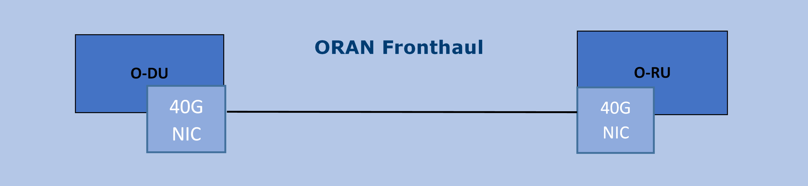

Figure 8. O-RAN Fronthaul Process

The O-RAN library provides support for transporting In-band and
Quadrature (IQ) samples between the O-DU and O-RU within the O-RAN
architecture based on functional split 7.2x. The library defines the
O-RAN packet formats to be used to transport radio samples within Front
Haul according to the O-RAN Fronthaul specification. It provides
functionality for generating O-RAN packets, appending IQ samples in the
packet payload, and extracting IQ samples from O-RAN packets. 

Note: The E Miantenance release version of the library supports U-plane and C-plane only. It is ready to be used in the PTP synchronized environment.

Note: Regarding the clock model and synchronization topology, configurations
C1 and C3 of the connection between O-DU and O-RU are the only
configurations supported in this release of the O-RAN implementation.

Note: Quality of PTP synchronization with respect to S-plane of O-RAN 
Fronthaul requirements as defined for O-RU is out of the scope of this
document. PTP primary and PTP secondary configuration are expected to satisfy
only the O-DU side of requirements and provide the “best-effort” PTP primary for
O-RU. This may or may not be sufficient for achieving the end to end
system requirements of S-plane. Specialized dedicated NIC card with
additional HW functionality might be required to achieve PTP primary
functionality to satisfy O-RU precision requirements for RAN deployments
scenarios.

.. image:: images/Configuration-C1.jpg
  :width: 600
  :alt: Figure 9. Configuration C1

Figure 9. Configuration C1

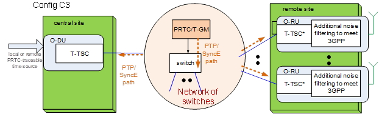

Figure 10. Configuration C3

Supported Feature Set
---------------------

The O-RAN Fronthaul specification defines a list of mandatory
functionality. Not all features defined as Mandatory for O-DU are
currently supported to fully extended. The following tables contain
information on what is available and the level of validation performed
for this release.

Note. Cells with a red background are listed as mandatory in the
specification but not supported in this implementation of O-RAN.

Table 7. ORAN Mandatory and Optional Feature Support

+-----------------+-----------------+-----------+----------------+
| Category        | Feature         | O-DU      | Support        |
|                 |                 | Support   |                |
+=================+=================+===========+================+
| RU Category     || Support for    | Mandatory | Y              |
|                 || CAT-A RU (up to|           |                |
|                 || 8 spatial      |           |                |
|                 || streams)       |           |                |
|                 +-----------------+-----------+----------------+
|                 || Support for    |           | Y              |
|                 || CAT-A RU (> 8  |           |                |
|                 || spatial        |           |                |
|                 || streams)       |           |                |
|                 +-----------------+-----------+----------------+
|                 || Support for    | Mandatory | Y              |
|                 || CAT-B RU       |           |                |
|                 || (precoding in  |           |                |
|                 || RU)            |           |                |
+-----------------+-----------------+-----------+----------------+
| Beamforming     || Beam Index     | Mandatory | Y              |
|                 || based          |           |                |
|                 +-----------------+-----------+----------------+
|                 || Real-time BF   | Mandatory | Y              |
|                 || Weights        |           |                |
|                 +-----------------+-----------+----------------+
|                 || Real-Time      |           | N              |
|                 || Beamforming    |           |                |
|                 || Attributes     |           |                |
|                 +-----------------+-----------+----------------+
|                 | UE Channel Info |           | N              |
+-----------------+-----------------+-----------+----------------+
| Bandwidth       || Programmable   | Mandatory | Y              |
| Saving          || staticbitwidth |           |                |
|                 || Fixed Point IQ |           |                |
|                 +-----------------+-----------+----------------+
|                 || Real-time      |           | Y              |
|                 || variable-bit   |           |                |
|                 || -width         |           |                |
|                 +-----------------+-----------+----------------+
|                 | Compressed IQ   |           | Y              |
|                 +-----------------+-----------+----------------+
|                 || Block floating |           | Y              |
|                 || point          |           |                |
|                 || compression    |           |                |
|                 +-----------------+-----------+----------------+
|                 || Block scaling  |           | N              |
|                 || compression    |           |                |
|                 +-----------------+-----------+----------------+
|                 || u-law          |           | N              |
|                 || compression    |           |                |
|                 +-----------------+-----------+----------------+
|                 || modulation     |           | Y              |
|                 || compression    |           |                |
|                 +-----------------+-----------+----------------+
|                 || beamspace      |           | Y              |
|                 || compression    |           |                |
|                 +-----------------+-----------+----------------+
|                 || Variable Bit   |           | Y              |
|                 || Width per      |           |                |
|                 || Channel (per   |           |                |
|                 || data section)  |           |                |
|                 +-----------------+-----------+----------------+
|                 || Static         |           | N              |
|                 || configuration  |           |                |
|                 || of U-Plane IQ  |           |                |
|                 || format and     |           |                |
|                 || compression    |           |                |
|                 || header         |           |                |
|                 +-----------------+-----------+----------------+
|                 || Use of symInc  |           | N              |
|                 || flag to allow  |           |                |
|                 || multiple       |           |                |
|                 || symbols in a   |           |                |
|                 || C-Plane section|           |                |
+-----------------+-----------------+-----------+----------------+
| Energy Saving   || Transmission   |           | N              |
|                 || blanking       |           |                |
+-----------------+-----------------+-----------+----------------+
| O-DU - RU       || Pre-configured | Mandatory | Y              |
| Timing          || Transport Delay|           |                |
|                 || Method         |           |                |
|                 +-----------------+-----------+----------------+
|                 || Measured       |           | N              |
|                 || Transport      |           |                |
|                 || Method (eCPRI  |           |                |
|                 || Msg 5)         |           |                |
+-----------------+-----------------+-----------+----------------+
| Synchronization | G.8275.1        | Mandatory | Y     (C3 only)|
|                 |                 |           |                |
|                 +-----------------+-----------+----------------+
|                 | G.8275.2        |           | N              |
|                 +-----------------+-----------+----------------+
|                 | GNSS based sync |           | N              |
|                 +-----------------+-----------+----------------+
|                 | SyncE           |           | N              |
+-----------------+-----------------+-----------+----------------+
| Transport       | L2 : Ethernet   | Mandatory | Y              |
| Features        |                 |           |                |
|                 +-----------------+-----------+----------------+
|                 || L3 : IPv4, IPv6|           | N              |
|                 || (CUS Plane)    |           |                |
|                 +-----------------+-----------+----------------+
|                 || QoS over       | Mandatory | Y              |
|                 || Fronthaul      |           |                |
|                 +-----------------+-----------+----------------+
|                 || Prioritization |           | N              |
|                 || of different   |           |                |
|                 || U-plane traffic|           |                |
|                 || types          |           |                |
|                 +-----------------+-----------+----------------+
|                 || Support of     |           | N              |
|                 || Jumbo Ethernet |           |                |
|                 || frames         |           |                |
|                 +-----------------+-----------+----------------+
|                 || eCPRI          | Mandatory | Y              |
|                 +-----------------+-----------+----------------+
|                 || support of     |           | N              |
|                 || eCPRI          |           |                |
|                 || concatenation  |           |                |
|                 +-----------------+-----------+----------------+
|                 | IEEE 1914.3     |           | N              |
|                 +-----------------+-----------+----------------+
|                 || Application    | Mandatory | Y              |
|                 || fragmentation  |           |                |
|                 +-----------------+-----------+----------------+
|                 || Transport      |           | N              |
|                 || fragmentation  |           |                |
+-----------------+-----------------+-----------+----------------+
| Other           || LAA LBT O-DU   |           | N              |
|                 || Congestion     |           |                |
|                 || Window mgmt    |           |                |
|                 +-----------------+-----------+----------------+
|                 || LAA LBT RU     |           | N              |
|                 || Congestion     |           |                |
|                 || Window mgm     |           |                |
+-----------------+-----------------+-----------+----------------+

Details on the subset of O-RAN functionality implemented are shown in
Table 8.

Level of Validation Specified as:

-  C: Completed code implementation for O-RAN Library

-  I: Integrated into Intel FlexRAN PHY

-  T: Tested end to end with O-RU

Table 8. Levels of support
     
+------------+------------+------------+------------+-----+-----+-----+
| Category   | Item                    |  Status    | C   | I   | T   |
+============+============+============+============+=====+=====+=====+
| General    || Radio                  | NR         | N/A | N/A | N/A |
|            || access                 |            |     |     |     |
|            || technology             |            |     |     |     |
|            || (LTE / NR)             |            |     |     |     |
|            +------------+------------+------------+-----+-----+-----+
|            || Nominal                || 15        | Y   | Y   | N   | 
|            || sub-carrier            || /30/120KHz|     |     |     | 
|            || spacing                |            |     |     |     |
|            +------------+------------+------------+-----+-----+-----+
|            | FFT size                || 512/1024  | Y   | Y   | N   |
|            |                         || /2048/4096|     |     |     |
|            +------------+------------+------------+-----+-----+-----+
|            || Channel                || 5/10      | Y   | Y   | N   |
|            || bandwidth              || /20/100Mhz|     |     |     |
|            +------------+------------+------------+-----+-----+-----+
|            || Number of              | 12         | Y   | Y   | N   | 
|            || Cells                  |            |     |     |     | 
|            || (Component             |            |     |     |     |
|            || Carriers)              |            |     |     |     |
|            ||                        |            |     |     |     |
|            +------------+------------+------------+-----+-----+-----+
|            || RU                     | A          | Y   | Y   | N   |
|            || category               |            |     |     |     |
|            +------------+------------+------------+-----+-----+-----+
|            | TDD Config              || Supported | Y   | Y   | N   |
|            |                         || Flexible  |     |     |     |
|            +------------+------------+------------+-----+-----+-----+
|            || FDD                    | Supported  | Y   | Y   | N   |
|            || Support                |            |     |     |     |
|            +------------+------------+------------+-----+-----+-----+
|            || Tx/Rx                  | Supported  | Y   | Y   | N   | 
|            || switching              |            |     |     |     | 
|            || based on               |            |     |     |     |
|            || 'data                  |            |     |     |     |
|            || Direction'             |            |     |     |     |
|            || field of               |            |     |     |     |
|            || C-plane                |            |     |     |     |
|            || message                |            |     |     |     |
|            +------------+------------+------------+-----+-----+-----+
|            || IP version             | N/A        | N/A | N/A | N/A |  
|            || for                    |            |     |     |     |  
|            || Management             |            |     |     |     |  
|            || traffic at             |            |     |     |     |  
|            || fronthaul              |            |     |     |     |  
|            || network                |            |     |     |     |  
|            |                         |            |     |     |     |
+------------+-------------------------+------------+-----+-----+-----+
| PRACH      || One Type 3             | Supported  | Y   | Y   | N   |   
|            || message                |            |     |     |     |   
|            || for all                |            |     |     |     |   
|            || repeated               |            |     |     |     |   
|            || PRACH                  |            |     |     |     |  
|            || preambles              |            |     |     |     |  
|            +-------------------------+------------+-----+-----+-----+
|            || Type 3                 | 1          | Y   | Y   | N   |   
|            || message                |            |     |     |     |   
|            || per                    |            |     |     |     |   
|            || repeated               |            |     |     |     | 
|            || PRACH                  |            |     |     |     | 
|            || preambles              |            |     |     |     | 
|            +-------------------------+------------+-----+-----+-----+
|            || timeOffset             | Supported  | Y   | Y   | N   | 
|            || including              |            |     |     |     | 
|            || cpLength               |            |     |     |     |  
|            +-------------------------+------------+-----+-----+-----+
|            | Supported               | Supported  | Y   | Y   | N   | 
|            +-------------------------+------------+-----+-----+-----+
|            || PRACH                  | Supported  | Y   | Y   | N   | 
|            || preamble               |            |     |     |     |
|            || format                 |            |     |     |     |
|            || index                  |            |     |     |     |
|            || number                 |            |     |     |     |
|            || (number of             |            |     |     |     |
|            || occasions)             |            |     |     |     |
|            |                         |            |     |     |     |
+------------+-------------------------+------------+-----+-----+-----+
|| Delay     || Network                | Supported  | Y   | Y   | N   | 
|| management|| delay                  |            |     |     |     | 
|            || determination          |            |     |     |     | 
|            +-------------------------+------------+-----+-----+-----+
|            || lls-CU                 | Supported  | Y   | Y   | N   |  
|            || timing                 |            |     |     |     |  
|            || advance                |            |     |     |     |  
|            || type                   |            |     |     |     |  
|            +-------------------------+------------+-----+-----+-----+
|            || Non-delay              || Not       | N   | N   | N   |
|            || managed                || supported |     |     |     | 
|            || U-plane                |            |     |     |     |
|            || traffic                |            |     |     |     |
|            |                         |            |     |     |     |
+------------+-------------------------+------------+-----+-----+-----+
|| C/U-plane || Transport              | Ethernet   | Y   | Y   | N   |
|| Transport || encapsulation          |            |     |     |     | 
|            || (Ethernet IP)          |            |     |     |     |
|            +-------------------------+------------+-----+-----+-----+
|            || Jumbo                  | Supported  | Y   | Y   | N   |
|            || frames                 |            |     |     |     |
|            +-------------------------+------------+-----+-----+-----+
|            || Transport              | eCPRI      | Y   | Y   | N   | 
|            || header                 |            |     |     |     | 
|            || (eCPRI RoE)            |            |     |     |     | 
|            +-------------------------+------------+-----+-----+-----+
|            || IP version             | N/A        | N/A | N/A | N/A |
|            || when                   |            |     |     |     | 
|            || Transport              |            |     |     |     | 
|            || header is              |            |     |     |     |
|            || IP/UDP                 |            |     |     |     |
|            +-------------------------+------------+-----+-----+-----+
|            || eCPRI                  || Not       | N   | N   | N   | 
|            || Concatenation          || supported |     |     |     | 
|            || when                   |            |     |     |     | 
|            || Transport              |            |     |     |     | 
|            || header is              |            |     |     |     | 
|            || eCPRI                  |            |     |     |     | 
|            +-------------------------+------------+-----+-----+-----+
|            || eAxC ID                | 4 \*       | Y   | Y   | N   | 
|            || CU_Port_ID             |            |     |     |     | 
|            || bitwidth               |            |     |     |     | 
|            +-------------------------+------------+-----+-----+-----+
|            || eAxC ID                | 4 \*       | Y   | Y   | N   | 
|            || BandSector_ID          |            |     |     |     | 
|            || bitwidth               |            |     |     |     | 
|            +-------------------------+------------+-----+-----+-----+
|            || eAxC ID                | 4 \*       | Y   | Y   | N   | 
|            || CC_ID                  |            |     |     |     | 
|            || bitwidth               |            |     |     |     | 
|            +-------------------------+------------+-----+-----+-----+
|            || eAxC ID                | 4 \*       | Y   | Y   | N   | 
|            || RU_Port_ID             |            |     |     |     | 
|            || bitwidth               |            |     |     |     | 
|            +-------------------------+------------+-----+-----+-----+
|            | Fragmentation           | Supported  | Y   | Y   | N   | 
|            +-------------------------+------------+-----+-----+-----+
|            || Transport              | N/A        | N   | N   | N   | 
|            || prioritization         |            |     |     |     | 
|            || within                 |            |     |     |     | 
|            || U-plane                |            |     |     |     | 
|            +-------------------------+------------+-----+-----+-----+
|            || Separation             | Supported  | Y   | Y   | N   | 
|            || of                     |            |     |     |     | 
|            || C/U-plane              |            |     |     |     | 
|            || and                    |            |     |     |     | 
|            || M-plane                |            |     |     |     | 
|            +-------------------------+------------+-----+-----+-----+
|            || Separation             || VLAN ID\  | Y   | Y   | N   | 
|            || of C-plane             || and/or    |     |     |     | 
|            || and                    || eCpri     |     |     |     | 
|            || U-plane                || Messagge  |     |     |     | 
|            |                         || Type      |     |     |     |
|            +-------------------------+------------+-----+-----+-----+
|            || Max Number             | 16         | Y   | Y   | N   | 
|            || of VLAN                |            |     |     |     | 
|            || per                    |            |     |     |     | 
|            || physical               |            |     |     |     | 
|            || port                   |            |     |     |     |
|            |                         |            |     |     |     | 
+------------+-------------------------+------------+-----+-----+-----+
|| Reception | Rx_on_time              | Supported  | Y   | Y   | N   | 
|| Window    |                         |            |     |     |     | 
|| Monitoring|                         |            |     |     |     | 
|| (Counters)|                         |            |     |     |     | 
|            +-------------------------+------------+-----+-----+-----+
|            | Rx_early                | Supported  | N   | N   | N   | 
|            +-------------------------+------------+-----+-----+-----+
|            | Rx_late                 | Supported  | N   | N   | N   | 
|            +-------------------------+------------+-----+-----+-----+
|            | Rx_corrupt              | Supported  | N   | N   | N   | 
|            +-------------------------+------------+-----+-----+-----+
|            || Rx_pkt_dupl            | Supported  | N   | N   | N   | 
|            +-------------------------+------------+-----+-----+-----+
|            || Total_msgs_rcvd        | Supported  | Y   | N   | N   | 
|            |                         |            |     |     |     |
+------------+-------------------------+------------+-----+-----+-----+
||           || RU                     || Index and | Y   | Y   | N   | 
|| Beam-\    || beamforming            || weights   |     |     |     | 
|| forming   || type                   ||           |     |     |     | 
|            +-------------------------+------------+-----+-----+-----+
|            || Beamforming            | C-plane    | Y   | N   | N   | 
|            || control                |            |     |     |     | 
|            || method                 |            |     |     |     | 
|            +-------------------------+------------+-----+-----+-----+
|            || Number of              || No res-   | Y   | Y   | N   | 
|            || beams                  || strictions|     |     |     | 
|            |                         |            |     |     |     |
+------------+-------------------------+------------+-----+-----+-----+
|| IQ        || U-plane                | Supported  | Y   | Y   | Y   | 
|| compre    || data                   |            |     |     |     | 
|  ssion     || compression            |            |     |     |     | 
|            || method                 |            |     |     |     | 
|            +-------------------------+------------+-----+-----+-----+
|            || U-plane                || BFP:      | Y   | Y   | Y   | 
|            || data IQ                || 8,9,12,14 |     |     |     | 
|            || bitwidth               || bits      |     |     |     | 
|            || (Before /              ||           |     |     |     | 
|            || After                  ||           |     |     |     | 
|            || compression)           ||           |     |     |     | 
|            +-------------------------+------------+-----+-----+-----+
|            || Static                 | Supported  | N   | N   | N   | 
|            || configuration          |            |     |     |     | 
|            || of U-plane             |            |     |     |     | 
|            || IQ format              |            |     |     |     | 
|            || and                    |            |     |     |     | 
|            || compression            |            |     |     |     | 
|            || header                 |            |     |     |     | 
|            |                         |            |     |     |     |
+------------+-------------------------+------------+-----+-----+-----+
|| eCPRI     || ecpriVersion           | 001b       | Y   | Y   | Y   |
|| Header    ||                        |            |     |     |     |  
|| Format    ||                        |            |     |     |     | 
|            +-------------------------+------------+-----+-----+-----+
|            || ecpriReserved          | Supported  | Y   | Y   | Y   | 
|            +-------------------------+------------+-----+-----+-----+
|            || ecpriCon               || Not       | N   | N   | N   | 
|            | catenation              || supported |     |     |     | 
|            +------------+------------+------------+-----+-----+-----+
|            || ecpri\    | U-plane    | Supported  | Y   | Y   | Y   |
|            || Message   |            |            |     |     |     |
|            |            +------------+------------+-----+-----+-----+
|            |            | C-plane    | Supported  | Y   | Y   | Y   |
|            |            +------------+------------+-----+-----+-----+
|            |            || Delay     | Supported  | Y   | Y   | Y   |
|            |            || measure   |            |     |     |     |
|            |            | ment       |            |     |     |     |
|            +------------+------------+------------+-----+-----+-----+
|            || ecpri\                 | Supported  | Y   | Y   | Y   | 
|            || Payload                |            |     |     |     | 
|            || (payload               |            |     |     |     | 
|            || size in                |            |     |     |     | 
|            || bytes)                 |            |     |     |     | 
|            +-------------------------+------------+-----+-----+-----+
|            || ecpriRtcid             | Supported  | Y   | Y   | Y   |
|            || /ecpriPcid             |            |     |     |     | 
|            +-------------------------+------------+-----+-----+-----+
|            || ecpri                  | Supported  | Y   | Y   | Y   | 
|            || Seqid:                 |            |     |     |     | 
|            || Sequence               |            |     |     |     |
|            || ID                     |            |     |     |     |
|            +-------------------------+------------+-----+-----+-----+
|            || ecpri\                 | Supported  | Y   | Y   | Y   | 
|            || Seqid:                 |            |     |     |     | 
|            || E bit                  |            |     |     |     | 
|            +-------------------------+------------+-----+-----+-----+
|            || ecpri\                 || Not       | N   | N   | N   | 
|            || Seqid:                 || supported |     |     |     | 
|            || Sub\                   |            |     |     |     | 
|            || sequence               |            |     |     |     |  
|            || ID                     |            |     |     |     | 
|            |                         |            |     |     |     |
+------------+------------+------------+------------+-----+-----+-----+
|| C-plane   || Section                || Not       | N   | N   | N   |
|| Type      || Type 0                 || supported |     |     |     |
|            +-------------------------+------------+-----+-----+-----+
|            || Section                | Supported  | Y   | Y   | Y   |
|            || Type 1                 |            |     |     |     |
|            +-------------------------+------------+-----+-----+-----+
|            || Section                | Supported  | Y   | Y   | Y   |  
|            || Type 3                 |            |     |     |     |
|            +-------------------------+------------+-----+-----+-----+
|            || Section                || Not       | N   | N   | N   |
|            || Type 5                 || supported |     |     |     |
|            +-------------------------+------------+-----+-----+-----+
|            || Section                || Not       | N   | N   | N   | 
|            || Type 6                 || supported |     |     |     | 
|            +-------------------------+------------+-----+-----+-----+
|            || Section                || Not       | N   | N   | N   | 
|            || Type 7                 || supported |     |     |     |
|            |                         |            |     |     |     |
+------------+------------+------------+------------+-----+-----+-----+
|| C-plane   || *Coding*\ || data\     | Supported  | Y   | Y   | N   |
|| Packet    || *of Infor*|| Direction |            |     |     |     |
|| Format    | *mation*   || (data     |            |     |     |     |
|            || *Elements*|| direction |            |     |     |     |
|            || *Appli*   || (gNB      |            |     |     |     |
|            | *cation*   || Tx/Rx))   |            |     |     |     |
|            || *Layer,*\ ||           |            |     |     |     |
|            || *Common*  ||           |            |     |     |     |
|            |            +------------+------------+-----+-----+-----+
|            |            || payload   || 001b      | Y   | Y   | N   |
|            |            | Version    ||           |     |     |     |
|            |            || (payload  ||           |     |     |     |
|            |            || version)  ||           |     |     |     |
|            |            +------------+------------+-----+-----+-----+
|            |            || filter    | Supported  | Y   | Y   | N   |
|            |            | Index      |            |     |     |     |
|            |            || (filter   |            |     |     |     |
|            |            || index)    |            |     |     |     |
|            |            +------------+------------+-----+-----+-----+
|            |            || frameId   | Supported  | Y   | Y   | N   |
|            |            || (frame    |            |     |     |     |
|            |            || iden      |            |     |     |     |
|            |            | tifier)    |            |     |     |     |
|            |            +------------+------------+-----+-----+-----+
|            |            || subframeId| Supported  | Y   | Y   | N   |
|            |            || (subframe |            |     |     |     |
|            |            || iden      |            |     |     |     |
|            |            | tifier)    |            |     |     |     |
|            |            +------------+------------+-----+-----+-----+
|            |            || slotId    | Supported  | Y   | Y   | N   |
|            |            || (slot     |            |     |     |     |
|            |            || iden      |            |     |     |     |
|            |            | tifier)    |            |     |     |     |
|            |            +------------+------------+-----+-----+-----+
|            |            || start\    | Supported  | Y   | Y   | N   |
|            |            || Symbolid  |            |     |     |     |
|            |            || (start    |            |     |     |     |
|            |            || symbol    |            |     |     |     |
|            |            || iden      |            |     |     |     |
|            |            | tifier)    |            |     |     |     |
|            |            +------------+------------+-----+-----+-----+
|            |            || number    || up to the | Y   | Y   | N   |
|            |            || Ofsections|| maximum   |     |     |     |
|            |            || (number of|| number of |     |     |     |  
|            |            || sections) || PRBs      |     |     |     |
|            |            +------------+------------+-----+-----+-----+
|            |            || section\  || 1 and 3   | Y   | Y   | N   |
|            |            || Type      ||           |     |     |     |
|            |            || (section  ||           |     |     |     |
|            |            || type)     ||           |     |     |     |
|            |            +------------+------------+-----+-----+-----+
|            |            || udCompHdr | Supported  | Y   | Y   | N   |
|            |            || (user data|            |     |     |     |
|            |            || com       |            |     |     |     |
|            |            | pression   |            |     |     |     |
|            |            || header)   |            |     |     |     |
|            |            +------------+------------+-----+-----+-----+
|            |            || number\   || Not       | N   | N   | N   |
|            |            || OfUEs     || supported |     |     |     |
|            |            || (number Of|            |     |     |     |
|            |            || UEs)      |            |     |     |     |
|            |            +------------+------------+-----+-----+-----+
|            |            || timeOffset| Supported  | Y   | Y   | N   |
|            |            || (time     |            |     |     |     |
|            |            || offset)   |            |     |     |     |
|            |            +------------+------------+-----+-----+-----+
|            |            || frame\    | mu=0,1,3   | Y   | Y   | N   |
|            |            || Structure |            |     |     |     |
|            |            || (frame    |            |     |     |     |
|            |            || structure)|            |     |     |     |
|            |            +------------+------------+-----+-----+-----+
|            |            || cpLength  | Supported  | Y   | Y   | N   |
|            |            || (cyclic   |            |     |     |     |
|            |            || prefix    |            |     |     |     |
|            |            || length)   |            |     |     |     |
|            +------------+------------+------------+-----+-----+-----+
|            || *Coding*  || sectionId | Supported  | Y   | Y   | N   |
|            || *of Infor*|| (section  |            |     |     |     |
|            | *mation*   || iden      |            |     |     |     |
|            || *Elements*| tifier)    |            |     |     |     |
|            || *Ap*      |            |            |     |     |     |
|            | *plication*|            |            |     |     |     |
|            || *Layer,*  |            |            |     |     |     |
|            || *Sections*|            |            |     |     |     |
|            |            +------------+------------+-----+-----+-----+
|            |            || rb        | 0          | Y   | Y   | N   |
|            |            || (resource |            |     |     |     |
|            |            || block     |            |     |     |     |
|            |            || indicator)|            |     |     |     |
|            |            +------------+------------+-----+-----+-----+
|            |            || symInc    | 0 or 1     | Y   | Y   | N   |
|            |            || (symbol   |            |     |     |     |
|            |            || number    |            |     |     |     |
|            |            || increment |            |     |     |     |
|            |            || command)  |            |     |     |     |
|            |            +------------+------------+-----+-----+-----+
|            |            || startPrbc | Supported  | Y   | Y   | N   |
|            |            || (starting |            |     |     |     |
|            |            || PRB of    |            |     |     |     |
|            |            || control   |            |     |     |     |
|            |            || section)  |            |     |     |     |
|            |            +------------+------------+-----+-----+-----+
|            |            || reMask    | Supported  | Y   | Y   | N   |
|            |            || (resource |            |     |     |     |
|            |            || element   |            |     |     |     |
|            |            || mask)     |            |     |     |     |
|            |            +------------+------------+-----+-----+-----+
|            |            || numPrbc   | Supported  | Y   | Y   | N   |
|            |            || (number of|            |     |     |     |
|            |            || contiguous|            |     |     |     |
|            |            || PRBs per  |            |     |     |     |
|            |            || control   |            |     |     |     |
|            |            || section)  |            |     |     |     |
|            |            +------------+------------+-----+-----+-----+
|            |            || numSymbol | Supported  | Y   | Y   | N   |
|            |            || (number of|            |     |     |     |
|            |            || symbols)  |            |     |     |     |
|            |            +------------+------------+-----+-----+-----+
|            |            || ef        | Supported  | Y   | Y   | N   |
|            |            || (extension|            |     |     |     |
|            |            || flag)     |            |     |     |     |
|            |            +------------+------------+-----+-----+-----+
|            |            || beamId    | Support    | Y   | Y   | N   |
|            |            || (beam     |            |     |     |     |
|            |            || iden      |            |     |     |     |
|            |            | tifier)    |            |     |     |     |
|            |            +------------+------------+-----+-----+-----+
|            |            || ueId (UE  || Not       | N   | N   | N   |
|            |            || iden      || supported |     |     |     |
|            |            | tifier)    |            |     |     |     |
|            |            +------------+------------+-----+-----+-----+
|            |            || freqOffset| Supported  | Y   | Y   | N   |
|            |            || (frequency|            |     |     |     |
|            |            || offset)   |            |     |     |     |
|            |            +------------+------------+-----+-----+-----+
|            |            || regulari  || Not       | N   | N   | N   |
|            |            | zation\    || supported |     |     |     |
|            |            || Factor    ||           |     |     |     |
|            |            || (regulari |            |     |     |     |
|            |            | zation     |            |     |     |     |
|            |            || Factor)   |            |     |     |     |
|            |            +------------+------------+-----+-----+-----+
|            |            || ciIsample,|| Not       | N   | N   | N   |
|            |            || ciQsample || supported |     |     |     |
|            |            || (channel  ||           |     |     |     |
|            |            || infor     |            |     |     |     |
|            |            | mation     |            |     |     |     |
|            |            || I and Q   |            |     |     |     |
|            |            || values)   |            |     |     |     |
|            |            +------------+------------+-----+-----+-----+
|            |            || laaMsgType|| Not       | N   | N   | N   |
|            |            || (LAA      || supported |     |     |     |
|            |            || message   ||           |     |     |     |
|            |            || type)     ||           |     |     |     |
|            |            +------------+------------+-----+-----+-----+
|            |            || laaMsgLen || Not       | N   | N   | N   |
|            |            || (LAA      || supported |     |     |     |
|            |            || message   |            |     |     |     |
|            |            || length)   |            |     |     |     |
|            |            +------------+------------+-----+-----+-----+
|            |            | lbtHandle  || Not       | N   | N   | N   |
|            |            |            || supported |     |     |     |
|            |            +------------+------------+-----+-----+-----+
|            |            || lbtDefer  || Not       | N   | N   | N   |
|            |            || Factor    || supported |     |     |     |
|            |            || (listen   ||           |     |     |     |
|            |            || before    ||           |     |     |     |
|            |            || talk      ||           |     |     |     |
|            |            || defer     ||           |     |     |     |
|            |            || factor)   ||           |     |     |     |
|            |            +------------+------------+-----+-----+-----+
|            |            || lbtBack   || Not       | N   | N   | N   |
|            |            || offCounter|| supported |     |     |     |
|            |            || (listen   ||           |     |     |     |
|            |            || before    ||           |     |     |     |
|            |            || talk      ||           |     |     |     |
|            |            || backoff   ||           |     |     |     |
|            |            || counter)  ||           |     |     |     |
|            |            +------------+------------+-----+-----+-----+
|            |            || lbtOffset || Not       | N   | N   | N   |
|            |            || (listen-  || supported |     |     |     |
|            |            || before    |            |     |     |     |
|            |            || talk      ||           |     |     |     |
|            |            || offset)   |            |     |     |     |
|            |            +------------+------------+-----+-----+-----+
|            |            || MCOT      || Not       | N   | N   | N   |
|            |            || (maximum  || supported |     |     |     |
|            |            || channel   |            |     |     |     |
|            |            || occupancy |            |     |     |     |
|            |            || time)     |            |     |     |     |
|            |            +------------+------------+-----+-----+-----+
|            |            || lbtMode   || Not       | N   | N   | N   |
|            |            || (LBT Mode)|| supported |     |     |     |
|            |            +------------+------------+-----+-----+-----+
|            |            || lbt       || Not       | N   | N   | N   |
|            |            | PdschRes   || supported |     |     |     |
|            |            || (LBT PDSCH||           |     |     |     |
|            |            || Result)   |            |     |     |     |
|            |            +------------+------------+-----+-----+-----+
|            |            || sfStatus  || Not       | N   | N   | N   |
|            |            || (subframe || supported |     |     |     |
|            |            || status)   ||           |     |     |     |
|            |            +------------+------------+-----+-----+-----+
|            |            || lbtDrsRes || Not       | N   | N   | N   |
|            |            || (LBT DRS  || supported |     |     |     |
|            |            || Result)   |            |     |     |     |
|            |            +------------+------------+-----+-----+-----+
|            |            || initial   || Not       | N   | N   | N   |
|            |            | PartialSF  || supported |     |     |     |
|            |            || (Initial  |            |     |     |     |
|            |            | partial    |            |     |     |     |
|            |            | SF)        |            |     |     |     |
|            |            +------------+------------+-----+-----+-----+
|            |            || lbtBufErr || Not       | N   | N   | N   |
|            |            || (LBT      || supported |     |     |     |
|            |            | Buffer     |            |     |     |     |
|            |            || Error)    |            |     |     |     |
|            |            +------------+------------+-----+-----+-----+
|            |            || sfnSf     || Not       | N   | N   | N   |
|            |            || (SFN/SF   || supported |     |     |     |
|            |            | End)       |            |     |     |     |
|            |            +------------+------------+-----+-----+-----+
|            |            || lbt       || Not       | N   | N   | N   |
|            |            || CWConfig_H|| supported |     |     |     |
|            |            || (HARQ     |            |     |     |     |
|            |            || Parameters|            |     |     |     |
|            |            || for       |            |     |     |     |
|            |            || Congestion|            |     |     |     |
|            |            || Window    |            |     |     |     |
|            |            || mana      |            |     |     |     |
|            |            | gement)    |            |     |     |     |
|            |            +------------+------------+-----+-----+-----+
|            |            || lbt       || Not       | N   | N   | N   |
|            |            || CWConfig_T|| supported |     |     |     |
|            |            || (TB       |            |     |     |     |
|            |            | Parameters |            |     |     |     |
|            |            || for       |            |     |     |     |
|            |            || Congestion|            |     |     |     |
|            |            || Window    |            |     |     |     |
|            |            || mana      |            |     |     |     |
|            |            | gement)    |            |     |     |     |
|            |            +------------+------------+-----+-----+-----+
|            |            || lbtTr     || Not       | N   | N   | N   |
|            |            | afficClass || supported |     |     |     |
|            |            || (Traffic  |            |     |     |     |
|            |            || class     |            |     |     |     |
|            |            || priority  |            |     |     |     |
|            |            || for       |            |     |     |     |
|            |            || Congestion|            |     |     |     |
|            |            || Window    |            |     |     |     |
|            |            || mana      |            |     |     |     |
|            |            | gement)    |            |     |     |     |
|            |            +------------+------------+-----+-----+-----+
|            |            || lbtCWR_Rst|| Not       | N   | N   | N   |
|            |            || (Noti     || supported |     |     |     |
|            |            | cation     |            |     |     |     |
|            |            || about     |            |     |     |     |
|            |            || packet    |            |     |     |     |
|            |            || reception |            |     |     |     |
|            |            || successful|            |     |     |     |
|            |            || or not)   |            |     |     |     |
|            |            +------------+------------+-----+-----+-----+
|            |            || reserved  | 0          | N   | N   | N   |
|            |            || (reserved |            |     |     |     |
|            |            || for future|            |     |     |     |
|            |            || use)      |            |     |     |     |
|            |            +------------+------------+-----+-----+-----+
|            |            || *Section* |            |     |     |     |
|            |            || *Exten*   |            |     |     |     |
|            |            | *sion*     |            |     |     |     |
|            |            || *Commands*|            |     |     |     |
|            |            +------------+------------+-----+-----+-----+
|            |            || extType   | Supported  | Y   | Y   | N   |
|            |            || (extension|            |     |     |     |
|            |            || type)     |            |     |     |     |
|            |            +------------+------------+-----+-----+-----+
|            |            || ef        | Supported  | Y   | Y   | N   |
|            |            | (extension |            |     |     |     |
|            |            || flag)     |            |     |     |     |
|            |            +------------+------------+-----+-----+-----+
|            |            || extLen    | Supported  | Y   | Y   | N   |
|            |            || (extension|            |     |     |     |
|            |            || length)   |            |     |     |     |
|            +------------+------------+------------+-----+-----+-----+
|            || Coding of |            |            |     |     |     |
|            || Infor     |            |            |     |     |     |
|            | mation     |            |            |     |     |     |
|            || Elements –|            |            |     |     |     |
|            || Appli     |            |            |     |     |     |
|            | cation     |            |            |     |     |     |
|            || Layer,    |            |            |     |     |     |
|            || Section   |            |            |     |     |     |
|            || Exten     |            |            |     |     |     |
|            | sions      |            |            |     |     |     |
|            +------------+------------+------------+-----+-----+-----+
|            ||           |            |            |     |     |     |
|            || *Ext*\    | bfw        | Supported  | Y   | Y   | N   |
|            || *Type=1:* | CompHdr    |            |     |     |     |
|            |            |            |            |     |     |     |
|            || *Beam*    || \(bea     |            |     |     |     |
|            |            |            |            |     |     |     |
|            || *forming* | forming    |            |     |     |     |
|            |            |            |            |     |     |     |
|            || *Weights* || weight    |            |     |     |     |
|            || *Exten*   || compre    |            |     |     |     |
|            | *sion*     || ssion     |            |     |     |     |
|            || *Type*    | header)    |            |     |     |     |
|            ||           +------------+------------+-----+-----+-----+
|            ||           ||           |            |     |     |     |
|            ||           || bf        | Supported  | Y   | Y   | N   |
|            ||           | wCompParam |            |     |     |     |
|            ||           || (beam     |            |     |     |     |
|            ||           | forming    |            |     |     |     |
|            ||           || weight    |            |     |     |     |
|            ||           || compre    |            |     |     |     |
|            ||           | ssion      |            |     |     |     |
|            ||           || parameter)|            |     |     |     |
|            ||           +------------+------------+-----+-----+-----+
|            ||           || bfwl      | Supported  | Y   | Y   | N   |
|            ||           || (beam     |            |     |     |     |
|            ||           | forming    |            |     |     |     |
|            ||           || weight    |            |     |     |     |
|            ||           || in-phase  |            |     |     |     |
|            ||           || value)    |            |     |     |     |
|            ||           +------------+------------+-----+-----+-----+
|            ||           || bfwQ      | Supported  | Y   | Y   | N   |
|            ||           || (beam     |            |     |     |     |
|            ||           | forming    |            |     |     |     |
|            ||           || weight    |            |     |     |     |
|            ||           || quadrature|            |     |     |     |
|            ||           || value)    |            |     |     |     |
|            +------------+------------+------------+-----+-----+-----+
|            ||           || bfaCompHdr| Supported  | Y   | N   | N   |
|            || *ExtType*\||           |            |     |     |     |
|            ||  *=2:*    || (beam     |            |     |     |     |
|            || *Beam*    | forming    |            |     |     |     |
|            | *forming*  || attributes|            |     |     |     |
|            || *Attribu* || compre    |            |     |     |     |
|            | *tes*      | ssion      |            |     |     |     |
|            || *Exten*   || header)   |            |     |     |     |
|            || *sion*    |            |            |     |     |     |
|            || *Type*    |            |            |     |     |     |
|            ||           +------------+------------+-----+-----+-----+
|            ||           || bfAzPt    | Supported  | Y   | N   | N   |
|            ||           || (beam     |            |     |     |     |
|            ||           | forming    |            |     |     |     |
|            ||           || azimuth   |            |     |     |     |
|            ||           || pointing  |            |     |     |     |
|            ||           || parameter)|            |     |     |     |
|            ||           +------------+------------+-----+-----+-----+
|            ||           || bfZePt    | Supported  | Y   | N   | N   |
|            ||           || (beam     |            |     |     |     |
|            ||           | forming    |            |     |     |     |
|            ||           || zenith    |            |     |     |     |
|            ||           || pointing  |            |     |     |     |
|            ||           || parameter)|            |     |     |     |
|            ||           +------------+------------+-----+-----+-----+
|            ||           || bfAz3dd   | Supported  | Y   | N   | N   |
|            ||           || (beam     |            |     |     |     |
|            ||           | forming    |            |     |     |     |
|            ||           || azimuth   |            |     |     |     |
|            ||           || beamwidth |            |     |     |     |
|            ||           || parameter)|            |     |     |     |
|            ||           +------------+------------+-----+-----+-----+
|            ||           || bfZe3dd   | Supported  | Y   | N   | N   |
|            ||           || (beam     |            |     |     |     |
|            ||           | forming    |            |     |     |     |
|            ||           || zenith    |            |     |     |     |
|            ||           || beamwidth |            |     |     |     |
|            ||           || parameter)|            |     |     |     |
|            ||           +------------+------------+-----+-----+-----+
|            ||           || bfAzSl    | Supported  | Y   | N   | N   |
|            ||           || (beam     |            |     |     |     |
|            ||           | forming    |            |     |     |     |
|            ||           || azimuth   |            |     |     |     |
|            ||           || sidelobe  |            |     |     |     |
|            ||           || parameter)|            |     |     |     |
|            ||           +------------+------------+-----+-----+-----+
|            ||           || bfZeSl    | Supported  | Y   | N   | N   |
|            ||           || (beam     |            |     |     |     |
|            ||           | forming    |            |     |     |     |
|            ||           || zenith    |            |     |     |     |
|            ||           || sidelobe  |            |     |     |     |
|            ||           || parameter)|            |     |     |     |
|            ||           +------------+------------+-----+-----+-----+
|            ||           || zero-     | Supported  | Y   | N   | N   |
|            ||           | padding    |            |     |     |     |
|            +------------+------------+------------+-----+-----+-----+
|            ||           || code\     | Supported  | Y   | N   | N   |
|            || *ExtType* || bookIndex |            |     |     |     |
|            || *=3:*     ||           |            |     |     |     |
|            || *DL*      || (precoder |            |     |     |     |
|            || *Preco*   || codebook  |            |     |     |     |
|            | *ding*     ||           |            |     |     |     |
|            || *Exten*   || used for  |            |     |     |     |
|            | *sion*     || trans     |            |     |     |     |
|            || *Type*    | mission    |            |     |     |     |
|            |            |            |            |     |     |     |
|            ||           +------------+------------+-----+-----+-----+
|            ||           || layerID   | Supported  | Y   | N   | N   |
|            ||           || (Layer ID |            |     |     |     |
|            ||           || for DL    |            |     |     |     |
|            ||           || trans     |            |     |     |     |
|            ||           | mission)   |            |     |     |     |
|            ||           +------------+------------+-----+-----+-----+
|            ||           || txScheme  | Supported  | Y   | N   | N   |
|            ||           || (trans    |            |     |     |     |
|            ||           | mission    |            |     |     |     |
|            ||           || scheme)   |            |     |     |     |
|            ||           +------------+------------+-----+-----+-----+
|            ||           || numLayers | Supported  | Y   | N   | N   |
|            ||           || (number of|            |     |     |     |
|            ||           || layers    |            |     |     |     |
|            ||           || used for  |            |     |     |     |
|            ||           || DL        |            |     |     |     |
|            ||           || trans     |            |     |     |     |
|            ||           | mission)   |            |     |     |     |
|            ||           +------------+------------+-----+-----+-----+
|            ||           || crsReMask | Supported  | Y   | N   | N   |
|            ||           || (CRS      |            |     |     |     |
|            ||           || resource  |            |     |     |     |
|            ||           || element   |            |     |     |     |
|            ||           || mask)     |            |     |     |     |
|            ||           +------------+------------+-----+-----+-----+
|            |            || crs\      | Supported  | Y   | N   | N   |
|            |            || SyumINum  |            |     |     |     |
|            |            || (CRS      |            |     |     |     |
|            |            || symbol    |            |     |     |     |
|            |            || number    |            |     |     |     |
|            |            || indi      |            |     |     |     |
|            |            | cation)    |            |     |     |     |
|            |            +------------+------------+-----+-----+-----+
|            |            || crsShift  | Supported  | Y   | N   | N   |
|            |            || (crsShift |            |     |     |     |
|            |            || used for  |            |     |     |     |
|            |            || DL        |            |     |     |     |
|            |            || trans     |            |     |     |     |
|            |            | mission)   |            |     |     |     |
|            |            +------------+------------+-----+-----+-----+
|            |            || beamIdAP1 | Supported  | Y   | N   | N   |
|            |            || (beam id  |            |     |     |     |
|            |            || to be used|            |     |     |     |
|            |            || for       |            |     |     |     |
|            |            || antenna   |            |     |     |     |
|            |            || port 1)   |            |     |     |     |
|            |            +------------+------------+-----+-----+-----+
|            |            || beamIdAP2 | Supported  | Y   | N   | N   |
|            |            || (beam id  |            |     |     |     |
|            |            || to be used|            |     |     |     |
|            |            || for       |            |     |     |     |
|            |            || antenna   |            |     |     |     |
|            |            || port 2)   |            |     |     |     |
|            |            +------------+------------+-----+-----+-----+
|            |            || beamIdAP3 | Supported  | Y   | N   | N   |
|            |            || (beam id  |            |     |     |     |
|            |            || to be used|            |     |     |     |
|            |            || for       |            |     |     |     |
|            |            || antenna   |            |     |     |     |
|            |            || port 3)   |            |     |     |     |
|            |            |            |            |     |     |     |
|            +------------+------------+------------+-----+-----+-----+
|            |            || csf       || Supported | Y   | Y   | N   |
|            || *ExtType*\|| (cons     ||           |     |     |     |
|            ||  *=4:*    | tellation  ||           |     |     |     |
|            || *Modula*  || shift     |            |     |     |     |
|            | *tion*     || flag)     |            |     |     |     |
|            || *Compre*  ||           |            |     |     |     |
|            | *ssion*    ||           |            |     |     |     |
|            || *Parame*  ||           |            |     |     |     |
|            | *ters*     ||           |            |     |     |     |
|            || *Exten*   ||           |            |     |     |     |
|            | *sion*     |            |            |     |     |     |
|            || *Type*    ||           |            |     |     |     |
|            |            +------------+------------+-----+-----+-----+
|            |            || mod       || Supported | Y   | Y   | N   |
|            |            || CompScaler||           |     |     |     |
|            |            || (         ||           |     |     |     |
|            |            || modulation||           |     |     |     |
|            |            || compre    ||           |     |     |     |
|            |            | ssion      ||           |     |     |     |
|            |            || scaler    ||           |     |     |     |
|            |            |  value)    ||           |     |     |     |
|            +------------+------------+------------+-----+-----+-----+
|            ||           || mcScale\  || Supported | Y   | N   | N   |
|            || *ExtType*\|| ReMask    ||           |     |     |     |
|            || *=5:*     || (         ||           |     |     |     |
|            || *Modula*  || modulation||           |     |     |     |
|            | *tion*     || compre    ||           |     |     |     |
|            || *Compre*  | ssion      ||           |     |     |     |
|            | *ssion*    || power     ||           |     |     |     |
|            || *Additio* ||  RE       ||           |     |     |     |
|            || *Parame*  ||  mask)    ||           |     |     |     |
|            || *ters*    |            ||           |     |     |     |
|            || *Exten*   ||           |            |     |     |     |
|            | *sion*     ||           |            |     |     |     |
|            || Type*     |            ||           |     |     |     |
|            |            +------------+------------+-----+-----+-----+
|            |            || csf       || Supported | Y   | N   | N   |
|            |            || (cons     ||           |     |     |     |
|            |            | tellation  ||           |     |     |     |
|            |            || shift     ||           |     |     |     |
|            |            || flag)     ||           |     |     |     |
|            |            +------------+------------+-----+-----+-----+
|            |            || mcScale\  | Supported  | Y   | N   | N   |
|            |            || Offset    |            |     |     |     |
|            |            || (scaling  |            |     |     |     |
|            |            || value for |            |     |     |     |
|            |            || modulation|            |     |     |     |
|            |            || compre    |            |     |     |     |
|            |            | ssion)     |            |     |     |     |
|            +------------+------------+------------+-----+-----+-----+
|            || *E*       || rbgSize   | Supported  | Y   | N   | N   |
|            | *xtType=6:*|| (resource |            |     |     |     |
|            || *Non-con* || block     |            |     |     |     |
|            | *tiguous*  || group     |            |     |     |     |
|            || *PRB*     || size)     |            |     |     |     |
|            || *alloca*  |            |            |     |     |     |
|            | *tion in*  |            |            |     |     |     |
|            || *time and*|            |            |     |     |     |
|            || *frequen* |            |            |     |     |     |
|            | *cy domain*|            |            |     |     |     |
|            |            +------------+------------+-----+-----+-----+
|            |            || rbgMask   | Supported  | Y   | N   | N   |
|            |            || (resource |            |     |     |     |
|            |            || block     |            |     |     |     |
|            |            || group bit |            |     |     |     |
|            |            || mask)     |            |     |     |     |
|            |            +------------+------------+-----+-----+-----+
|            |            || symbol\   | Supported  | Y   | N   | N   |
|            |            || Mask      |            |     |     |     |
|            |            || (symbol   |            |     |     |     |
|            |            || bit mask) |            |     |     |     |
|            +------------+------------+------------+-----+-----+-----+
|            || *Ext*     | beam       | Supported  | Y   | N   | N   |
|            | *Type=10:* | GroupType  |            |     |     |     |
|            || *Section* |            |            |     |     |     |
|            || *des*     |            |            |     |     |     |
|            | *cription* |            |            |     |     |     |
|            || *for gro* |            |            |     |     |     |
|            | *up*       |            |            |     |     |     |
|            || *configu* |            |            |     |     |     |
|            | *ration of*|            |            |     |     |     |
|            || *multiple*|            |            |     |     |     |
|            || *ports*   |            |            |     |     |     |
|            |            |            |            |     |     |     |
|            |            +------------+------------+-----+-----+-----+
|            |            | numPortc   | Supported  | Y   | N   | N   |
|            |            |            |            |     |     |     |
|            +------------+------------+------------+-----+-----+-----+
|            || *Ext*     || b         | Supported  | Y   | Y   | N   |
|            | *Type=11:* | fwCompHdr  |            |     |     |     |
|            || *Flexible*|| (beam     |            |     |     |     |
|            || *Beam*    | forming    |            |     |     |     |
|            | *forming*  || weight    |            |     |     |     |
|            || *Weights* || compre    |            |     |     |     |
|            || *Exten*   | ssion      |            |     |     |     |
|            | *sion*     |            |            |     |     |     |
|            || *Type*    || header)   |            |     |     |     |
|            |            +------------+------------+-----+-----+-----+
|            |            || bfw       | Supported  | Y   | Y   | N   |
|            |            || CompParam |            |     |     |     |
|            |            || for PRB   |            |     |     |     |
|            |            || bundle x  |            |     |     |     |
|            |            || (beam     |            |     |     |     |
|            |            | forming    |            |     |     |     |
|            |            || weight    |            |     |     |     |
|            |            || compre    |            |     |     |     |
|            |            | ssion      |            |     |     |     |
|            |            || parameter)|            |     |     |     |
|            |            +------------+------------+-----+-----+-----+
|            |            || numBund   | Supported  | Y   | Y   | N   |
|            |            | Prb        |            |     |     |     |
|            |            || (Number   |            |     |     |     |
|            |            || of        |            |     |     |     |
|            |            || bundled   |            |     |     |     |
|            |            || PRBs per  |            |     |     |     |
|            |            || beam      |            |     |     |     |
|            |            | forming    |            |     |     |     |
|            |            || weights)  |            |     |     |     |
|            |            +------------+------------+-----+-----+-----+
|            |            || bfwI      | Supported  | Y   | Y   | N   |
|            |            || (beam     |            |     |     |     |
|            |            | forming    |            |     |     |     |
|            |            || weight    |            |     |     |     |
|            |            || in-phase  |            |     |     |     |
|            |            || value)    |            |     |     |     |
|            |            +------------+------------+-----+-----+-----+
|            |            || bfwQ      | Supported  | Y   | Y   | N   |
|            |            || (beam     |            |     |     |     |
|            |            | forming    |            |     |     |     |
|            |            || weight    |            |     |     |     |
|            |            || quadra    |            |     |     |     |
|            |            | ture       |            |     |     |     |
|            |            || value)    |            |     |     |     |
|            |            +------------+------------+-----+-----+-----+
|            |            || disable\  | Supported  | Y   | Y   | N   |
|            |            || BFWs      |            |     |     |     |
|            |            || (disable  |            |     |     |     |
|            |            || beam      |            |     |     |     |
|            |            | forming    |            |     |     |     |
|            |            || weights)  |            |     |     |     |
|            |            +------------+------------+-----+-----+-----+
|            |            || RAD       | Supported  | Y   | Y   | N   |
|            |            || (Reset    |            |     |     |     |
|            |            || After PRB |            |     |     |     |
|            |            || Discon    |            |     |     |     |
|            |            | tinuity)   |            |     |     |     |
|            |            |            |            |     |     |     |
+------------+------------+------------+------------+-----+-----+-----+
|| U-plane   || data\                  | Supported  | Y   | Y   | Y   | 
|| Packet    || Direction              |            |     |     |     |
|| Format    || (data                  |            |     |     |     |
|            || direction              |            |     |     |     | 
|            || (gNB                   |            |     |     |     |
|            || Tx/Rx))                |            |     |     |     |
|            +-------------------------+------------+-----+-----+-----+
|            || payload\               | 001b       | Y   | Y   | Y   | 
|            || Version                |            |     |     |     |
|            || (payload               |            |     |     |     |
|            || version)               |            |     |     |     |
|            +-------------------------+------------+-----+-----+-----+
|            || filter\                | Supported  | Y   | Y   | Y   |
|            || Index                  |            |     |     |     |
|            || (filter                |            |     |     |     |
|            || index)                 |            |     |     |     |
|            +-------------------------+------------+-----+-----+-----+
|            || frameId                | Supported  | Y   | Y   | Y   | 
|            || (frame                 |            |     |     |     |
|            || iden                   |            |     |     |     |
|            | tifier)                 |            |     |     |     |
|            +-------------------------+------------+-----+-----+-----+
|            || subframeId             | Supported  | Y   | Y   | Y   | 
|            || (subframe              |            |     |     |     |
|            || iden                   |            |     |     |     |
|            | tifier)                 |            |     |     |     |
|            +-------------------------+------------+-----+-----+-----+
|            || slotId                 | Supported  | Y   | Y   | Y   | 
|            || (slot                  |            |     |     |     |
|            || iden                   |            |     |     |     |
|            | tifier)                 |            |     |     |     |
|            +-------------------------+------------+-----+-----+-----+
|            || symbolId               | Supported  | Y   | Y   | Y   | 
|            || (symbol                |            |     |     |     |
|            || iden                   |            |     |     |     |
|            | tifier)                 |            |     |     |     |
|            +-------------------------+------------+-----+-----+-----+
|            || sectionId              | Supported  | Y   | Y   | Y   | 
|            || (section               |            |     |     |     |
|            || iden                   |            |     |     |     |
|            | tifier)                 |            |     |     |     |
|            +-------------------------+------------+-----+-----+-----+
|            || rb                     | 0          | Y   | Y   | Y   | 
|            || (resource              |            |     |     |     |
|            || block                  |            |     |     |     |
|            || indicator)             |            |     |     |     |
|            +-------------------------+------------+-----+-----+-----+
|            || symInc                 | 0          | Y   | Y   | Y   |
|            || (symbol                |            |     |     |     |
|            || number                 |            |     |     |     |
|            || increment              |            |     |     |     |
|            || command)               |            |     |     |     |
|            +-------------------------+------------+-----+-----+-----+
|            || startPrbu              | Supported  | Y   | Y   | Y   | 
|            || (startingPRB           |            |     |     |     |
|            || of user                |            |     |     |     |
|            || plane                  |            |     |     |     |
|            || section)               |            |     |     |     |
|            +-------------------------+------------+-----+-----+-----+
|            || numPrbu                | Supported  | Y   | Y   | Y   |
|            || (number of             |            |     |     |     |
|            || PRBs per               |            |     |     |     |
|            || user plane             |            |     |     |     |
|            || section)               |            |     |     |     |
|            +-------------------------+------------+-----+-----+-----+
|            || udCompHdr              | Supported  | Y   | Y   | N   |
|            || (user data             |            |     |     |     |
|            || com                    |            |     |     |     |
|            | pression                |            |     |     |     |
|            || header)                |            |     |     |     |
|            +-------------------------+------------+-----+-----+-----+
|            || reserved               | 0          | Y   | Y   | Y   | 
|            || (reserved              |            |     |     |     |
|            || for future             |            |     |     |     |
|            || use)                   |            |     |     |     |
|            +-------------------------+------------+-----+-----+-----+
|            || udCompParam            | Supported  | Y   | Y   | N   | 
|            || (user data             |            |     |     |     |
|            || compre                 |            |     |     |     |
|            | ssion                   |            |     |     |     |
|            || parameter)             |            |     |     |     |
|            +-------------------------+------------+-----+-----+-----+
|            || iSample                | 16         | Y   | Y   | Y   | 
|            || (in-phase              |            |     |     |     |
|            |  sample)                |            |     |     |     |
|            +-------------------------+------------+-----+-----+-----+
|            || qSample                | 16         | Y   | Y   | Y   | 
|            || (                      |            |     |     |     |
|            | quadrature              |            |     |     |     |
|            | sample)                 |            |     |     |     |
|            |                         |            |     |     |     |
+------------+-------------------------+------------+-----+-----+-----+
| S-plane    || Topology               | Supported  | N   | N   | N   | 
|            || confi                  |            |     |     |     |
|            | guration:               |            |     |     |     |
|            || C1                     |            |     |     |     |
|            +-------------------------+------------+-----+-----+-----+
|            || Topology               | Supported  | N   | N   | N   |
|            || confi                  |            |     |     |     |
|            | guration:               |            |     |     |     |
|            || C2                     |            |     |     |     |
|            +-------------------------+------------+-----+-----+-----+
|            || Topology               | Supported  | Y   | Y   | Y   |
|            || confi                  |            |     |     |     |
|            | guration:               |            |     |     |     |
|            || C3                     |            |     |     |     |
|            +-------------------------+------------+-----+-----+-----+
|            || Topology               | Supported  | N   | N   | N   | 
|            || confi                  |            |     |     |     |
|            | guration:               |            |     |     |     |
|            || C4                     |            |     |     |     |
|            |                         |            |     |     |     |
+            +------------+------------+------------+-----+-----+-----+
|            | PTP        || Full      | Supported  | Y   | Y   | N   |
|            |            || Timing    |            |     |     |     |
|            |            || Support   |            |     |     |     |
|            |            || (G.8275.1)|            |     |     |     |
|            |            |            |            |     |     |     |
+------------+------------+------------+------------+-----+-----+-----+
| M-plane    |            |            || Not       | N   | N   | N   |
|            |            |            || supported |     |     |     |
|            |            |            |            |     |     |     |
+------------+------------+------------+------------+-----+-----+-----+

\* The bit width of each component in eAxC ID can be configurable.

Transport Layer
---------------

O-RAN Fronthaul data can be transported over Ethernet or IPv4/IPv6. In
the current implementation, the O-RAN library supports only Ethernet with
VLAN.

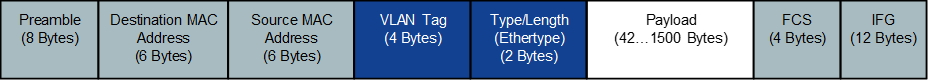

Figure 11. Native Ethernet Frame with VLAN

Standard DPDK routines are used to perform Transport Layer
functionality.

VLAN tag functionality is offloaded to NIC as per the configuration of
VF (refer to Setup Configuration).

The transport header is defined in the ORAN Fronthaul specification
based on the eCPRI specification.

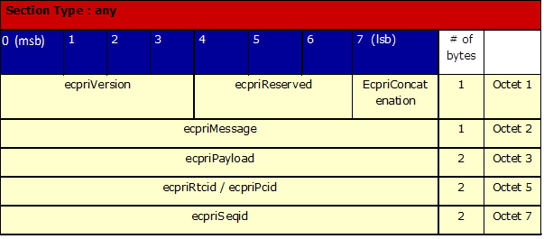

Figure 12. eCPRI Header Field Definitions

Only ECPRI_IQ_DATA = 0x00 and ECPRI_RT_CONTROL_DATA= 0x02 message types
are supported.

For one-way delay measurements the eCPRI Header Field Definitions are
the same as above until the ecpriPayload. The one-delay measurement
message format is shown in the next figure.

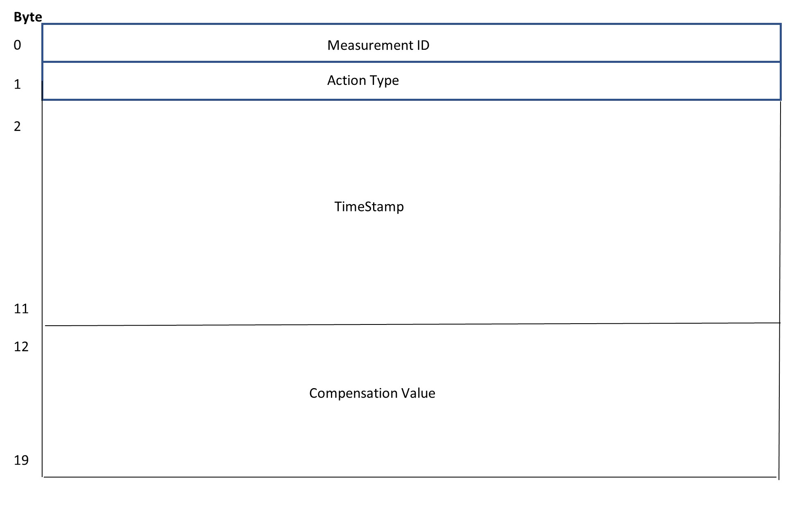

Figure 13. ecpri one-way delay measurement message

In addition, for the eCPRI one-delay measurement message there is a
requirement of dummy bytes insertion so the overall ethernet frame has
at least 64 bytes.

The measurement ID is a one-byte value used by the sender of the request
to distinguish the response received between different measurements.

The action type is a one-byte value defined in Table 8 of the eCPRI
Specification V2.0.

Action Type 0x00 corresponds to a Request

Action Type 0x01 corresponds to a Request with Follow Up

Both values are used by an eCPRI node to initiate a one-way delay
measurement in the direction of its own node to another node.

Action Type 0x02 corresponds to a Response

Action Type 0x03 is a Remote Request

Action Type 0x04 is a Remote Request with Follow Up

Values 0x03 and 0x04 are used when an eCPRI node needs to know the
one-way delay from another node to itself.

Action Type 0x05 is the Follow_Up message.

The timestamp uses the IEEE-1588 Timestamp format with 8 bytes for the
seconds part and 4 bytes for the nanoseconds part. The timestamp is a
positive time with respect to the epoch.

The compensation value is used with Action Types 0x00 (Request), 0x02
(Response) or 0x05 (Follow_up) for all others this field contains zeros.
This value is the compensation time measured in nanoseconds and
multiplied by 2\ :sup:16 and follows the format for the
correctionField in the common message header specified by the IEE
1588-2008 clause 13.3.

Handling of ecpriRtcid/ecpriPcid Bit field size is configurable and can
be defined on the initialization stage of the O-RAN library.

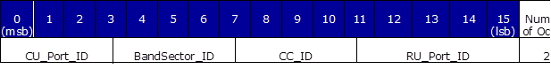

Figure 14. Bit Allocations of ecpriRtcid/ecpriPcid

For ecpriSeqid only, the support for a sequence number is implemented.
The subsequent number is not supported.

U-plane
-------

The following diagrams show O-RAN packet protocols’ headers and data
arrangement with and without compression support.

O-RAN packet meant for traffic with compression enabled has the
Compression Header added after each Application Header. According to
O-RAN Fronthaul's specification, the Compression Header is part of a
repeated Section Application Header. In the O-RAN library implementation,
the header is implemented as a separate structure, following the
Application Section Header. As a result, the Compression Header is not
included in the O-RAN packet, if compression is not used.

Figure 15 shows the components of an ORAN packet.

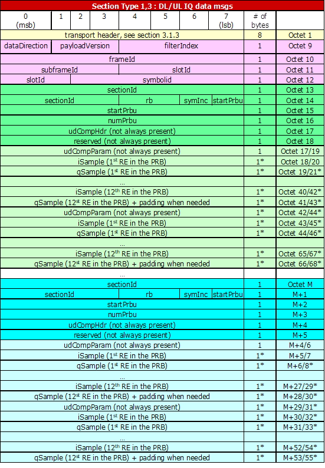

Figure 15. O-RAN Packet Components

Radio Application Header
~~~~~~~~~~~~~~~~~~~~~~~~

The next header is a common header used for time reference.

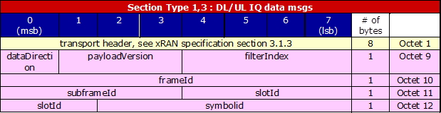

Figure 16. Radio Application Header

The radio application header specific field values are implemented as
follows:

-  filterIndex = 0

-  frameId = [0:99]

-  subframeId = [0:9]

-  slotId = [0:7]

-  symbolId = [0:13]

Data Section Application Data Header
~~~~~~~~~~~~~~~~~~~~~~~~~~~~~~~~~~~~

The Common Radio Application Header is followed by the Application
Header that is repeated for each Data Section within the eCPRI message.
The relevant section of O-RAN packet is shown in color.

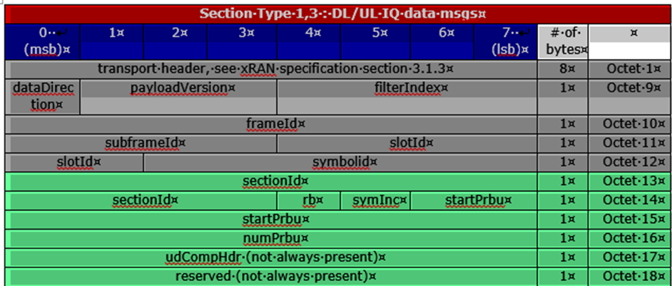

Figure 17. Data Section Application Data Header

A single section is used per one Ethernet packet with IQ samples
startPrbu is equal to 0 and numPrbu is wqual to the number of RBs used:

-  rb field is not used (value 0).

-  symInc is not used (value 0)

Data Payload
~~~~~~~~~~~~

An O-RAN packet data payload contains a number of PRBs. Each PRB is built
of 12 IQ samples. Flexible IQ bit width is supported. If compression is enabled udCompParam is included in the data payload. The data section is shown in colour. 

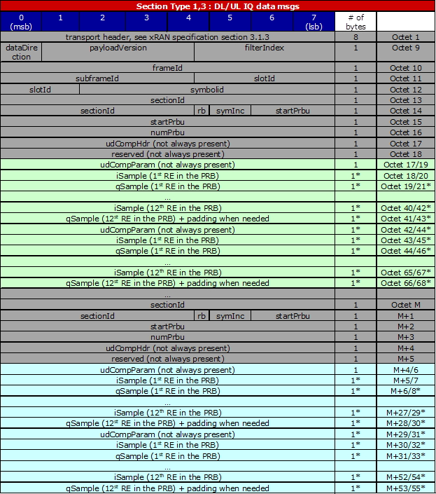

Figure 17. Data Payload

C-plane
-------

C-Plane messages are encapsulated using a two-layered header approach.
The first layer consists of an eCPRI standard header, including
corresponding fields used to indicate the message type, while the second
layer is an application layer including necessary fields for control and
synchronization. Within the application layer, a “section” defines the characteristics of U-plane data to be transferred or received from a
beam with one pattern id. In general, the transport header,application
header, and sections are all intended to be aligned on 4-byte boundaries
and are transmitted in “network byte order” meaning the most significant
byte of a multi-byte parameter is transmitted first.

Table 9 is a list of sections currently supported.

Table 9. Section Types

+--------------+--------------------------+--------------------------+
| Section Type | Target Scenario          | Remarks                  |
+--------------+--------------------------+--------------------------+
| 0            | Unused Resource Blocks   | Not supported            |
|              | or symbols in Downlink   |                          |
|              | or Uplink                |                          |
+--------------+--------------------------+--------------------------+
| 1            | Most DL/UL radio         | Supported                |
|              | channels                 |                          |
+--------------+--------------------------+--------------------------+
| 2            | reserved for future use  | N/A                      |
+--------------+--------------------------+--------------------------+
| 3            | PRACH and                | Only PRACH is supported. |
|              | mixed-numerology         | Mixed numerology is not  |
|              | channels                 | supported.               |
+--------------+--------------------------+--------------------------+
| 4            | Reserved for future use  | Not supported            |
+--------------+--------------------------+--------------------------+
| 5            | UE scheduling            | Not supported            |
|              | information (UE-ID       |                          |
|              | assignment to section)   |                          |
+--------------+--------------------------+--------------------------+
| 6            | Channel information      | Not supported            |
+--------------+--------------------------+--------------------------+
| 7            | LAA                      | Not supported            |
+--------------+--------------------------+--------------------------+
| 8-255        | Reserved for future use  | N/A                      |
+--------------+--------------------------+--------------------------+

Section extensions are not supported in this release.

The definition of the C-Plane packet can be found lib/api/xran_pkt_cp.h
and the fields are appropriately re-ordered in order to apply the
conversion of network byte order after setting values.
The comments in source code of O-RAN lib can be used to see more information on 
implementation specifics of handling sections as well as particular fields. 
Additional changes may be needed on C-plane to perform IOT with O-RU depending on the scenario.

Ethernet Header
~~~~~~~~~~~~~~~

Refer to Figure 11.

eCPRI Header
~~~~~~~~~~~~

Refer to Figure 12.

This header is defined as the structure of xran_ecpri_hdr in
lib/api/xran_pkt.h.

Radio Application Common Header
~~~~~~~~~~~~~~~~~~~~~~~~~~~~~~~

The Radio Application Common Header is used for time reference. Its
structure is shown in Figure 18.

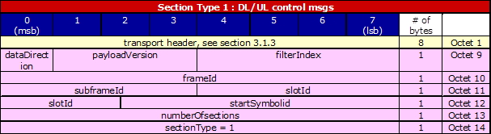

Figure 19. Radio Application Common Header

This header is defined as the structure of
xran_cp_radioapp_common_header in lib/api/xran_pkt_cp.h.

Please note that the payload version in this header is fixed to
XRAN_PAYLOAD_VER (defined as 1) in this release.

Section Type 0 Structure
~~~~~~~~~~~~~~~~~~~~~~~~

Figure 20 describes the structure of Section Type 0.

.. image:: images/Section-Type-0-Structure.jpg
  :width: 600
  :alt: Figure 20. Section Type 0 Structure

Figure 20. Section Type 0 Structure

In Figure 19 through Figure 23, the color yellow means it is a transport
header; the color pink is the radio application header; others are
repeated sections.

Section Type 1 Structure
~~~~~~~~~~~~~~~~~~~~~~~~

Figure 21 describes the structure of Section Type 1.

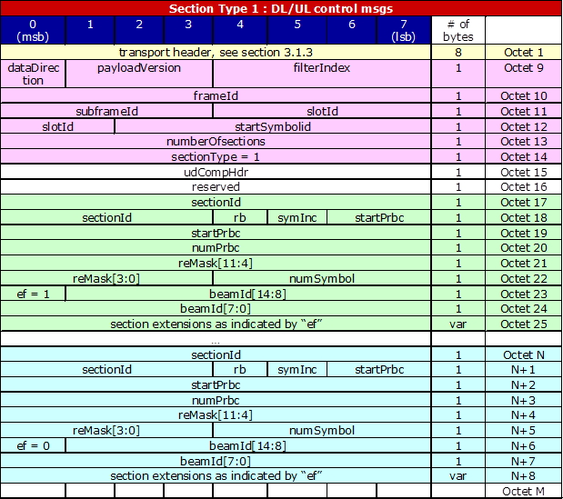

Figure 21. Section Type 1 Structure

Section Type 1 message has two additional parameters in addition to
radio application common header:

-  udCompHdr : defined as the structure of xran_radioapp_udComp_header

-  reserved : fixed by zero

Section type 1 is defined as the structure of xran_cp_radioapp_section1,
and this part can be repeated to have multiple sections.

Whole section type 1 message can be described in this summary:

+----------------------------------+
| xran_cp_radioapp_common_header   |
+==================================+
| xran_cp_radioapp_section1_header |
+----------------------------------+
| xran_cp_radioapp_section1        |
+----------------------------------+
| ……                               |
+----------------------------------+
| xran_cp_radioapp_section1        |
+----------------------------------+

Section Type 3 Structure
~~~~~~~~~~~~~~~~~~~~~~~~

Figure 22 describes the structure of Section Type 3.

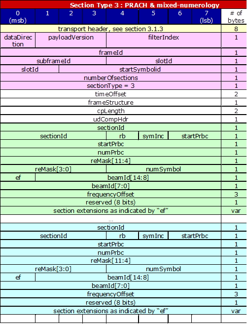

Figure 22. Section Type 3 Structure

Section Type 3 message has below four additional parameters in addition
to radio application common header.

-  timeOffset

-  frameStructure: defined as the structure of
   xran_cp_radioapp_frameStructure

-  cpLength

-  udCompHdr: defined as the structure of xran_radioapp_udComp_header

Section Type 3 is defined as the structure of xran_cp_radioapp_section3
and this part can be repeated to have multiple sections.

Whole section type 3 message can be described in this summary:

+----------------------------------+
| xran_cp_radioapp_common_header   |
+==================================+
| xran_cp_radioapp_section3_header |
+----------------------------------+
| xran_cp_radioapp_section3        |
+----------------------------------+
| ……                               |
+----------------------------------+
| xran_cp_radioapp_section3        |
+----------------------------------+

Section Type 5 Structure
~~~~~~~~~~~~~~~~~~~~~~~~

Figure 23 describes the structure of Section Type 5.

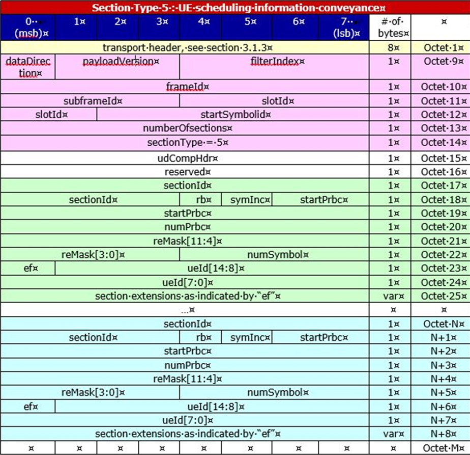

Figure 23.   Section Type 5 Structure

Section Type 6 Structure
~~~~~~~~~~~~~~~~~~~~~~~~

Figure 24 describes the structure of Section Type 6.

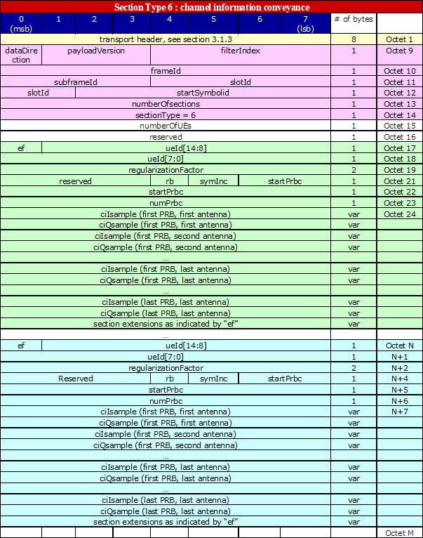

Figure 24. Section Type 6 Structure

