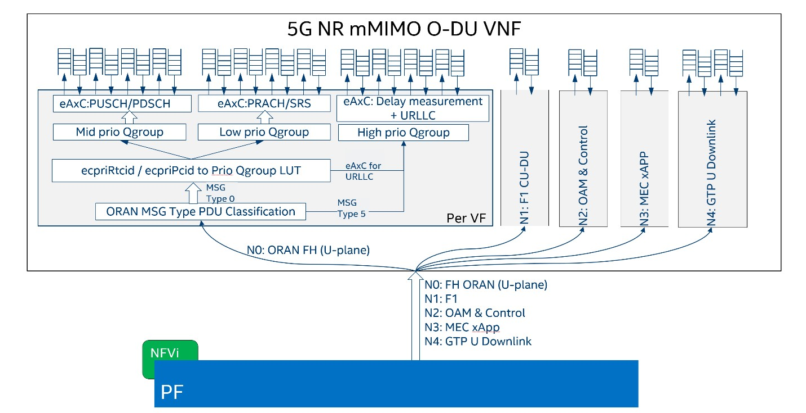

..    Copyright (c) 2019-2022 Intel
..
..  Licensed under the Apache License, Version 2.0 (the "License");
..  you may not use this file except in compliance with the License.
..  You may obtain a copy of the License at
..
..      http://www.apache.org/licenses/LICENSE-2.0
..
..  Unless required by applicable law or agreed to in writing, software
..  distributed under the License is distributed on an "AS IS" BASIS,
..  WITHOUT WARRANTIES OR CONDITIONS OF ANY KIND, either express or implied.
..  See the License for the specific language governing permissions and
..  limitations under the License.

eCPRI DDP Profile for Columbiaville (Experimental Feature)
==========================================================

.. _introduction-3:

Introduction
============

The Intel® Ethernet 800 Series is the next generation of Intel® Ethernet
Controllers and Network Adapters. The Intel® Ethernet 800 Series is
designed with an enhanced programmable pipeline, allowing deeper and
more diverse protocol header processing. This on-chip capability is
called Dynamic Device Personalization (DDP). In the Intel® Ethernet 800
Series, a DDP profile is loaded dynamically on driver load per device.

A general-purpose DDP package is automatically installed with all
supported Intel® Ethernet 800 Series drivers on Windows*, ESX*,
FreeBSD*, and Linux\* operating systems, including those provided by the
Data Plane Development Kit (DPDK). This general-purpose DDP package is
known as the OS-default package.

For more information on DDP technology in the Intel® Ethernet 800 Series
products and the OS-default package, refer to the Intel® Ethernet
Controller E810 Dynamic Device Personalization (DDP) Technology Guide,
published here: https://cdrdv2.intel.com/v1/dl/getContent/617015.

This document describes an optional DDP package targeted towards the
needs of Wireless and Edge (Wireless Edge) customers. This Wireless Edge
DDP package (v1.3.22.101) adds support for eCPRI protocols in addition
to the protocols in the OS-default package. The Wireless Edge DDP
package is supported by DPDK.

Starting from DPDK 21.02 drivers and in the future will also be
supported by the Intel® Ethernet 800 Series ice driver. on Linux
operating systems. The Wireless DDP Package can be loaded on all Intel®
Ethernet 800 Series devices, or different packages can be selected via
serial number per device.

Software/Firmware Requirements
==============================

The specific DDP package requires certain firmware and DPDK versions and
Intel® Ethernet 800 Series firmware/NVM versions. Support for eCPRI DDP
profile included starting from Columbiaville (CVL)release 2.4 or later.
The required DPDK version contains the support of loading the specific
Wireless Edge DDP package.

-  Intel® Ethernet 800 Series Linux Driver (ice) — 1.4.0 (or later)

-  Wireless Edge DDP Package version (ice_wireless_edge) — 1.3.22.101

-  Intel® Ethernet 800 Series firmware version — 1.5.4.2 (or later)

-  Intel® Ethernet 800 Series NVM version — 2.4 (or later)

-  DPDK version— 21.02 (or later)

-  For FlexRAN release 21.03, corresponding support of CVL 2.4 driver pack and DPDK 21.02 is “experimental” and subject to additional testing and potential changes.

DDP Package Setup
=================

The Intel® Ethernet 800 Series Comms DDP package supports only
Linux-based operating systems currently.

Currently, the eCPRI is fully supported only by DPDK 21.02. It can be
loaded either by DPDK or the Intel® Ethernet 800 Series Linux base
driver.

Wireless Edge DDP Package
=========================

For details on how to set up DPDK, refer to Intel® Ethernet Controller
E810 Data Plane Development Kit (DPDK) Configuration Guide (Doc ID:
633514).

There are two methods where DDP package can be loaded and used under
DPDK (see Section C.3.2  and
Section C.3.2 ). For both methods, the
user must obtain the ice_wireless_edge-1.3.22.101.pkg or later from
Intel (please contact your Intel representative for more information)

Option 1: *ice* Linux Base Driver
=================================

The first option is to have the ice Linux base driver load the package.

The *ice* Linux base driver looks for the symbolic link
*intel/ice/ddp/ice.pkg* under the default firmware search path, checking
the following folders in order:

-  */lib/firmware/updates/*

-  */lib/firmware/*

To install the Comms package, copy the extracted .pkg file and its
symbolic link to */lib/firmware/updates/intel/ice/ddp* as follows, and
reload the ice driver::

  # cp /usr/tmp/ice_wireless_edge-1.3.22.101.pkg /lib/firmware/updates/intel/ice/ddp/
  # ln -sf /lib/firmware/updates/intel/ice/ddp/ice_wireless_edge-1.3.22.101.pkg /lib/firmware/updates/intel/ice/ddp/ice.pkg
  # modprobe -r irdma
  # modprobe -r ice
  # modprobe ice

The kernel message log (*dmesg*) indicates status of package loading in
the system. If the driver successfully finds and loads the DDP package,
*dmesg* indicates that the DDP package successfully loaded. If not, the
driver transitions to safe mode.

Once the driver loads the package, the user can unbind the *ice* driver
from a desired port on the device so that DPDK can utilize the port.

The following example unbinds Port 0 and Port 1 of device on Bus 6,
Device 0. Then, the port is bound to either igb_uio or vfio-pci. ::

  # ifdown <interface>
  # dpdk-devbind -u 06:00.0
  # dpdk-devbind -u 06:00.1
  # dpdk-devbind -b igb_uio 06:00.0 06:00.1

Option 2: DPDK Driver Only
==========================

The second method is if the system does not have the *ice* driver
installed. In this case, the user can download the DDP package from the
Intel download center and extract the zip file to obtain the package
(*.pkg*) file. Similar to the Linux base driver, the DPDK driver looks
for the *intel/ddp/ice.pkg* symbolic link in the kernel default firmware
search path */lib/firmware/updates and /lib/firmware/*.

Copy the extracted DDP *.pkg* file and its symbolic link to
*/lib/firmware/intel/ice/ddp*, as follows. ::

  # cp /usr/tmp/ice_wireless_edge-1.3.22.101 /lib/firmware/intel/ice/ddp/
  # cp /usr/tmp/ice.pkg /lib/firmware/intel/ice/ddp/

When DPDK driver loads, it looks for *ice.pkg* to load. If the file
exists, the driver downloads it into the device. If not, the driver
transitions into safe mode.

Loading DDP Package to a Specific Intel® Ethernet 800 Series Device
===================================================================

On a host system running with multiple Intel® Ethernet 800 Series
devices, there is sometimes a need to load a specific DDP package on a
selected device while loading a different package on the remaining
devices.

The Intel® Ethernet 800 Series Linux base driver and DPDK driver can
both load a specific DDP package to a selected adapter based on the
device's serial number. The driver does this by looking for a specific
symbolic link package filename containing the selected device's serial
number.

The following example illustrates how a user can load a specific package
(e.g., *ice_wireless_edge-1.3.22.101*) on the device of Bus 6.

1. Find device serial number.

..

To view bus, device, and function of all Intel® Ethernet 800 Series
Network Adapters in the system:::

  # lspci | grep -i Ethernet | grep -i Intel
  06:00.0 Ethernet controller: Intel Corporation Ethernet Controller E810-C for QSFP (rev 01)
  06:00.1 Ethernet controller: Intel Corporation Ethernet Controller E810-C for QSFP (rev 01)
  82:00.0 Ethernet controller: Intel Corporation Ethernet Controller E810-C for SFP (rev 01)
  82:00.1 Ethernet controller: Intel Corporation Ethernet Controller E810-C for SFP (rev 01)
  82:00.2 Ethernet controller: Intel Corporation Ethernet Controller E810-C for SFP (rev 01)
  82:00.3 Ethernet controller: Intel Corporation Ethernet Controller E810-C for SFP (rev 01)

Use the **lspci** command to obtain the selected device serial
number:::

  # lspci -vv -s 06:00.0 \| grep -i Serial
  Capabilities: [150 v1] Device Serial Number 35-11-a0-ff-ff-ca-05-68

Or, fully parsed without punctuation:::

  # lspci -vv -s 06:00.0 \|grep Serial \|awk '{print $7}'|sed s/-//g
  3511a0ffffca0568

2. Rename the package file with the device serial number in the name.

..

Copy the specific package over to /lib/firmware/updates/intel/ice/ddp
(or /lib/firmware/intel/ice/ ddp) and create a symbolic link with the
serial number linking to the package, as shown. The specific symbolic
link filename starts with “ice-” followed by the device serial in
lower case without dash ('-'). ::

  # ln -s
  /lib/firmware/updates/intel/ice/ddp/ice_wireless_edge-1.3.22.101.pkg
  /lib/firmware/updates/intel/ice/ddp/ice-3511a0ffffca0568.pkg

3. If using Linux kernel driver (*ice*), reload the base driver (not
required if using only DPDK driver). ::

  # rmmod ice
  # modprobe ice

The driver loads the specific package to the selected device and the
OS-default package to the remaining Intel® Ethernet 800 Series
devices in the system.

4. Verify.

For kernel driver:
==================

Example of output of successful load of Wireless Edge Package to all
devices:::

  # dmesg | grep -i "ddp \| safe"
  [606960.921404] ice 0000:18:00.0: The DDP package was successfully loaded: ICE Wireless Edge Package version 1.3.22.101
  [606961.672999] ice 0000:18:00.1: DDP package already present on device: ICE Wireless Edge Package version 1.3.22.101
  [606962.439067] ice 0000:18:00.2: DDP package already present on device: ICE Wireless Edge Package version 1.3.22.101
  [606963.198305] ice 0000:18:00.3: DDP package already present on device: ICE Wireless Edge Package version 1.3.22.101
  [606964.252076] ice 0000:51:00.0: The DDP package was successfully loaded: ICE Wireless Edge Package version 1.3.22.101
  [606965.017082] ice 0000:51:00.1: DDP package already present on device: ICE Wireless Edge Package version 1.3.22.101
  [606965.802115] ice 0000:51:00.2: DDP package already present on device: ICE Wireless Edge Package version 1.3.22.101
  [606966.576517] ice 0000:51:00.3: DDP package already present on device: ICE Wireless Edge Package version 1.3.22.101

If using only DPDK driver:
==========================

Verify using DPDK's **testpmd** application to indicate the status
And version of the loaded DDP package.

Example of eCPRI config with dpdk-testpmd
-----------------------------------------

16 O-RAN eCPRI IQ streams mapped to 16 independent HW queues each.::

  #./dpdk-testpmd -l 22-25 -n 4 -a 0000:af:01.0 -- -i  --rxq=16 --txq=16 --cmdline-file=/home/flexran_xran/ddp.txt

  cat /home/flexran_xran/ddp.txt
  port stop 0
  port config mtu 0 9600
  port config 0 rx_offload vlan_strip on
  port start 0
  flow create 0 ingress pattern eth / ecpri common type iq_data pc_id is 0x0000 / end actions queue index 0 / mark / end
  flow create 0 ingress pattern eth / ecpri common type iq_data pc_id is 0x0001 / end actions queue index 1 / mark / end
  flow create 0 ingress pattern eth / ecpri common type iq_data pc_id is 0x0002 / end actions queue index 2 / mark / end
  flow create 0 ingress pattern eth / ecpri common type iq_data pc_id is 0x0003 / end actions queue index 3 / mark / end
  flow create 0 ingress pattern eth / ecpri common type iq_data pc_id is 0x0004 / end actions queue index 4 / mark / end
  flow create 0 ingress pattern eth / ecpri common type iq_data pc_id is 0x0005 / end actions queue index 5 / mark / end
  flow create 0 ingress pattern eth / ecpri common type iq_data pc_id is 0x0006 / end actions queue index 6 / mark / end
  flow create 0 ingress pattern eth / ecpri common type iq_data pc_id is 0x0007 / end actions queue index 7 / mark / end
  flow create 0 ingress pattern eth / ecpri common type iq_data pc_id is 0x0008 / end actions queue index 8 / mark / end
  flow create 0 ingress pattern eth / ecpri common type iq_data pc_id is 0x0009 / end actions queue index 9 / mark / end
  flow create 0 ingress pattern eth / ecpri common type iq_data pc_id is 0x000a / end actions queue index 10 / mark / end
  flow create 0 ingress pattern eth / ecpri common type iq_data pc_id is 0x000b / end actions queue index 11 / mark / end
  flow create 0 ingress pattern eth / ecpri common type iq_data pc_id is 0x000c / end actions queue index 12 / mark / end
  flow create 0 ingress pattern eth / ecpri common type iq_data pc_id is 0x000d / end actions queue index 13 / mark / end
  flow create 0 ingress pattern eth / ecpri common type iq_data pc_id is 0x000e / end actions queue index 14 / mark / end
  flow create 0 ingress pattern eth / ecpri common type iq_data pc_id is 0x000f / end actions queue index 15 / mark / end
  set fwd rxonly
  start
  show fwd stats all

O-RAN Front haul eCPRI
======================

Intel® Ethernet 800 Series DDP capabilities support several
functionalities important for the O-RAN FH.

-  RSS for packet steering based on ecpriMessage

-  RSS for packet steering based on ecpriRtcid/ecpriPcid

-  Queue mapping based on ecpriRtcid/ecpriPcid

-  Queue mapping based on ecpriMessage

Figure 30. O-RAN FH VNF

Table 13. Patterns & Input Sets for Flow Director and RSS (DPDK 21.02)

============================= ========================================
Pattern                       Input Set
============================= ========================================
ETH / VLAN / eCPRI            ecpriMessage \| ecpriRtcid/ecpriPcid
ETH / VLAN /IPv4(6)/UDP/eCPRI ecpriMessage \| ecpriRtcid/ecpriPcid (*)
============================= ========================================

*Note:* \* IP/UDP is not used with FlexRAN

Limitations
===========

DPDK 21.02 allows up to 1024 queues per VF and RSS across up to 64
receive queues.

RTE Flow API
============

The DPDK Generic flow API (rte_flow) will be used to the configure the
Intel® Ethernet 800 Series to match specific ingress traffic and forward
it to specified queues.

For further information, please refer to section 11 of the DPDK
Programmers
guide <https://doc.dpdk.org/guides/prog_guide/rte_flow.html>.

The specific ingress traffic is identified by a matching pattern which
is composed of one or more Pattern items (represented by struct
rte_flow_item). Once a match has been determined one or more associated
Actions (represented by struct rte_flow_action) will be performed.

A number of flow rules can be combined such that one rule directs
traffic to a queue group based on *ecpriMessage/ ecpriRtcid/ecpriPcid*
etc. and a second rule distributes matching packets within that queue
group using RSS.

The following subset of the RTE Flow API functions can be used to
validate, create and destroy RTE Flow rules.

RTE Flow Rule Validation
========================

A RTE Flow rule is created via a call to the function
*rte_flow_validate*. This can be used to check the rule for correctness
and whether it would be accepted by the device given sufficient
resources.::

  int	rte_flow_validate(uint16_t port_id,
        const struct rte_flow_attr *attr,
        const struct rte_flow_item pattern[],
        const struct rte_flow_action *actions[]
        struct rte_flow_error *error);

port_id : port identifier of Ethernet device

attr : flow rule attributes(ingress/egress)

pattern : pattern specification (list terminated by the END pattern
item).

action : associated actions (list terminated by the END action).

error : perform verbose error reporting if not NULL.

0 is returned upon success, negative errno otherwise.

RTE Flow Rule Creation
======================

A RTE Flow rule is created via a call to the function *rte_flow_create*.::

  struct rte_flow * rte_flow_create(uint16_t port_id,
          const struct rte_flow_attr *attr,
          const struct rte_flow_item pattern[],
          const struct rte_flow_action *actions[]
          struct rte_flow_error *error);

port_id : port identifier of Ethernet device

attr : flow rule attributes(ingress/egress)

pattern : pattern specification (list terminated by the END pattern
item).

action : associated actions (list terminated by the END action).

error : perform verbose error reporting if not NULL.

A valid handle is returned upon success, NULL otherwise.

RTE Flow Rule Destruction
=========================

A RTE Flow rule is destroyed via a call to the function
*rte_flow_destroy*.::

  int rte_flow_destroy(uint16_t port_id,
    struct rte_flow \*flow,
    struct rte_flow_error \*error);

port_id : port identifier of Ethernet device

flow : flow rule handle to destroy.

error : perform verbose error reporting if not NULL.

0 is returned upon success, negative errno otherwise.

RTE Flow Flush
==============

All flow rule handles associated with a port can be released using
*rte_flow_flush*. They are released as with successive calls to function
*rte_flow_destroy*.::

  int rte_flow_flush(uint16_t port_id,
    struct rte_flow_error \*error);

port_id : port identifier of Ethernet device

error : perform verbose error reporting if not NULL.

0 is returned upon success, negative errno otherwise.

RTE Flow Query
==============

A RTE Flow rule is queried via a call to the function *rte_flow_query*.::

  int rte_flow_query(uint16_t port_id,
                  struct rte_flow *flow,
                  const struct rte_flow_action *action,
                  void *data,
                  struct rte_flow_error *error);

port_id : port identifier of Ethernet device

flow : flow rule handle to query

action : action to query, this must match prototype from flow rule.

data : pointer to storage for the associated query data type

error : perform verbose error reporting if not NULL.

0 is returned upon success, negative errno otherwise.

RTE Flow Rules
==============

A flow rule is the combination of attributes with a matching pattern and
a list of actions. Each flow rules consists of:

-  **Attributes (represented by struct rte_flow_attr):** properties of a flow rule such as its direction (ingress or egress) and priority.

-  **Pattern Items (represented by struct rte_flow_item):** is part of a matching pattern that either matches specific packet data or traffic properties.

-  **Matching pattern:** traffic properties to look for, a combination of any number of items.

-  **Actions (represented by struct rte_flow_action):** operations to perform whenever a packet is matched by a pattern.

Attributes
==========

Flow rule patterns apply to inbound and/or outbound traffic. For the
purposes described in later sections the rules apply to ingress only.
For further information, please refer to section 11 of the DPDK
Programmers guide <https://doc.dpdk.org/guides/prog_guide/rte_flow.html>.::

  *struct*\ rte_flow_attr <https://doc.dpdk.org/api/structrte__flow__attr.html>\ *{*
  *uint32_t*\ group <https://doc.dpdk.org/api/structrte__flow__attr.html#a0d20c78ce80e301ed514bd4b4dec9ec0>\ *;*
  *uint32_t*\ priority <https://doc.dpdk.org/api/structrte__flow__attr.html#a90249de64da5ae5d7acd34da7ea1b857>\ *;*
  *uint32_t*\ ingress <https://doc.dpdk.org/api/structrte__flow__attr.html#ae4d19341d5298a2bc61f9eb941b1179c>\ *:1;*
  *uint32_t*\ egress <https://doc.dpdk.org/api/structrte__flow__attr.html#a33bdc3cfc314d71f3187a8186bc570a9>\ *:1;*
  *uint32_t*\ transfer <https://doc.dpdk.org/api/structrte__flow__attr.html#a9371183486f590ef35fef41dec806fef>\ *:1;*
  *uint32_t*\ reserved <https://doc.dpdk.org/api/structrte__flow__attr.html#aa43c4c21b173ada1b6b7568956f0d650>\ *:29;*
  *};*

Pattern items
=============

For the purposes described in later sections Pattern items are primarily
for matching protocol headers and packet data, usually associated with a
specification structure. These must be stacked in the same order as the
protocol layers to match inside packets, starting from the lowest.

Item specification structures are used to match specific values among
protocol fields (or item properties).

Up to three structures of the same type can be set for a given item:

-  **spec:** values to match (e.g. a given IPv4 address).

-  **last:** upper bound for an inclusive range with corresponding fields in spec.

-  **mask:** bit-mask applied to both spec and last whose purpose is to distinguish the values to take into account and/or partially mask them out (e.g. in order to match an IPv4 address prefix).

Table 14. Example RTE FLOW Item Types

+-------------+---------------------------------------+-------------------------+
| Item Type\* | Description                           | Specification Structure |
+=============+=======================================+=========================+
| END         | End marker for item lists             | None                    |
+-------------+---------------------------------------+-------------------------+
| VOID        | Used as a placeholder for convenience | None                    |
+-------------+---------------------------------------+-------------------------+
| ETH         | Matches an Ethernet header            | rte_flow_item_eth       |
+-------------+---------------------------------------+-------------------------+
| VLAN        | Matches an 802.1Q/ad VLAN tag.        | rte_flow_item_vlan      |
+-------------+---------------------------------------+-------------------------+
| IPV4        | Matches an IPv4 header                | rte_flow_item_ipv4      |
+-------------+---------------------------------------+-------------------------+
| IPV6        | Matches an IPv6 header                | rte_flow_item_ipv6      |
+-------------+---------------------------------------+-------------------------+
| ICMP        | Matches an ICMP header.               | rte_flow_item_icmp      |
+-------------+---------------------------------------+-------------------------+
| UDP         | Matches an UDP header.                | rte_flow_item_udp       |
+-------------+---------------------------------------+-------------------------+
| TCP         | Matches a TCP header.                 | rte_flow_item_tcp       |
+-------------+---------------------------------------+-------------------------+
| SCTP        | Matches a SCTP header.                | rte_flow_item_sctp      |
+-------------+---------------------------------------+-------------------------+
| VXLAN       | Matches a VXLAN header.               | rte_flow_item_vxlan     |
+-------------+---------------------------------------+-------------------------+
| NVGRE       | Matches a NVGRE header.               | rte_flow_item_nvgre     |
+-------------+---------------------------------------+-------------------------+
| ECPRI       | Matches ECPRI Header                  | rte_flow_item_ecpri     |
+-------------+---------------------------------------+-------------------------+

::

  RTE_FLOW_ITEM_TYPE_ETH

  struct rte_flow_item_eth {
          struct rte_ether_addr dst; /**< Destination MAC. */
          struct rte_ether_addr src; /**< Source MAC. > */
          rte_be16_t type; /**< EtherType or TPID.> */
  };

  struct rte_ether_addr {
          uint8_t addr_bytes[RTE_ETHER_ADDR_LEN]; /**< Addr bytes in tx order */
  }

::

  RTE_FLOW_ITEM_TYPE_IPV4 
  
  struct rte_flow_item_ipv4 {
          struct rte_ipv4_hdr hdr; /**< IPv4 header definition. */
  };

  struct rte_ipv4_hdr {
          uint8_t  version_ihl;           /**< version and header length */
          uint8_t  type_of_service;       /**< type of service */
          rte_be16_t total_length;        /**< length of packet */
          rte_be16_t packet_id;           /**< packet ID */
          rte_be16_t fragment_offset;     /**< fragmentation offset */
          uint8_t  time_to_live;          /**< time to live */
          uint8_t  next_proto_id;         /**< protocol ID */
          rte_be16_t hdr_checksum;        /**< header checksum */
          rte_be32_t src_addr;            /**< source address */
          rte_be32_t dst_addr;            /**< destination address */
  }

  RTE_FLOW_ITEM_TYPE_UDP

  struct rte_flow_item_udp {
          struct rte_udp_hdr hdr; /**< UDP header definition. */
  };

  struct rte_udp_hdr {
          rte_be16_t src_port;    /**< UDP source port. */
          rte_be16_t dst_port;    /**< UDP destination port. */
          rte_be16_t dgram_len;   /**< UDP datagram length */
          rte_be16_t dgram_cksum; /**< UDP datagram checksum */
  }

  RTE_FLOW_ITEM_TYPE_ECPRI 
  
  struct rte_flow_item_ecpri {
    struct rte_ecpri_combined_msg_hdr hdr;
  };

  struct rte_ecpri_combined_msg_hdr {
    struct rte_ecpri_common_hdr common;
    union {
      struct rte_ecpri_msg_iq_data type0;
      struct rte_ecpri_msg_bit_seq type1;
      struct rte_ecpri_msg_rtc_ctrl type2;
      struct rte_ecpri_msg_bit_seq type3;
      struct rte_ecpri_msg_rm_access type4;
      struct rte_ecpri_msg_delay_measure type5;
      struct rte_ecpri_msg_remote_reset type6;
      struct rte_ecpri_msg_event_ind type7;
      rte_be32_t dummy[3];
    };
  };
  struct rte_ecpri_common_hdr {
    union {
      rte_be32_t u32;	/**< 4B common header in BE */
      struct {
  #if RTE_BYTE_ORDER == RTE_LITTLE_ENDIAN
        uint32_t size:16; /**< Payload Size */
        uint32_t type:8; /**< Message Type */
        uint32_t c:1; /**< Concatenation Indicator */
        uint32_t res:3; /**< Reserved */
        uint32_t revision:4; /**< Protocol Revision */
  #elif RTE_BYTE_ORDER == RTE_BIG_ENDIAN
        uint32_t revision:4; /**< Protocol Revision */
        uint32_t res:3; /**< Reserved */
        uint32_t c:1;  /**< Concatenation Indicator */
        uint32_t type:8; /**< Message Type */
        uint32_t size:16; /**< Payload Size */
  #endif
      };
    };
  };
  /**
  * eCPRI Message Header of Type #0: IQ Data
  */
  struct rte_ecpri_msg_iq_data {
    rte_be16_t pc_id;		/**< Physical channel ID */
    rte_be16_t seq_id;		/**< Sequence ID */
  };

  /**
  * eCPRI Message Header of Type #1: Bit Sequence
  */
  struct rte_ecpri_msg_bit_seq {
    rte_be16_t pc_id;		/**< Physical channel ID */
    rte_be16_t seq_id;		/**< Sequence ID */
  };

  /**
  * eCPRI Message Header of Type #2: Real-Time Control Data
  */
  struct rte_ecpri_msg_rtc_ctrl {
    rte_be16_t rtc_id;		/**< Real-Time Control Data ID */
    rte_be16_t seq_id;		/**< Sequence ID */
  };

  /**
  * eCPRI Message Header of Type #3: Generic Data Transfer
  */
  struct rte_ecpri_msg_gen_data {
    rte_be32_t pc_id;		/**< Physical channel ID */
    rte_be32_t seq_id;		/**< Sequence ID */
  };

  /**
  * eCPRI Message Header of Type #4: Remote Memory Access
  */
  RTE_STD_C11
  struct rte_ecpri_msg_rm_access {
  #if RTE_BYTE_ORDER == RTE_LITTLE_ENDIAN
    uint32_t ele_id:16;		/**< Element ID */
    uint32_t rr:4;			/**< Req/Resp */
    uint32_t rw:4;			/**< Read/Write */
    uint32_t rma_id:8;		/**< Remote Memory Access ID */
  #elif RTE_BYTE_ORDER == RTE_BIG_ENDIAN
    uint32_t rma_id:8;		/**< Remote Memory Access ID */
    uint32_t rw:4;			/**< Read/Write */
    uint32_t rr:4;			/**< Req/Resp */
    uint32_t ele_id:16;		/**< Element ID */
  #endif
    uint8_t addr[6];		/**< 48-bits address */
    rte_be16_t length;		/**< number of bytes */
  };

  /**
  * eCPRI Message Header of Type #5: One-Way Delay Measurement
  */
  struct rte_ecpri_msg_delay_measure {
    uint8_t msr_id;			/**< Measurement ID */
    uint8_t act_type;		/**< Action Type */
  };

  /**
  * eCPRI Message Header of Type #6: Remote Reset
  */
  struct rte_ecpri_msg_remote_reset {
    rte_be16_t rst_id;		/**< Reset ID */
    uint8_t rst_op;			/**< Reset Code Op */
  };

  /**
  * eCPRI Message Header of Type #7: Event Indication
  */
  struct rte_ecpri_msg_event_ind {
    uint8_t evt_id;			/**< Event ID */
    uint8_t evt_type;		/**< Event Type */
    uint8_t seq;			/**< Sequence Number */
    uint8_t number;			/**< Number of Faults/Notif */
  };

Matching Patterns
=================

A matching pattern is formed by stacking items starting from the lowest
protocol layer to match. Patterns are terminated by END pattern item.

Actions
-------

Each possible action is represented by a type. An action can have an
associated configuration object. Actions are terminated by the END
action.

Table 15. RTE FLOW Actions

+----------+----------------------------+-------------------------+
| Action\* | Description                | Configuration Structure |
+==========+============================+=========================+
| END      | End marker for action      | none                    |
|          | lists                      |                         |
+----------+----------------------------+-------------------------+
| VOID     | Used as a placeholder for  | none                    |
|          | convenience                |                         |
+----------+----------------------------+-------------------------+
| PASSTHRU | Leaves traffic up for      | none                    |
|          | additional processing by   |                         |
|          | subsequent flow rules;     |                         |
|          | makes a flow rule          |                         |
|          | non-terminating.           |                         |
+----------+----------------------------+-------------------------+
| MARK     | Attaches an integer value  | rte_flow_action_mark    |
|          | to packets and sets        |                         |
|          | PKT_RX_FDIR and            |                         |
|          | PKT_RX_FDIR_ID mbuf flags  |                         |
+----------+----------------------------+-------------------------+
| QUEUE    | Assigns packets to a given | rte_flow_action_queue   |
|          | queue index                |                         |
+----------+----------------------------+-------------------------+
| DROP     | Drops packets              | none                    |
+----------+----------------------------+-------------------------+
| COUNT    | Enables Counters for this  | rte_flow_action_count   |
|          | flow rule                  |                         |
+----------+----------------------------+-------------------------+
| RSS      | Similar to QUEUE, except   | rte_flow_action_rss     |
|          | RSS is additionally        |                         |
|          | performed on packets to    |                         |
|          | spread them among several  |                         |
|          | queues according to the    |                         |
|          | provided parameters.       |                         |
+----------+----------------------------+-------------------------+
| VF       | Directs matching traffic   | rte_flow_action_vf      |
|          | to a given virtual         |                         |
|          | function of the current    |                         |
|          | device                     |                         |
+----------+----------------------------+-------------------------+

Route to specific Queue id based on ecpriRtcid/ecpriPcid
========================================================

An RTE Flow Rule will be created to match an eCPRI packet with a
specific pc_id value and route it to specified queues.

.. _pattern-items-1:

Pattern Items
-------------

Table 16. Pattern Items to match eCPRI packet with a Specific Physical
Channel ID (pc_id)

+-------+----------+-----------------------+-----------------------+
| Index | Item     | Spec                  | Mask                  |
+=======+==========+=======================+=======================+
| 0     | Ethernet | 0                     | 0                     |
+-------+----------+-----------------------+-----------------------+
| 1     | eCPRI    | hdr.common.type =     | hdr.common.type =     |
|       |          | RTE_EC                | 0xff;                 |
|       |          | PRI_MSG_TYPE_IQ_DATA; |                       |
|       |          |                       | hdr.type0.pc_id =     |
|       |          | hdr.type0.pc_id =     | 0xffff;               |
|       |          | pc_id;                |                       |
+-------+----------+-----------------------+-----------------------+
| 2     | END      | 0                     | 0                     |
+-------+----------+-----------------------+-----------------------+

The following code sets up the *RTE_FLOW_ITEM_TYPE_ETH* and
*RTE_FLOW_ITEM_TYPE_ECPRI* Pattern Items.

The *RTE_FLOW_ITEM_TYPE_ECPRI* Pattern is configured to match on the
pc_id value (in this case 8 converted to Big Endian byte order).

+--------------------------------------------------------------------------+
| uint8_t pc_id_be = 0x0800;                                               |
|                                                                          |
| #define MAX_PATTERN_NUM 3                                                |
|                                                                          |
| struct rte_flow_item pattern[MAX_PATTERN_NUM];                           |
|                                                                          |
| struct rte_flow_action action[MAX_ACTION_NUM];                           |
|                                                                          |
| struct rte_flow_item_ecpri ecpri_spec;                                   |
|                                                                          |
| struct rte_flow_item_ecpri ecpri_mask;                                   |
|                                                                          |
| /\* Ethernet \*/                                                         |
|                                                                          |
| patterns[0].type = RTE_FLOW_ITEM_TYPE_ETH;                               |
|                                                                          |
| patterns[0].spec = 0;                                                    |
|                                                                          |
| patterns[0].mask = 0;                                                    |
|                                                                          |
| /\* ECPRI \*/                                                            |
|                                                                          |
| ecpri_spec.hdr.common.type = RTE_ECPRI_MSG_TYPE_IQ_DATA;                 |
|                                                                          |
| ecpri_spec.hdr.type0.pc_id = pc_id_be;                                   |
|                                                                          |
| ecpri_mask.hdr.common.type = 0xff;                                       |
|                                                                          |
| ecpri_mask.hdr.type0.pc_id = 0xffff;                                     |
|                                                                          |
| ecpri_spec.hdr.common.u32 = rte_cpu_to_be_32(ecpri_spec.hdr.common.u32); |
|                                                                          |
| pattern[1].type = RTE_FLOW_ITEM_TYPE_ECPRI;                              |
|                                                                          |
| pattern[1].spec = &ecpri_spec;                                           |
|                                                                          |
| pattern[1].mask = &ecpri_mask;                                           |
|                                                                          |
| /\* END the pattern array \*/                                            |
|                                                                          |
| patterns[2].type = RTE_FLOW_ITEM_TYPE_END                                |
+--------------------------------------------------------------------------+

Action
------

Table 17. QUEUE action for given queue id

===== ====== ====== ==================== ====================
Index Action Fields Description          Value
===== ====== ====== ==================== ====================
0     QUEUE  index  queue indices to use Must be 0,1,2,3, etc
1     END
===== ====== ====== ==================== ====================

The following code sets up the action *RTE_FLOW_ACTION_TYPE_QUEUE* and
calls the *rte_flow_create* function to create the RTE Flow rule.

+----------------------------------------------------------------------+
| *#define MAX_ACTION_NUM 2*                                           |
|                                                                      |
| *uint16_t rx_q = 4;*                                                 |
|                                                                      |
| *struct rte_flow_action_queue queue = { .index = rx_q };*            |
|                                                                      |
| *struct rte_flow \*handle;*                                          |
|                                                                      |
| *struct rte_flow_error err;*                                         |
|                                                                      |
| *struct rte_flow_action actions[MAX_ACTION_NUM];*                    |
|                                                                      |
| *struct rte_flow_attr attributes = {.ingress = 1 };*                 |
|                                                                      |
| *action[0].type = RTE_FLOW_ACTION_TYPE_QUEUE;*                       |
|                                                                      |
| *action[0].conf = &queue;*                                           |
|                                                                      |
| *action[1].type = RTE_FLOW_ACTION_TYPE_END;*                         |
|                                                                      |
| *handle = rte_flow_create (port_id, &attributes, patterns, actions,  |
| &err);*                                                              |
+----------------------------------------------------------------------+
