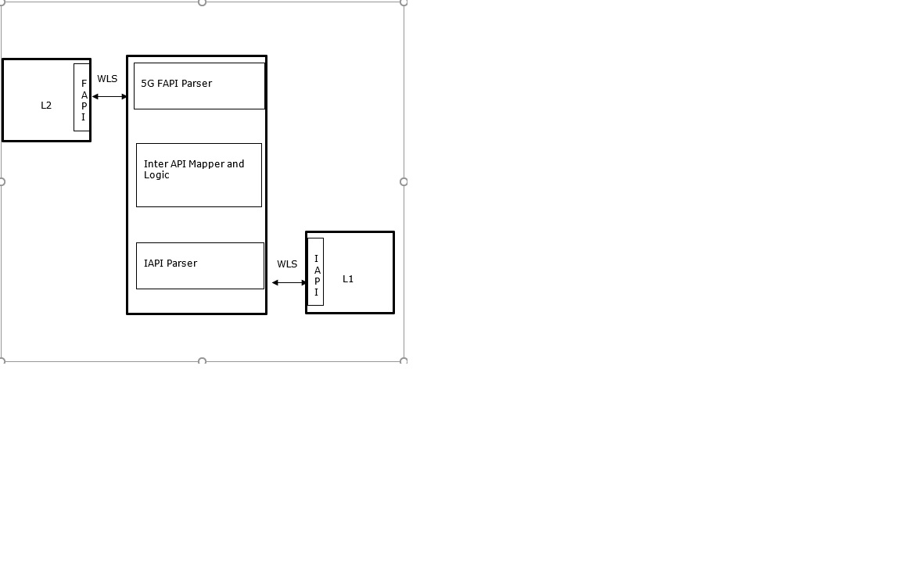

..    Copyright (c) 2020-2022 Intel
..
..  Licensed under the Apache License, Version 2.0 (the "License");
..  you may not use this file except in compliance with the License.
..  You may obtain a copy of the License at
..
..      http://www.apache.org/licenses/LICENSE-2.0
..
..  Unless required by applicable law or agreed to in writing, software
..  distributed under the License is distributed on an "AS IS" BASIS,
..  WITHOUT WARRANTIES OR CONDITIONS OF ANY KIND, either express or implied.
..  See the License for the specific language governing permissions and
..  limitations under the License.

.. |br| raw:: html

    

O-RAN FAPI 5G TM Introduction
=============================

.. contents::
    :depth: 3
    :local:

The ORAN FAPI 5G Translator Module (TM) is a standalone application that communicates with the ODU-High using the 5G FAPI protocol defined
by the Small Cell Forum and communicates with the ODU Low using the Intel L2-L1 API using the Wireless Subsystem Interface
Library (WLS) to handle the shared memory and buffer management required by the Interfaces. In addition the ORAN 5G FAPI TM requires the
Data Plane Design Kit (DPDK) which is integrated with the WLS Library.

Table 1. Terminology

+----------+----------------------------------------------------------+
| Term     | Description                                              |
+----------+----------------------------------------------------------+
| API      | Application Platform Interface                           |
+----------+----------------------------------------------------------+
| BBU      | Baseband Unit                                            |
+----------+----------------------------------------------------------+
| CORESET  | Control Resource Set                                     |
+----------+----------------------------------------------------------+
| DOS      | Denial of Service Attack                                 |
+----------+----------------------------------------------------------+
| DPDK     | Data Plane Design Kit                                    |
+----------+----------------------------------------------------------+
| eNb      | Enode B                                                  |
+----------+----------------------------------------------------------+
| EPC      | Evolved Packet Core                                      |
+----------+----------------------------------------------------------+
| EVM      | Error Vector magnitude                                   |
+----------+----------------------------------------------------------+
| FAPI     | Functional Application Platform Interface                |
+----------+----------------------------------------------------------+
| gNB      | Next generation eNB or g Node B                          |
+----------+----------------------------------------------------------+
| IQ       | In-phase and in-quadrature                               |
+----------+----------------------------------------------------------+
| ISA      | Intel Software Architecture i.e. AVX2, AVX256, AVX512    |
+----------+----------------------------------------------------------+
| MAC      | Medium Access Control                                    |
+----------+----------------------------------------------------------+
| MIB      | Master Information Block                                 |
+----------+----------------------------------------------------------+
| nFAPI    | Network FAPI (Between VNF(L2/L3) and PNF(L1))            |
+----------+----------------------------------------------------------+
| PDU      | Protocol Data Unit                                       |
+----------+----------------------------------------------------------+
| PHY      | Physical Layer Processing                                |
+----------+----------------------------------------------------------+
| PMD      | Poll Mode Driver                                         |
+----------+----------------------------------------------------------+
| PNF      | Physical Network Function                                |
+----------+----------------------------------------------------------+
| PSS      | Primary Synchronization Signal                           |
+----------+----------------------------------------------------------+
| QPSK     | Quadrature Phase Shift Keying                            |
+----------+----------------------------------------------------------+
| RAN      | Radio Access Network                                     |
+----------+----------------------------------------------------------+
| RE       | Radio Equipment                                          |
+----------+----------------------------------------------------------+
| REC      | Radio Equipment Control                                  |
+----------+----------------------------------------------------------+
| ROE      | Radio Over Ethernet                                      |
+----------+----------------------------------------------------------+
| RX or Rx | Receive                                                  |
+----------+----------------------------------------------------------+
| SCF      | Small Cell Forum                                         |
+----------+----------------------------------------------------------+
| SFN      | System Frame Number ∈ {0,…,1023}                         |
+----------+----------------------------------------------------------+
| SIB      | System Information Block                                 |
+----------+----------------------------------------------------------+
| SSS      | Secondary Synchronization Signal                         |
+----------+----------------------------------------------------------+
| TLV      | Type Length Value                                        |
+----------+----------------------------------------------------------+
| TX or Tx | Transmit                                                 |
+----------+----------------------------------------------------------+
| U-Plane  | User Plane                                               |
+----------+----------------------------------------------------------+
| URLLC    | Ultra Reliable Low Latency Coding                        |
+----------+----------------------------------------------------------+
| VNF      | Virtual Network Function                                 |
+----------+----------------------------------------------------------+
| WLS      | Wireless Subsystem Interface                             |
+----------+----------------------------------------------------------+
| WLS_DPDK | WLS that uses DPDK functions instead of accessing kernel |
|          | functions                                                |
+----------+----------------------------------------------------------+

Reference Documents
-------------------

Table 2. Reference Documents

+-------------------------------------+-------------------------------+
| Document                            | Document                      |
|                                     | No./Location                  |
+-------------------------------------+-------------------------------+
|| 1) FlexRAN 5G New Radio Reference  | CDI 603575   Intel Corp.      |
||    Solution L1-L2 API Specification|                               |
||    Rev 10.00 March 2021            |                               |
+-------------------------------------+-------------------------------+
|| 2) 5G FAPI:PHY API Specification,  | 222.10.02/ smallcellforum.org |
||   Version 2.0.0, March 2020        |                               |
+-------------------------------------+-------------------------------+

Translator Module Top Level Design
==================================

The following diagram illustrates the different functions and components
used by this module and how it interconnects to the L2 and L1 layers.

Figure 1. ORAN 5G FAPI Translator Module Top Level Architecture

Figure 1. ORAN 5G FAPI TM Top Level Diagram

The Translator Module consists of the following functions:

-  A 5G FAPI Parser facing the L2 interface.

-  An Inter API Mapper and Logic.

-  An Intel API Parser facing the L1 interface.

-  WLS dpdk based library supporting 2 instances.
