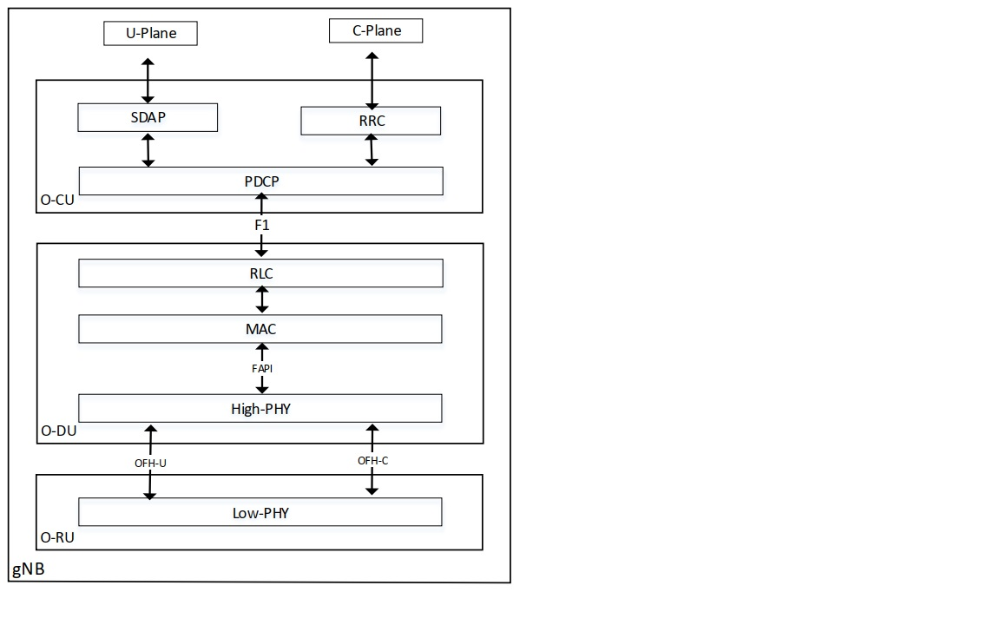

..    Copyright (c) 2019-2022 Intel
..
..  Licensed under the Apache License, Version 2.0 (the "License");
..  you may not use this file except in compliance with the License.
..  You may obtain a copy of the License at
..
..      http://www.apache.org/licenses/LICENSE-2.0
..
..  Unless required by applicable law or agreed to in writing, software
..  distributed under the License is distributed on an "AS IS" BASIS,
..  WITHOUT WARRANTIES OR CONDITIONS OF ANY KIND, either express or implied.
..  See the License for the specific language governing permissions and
..  limitations under the License.

.. |br| raw:: html

    

O-DU Low Project Introduction
================================

.. contents::
    :depth: 3
    :local:

The O-DU low project focus on the baseband PHY Reference Design, which uses Xeon® series Processor with Intel Architecture. This 5GNR Reference PHY consists of a L1 binary \
and three kinds of interfaces which are validated on a Intel® Xeon® SkyLake / CascadeLake platforms and demonstrates the capabilities of the software running different \
5GNR L1 features. It implements the relevant functions described in [3GPP TS 38.211, 212, 213, 214 and 215].
 
The L1 has three \ 
interfaces to communicate with other network functions as described below:

* Interface between L1 and Front Haul, it adopts the WG4 specification for the CUS plane communication. 

* Interface between O-DU Low and O-DU High, it adopts the FAPI interface according to the WG8 AAL specification.

* Interface between O-DU Low and accelerator, DPDK BBDev was adopted as original contribution, it will follow the WG6 definition after the WG6 specification is finalized. 

The following figure shows the ORAN O-CU, O-DU and O-RU blocks for a gNB implemetation. The O-DU Low projects implements the FAPI interface by a 5G FAPI TM module, the OFH-U and OFH-C
by means of the FHI Library and the functionality of the High-PHY and a test MAC are available through github in the form of a binary blob for the current release. For the details refer to the Running L1 and Testmac section of this document 

   
Scope
-----

In this O-DU Low document, the details on how the build the modules supporting each interface, how to run the L1 and associated components, the architecture for each
interface implementation and the release notes that describe each component release details are provided.

Intended Audience
-------------------

The intended audience for this document are software engineers and system architects who design and develop |br|
5G systems using the O-RAN Specifications.

Terminology
-------------

Table 1. Terminology

+---------+-----------------------------------------------------------+
| Term    | Description                                               |
+=========+===========================================================+
| 5G NR   | Fifth Generation New Radio                                |
+---------+-----------------------------------------------------------+
| ACS     | Access Control system                                     |
+---------+-----------------------------------------------------------+
| API     | Application Programming Interface                         |
+---------+-----------------------------------------------------------+
| BOM     | Bill of Materials                                         |
+---------+-----------------------------------------------------------+
| CP      | Cyclic Prefix                                             |
+---------+-----------------------------------------------------------+
| DDP     | Dynamic Device Personalization                            |
+---------+-----------------------------------------------------------+
| DPDK    | Data Plane Development Kit                                |
+---------+-----------------------------------------------------------+
| eAxC    | Extended Antenna Carrier                                  |
+---------+-----------------------------------------------------------+
| eCPRI   | Enhanced Common Public Radio Interface                    |
+---------+-----------------------------------------------------------+
| eNB     | Enode B                                                   |
+---------+-----------------------------------------------------------+
| ETH     | Ethernet                                                  |
+---------+-----------------------------------------------------------+
| FCS     | Frame Check Sequence                                      |
+---------+-----------------------------------------------------------+
| FEC     | Forward Error Correction                                  |
+---------+-----------------------------------------------------------+
| FFT     | Fast Fourier Transform                                    |
+---------+-----------------------------------------------------------+
| FH      | Front Haul                                                |
+---------+-----------------------------------------------------------+
| gNB     | Next-generation NodeB also named as Base Station          |
+---------+-----------------------------------------------------------+
| GNSS    | Global Navigation Satellite System                        |
+---------+-----------------------------------------------------------+
| GPS     | Global Positioning System                                 |
+---------+-----------------------------------------------------------+
| HARQ    | Hybrid Automatic Repeat Request                           |
+---------+-----------------------------------------------------------+
| HW      | Hardware                                                  |
+---------+-----------------------------------------------------------+
| IFG     | Interframe Gap                                            |
+---------+-----------------------------------------------------------+
| IFFT    | Inverse Fast Fourier Transform                            |
+---------+-----------------------------------------------------------+
| IoT     | Inter-Operability Testing                                 |
+---------+-----------------------------------------------------------+
| IQ      | In-band and Quadrature                                    |
+---------+-----------------------------------------------------------+
| LAA     | License Assisted Access                                   |
+---------+-----------------------------------------------------------+
| LTE     | Long Term Evolution                                       |
+---------+-----------------------------------------------------------+
| MAC     | Media Access Control                                      |
+---------+-----------------------------------------------------------+
| MEC     | Mobile Edge Computing                                     |
+---------+-----------------------------------------------------------+
| M-Plane | Management Plane                                          |
+---------+-----------------------------------------------------------+
| mmWave  | Millimeter Wave                                           |
+---------+-----------------------------------------------------------+
| NIC     | Network Interface Controller                              |
+---------+-----------------------------------------------------------+
| O-DU    | O-RAN Distributed Unit: a logical node hosting            |
|         | RLC/MAC/High-PHY layers based on a lower layer functional |
|         | split.                                                    |
+---------+-----------------------------------------------------------+
| O-RU    | O-RAN Radio Unit: a logical node hosting Low-PHY layer    |
|         | and RF processing based on a lower layer functional       |
|         | split. This is similar to 3GPP’s “TRP” or “RRH” but more  |
|         | specific in including the Low-PHY layer (FFT/IFFT, PRACH  |
|         | extraction).                                              |
+---------+-----------------------------------------------------------+
| OWD     | One Way Delay                                             |
+---------+-----------------------------------------------------------+
| PDCCH   | Physical Downlink Control Channel                         |
+---------+-----------------------------------------------------------+
| PDSCH   | Physical Downlink Shared Channel                          |
+---------+-----------------------------------------------------------+
| PHC     | Physical Hardware Clock                                   |
+---------+-----------------------------------------------------------+
| PHP     | Hypetext Preprocessor                                     |
+---------+-----------------------------------------------------------+
| PMD     | Poll Mode Driver                                          |
+---------+-----------------------------------------------------------+
| POSIX   | Portable Operating System Interface                       |
+---------+-----------------------------------------------------------+
| PRACH   | Physical Random Access Channel                            |
+---------+-----------------------------------------------------------+
| PRB     | Physical Resource Block                                   |
+---------+-----------------------------------------------------------+
| PRTC    | Protected Real Time Clock                                 |
+---------+-----------------------------------------------------------+
| PUCCH   | Physical Uplink Control Channel                           |
+---------+-----------------------------------------------------------+
| PUSCH   | Physical Uplink Shared Channel                            |
+---------+-----------------------------------------------------------+
| PTP     | Precision Time Protocol                                   |
+---------+-----------------------------------------------------------+
| RA      | Random Access                                             |
+---------+-----------------------------------------------------------+
| RAN     | Radio Access Network                                      |
+---------+-----------------------------------------------------------+
| RB      | Resource Block                                            |
+---------+-----------------------------------------------------------+
| RE      | Resource Element                                          |
+---------+-----------------------------------------------------------+
| RLC     | Radio Link Control                                        |
+---------+-----------------------------------------------------------+
| RoE     | Radio over Ethernet                                       |
+---------+-----------------------------------------------------------+
| RT      | Real Time                                                 |
+---------+-----------------------------------------------------------+
| RTE     | Real Time Environment                                     |
+---------+-----------------------------------------------------------+
| RSS     | Receive Side Scaling                                      |
+---------+-----------------------------------------------------------+
| RU      | Radio Unit                                                |
+---------+-----------------------------------------------------------+
| SR-IOV  | Single Root Input/Output Virtualization                   |
+---------+-----------------------------------------------------------+
| SW      | Software                                                  |
+---------+-----------------------------------------------------------+
| SyncE   | Synchronous Ethernet                                      |
+---------+-----------------------------------------------------------+
| TDD     | Time Division Duplex                                      |
+---------+-----------------------------------------------------------+
| ToS     | Top of the Second                                         |
+---------+-----------------------------------------------------------+
| TSC     | Time Stamp Counter                                        |
+---------+-----------------------------------------------------------+
| TTI     | Transmission Time Interval                                |
+---------+-----------------------------------------------------------+
| UE      | User Equipment                                            |
+---------+-----------------------------------------------------------+
| UL      | Uplink                                                    |
+---------+-----------------------------------------------------------+
| VF      | Virtual Function                                          |
+---------+-----------------------------------------------------------+
| VIM     | Virtual Infrastructure Manager                            |
+---------+-----------------------------------------------------------+
| VLAN    | Virtual Local Area Network                                |
+---------+-----------------------------------------------------------+
| VM      | Virtual Machine                                           |
+---------+-----------------------------------------------------------+
| WLS     | Wireless Subsystem Interface                              |
+---------+-----------------------------------------------------------+
| xRAN    | Extensible Radio Access Network                           |
+---------+-----------------------------------------------------------+

Reference Documents
-------------------

Table 2. Reference Documents

+----------------------------------+----------------------------------+
| Document                         | Document                         |
|                                  | No./Location                     |
+==================================+==================================+
| *FlexRAN Reference Solution      | 575822                           |
| Software Release Notes*          |                                  |
+----------------------------------+----------------------------------+
| *FlexRAN Reference Solution L1   | 571741                           |
| XML Configuration User Guide*    |                                  |
+----------------------------------+----------------------------------+
| *FlexRAN Reference Solution LTE  | 571742                           |
| eNB L2-L1 Application            |                                  |
| Programming Interface [API]      |                                  |
| Specification*                   |                                  |
+----------------------------------+----------------------------------+
| *FlexRAN Reference Solution      | 576423                           |
| L2-L1 nFAPI Specification*       |                                  |
+----------------------------------+----------------------------------+
| *FlexRAN and Mobile Edge Compute | 575891                           |
| (MEC) Platform Setup Guide*      |                                  |
+----------------------------------+----------------------------------+
| *FlexRAN 5G NR Reference         | 603577                           |
| Solution RefPHY (Doxygen).*      |                                  |
+----------------------------------+----------------------------------+
|    *Intel® Ethernet Controller   | 617015                           |
|    E810*                         |                                  |
|                                  |                                  |
| *Dynamic Device Personalization  |                                  |
| (DDP)*                           |                                  |
|                                  |                                  |
| *Technology Guide*               |                                  |
+----------------------------------+----------------------------------+
| *3GPP\* specification series*    | https://www.3gpp.org             |
|                                  | dynareport/SpecList.htm          |
|                                  | ?release=Rel-15&tech=3&ts=1&tr=1 |
+----------------------------------+----------------------------------+
| *Wolf Pass Server Documentation* | https://ark.intel.com/products/  |
|                                  | codename/80739/Wolf-Pass         |
+----------------------------------+----------------------------------+
| *Intel® C++ Compiler in Intel®   | https://software.intel.com/      |
| Parallel Studio XE*              | en-us/c-compilers/ipsxe          |
+----------------------------------+----------------------------------+
| *DPDK documentation*             | http://dpdk.org/doc/guides/      |
+----------------------------------+----------------------------------+
| *O-RAN Fronthaul Working Group   | https://www.o-ran.org/           |
| Control, User and                | specifications                   |
| Synchronization Plane            |                                  |
| Specification                    |                                  |
| (ORAN-WG4.CUS.0-v04.00)*         |                                  |
+----------------------------------+----------------------------------+
| *ORAN Specification*             | https://www.o-ran.org/           |
|                                  | adopter-license                  |
+----------------------------------+----------------------------------+
| *IEEE-1588-2008 IEEE Standard    | https://standards.ieee.org/      |
| for a Precision Clock            | standard/1588-2008.html          |
| Synchronization Protocol for     |                                  |
| Networked Measurement and        |                                  |
| Control Systems*                 |                                  |
+----------------------------------+----------------------------------+
| *eCPRI Specification V2.0        | http://www.cpri.info/spec.html   |
| Interface Specification*         |                                  |
+----------------------------------+----------------------------------+

