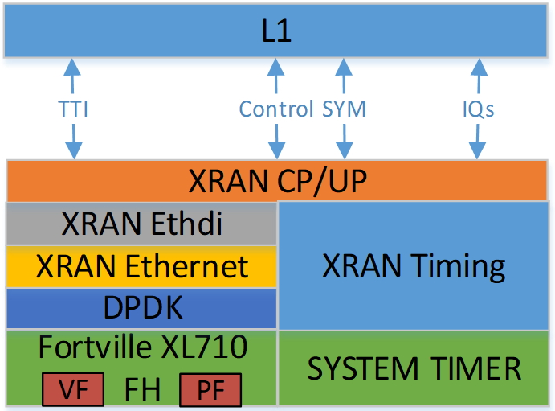

..    Copyright (c) 2019 Intel
..
..  Licensed under the Apache License, Version 2.0 (the "License");
..  you may not use this file except in compliance with the License.
..  You may obtain a copy of the License at
..
..      http://www.apache.org/licenses/LICENSE-2.0
..
..  Unless required by applicable law or agreed to in writing, software
..  distributed under the License is distributed on an "AS IS" BASIS,
..  WITHOUT WARRANTIES OR CONDITIONS OF ANY KIND, either express or implied.
..  See the License for the specific language governing permissions and
..  limitations under the License.

.. |br| raw:: html

    

xRAN Library Design
===================

.. contents::
    :depth: 3
    :local:

The xRAN Library consists of multiple modules where different
functionality is encapsulated. The complete list of all \*.c and \*.h
files as well as Makefile for xRAN (aka FHI Lib Bronze Release) release is:

├── app

│   ├── dpdk.sh

│   ├── gen_test.m

│   ├── Makefile

│   ├── src

│   │   ├── common.c

│   │   ├── common.h

│   │   ├── config.c

│   │   ├── config.h

│   │   ├── debug.h

│   │   ├── sample-app.c

│   │   └── xran_mlog_task_id.h

│   └── usecase

│       ├── cat_b

│       ├── lte_a

│       ├── lte_b

│       ├── mu0_10mhz

│       ├── mu0_20mhz

│       ├── mu0_5mhz

│       ├── mu1_100mhz

│       └── mu3_100mhz

├── banner.txt

├── build.sh

├── lib

│   ├── api

│   │   ├── xran_compression.h

│   │   ├── xran_compression.hpp

│   │   ├── xran_cp_api.h

│   │   ├── xran_fh_o_du.h

│   │   ├── xran_mlog_lnx.h

│   │   ├── xran_pkt_cp.h

│   │   ├── xran_pkt.h

│   │   ├── xran_pkt_up.h

│   │   ├── xran_sync_api.h

│   │   ├── xran_timer.h

│   │   ├── xran_transport.h

│   │   └── xran_up_api.h

│   ├── ethernet

│   │   ├── ethdi.c

│   │   ├── ethdi.h

│   │   ├── ethernet.c

│   │   └── ethernet.h

│   ├── Makefile

│   └── src

│       ├── xran_app_frag.c

│       ├── xran_app_frag.h

│       ├── xran_bfp_cplane16.cpp

│       ├── xran_bfp_cplane32.cpp

│       ├── xran_bfp_cplane64.cpp

│       ├── xran_bfp_cplane8.cpp

│       ├── xran_bfp_ref.cpp

│       ├── xran_bfp_utils.hpp

│       ├── xran_common.c

│       ├── xran_common.h

│       ├── xran_compression.cpp

│       ├── xran_cp_api.c

│       ├── xran_frame_struct.c

│       ├── xran_frame_struct.h

│       ├── xran_lib_mlog_tasks_id.h

│       ├── xran_main.c

│       ├── xran_printf.h

│       ├── xran_sync_api.c

│       ├── xran_timer.c

│       ├── xran_transport.c

│       ├── xran_ul_tables.c

│       └── xran_up_api.c

├── Licenses.txt

├── readme.md

└── test

    ├── common
    
    │   ├── common.cpp
    
    │   ├── common.hpp
    
    │   ├── common_typedef_xran.h
    
    │   ├── json.hpp
    
    │   ├── MIT_License.txt
    
    │   ├── xranlib_unit_test_main.cc
    
    │   └── xran_lib_wrap.hpp
    
    ├── master.py
    
    ├── readme.txt
    
    └── test_xran
    
        ├── chain_tests.cc
        
        ├── compander_functional.cc
        
        ├── conf.json
        
        ├── c_plane_tests.cc
        
        ├── init_sys_functional.cc
        
        ├── Makefile
        
        ├── prach_functional.cc
        
        ├── prach_performance.cc
        
        ├── unittests.cc
        
        └── u_plane_functional.cc

General Introduction
--------------------

The xRAN Library functionality is broken down into two main sections:

-  XRAN specific packet handling (src)

-  Ethernet and supporting functionality (Ethernet)

External functions and structures are available via set of header files
in the API folder.

This library depends on DPDK primitives to perform Ethernet networking
in userspace, including initialization and control of Ethernet ports.
Ethernet ports are expected to be SRIOV virtual functions (VF) but also
can be physical functions (PF) as well.

This library is expected to be included in the project via
xran_fh_o_du.h, statically compiled and linked with the L1 application
as well as DPDK libraries. The xRAN packet processing-specific
functionality is encapsulated into this library and not exposed to the
rest of the 5G NR pipeline. 

This way, xRAN specific changes are decoupled from the 5G NR L1
pipeline. As a result, the design and implementation of the 5G L1
pipeline code and xRAN library can be done in parallel, provided the
defined interface is not modified.

Ethernet consists of two modules:

-  Ethernet implements xRAN specific HW Ethernet initialization, close,
   send and receive

-  ethdi provides Ethernet level software primitives to handle xRAN
   packet exchange

The xRAN layer implements the next set of functionalities:

-  Common code specific for both C-plane and U-plane as well as TX and
   RX

-  Implementation of C-plane API available within the library and
   externally

-  The primary function where general library initialization and
   configuration performed

-  Module to provide the status of PTP synchronization

-  Timing module where system time is polled

-  eCPRI specific transport layer functions

-  APIs to handle U-plane packets

-  A set of utility modules for debugging (printf) and data tables are
   included as well.

Figure 24. Illustration of xRAN Sublayers

A detailed description of functions and input/output arguments, as well
as key data structures, can be found in the Doxygen file for the FlexRAN
5G NR release. In this document supplemental information is provided
with respect to the overall design and implementation assumptions.

Initialization and Close
------------------------

An example of the initialization sequence can be found in the sample
application code. It consists of the following steps:

1.Setup structure struct xran_fh_init according to configuration.

2.Call xran_init() to instantiate the xRAN lib memory model and
threads. The function returns a pointer to xRAN handle which is used
for consecutive configuration functions.

3.Initialize memory buffers used for L1 and xRAN exchange of
information.

4.Assign callback functions for (one) TTI event and for the reception
of half of the slot of symbols (7 symbols) and Full slot of symbols
14 symbols).

5.Call xran_open() to initialize PRACH configuration, initialize DPDK,
and launch xRAN timing thread.

6.Call xran_start() to start processing xRAN packets for DL and UL.

After this is complete 5G L1 runs with xRAN Front haul interface. During
run time for every TTI event, the corresponding call back is called. For
packet reception on UL direction, the corresponding call back is called.
OTA time information such as frame id, subframe id and slot id can be
obtained as result synchronization of the L1 pipeline to GPS time is
performed.

To stop and close the interface, perform this sequence of steps:

7.Call xran_stop() to stop the processing of DL and UL.

8.Call xran_close() to remove usage of xRAN resources.

9.Call xran_mm_destroy() to destroy memory management subsystem.

After this session is complete, a restart of the full L1 application is
required. The current version of the library does not support multiple
sessions without a restart of the full L1 application.

Configuration
~~~~~~~~~~~~~

The xRAN library configuration is provided in the set of structures, such as struct xran_fh_init and struct xran_fh_config. 
The sample application gives an example of a test configuration used for LTE and 5GNR mmWave and Sub 6. Sample application
folder /app/usecase/ contains set of examples for different Radio Access technology  (LTE|5G NR), different category  (A|B)
and list of numerologies (0,1,3) and list of bandwidths (5,10,20,100Mhz).

Some configuration options are not used in the Bronze Release and are reserved
for future use.

The following options are available: 

**Structure** struct xran_fh_init\ **:**

-  Number of CC and corresponding settings for each

-  Core allocation for xRAN

-  Ethernet port allocation

-  O-DU and RU Ethernet Mac address

-  Timing constraints of O-DU and 0-RU

-  Debug features

**Structure** struct xran_fh_config\ **:**

-  Number of eAxC

-  TTI Callback function and parameters

-  PRACH 5G NR specific settings

-  TDD frame configuration

-  BBU specific configuration

-  RU specific configuration

**From an implementation perspective:**

xran_init() performs init of the xRAN library and interface according to
struct xran_fh_init information as per the start of application
configuration.:

-  Init DPDK with corresponding networking ports and core assignment

-  Init mbuf pools

-  Init DPDK timers and DPDK rings for internal packet processing

-  Instantiate ORAN FH thread doing

   -  Timing processing (xran_timing_source_thread())

   -  ETH PMD (process_dpdk_io())

   -  IO XRAN-PHY exchange (ring_processing_func())

**xran_open()** performs additional configuration as per run scenario:

-  PRACH configuration

-  C-plane initialization

The Function **xran_close()** performs free of resources and allows potential
restart of front haul interface with a different scenario.

Start/Stop
~~~~~~~~~~

The Functions **xran_start()/xran_stop()** enable/disable packet processing for
both DL and UL. This triggers execution of callbacks into the L1
application.

Data Exchange
~~~~~~~~~~~~~

Exchange of IQ samples, as well as C-plane specific information, is
performed using a set of buffers allocated by xRAN library from DPDK
memory and shared with the l1 application. Buffers are allocated as a
standard mbuf structure and DPDK pools are used to manage the allocation
and free resources. Shared buffers are allocated at the init stage and
are expected to be reused within 80 TTIs (10 ms).

The xRAN protocol requires U-plane IQ data to be transferred in network
byte order, and the L1 application handles IQ sample data in CPU byte
order, requiring a swap. The PHY BBU pooling tasks perform copy and byte
order swap during packet processing.

C-plane Information Settings
~~~~~~~~~~~~~~~~~~~~~~~~~~~~

The interface between the xRAN library and PHY is defined via struct
xran_prb_map and similar to the data plane. The same mbuf memory is used
to allocate memory map of PRBs for each TTI.

/\* Beamforming waights for single stream for each PRBs  given number of Antenna elements \*/
struct xran_cp_bf_weight{

    int16_t nAntElmTRx;        /\*< num TRX for this allocation \*/
    int8_t*  p_ext_start;      /\*< pointer to start of buffer for full C-plane packet \*/
    int8_t*  p_ext_section;    /\*< pointer to form extType \*/
    int16_t  ext_section_sz;   /\*< extType section size \*/

/\* section descriptor for given number of PRBs used on U-plane packet creation \*/
struct xran_section_desc {

    uint16_t section_id; /\*< section id used for this element \*/

    int16_t iq_buffer_offset;    /\*< Offset in bytes for the content of IQs with in main symb buffer \*/
    int16_t iq_buffer_len;       /\*< Length in bytes for the content of IQs with in main symb buffer \*/

    uint8_t \*pData;      /\*< optional pointer to data buffer \*/
    void    \*pCtrl;      /\*< optional poitner to mbuf \*/
    
};

struct xran_prb_elm {
    int16_t nRBStart;    /\*< start RB of RB allocation \*/
    int16_t nRBSize;     /\*< number of RBs used \*/
    int16_t nStartSymb;  /\*< start symbol ID \*/
    int16_t numSymb;     /\\*< number of symbols \*/
    int16_t nBeamIndex;  /\*< beam index for given PRB \*/
    int16_t bf_weight_update; /\* need to update beam weights or not \*/
    int16_t compMethod;  /\*< compression index for given PRB \*/
    int16_t iqWidth;     /\*< compression bit width for given PRB \*/
    int16_t BeamFormingType; /\*< index based, weights based or attribute based beam forming\*/

    struct xran_section_desc * p_sec_desc[XRAN_NUM_OF_SYMBOL_PER_SLOT]; /\*< section desctiptors to U-plane data given RBs \*/
    struct xran_cp_bf_weight   bf_weight; /\*< beam forming information relevant for given RBs \*/

    union {
        struct xran_cp_bf_attribute bf_attribute;
        struct xran_cp_bf_precoding bf_precoding;
        
    };
    
/\* PRB map structure \*/

struct xran_prb_map {
    uint8_t   dir;        /\*< DL or UL direction \*/
    uint8_t   xran_port;  /\*< xran id of given RU [0-(XRAN_PORTS_NUM-1)] \*/
    uint16_t  band_id;    /\*< xran band id \*/
    uint16_t  cc_id;      /\*< componnent carrier id [0 - (XRAN_MAX_SECTOR_NR-1)] \*/
    uint16_t  ru_port_id; /\*< RU device antenna port id [0 - (XRAN_MAX_ANTENNA_NR-1) \*/
    uint16_t  tti_id;     /\*< xRAN slot id [0 - (max tti-1)] \*/
    uint8_t   start_sym_id;     /\*< start symbol Id [0-13] \*/
    uint32_t  nPrbElm;    /\*< total number of PRB elements for given map [0- (XRAN_MAX_PRBS-1)] \*/
    struct xran_prb_elm prbMap[XRAN_MAX_PRBS];
    
};

For the Bronze release C-plane sections are expected to be provided by L1
pipeline. If 100% of RBs always allocated single element of RB map
is expected to be allocated across all symbols. Dynamic RB allocation is
performed base on C-plane configuration.

The xRAN library will require that the content of the PRB map should be
sorted in increasing order of PRB first and then symbols.

Memory Management
-----------------

Memory used for the exchange of IQ data as well as control information,
is controlled by the xRAN library. L1 application at the init stage
performs:

-  init memory management subsystem

-  init buffer management subsystem (via DPDK pools)

-  allocate buffers (mbuf) for each CC, antenna, symbol, and direction \
   (DL, UL, PRACH) for XRAN_N_FE_BUF_LEN TTIs.

-  buffers are reused for every XRAN_N_FE_BUF_LEN TTIs

After the session is completed, the application can free buffers and
destroy the memory management subsystem.

From an implementation perspective, the xRAN library uses a standard
mbuf primitive and allocates a pool of buffers for each sector. This
function is performed using rte_pktmbuf_pool_create(),
rte_pktmbuf_alloc(), rte_pktmbuf_append() to allocate one buffer per
symbol for the mmWave case. More information on mbuf and DPDK pools can
be found in the DPDK documentation.

In the current implementation, mbuf, the number of buffers shared with
the L1 application is the same number of buffers used to send to and
receive from the Ethernet port. Memory copy operations are not required
if the packet size is smaller than or equal to MTU. Future versions of
the xRAN library are required to remove the memory copy requirement for
packets where the size larger than MTU.

External Interface Memory
~~~~~~~~~~~~~~~~~~~~~~~~~

The xRAN library header file defines a set of structures to simplify
access to memory buffers used for IQ data.

struct xran_flat_buffer {

uint32_t nElementLenInBytes;

uint32_t nNumberOfElements;

uint32_t nOffsetInBytes;

uint32_t nIsPhyAddr;

uint8_t \*pData;

void \*pCtrl;

};

struct xran_buffer_list {

uint32_t nNumBuffers;

struct xran_flat_buffer \*pBuffers;

void \*pUserData;

void \*pPrivateMetaData;

};

typedef struct {

int32_t bValid ;

int32_t nSegToBeGen;

int32_t nSegGenerated;

int32_t nSegTransferred;

struct rte_mbuf \*pData[N_MAX_BUFFER_SEGMENT];

struct xran_buffer_list sBufferList;

} BbuIoBufCtrlStruct;

There is no explicit requirement for user to organize a set of buffers
in this particular way. From a compatibility |br|
perspective it is useful to
follow the existing design of the 5G NR l1app used for Front Haul FPGA
and define structures shared between l1 and xRAN lib as shown:

/\* io struct \*/

BbuIoBufCtrlStruct
sFrontHaulTxBbuIoBufCtrl[XRAN_N_FE_BUF_LEN][XRAN_MAX_SECTOR_NR]\
[XRAN_MAX_ANTENNA_NR];

BbuIoBufCtrlStruct
sFrontHaulTxPrbMapBbuIoBufCtrl[XRAN_N_FE_BUF_LEN][XRAN_MAX_SECTOR_NR][XRAN_MAX_ANTENNA_NR];

BbuIoBufCtrlStruct
sFrontHaulRxBbuIoBufCtrl[XRAN_N_FE_BUF_LEN][XRAN_MAX_SECTOR_NR][XRAN_MAX_ANTENNA_NR];

BbuIoBufCtrlStruct
sFrontHaulRxPrbMapBbuIoBufCtrl[XRAN_N_FE_BUF_LEN][XRAN_MAX_SECTOR_NR][XRAN_MAX_ANTENNA_NR];

BbuIoBufCtrlStruct
sFHPrachRxBbuIoBufCtrl[XRAN_N_FE_BUF_LEN][XRAN_MAX_SECTOR_NR][XRAN_MAX_ANTENNA_NR];

/\* Cat B \*/

BbuIoBufCtrlStruct
sFHSrsRxBbuIoBufCtrl[XRAN_N_FE_BUF_LEN][XRAN_MAX_SECTOR_NR][XRAN_MAX_ANT_ARRAY_ELM_NR];

/\* buffers list \*/

struct xran_flat_buffer
sFrontHaulTxBuffers[XRAN_N_FE_BUF_LEN][XRAN_MAX_SECTOR_NR][XRAN_MAX_ANTENNA_NR][XRAN_NUM_OF_SYMBOL_PER_SLOT];

struct xran_flat_buffer
sFrontHaulTxPrbMapBuffers[XRAN_N_FE_BUF_LEN][XRAN_MAX_SECTOR_NR][XRAN_MAX_ANTENNA_NR][XRAN_NUM_OF_SYMBOL_PER_SLOT];

struct xran_flat_buffer
sFrontHaulRxBuffers[XRAN_N_FE_BUF_LEN][XRAN_MAX_SECTOR_NR][XRAN_MAX_ANTENNA_NR][XRAN_NUM_OF_SYMBOL_PER_SLOT];

struct xran_flat_buffer
sFrontHaulRxPrbMapBuffers[XRAN_N_FE_BUF_LEN][XRAN_MAX_SECTOR_NR][XRAN_MAX_ANTENNA_NR][XRAN_NUM_OF_SYMBOL_PER_SLOT];

struct xran_flat_buffer
sFHPrachRxBuffers[XRAN_N_FE_BUF_LEN][XRAN_MAX_SECTOR_NR][XRAN_MAX_ANTENNA_NR][XRAN_NUM_OF_SYMBOL_PER_SLOT];

/\* Cat B SRS buffers \*/

struct xran_flat_buffer
sFHSrsRxBuffers[XRAN_N_FE_BUF_LEN][XRAN_MAX_SECTOR_NR][XRAN_MAX_ANT_ARRAY_ELM_NR][XRAN_MAX_NUM_OF_SRS_SYMBOL_PER_SLOT];

Doxygen file and xran_fh_o_du.h provide more details on the definition
and usage of these structures.

xRAN Specific Functionality
---------------------------

Front haul interface implementation in the general case is abstracted
away using the interface defined in xran_fh_o_du.h

The L1 application is not required to access xRAN protocol primitives
(eCPRI header, application header, and others) directly. It is
recommended to use the interface to remove dependencies between
different software modules such as the l1 pipeline and xRAN library.

External API
~~~~~~~~~~~~

The U-plane and C-plane APIs can be used directly from the application
if such an option is required. The set of header files can be exported
and called directly.

xran_fh_o_du.h – xRAN main header file for O-DU scenario

xran_cp_api.h – Control plane functions

xran_pkt_cp.h – xRAN control plane packet definition

xran_pkt.h – xRAN packet definition

xran_pkt_up.h – xRAN User plane packet definition

xran_sync_api.h – api functions to check PTP status

xran_timer.h – API for timing

xran_transport.h – eCPRI transport layer definition and api

xran_up_api.h – user plane functions and definitions

xran_compression.h – interface to compression/decompression functions

Doxygen files provide detailed information on functions and structures
available.

.. _c-plane-1:

C-plane
~~~~~~~

Implementation of the C-plane set of functions is defined in
xran_cp_api.c and is used to prepare the content of C-plane packets
according to the given configuration. Users can enable/disable
generation of C-plane messages using enableCP field in struct
xran_fh_init structure during init of ORAN front haul. The time of
generation of C-plane message for DL and UL is done “Slot-based,” and
timing can be controlled using O-DU settings according to Table 4.

The C-plane module contains:

-  initialization of C-plane database to keep track of allocation of
   resources

-  code to prepare C-plane packet for TX (O-DU)

-  eCPRI header

-  append radio application header

-  append control section header

-  append control section

-  parser of C-plane packet for RX (O-RU emulation)

-  parses and checks Section 1 and Section 3 packet content

Sending and receiving packets is performed using xRAN ethdi sublayer
functions.

Creating a C-Plane Packet
^^^^^^^^^^^^^^^^^^^^^^^^^

API and Data Structures
'''''''''''''''''''''''

A C-Plane message can be composed using the following API:

int xran_prepare_ctrl_pkt(struct rte_mbuf \*mbuf,

struct xran_cp_gen_params \*params,

uint8_t CC_ID, uint8_t Ant_ID, uint8_t seq_id);

mbuf is the pointer of a DPDK packet buffer, which is allocated from the
caller.

params are the pointer of the structure which has the parameters to
create the message.

CC_ID is the parameter to specify component carrier index, Ant_ID is the
parameters to specify the antenna port index (RU port index).

seq_id is the sequence index for the message.

params, the parameters to create a C-Plane message are defined as the
structure of xran_cp_gen_params with an |br|
example given below:

struct xran_cp_gen_params {

uint8_t dir;

uint8_t sectionType;

uint16_t numSections;

struct xran_cp_header_params hdr;

struct xran_section_gen_info \*sections;

};

dir is the direction of the C-Plane message to be generated. Available
parameters are defined as XRAN_DIR_UL and XRAN_DIR_DL.

sectionType is the section type for C-Plane message to generate, as ORAN
specification defines all sections in a C-Plane message shall have the
same section type. If different section types are required, they shall
be sent with separate C-Plane messages. Available types of sections are
defined as XRAN_CP_SECTIONTYPE_x. Please refer to the Table 5-2 Section
Types in chapter 5.4 of ORAN specification.

numSections is the total number of sections to generate, i.e., the
number of the array in sections (struct xran_section_gen_info).

hdr is the structure to hold the information to generate the radio
application and section header in the C-Plane message. It is defined as
the structure of xran_cp_header_params. Not all parameters in this
structure are used for the generation, and the required parameters are
slightly different by the type of section, as described in Table 10 and
Table 11.

Table 10. struct xran_cp_header_params – Common Radio Application Header

+------------+---------------------------------------------+---------+
|            | Description                                 | Remarks |
+============+=============================================+=========+
| filterIdx  | Filter Index. Available values are defined  | 5.4.4.3 |
|            | as XRAN_FILTERINDEX_xxxxx.                  |         |
+------------+---------------------------------------------+---------+
| frameId    | Frame Index. It is modulo 256 of frame      | 5.4.4.4 |
|            | number.                                     |         |
+------------+---------------------------------------------+---------+
| subframeId | Sub-frame Index.                            | 5.4.4.5 |
+------------+---------------------------------------------+---------+
| slotId     | Slot Index. The maximum number is 15, as    | 5.4.4.6 |
|            | defined in the specification.               |         |
+------------+---------------------------------------------+---------+
| startSymId | Start Symbol Index.                         | 5.4.4.7 |
+------------+---------------------------------------------+---------+

Table 11. struct xran_cp_header_params – Section Specific Parameters

+----------+----------+----------+---------+---+---+---+---+----------+
|          | Des\     | Section  | Remarks |   |   |   |   |          |
|          | cription | Type     |         |   |   |   |   |          |
|          |          | ap\      |         |   |   |   |   |          |
|          |          | plicable |         |   |   |   |   |          |
+==========+==========+==========+=========+===+===+===+===+==========+
|          |          | 0        | 1       | 3 | 5 | 6 | 7 |          |
+----------+----------+----------+---------+---+---+---+---+----------+
| fftSize  | FFT size | X        |         | X |   |   |   | 5.4.4.13 |
|          | in frame |          |         |   |   |   |   |          |
|          | st\      |          |         |   |   |   |   |          |
|          | ructure. |          |         |   |   |   |   |          |
|          | A\       |          |         |   |   |   |   |          |
|          | vailable |          |         |   |   |   |   |          |
|          | values   |          |         |   |   |   |   |          |
|          | are      |          |         |   |   |   |   |          |
|          | defined  |          |         |   |   |   |   |          |
|          | as       |          |         |   |   |   |   |          |
|          | X\       |          |         |   |   |   |   |          |
|          | RAN_FFTS\|          |         |   |   |   |   |          |
|          | IZE_xxxx |          |         |   |   |   |   |          |
+----------+----------+----------+---------+---+---+---+---+----------+
| Scs      | Su\      | X        |         | X |   |   |   | 5.4.4.13 |
|          | bcarrier |          |         |   |   |   |   |          |
|          | Spacing  |          |         |   |   |   |   |          |
|          | in the   |          |         |   |   |   |   |          |
|          | frame    |          |         |   |   |   |   |          |
|          | st\      |          |         |   |   |   |   |          |
|          | ructure. |          |         |   |   |   |   |          |
|          | A\       |          |         |   |   |   |   |          |
|          | vailable |          |         |   |   |   |   |          |
|          | values   |          |         |   |   |   |   |          |
|          | are      |          |         |   |   |   |   |          |
|          | defined  |          |         |   |   |   |   |          |
|          | as       |          |         |   |   |   |   |          |
|          | XRAN_SCS\|          |         |   |   |   |   |          |          
|          | _xxxx    |          |         |   |   |   |   |          |
+----------+----------+----------+---------+---+---+---+---+----------+
| iqWidth  | I/Q bit  |          | X       | X | X |   |   | 5.4.4.10 |
|          | width in |          |         |   |   |   |   |          |
|          | user     |          |         |   |   |   |   | 6.3.3.13 |
|          | data     |          |         |   |   |   |   |          |
|          | com\     |          |         |   |   |   |   |          |
|          | pression |          |         |   |   |   |   |          |
|          | header.  |          |         |   |   |   |   |          |
|          | Should   |          |         |   |   |   |   |          |
|          | be set   |          |         |   |   |   |   |          |
|          | by zero  |          |         |   |   |   |   |          |
|          | for      |          |         |   |   |   |   |          |
|          | 16bits   |          |         |   |   |   |   |          |
+----------+----------+----------+---------+---+---+---+---+----------+
| compMeth | Com\     |          | X       | X | X |   |   | 5.4.4.10 |
|          | pression |          |         |   |   |   |   |          |
|          | Method   |          |         |   |   |   |   | 6.3.3.13 |
|          | in user  |          |         |   |   |   |   |          |
|          | data     |          |         |   |   |   |   |          |
|          | com\     |          |         |   |   |   |   |          |
|          | pression |          |         |   |   |   |   |          |
|          | header.  |          |         |   |   |   |   |          |
|          | A\       |          |         |   |   |   |   |          |
|          | vailable |          |         |   |   |   |   |          |
|          | values   |          |         |   |   |   |   |          |
|          | are      |          |         |   |   |   |   |          |
|          | defined  |          |         |   |   |   |   |          |
|          | as       |          |         |   |   |   |   |          |
|          | XRAN\    |          |         |   |   |   |   |          |
|          | _COMPMET\|          |         |   |   |   |   |          |
|          | HOD_xxxx |          |         |   |   |   |   |          |
+----------+----------+----------+---------+---+---+---+---+----------+
| numUEs   | Number   |          |         |   |   | X |   | 5.4.4.11 |
|          | of UEs.  |          |         |   |   |   |   |          |
|          | Applies  |          |         |   |   |   |   |          |
|          | to       |          |         |   |   |   |   |          |
|          | section  |          |         |   |   |   |   |          |
|          | type 6   |          |         |   |   |   |   |          |
|          | and not  |          |         |   |   |   |   |          |
|          | s\       |          |         |   |   |   |   |          |
|          | upported |          |         |   |   |   |   |          |
|          | in this  |          |         |   |   |   |   |          |
|          | release. |          |         |   |   |   |   |          |
+----------+----------+----------+---------+---+---+---+---+----------+
| ti\      | Time     | X        |         | X |   |   |   | 5.4.4.12 |
| meOffset | Offset.  |          |         |   |   |   |   |          |
|          | Time     |          |         |   |   |   |   |          |
|          | offset   |          |         |   |   |   |   |          |
|          | from the |          |         |   |   |   |   |          |
|          | start of |          |         |   |   |   |   |          |
|          | the slot |          |         |   |   |   |   |          |
|          | to start |          |         |   |   |   |   |          |
|          | of       |          |         |   |   |   |   |          |
|          | Cyclic   |          |         |   |   |   |   |          |
|          | Prefix.  |          |         |   |   |   |   |          |
+----------+----------+----------+---------+---+---+---+---+----------+
| cpLength | Cyclic   | X        |         | X |   |   |   | 5.4.4.14 |
|          | Prefix   |          |         |   |   |   |   |          |
|          | Length.  |          |         |   |   |   |   |          |
+----------+----------+----------+---------+---+---+---+---+----------+

**Only sections types 1 and 3 are supported in the current release.**

Sections are the pointer to the array of structure which has the
parameters for section(s) and it is defined as below:

struct xran_section_gen_info {

struct xran_section_info info;

uint32_t exDataSize;

struct {

uint16_t type;

uint16_t len;

void \*data;

} exData[XRAN_MAX_NUM_EXTENSIONS];

};

info is the structure to hold the information to generate section and it
is defined as the structure of xran_section_info. Like
xran_cp_header_params, all parameters are not required to generate
section and Table 12 describes which |br|
parameters are required for each
section.

Table 12. Parameters for Sections

+-------+-------+-------+-------+-------+-------+-------+-------+
|       | D\    | Se\   | Re\   |       |       |       |       |
|       | escri\| ction | marks |       |       |       |       |
|       | ption | Type  |       |       |       |       |       |
|       |       | appli\|       |       |       |       |       |
|       |       | cable |       |       |       |       |       |
+=======+=======+=======+=======+=======+=======+=======+=======+
|       |       | 0     | 1     | 3     | 5     | 6     |       |
+-------+-------+-------+-------+-------+-------+-------+-------+
| Id    | Se\   | **X** | **X** | **X** | **X** | **X** | 5.\   |
|       | ction |       |       |       |       |       | 4.5.1 |
|       | I\    |       |       |       |       |       |       |
|       | denti\|       |       |       |       |       |       |
|       | fier. |       |       |       |       |       |       |
+-------+-------+-------+-------+-------+-------+-------+-------+
| Rb    | Res\  | **X** | **X** | **X** | **X** | **X** | 5.\   |
|       | ource |       |       |       |       |       | 4.5.2 |
|       | Block\|       |       |       |       |       |       |
|       | Indic\|       |       |       |       |       |       |
|       | ator. |       |       |       |       |       |       |
|       | Avai\ |       |       |       |       |       |       |
|       | lable |       |       |       |       |       |       |
|       | v\    |       |       |       |       |       |       |
|       | alues |       |       |       |       |       |       |
|       | are   |       |       |       |       |       |       |
|       | de\   |       |       |       |       |       |       |
|       | fined |       |       |       |       |       |       |
|       | as    |       |       |       |       |       |       |
|       | XRAN\ |       |       |       |       |       |       |
|       | _\    |       |       |       |       |       |       |
|       | RBI\  |       |       |       |       |       |       |
|       | ND_xx\|       |       |       |       |       |       |
|       | xx.   |       |       |       |       |       |       |
+-------+-------+-------+-------+-------+-------+-------+-------+
| s\    | S\    | **X** | **X** | **X** | **X** | **X** | 5.\   |
| ymInc | ymbol |       |       |       |       |       | 4.5.3 |
|       | n\    |       |       |       |       |       |       |
|       | umber |       |       |       |       |       |       |
|       | Incr\ |       |       |       |       |       |       |
|       | ement |       |       |       |       |       |       |
|       | com\  |       |       |       |       |       |       |
|       | mand. |       |       |       |       |       |       |
|       | Avai\ |       |       |       |       |       |       |
|       | lable |       |       |       |       |       |       |
|       | v\    |       |       |       |       |       |       |
|       | alues |       |       |       |       |       |       |
|       | are   |       |       |       |       |       |       |
|       | de\   |       |       |       |       |       |       |
|       | fined |       |       |       |       |       |       |
|       | as    |       |       |       |       |       |       |
|       | XRA\  |       |       |       |       |       |       |
|       | N_SYM\|       |       |       |       |       |       |
|       | BOL\  |       |       |       |       |       |       |
|       | NUMBE\|       |       |       |       |       |       |
|       | R_xx\ |       |       |       |       |       |       |
|       | xx.   |       |       |       |       |       |       |
+-------+-------+-------+-------+-------+-------+-------+-------+
| star\ | Sta\  | **X** | **X** | **X** | **X** | **X** | 5.\   |
| tPrbc | rting\|       |       |       |       |       | 4.5.4 |
|       | PRB   |       |       |       |       |       |       |
|       | of    |       |       |       |       |       |       |
|       | data  |       |       |       |       |       |       |
|       | se\   |       |       |       |       |       |       |
|       | ction |       |       |       |       |       |       |
|       | de\   |       |       |       |       |       |       |
|       | scrip\|       |       |       |       |       |       |
|       | tion. |       |       |       |       |       |       |
+-------+-------+-------+-------+-------+-------+-------+-------+
| nu    | The   | **X** | **X** | **X** | **X** | **X** | 5.\   |
| mPrbc | n\    |       |       |       |       |       | 4.5.6 |
|       | umber |       |       |       |       |       |       |
|       | of    |       |       |       |       |       |       |
|       | conti\|       |       |       |       |       |       |
|       | guous |       |       |       |       |       |       |
|       | PRBs  |       |       |       |       |       |       |
|       | per   |       |       |       |       |       |       |
|       | data  |       |       |       |       |       |       |
|       | se\   |       |       |       |       |       |       |
|       | ction |       |       |       |       |       |       |
|       | de\   |       |       |       |       |       |       |
|       | scrip\|       |       |       |       |       |       |
|       | tion. |       |       |       |       |       |       |
|       | When  |       |       |       |       |       |       |
|       | nu\   |       |       |       |       |       |       |
|       | mPrbc |       |       |       |       |       |       |
|       | is    |       |       |       |       |       |       |
|       | gr\   |       |       |       |       |       |       |
|       | eater |       |       |       |       |       |       |
|       | than  |       |       |       |       |       |       |
|       | 255,  |       |       |       |       |       |       |
|       | it    |       |       |       |       |       |       |
|       | will  |       |       |       |       |       |       |
|       | be    |       |       |       |       |       |       |
|       | conv\ |       |       |       |       |       |       |
|       | erted |       |       |       |       |       |       |
|       | to    |       |       |       |       |       |       |
|       | zero  |       |       |       |       |       |       |
|       | by    |       |       |       |       |       |       |
|       | the   |       |       |       |       |       |       |
|       | macro |       |       |       |       |       |       |
|       | (XR\  |       |       |       |       |       |       |
|       | AN_CO\|       |       |       |       |       |       |
|       | NVERT\|       |       |       |       |       |       |
|       | _NUMP\|       |       |       |       |       |       |
|       | RBC). |       |       |       |       |       |       |
+-------+-------+-------+-------+-------+-------+-------+-------+
| r\    | Res\  | **X** | **X** | **X** | **X** |       | 5.\   |
| eMask | ource\|       |       |       |       |       | 4.5.5 |
|       | El\   |       |       |       |       |       |       |
|       | ement\|       |       |       |       |       |       |
|       | Mask. |       |       |       |       |       |       |
+-------+-------+-------+-------+-------+-------+-------+-------+
| numS\ | N\    | **X** | **X** | **X** | **X** |       | 5.\   |
| ymbol | umber |       |       |       |       |       | 4.5.7 |
|       | of    |       |       |       |       |       |       |
|       | Sym\  |       |       |       |       |       |       |
|       | bols. |       |       |       |       |       |       |
+-------+-------+-------+-------+-------+-------+-------+-------+
| b\    | Beam\ |       | **X** | **X** |       |       | 5.\   |
| eamId | I\    |       |       |       |       |       | 4.5.9 |
|       | denti\|       |       |       |       |       |       |
|       | fier. |       |       |       |       |       |       |
+-------+-------+-------+-------+-------+-------+-------+-------+
| freqO\| Freq\ |       |       | **X** |       |       | 5.4\  |
| ffset | uency\|       |       |       |       |       | .5.11 |
|       | Of\   |       |       |       |       |       |       |
|       | fset. |       |       |       |       |       |       |
+-------+-------+-------+-------+-------+-------+-------+-------+
| ueId  | UE\   |       |       |       | **X** | **X** | 5.4\  |
|       | i\    |       |       |       |       |       | .5.10 |
|       | denti\|       |       |       |       |       |       |
|       | fier. |       |       |       |       |       |       |
|       | Not   |       |       |       |       |       |       |
|       | supp\ |       |       |       |       |       |       |
|       | orted |       |       |       |       |       |       |
|       | in    |       |       |       |       |       |       |
|       | this  |       |       |       |       |       |       |
|       | rel\  |       |       |       |       |       |       |
|       | ease. |       |       |       |       |       |       |
+-------+-------+-------+-------+-------+-------+-------+-------+
| regF\ | Regu\ |       |       |       |       | **X** | 5.4\  |
| actor | lariz\|       |       |       |       |       | .5.12 |
|       | ation |       |       |       |       |       |       |
|       | Fa\   |       |       |       |       |       |       |
|       | ctor. |       |       |       |       |       |       |
|       | Not   |       |       |       |       |       |       |
|       | supp\ |       |       |       |       |       |       |
|       | orted |       |       |       |       |       |       |
|       | in    |       |       |       |       |       |       |
|       | this  |       |       |       |       |       |       |
|       | re\   |       |       |       |       |       |       |
|       | lease |       |       |       |       |       |       |
+-------+-------+-------+-------+-------+-------+-------+-------+
| Ef    | Exte\ |       | **X** | **X** | **X** | **X** | 5.\   |
|       | nsion |       |       |       |       |       | 4.5.8 |
|       | Flag. |       |       |       |       |       |       |
|       | Not   |       |       |       |       |       |       |
|       | supp\ |       |       |       |       |       |       |
|       | orted |       |       |       |       |       |       |
|       | in    |       |       |       |       |       |       |
|       | this  |       |       |       |       |       |       |
|       | rel\  |       |       |       |       |       |       |
|       | ease. |       |       |       |       |       |       |
+-------+-------+-------+-------+-------+-------+-------+-------+

**Only sections types 1 and 3 are supported in the current release.**

**The xran_section_info has more parameters – type, startSymId, iqWidth,
compMeth. These are the same parameters as those of radio application
or section header but need to be copied into this structure again for
the section data base.**

exDataSize and exData are used to add section extensions for the
section.

exDataSize is the number of elements in the exData array. The maximum
number of elements is defined as XRAN_MAX_NUM_EXTENSIONS and it is
defined by four in this release with the assumption that four different
types of section extensions can be added to a section (section extension
type 3 is excluded since it is not supported). exData.type is the type
of section extension and exData.len is the length of structure of
section extension parameter in exData.data. exData.data is the pointer
to the structure of section extensions and different structures are used
by the type of section extensions like below.

struct xran_sectionext1_info {

uint16_t rbNumber; /* number RBs to ext1 chain \*/

uint16_t bfwNumber; /* number of bf weights in this section \*/

uint8_t bfwiqWidth;

uint8_t bfwCompMeth;

int16_t \*p_bfwIQ; /* pointer to formed section extention \*/

int16_t bfwIQ_sz; /* size of buffer with section extention information
\*/

union {

uint8_t exponent;

uint8_t blockScaler;

uint8_t compBitWidthShift;

uint8_t activeBeamspaceCoeffMask[XRAN_MAX_BFW_N]; /\* ceil(N/8)*8,
should be multiple of 8 \*/

} bfwCompParam;

};

For section extension type 1, the structure of xran_sectionext1_info is
used. Please note that the xRAN library will use bfwIQ (beamforming
weight) as-is, i.e., xRAN library will not perform the compression, so
the user should provide proper data to bfwIQ.

struct xran_sectionext2_info {

uint8_t bfAzPtWidth;

uint8_t bfAzPt;

uint8_t bfZePtWidth;

uint8_t bfZePt;

uint8_t bfAz3ddWidth;

uint8_t bfAz3dd;

uint8_t bfZe3ddWidth;

uint8_t bfZe3dd;

uint8_t bfAzSI;

uint8_t bfZeSI;

};

For section extension type 2, the structure of xran_sectionext2_info is
used. Each parameter will be packed as specified bit width.

struct xran_sectionext4_info {

uint8_t csf;

uint8_t pad0;

uint16_t modCompScaler;

};

For section extension type 4, the structure of xran_sectionext4_info is
used.

struct xran_sectionext5_info {

uint8_t num_sets;

struct {

uint16_t csf;

uint16_t mcScaleReMask;

uint16_t mcScaleOffset;

} mc[XRAN_MAX_MODCOMP_ADDPARMS];

};

For section extension type 5, the structure of xran_sectionext5_info is
used. Please note that current implementation supports maximum two sets
of additional parameters.

**Section extensions type 3 is not supported since it is LTE specific.**

Section Extensions are not fully verified in this release.

Detail Procedures in API
''''''''''''''''''''''''

xran_prepare_ctrl_pkt() has several procedures to compose a C-Plane
packet.

1. Append transport header

-  Reserve eCPRI header space in the packet buffer

-  eCPRI version is fixed by XRAN_ECPRI_VER (0x0001)

-  Concatenation and transport layer fragmentation is not supported.

   ecpri_concat=0, ecpri_seq_id.sub_seq_id=0 and ecpri_seq_id.e_bit=1

-  The caller needs to provide a component carrier index, antenna index,
   and message identifier through function arguments.

   CC_ID, Ant_ID and seq_id

-  ecpriRtcid (ecpri_xtc_id) is composed with CC_ID and Ant_ID by
   xran_compose_cid.

-  DU port ID and band sector ID are fixed by zero in this release.

-  The output of xran_compose_cid is stored in network byte order.

-  The length of the payload is initialized by zero.

2. Append radio application header:

-  xran_append_radioapp_header() checks the type of section through
   params->sectionType and determines proper function to append
   remaining header components.

-  Only section type 1 and 3 are supported, returns
   XRAN_STATUS_INVALID_PARAM for other types.

-  Each section uses a different function to compose the remaining
   header and size to calculate the total length in the transport
   header.

For section type 1, xran_prepare_section1_hdr() and sizeof(struct
xran_cp_radioapp_section1_header)

For section type 3, xran_prepare_section3_hdr() and sizeof(struct
xran_cp_radioapp_section3_header)

-  Reserves the space of common radio application header and composes
   header by xran_prepare_radioapp_common_header().

-  The header is stored in network byte order.

-  Appends remaining header components by the selected function above

-  The header is stored in network byte order

3. Append section header and section

-  xran_append_control_section() determines proper size and function to
   append section header and contents.

-  For section type 1, xran_prepare_section1() and sizeof(struct
   xran_cp_radioapp_section1)

-  For section type 3, xran_prepare_section3() and sizeof(struct
   xran_cp_radioapp_section3)

-  Appends section header and section(s) by selected function above.

-  If multiple sections are configured, then those will be added.

-  Since fragmentation is not considered in this implementation, the
   total length of a single C-Plane message shall not exceed MTU
   size.

-  The header and section(s) are stored in network byte order.

-  Appends section extensions if it is set (ef=1)

-  xran_append_section_extensions() adds all configured extensions by
   its type.

-  xran_prepare_sectionext_x() (x = 1,2,4,5) will be called by the
   type from xran_append_section_extensions() and these functions
   will create extension field.

**Example Usage of API**
''''''''''''''''''''''''

There are two reference usages of API to generate C-Plane message in
lib/src/xran_common.c

-  generate_cpmsg_dlul()

-  generate_cpmsg_prach()

generate_cpmsg_dlul() is to generate the C-Plane message with section
type 1 for DL or UL symbol data scheduling.

This function has hardcoded values for some parameters such as:

-  The filter index is fixed to XRAN_FILTERINDEX_STANDARD.

-  RB indicator is fixed to XRAN_RBIND_EVERY.

-  Symbol increment is not used (XRAN_SYMBOLNUMBER_NOTINC)

-  Resource Element Mask is fixed to 0xfff

The extension is not used.

After C-Plane message generation, API send_cpmsg() is called. This
function also includes the implementation for these capabilities:

-  Send the generated packet to the TX ring after adding an Ethernet
   header.

-  Add section information of generated C-Plane packet to section
   database, to generate U-plane message by C-Plane configuration

send_cpmsg_prach() is to generate the C-Plane message with section type
3 for PRACH scheduling.

This functions also has some hardcoded values for the following
parameters:

-  RB indicator is fixed to XRAN_RBIND_EVERY.

-  Symbol increment is not used (XRAN_SYMBOLNUMBER_NOTINC).

-  Resource Element Mask is fixed to 0xfff.

And similar to generate_cpmsg_dlul(), after this function generates the
message, send_cpmsg() sends the generated packet to the TX ring and adds
section information of the packet to the section database. Checking and
parsing received PRACH symbol data by section information from the
C-Plane are not implemented in this release.

Example Configuration of C-Plane Messages
'''''''''''''''''''''''''''''''''''''''''

C-Plane messages can be composed through API, and the sample application
shows several reference usages of the configuration for different
numerologies.

Below are the examples of C-Plane message configuration with a sample
application for mmWave – numerology 3, 100 MHz bandwidth, TDD (DDDS)

**C-Plane Message – downlink symbol data for a downlink slot**

-  Single CP message with the single section of section type 1

-  Configures single CP message for all consecutive downlink symbols

-  Configures whole RBs (66) for a symbol

-  Compression and beamforming are not used

Common Header Fields::

- dataDirection = XRAN_DIR_DL
- payloadVersion = XRAN_PAYLOAD_VER
- filterIndex = XRAN_FILTERINDEX_STANDARD
- frameId = [0..99]
- subframeId = [0..9]
- slotID = [0..9]
- startSymbolid = 0
- numberOfsections = 1
- sectionType = XRAN_CP_SECTIONTYPE_1
- udCompHdr.idIqWidth = 0
- udCompHdr.udCompMeth = XRAN_COMPMETHOD_NONE
- reserved = 0

Section Fields::

- sectionId = [0..4095]
- rb = XRAN_RBIND_EVERY
- symInc = XRAN_SYMBOLNUMBER_NOTINC 
- startPrbc = 0
- numPrbc = 66
- reMask = 0xfff
- numSymbol = 14
- ef = 0
- beamId = 0

**C-Plane Message – uplink symbol data for uplink slot**

-  Single CP message with the single section of section type 1

-  Configures single CP message for all consecutive uplink symbols (UL
   symbol starts from 3)

-  Configures whole RBs (66) for a symbol

-  Compression and beamforming are not used

Common Header Fields::

- dataDirection = XRAN_DIR_UL
- payloadVersion = XRAN_PAYLOAD_VER
- filterIndex = XRAN_FILTERINDEX_STANDARD
- frameId = [0..99]
- subframeId = [0..9]
- slotID = [0..9]
- startSymbolid = 3
- numberOfsections = 1
- sectionType = XRAN_CP_SECTIONTYPE_1
- udCompHdr.idIqWidth = 0
- udCompHdr.udCompMeth = XRAN_COMPMETHOD_NONE
- reserved = 0

Section Fields::

- sectionId = [0..4095]
- rb = XRAN_RBIND_EVERY
- symInc = XRAN_SYMBOLNUMBER_NOTINC 
- startPrbc = 0
- numPrbc = 66
- reMask = 0xfff
- numSymbol = 11
- ef = 0
- beamId = 0

**C-Plane Message – PRACH**

-  Single CP message with the single section of section type 3 including
   repetition

-  Configures PRACH format A3, config index 81, and detail parameters
   are:

-  Filter Index : 3

-  CP length : 0

-  Time offset : 2026

-  FFT size : 1024

-  Subcarrier spacing : 120KHz

-  Start symbol index : 7

-  Number of symbols : 6

-  Number of PRBCs : 12

-  Frequency offset : -792

-  Compression and beamforming are not used

Common Header Fields::

-  dataDirection = XRAN_DIR_UL
-  payloadVersion = XRAN_PAYLOAD_VER
-  filterIndex = XRAN_FILTERINDEPRACH_ABC
-  frameId = [0,99]
-  subframeId = [0,3]
-  slotID = 3 or 7
-  startSymbolid = 7
-  numberOfSections = 1
-  sectionType = XRAN_CP_SECTIONTYPE_3
-  timeOffset = 2026
-  frameStructure.FFTSize = XRAN_FFTSIZE_1024
-  frameStructure.u = XRAN_SCS_120KHZ
-  cpLength = 0
-  udCompHdr.idIqWidth = 0
-  udCompHdr.udCompMeth = XRAN_COMPMETHOD_NONE

Section Fields::

- sectionId = [0..4095]
- rb = XRAN_RBIND_EVERY
- symInc = XRAN_SYMBOLNUMBER_NOTINC 
- startPrbc = 0
- numPrbc = 12
- reMask = 0xfff
- numSymbol = 6
- ef = 0
- beamId = 0
- frequencyOffset = -792
- reserved

Functions to Store/Retrieve Section Information
^^^^^^^^^^^^^^^^^^^^^^^^^^^^^^^^^^^^^^^^^^^^^^^

There are several functions to store/retrieve section information of
C-Plane messages. Since U-plane messages must be generated by the
information in the sections of a C-Plane message, it is required to
store and retrieve section information.

**APIs and Data Structure**
'''''''''''''''''''''''''''

APIs for initialization and release storage are:

-  int xran_cp_init_sectiondb(void \*pHandle);

-  int xran_cp_free_sectiondb(void \*pHandle);

APIs to store and retrieve section information are:

-  int xran_cp_add_section_info(void \*pHandle, uint8_t dir, uint8_t
   cc_id, uint8_t ruport_id, uint8_t ctx_id, struct xran_section_info
   \*info);

-  int xran_cp_add_multisection_info(void \*pHandle, uint8_t cc_id,
   uint8_t ruport_id, uint8_t ctx_id, struct xran_cp_gen_params
   \*gen_info);

-  struct xran_section_info \*xran_cp_find_section_info(void \*pHandle,
   uint8_t dir, uint8_t cc_id, uint8_t ruport_id, uint8_t ctx_id,
   uint16_t section_id);

-  struct xran_section_info \*xran_cp_iterate_section_info(void
   \*pHandle, uint8_t dir, uint8_t cc_id, uint8_t ruport_id, uint8_t
   ctx_id, uint32_t \*next);

-  int xran_cp_getsize_section_info(void \*pHandle, uint8_t dir, uint8_t
   cc_id, uint8_t ruport_id, uint8_t ctx_id);

APIs to reset the storage for a new slot are:

-  int xran_cp_reset_section_info(void \*pHandle, uint8_t dir, uint8_t
   cc_id, uint8_t ruport_id, uint8_t ctx_id);

The structure of xran_section_info is used to store/retrieve
information. This is the same structure used to generate a C-Plane
message. Please refer to Section 5.4.2.1.1 for more details.

The storage for section information is declared as a multi-dimensional
array and declared as a local static variable to limit direct access.
Each item is defined as the structure of xran_sectioninfo_db, and it has
the number of stored section information items (cur_index) and the array
of the information (list), as shown below.

/*

\* This structure to store the section information of C-Plane

\* in order to generate and parse corresponding U-Plane \*/

struct xran_sectioninfo_db {

uint32_t cur_index; /* Current index to store for this eAXC \*/

struct xran_section_info list[XRAN_MAX_NUM_SECTIONS]; /* The array of
section information \*/

};

static struct xran_sectioninfo_db
sectiondb[XRAN_MAX_SECTIONDB_CTX][XRAN_DIR_MAX][XRAN_COMPONENT_CARRIERS_MAX][XRAN_MAX_ANTENNA_NR*2
+ XRAN_MAX_ANT_ARRAY_ELM_NR];

The maximum size of the array can be adjusted if required by system
configuration. Since transmission and reception window of U-Plane can be
overlapped with the start of new C-Plane for next slot, functions have
context index to identify and protect the information. Currently the
maximum number of context is defined by two and it can be adjusted if
needed.

Note. Since the context index is not managed by the library and APIs are
expecting it from the caller as a parameter, the caller shall
consider a proper method to manage it to avoid corruption. The
current reference implementation uses a slot and subframe index to
calculate the context index.

**Example Usage of APIs**
'''''''''''''''''''''''''

There are references to show the usage of APIs as below.

-  Initialization and release:

-  xran_cp_init_sectiondb(): xran_open() in lib/src/xran_main.c

-  xran_cp_free_sectiondb(): xran_close() in lib/src/xran_main.c

-  Store section information:

-  xran_cp_add_section_info(): send_cpmsg_dlul() and
   send_cpmsg_prach()in lib/src/xran_main.c

-  Retrieve section information:

-  xran_cp_iterate_section_info(): xran_process_tx_sym() in
   lib/src/xran_main.c

-  xran_cp_getsize_section_info(): xran_process_tx_sym() in
   lib/src/xran_main.c

-  Reset the storage for a new slot:

-  xran_cp_reset_section_info(): tx_cp_dl_cb() and tx_cp_ul_cb() in
   lib/src/xran_main.c

**Function for RU emulation and Debug**
'''''''''''''''''''''''''''''''''''''''

xran_parse_cp_pkt() is a function which can be utilized for RU emulation
or debug. It is defined below:

int xran_parse_cp_pkt(struct rte_mbuf \*mbuf,

struct xran_cp_gen_params \*result,

struct xran_recv_packet_info \*pkt_info);

It parses a received C-Plane packet and retrieves the information from
its headers and sections.

The retrieved information is stored in the structures:

struct xran_cp_gen_params: section information from received C-Plane
packet

struct xran_recv_packet_info: transport layer header information (eCPRI
header)

These functions can be utilized to debug or RU emulation purposes.

.. _u-plane-1:

U-plane
~~~~~~~

Single Section is the default mode of xRAN packet creation. It assumes
that there is only one section per packet, and all IQ samples are
attached to it. Compression is not supported.

A message is built in mbuf space given as a parameter. The library
builds eCPRI header filling structure fields by taking the IQ sample
size and populating a particular packet length and sequence number.

With compression, supported IQ bit widths are 8,9,10,12,14.

Implementation of a U-plane set of functions is defined in xran_up_api.c
and is used to prepare U-plane packet content according to the given
configuration.

The following list of functions is implemented for U-plane:

-  Build eCPRI header

-  Build application header

-  Build section header

-  Append IQ samples to packet

-  Prepare full symbol of xRAN data for single eAxC

-  Process RX packet per symbol.

The time of generation of a U-plane message for DL and UL is
“symbol-based” and can be controlled using O-DU settings (O-RU),
according to Table 4.

Supporting Code
---------------

The xRAN library has a set of functions used to assist in packet
processing and data exchange not directly used for xRAN packet
processing.

Timing
~~~~~~

The sense of time for the xRAN protocol is obtained from system time,
where the system timer is synchronized to GPS time via PTP protocol
using the Linux PHP package. On the software side, a simple polling loop
is utilized to get time up to nanosecond precision and particular packet
processing jobs are scheduled via the DPDK timer.

long poll_next_tick(int interval)

{

struct timespec start_time;

struct timespec cur_time;

long target_time;

long delta;

clock_gettime(CLOCK_REALTIME, &start_time);

target_time = (start_time.tv_sec \* NSEC_PER_SEC + start_time.tv_nsec +
interval \* NSEC_PER_USEC) / (interval \* NSEC_PER_USEC) \* interval;

while(1)

{

clock_gettime(CLOCK_REALTIME, &cur_time);

delta = (cur_time.tv_sec \* NSEC_PER_SEC + cur_time.tv_nsec) -
target_time \* NSEC_PER_USEC;

if(delta > 0 \|\| (delta < 0 && abs(delta) < THRESHOLD))

{

break;

}

}

return delta;

}

Polling is used to achieve the required precision of symbol time. For
example, in the mmWave scenario, the symbol time is 125µs/14=~8.9µs.
Small deterministic tasks can be executed within the polling interval
provided. It’s smaller than the symbol interval time.

DPDK Timers
~~~~~~~~~~~

DPDK provides sets of primitives (struct rte_rimer) and functions
(rte_timer_reset_sync() rte_timer_manage()) to |br|
schedule processing of
function as timer. The timer is based on the TSC clock and is not
synchronized to PTP time. As a |br|
result, this timer cannot be used as a
periodic timer because the TSC clock can drift substantially relative to
the system timer which in turn is synchronized to PTP (GPS)

Only single-shot timers are used to schedule processing based on
events such as symbol time. The packet |br|
processing function
calls rte_timer_manage() in the loop, and the resulting execution of
timer function happens right |br|
after the timer was “armed”.

xRAN Ethernet
~~~~~~~~~~~~~

xran_init_port() function performs initialization of DPDK ETH port.
Standard port configuration is used as per reference example from DPDK.

Jumbo Frames are used by default. Mbufs size is extended to support 9600
bytes packets.

Mac address and VLAN tag are expected to be configured by Infrastructure
software. See Appendix A.4.

From an implementation perspective, modules provide functions to handle:

-  Ethernet headers

-  VLAN tag

-  Send and Receive mbuf.

xRAN Ethdi
~~~~~~~~~~

Ethdi provides functionality to work with the content of an Ethernet
packet and dispatch processing to/from the xRAN layer. Ethdi
instantiates a main PMD driver thread and dispatches packets between the
ring and RX/TX using rte_eth_rx_burst() and rte_eth_tx_burst() DPDK
functions.

For received packets, it maintains a set of handlers for ethertype
handlers and xRAN layer register one xRAN ethtype |br|
0xAEFE, resulting in
packets with this ethertype being routed to the xRAN processing
function. This function checks the message type of the eCPRI header and
dispatches packet to either C-plane processing or U-plane processing.

Initialization of memory pools, allocation and freeing of mbuf for
Ethernet packets occur in this layer.

